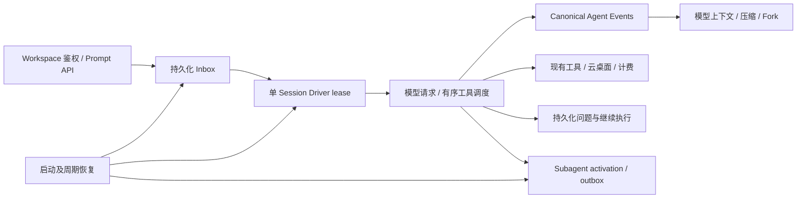

# Agent Kernel 与当前主线的整合

本文件描述 `codex/integrate-agent-refactor` 的实际实现。整合基线为
`origin/main` 的 `9f94524`，重构来源为 `codex/agent-refactor` 的 `7666824`。
旧分支的部署记录不能视为本分支的验收结果。

## 执行与数据流

- `backend/agent/driver.py` 以数据库时间、run id、generation 和精确条件更新
  决定执行所有权。工具完成、状态结算、消息写入须属于当前 generation。
- `backend/agent/inbox.py` 在请求被接受时保存输入、模型参数及附件，支持
  followup、steer、inject。成功 claim 后才物化消息并启动模型请求；附件传递
  失败不会跳过检查继续执行。同步接口按自己的 Inbox 条目取结果。
- `backend/agent/tool_scheduler.py` 将顺序预检、可并行工具执行及按模型顺序提交
  分开。只有显式声明可并行的工具才能并行；子工具继承当前工具与权限边界。
- `backend/session/agent_event_log.py` 保存 canonical history，Message/Part 仍是
  产品使用的公共读模型。压缩和 Fork 通过 event range 与摘要校验固定上下文，
  Fork 截断在完整回合边界，恢复不会盲目重放已可能产生副作用的工具。

## 与 main 已有能力的衔接

Driver 和 `question.runtime` 使用同一个 run id。Driver generation 标识执行批次，
问题系统的 generation 标识用户输入代次，两者各自保留用途。数据库写入与远端
请求之前同时检查当前执行资格。用户停止、替换输入、问题回答和重启恢复仍经过
主线的持久化问题流程；等待输入的工具和回答结果在同一事务写入 canonical events。

工作空间权限、会话分页、计费与订阅、通知、云桌面激活、现有视频流程、Cron 和
独立 trajectory 采集继续沿用 main。Agent events 用于执行正确性，trajectory
用于分析与回放；业务路径不会改为依赖 trajectory 数据库的在线写入。
子任务继承父会话的 workspace/project，并将生命周期事实归属父会话的 trajectory。

Web 和移动端按 generation 拒绝过期状态和输出，保留消息分页、持久化问题及终态回读。
现有配置、容器部署和产品 UI 不随旧分支回退。

## 子任务、权限与扩展

`subagent_runtime.py` 持久化 descriptor、activation、claim 和 outbox；Task 支持
spawn、fork、follow_up、interrupt、report、list。模型、推理参数、persona、工具集
及输出 schema 在接受任务时校验并冻结。后续委派只能收窄继承的权限边界。

Skill Provider 以 user/project/workdir、revision 和 rank 形成确定的目录快照，
工具执行时复核 scope/revision。云桌面客户端与 Skill Provider 共用 main 的用户
scope 算法。Platform Plugin 采用分阶段激活、保留最近成功版本及调用结束后释放旧版本。
现有容器内 Skill/MCP 管理与部署协议保持 main 的实现。

## 云桌面与副作用边界

保留 main 的每用户桌面分配、计费检查与 Docker/Kubernetes/WUYING 配置支持。
项目目录仍为 `/workspace/<slug>`，附件仍送至 `/workspace/uploads`。文件工具
通过当前 Action Server 的 execute 接口执行只读路径解析，预检规范路径和符号链接。

本次没有引入旧分支的共享桌面布局、Action Server 签名 lease receipt 或远端 epoch
协议。Backend 能阻止失去资格的后续请求和数据库写入，但不能保证撤回已发出的远端
命令，也不能把路径预检解释成远端文件操作的原子锁。

图片生成接入 external-effect ledger，以稳定操作标识、提交前持久化及可查询结果
对账避免盲目重复付费；无法确认的结果保留 unknown/manual-review。当前视频、OSS
及其他外部服务继续使用 main 的业务流程，不宣称全系统 exactly-once。

## 迁移与恢复

保留 main 的全部已存在迁移；9 个 Agent 迁移从 main 的业务库 head
`f8c2a6e0b4d1` 顺序衔接，唯一新 head 为 `d0a2c4e6f8b1`。独立 trajectory
迁移链没有合并进业务库。桌面 SQLite readiness 同步增加所需表和列。

`agent.recovery_service` 启动时执行一次，之后约每 15 秒扫描；顺序是过期 Driver、
中断/子任务 outbox、历史修复、可恢复的预约任务、Inbox、external effects。
它独立于 Cron 启动，健康进程的 lease 不因另一个实例启动而被清除。
`question_worker` 继续处理回答后的恢复，并通过同一 Driver 保证单 Session 单飞。

最终本地验证结果及尚未执行的环境验证见 [整合记录](AGENT_MAIN_INTEGRATION.md)。
