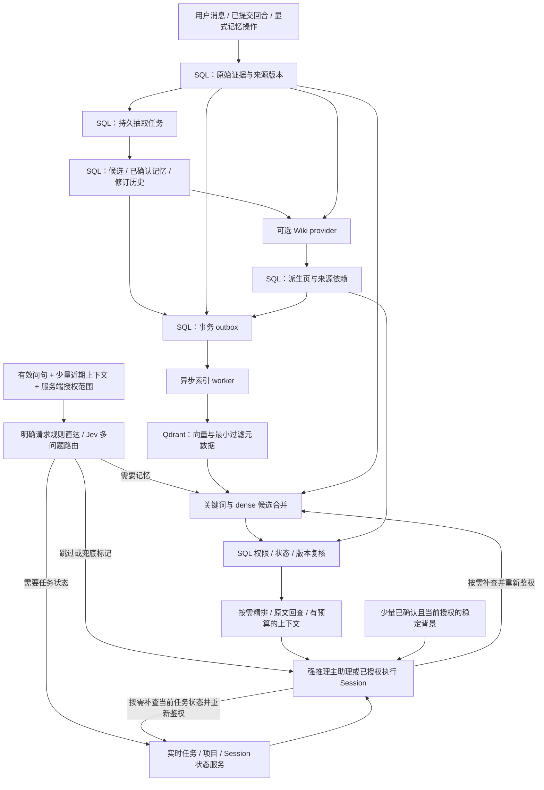

# OpenBox 个人助理长期记忆执行计划

> 当前实施状态（2026-10-02）：用户已恢复并授权实现、本地模型调用与浏览器验证。实现和运维记录见 [LONG_TERM_MEMORY_IMPLEMENTATION.md](LONG_TERM_MEMORY_IMPLEMENTATION.md)。下方“暂停”“未实施”等表述保留的是 2026-10-01 计划审查的历史边界，不代表当前执行状态。

> 状态：**计划已整理，本文不代表已实现或已验收**。更新日期：2026-10-01。
>
> 代码基线：`feature/personal-assistant`，`2eaa1c9314b0c7f42b915eec73cb2fd495b31899`。
>
> 授权边界：**当前仅授权更新、复核本计划，功能实施继续暂停**。Wiki 只读审查已纳入；本轮补充用户指定的 Jev 前置快速路由与可查看的调试页面，并取消固定测试集作为必做交付。本轮请求配置为 `gpt-6-astra + max`，运行时核实限制见第 15 节，不静默降级。本轮未实施功能、安装或部署服务、调用模型 API 测试、迁移数据库、执行测试、commit 或 push。后续实施、付费调用、购买服务及部署按各自授权执行。

## 1. 目标、已定方向与待定策略

目标是让强推理主助理在管理项目和多个 Session 时，能可靠地记住用户偏好、项目决定、约束、反馈和可复用经验，并能回到原始证据回答细节、时间与更正问题。语音层和执行 Session 是长期记忆的调用方，本计划不实现整个个人助理、语音系统或 Linux 操控。

| 决策 | 状态 | 约束 |
|---|---|---|
| 独立向量数据库 | **用户已定** | 不再以 pgvector 为主方案；现有业务 SQL 库继续保留 |
| Qdrant | **具体规划候选** | 作为索引适配器目标；版本、托管/自建、区域、容量、预算、备份和网络均待确认 |
| SQL 为证据、记忆版本、权限和任务状态的权威来源 | 本方案原则 | Qdrant 和 Wiki 均可由已授权的 SQL 数据重建 |
| 强推理主助理 + 语音层 + 执行 Session | 产品背景 | 三者复用统一记忆服务，不各建一个用户画像；实时任务状态直接读业务服务 |
| 新记忆默认个人可见、自动抽取先成为候选 | **助手建议，尚未获产品策略批准** | 在策略确认前不启用自动激活或共享；不能把本建议写成用户已经选择 |
| 历史会话回填 | **范围未批准** | 不默认扫描全部历史；先实现可限定用户、项目、日期和数量的 dry-run 方案 |
| 派生 Wiki | 分阶段增强；用户新增组件边界要求 | 在现有 OpenBox worktree 内组织独立组件，未来可拆包；编纂核心与宿主权限/发布分离，不直接依赖上游整包 |
| Jev 前置快速路由 | **用户已定的计划方向** | 显式请求先走规则；其余按需一次请求判断记忆/任务需求，避免每回合额外调用强模型做路由；主助理保持强推理模型 |
| 可查看的逐回合调试页面 | **用户已定的交付方向** | 取代固定测试集、冻结质量集及强制离线对比报告；保留必要工程正确性、安全和恢复验收，本轮均不执行 |

成功标准是证据可追溯、更新不丢失、更正有效、权限不串、删除可验证、服务故障可恢复，以及用户能在调试页面检查每次路由、检索、Wiki 使用和成本。质量通过获授权使用中的可观测记录、用户纠正及按需排查判断，不要求先建设固定测试数据集；本文不承诺固定准确率或未经测量的延迟。

## 2. 当前代码事实与可复用接点

以下为基线静态阅读结论，不等同于线上行为验证。旧设计文档仅用于了解约定，现状以当前代码为准。

| 已核实事实 | 代码锚点 | 实施含义 |
|---|---|---|
| `UserMemory` / `user_memories` 已有 `user_id`、必填 `workspace_id`、可空 `project_id`、证据 JSON、TTL、状态、owner 和 confidence | [db/models/memory.py](../backend/db/models/memory.py) | 增量演进已有记忆，避免新旧两套权威库 |
| `write_memory` 创建 `CANDIDATE`；`propose_note → confirm_note/reject_note` 已有提议流程 | [memory/service.py](../backend/memory/service.py) | 复用用户确认入口；补版本、来源和事务边界 |
| 工具可写入、提议、搜索和列举记忆；API 可列举、手动创建、确认、拒绝、编辑、软删除 | [tool/creator_context.py](../backend/tool/creator_context.py)、[api/memories.py](../backend/api/memories.py) | 统一写入服务，保留 API/工具兼容层 |
| 持久 `memory_proposal` 续接分支直接修改 `UserMemory` | [question/continuation.py](../backend/question/continuation.py) | 必须一并收敛，防止旧确认卡恢复绕过版本、来源和 outbox |
| `assemble_user_context` 读取 `CANDIDATE` 与 `ACTIVE`，排除 `PENDING_NOTE`，未知类型会进入有数量上限的 volatile 桶 | [memory/context.py](../backend/memory/context.py) | **不能假设所有候选都被隔离**；先建立独立的候选准入规则，再接自动抽取 |
| build/plan 自动注入 `<user_memory>`；指定项目时包含同项目和 `project_id IS NULL` 记忆；`project_id=None` 时当前不加项目过滤 | [agent/loop.py](../backend/agent/loop.py)、[memory/context.py](../backend/memory/context.py) | 缺省项目当前会读所选用户/workspace 的所有项目，应明确调用语义；稳定记忆尚无总 token 上限；“全局”不等于跨 workspace |
| `search_memories/list_active_memories` 有 workspace 参数时用 workspace 过滤替代 user 过滤；上下文组装则始终过滤 user，再按 workspace 过滤 | [memory/service.py](../backend/memory/service.py)、[memory/context.py](../backend/memory/context.py) | 工具和 API 共用该服务，均需审计；在显式共享语义落地前不能把 workspace 相同视为可共享 |
| 压缩摘要默认服务于原 Session；显式 UI/Task fork 可继承摘要和 replacement；未发现统一的成功回合后持久抽取、跨 Session 合并链 | [agent/compaction.py](../backend/agent/compaction.py)、[session/compaction.py](../backend/session/compaction.py)、[session/fork.py](../backend/session/fork.py) | Compaction 不自动写入 `user_memories`，不能作为唯一证据 |
| 已有 Inbox、Driver、AgentEvent 与恢复服务 | [agent/inbox.py](../backend/agent/inbox.py)、[agent/driver.py](../backend/agent/driver.py)、[db/models/agent_event.py](../backend/db/models/agent_event.py)、[agent/recovery_service.py](../backend/agent/recovery_service.py) | 借用持久任务、租约和恢复模式；需另核事务契约，不能假定现有事件天然就是可靠记忆 outbox |
| SQLAlchemy 存储支持 PostgreSQL/SQLite；配置默认 PostgreSQL，部署样例为 PostgreSQL 16 系列 | [db/base.py](../backend/db/base.py)、[core/config.py](../backend/core/config.py)、[docker-compose.yml](../docker-compose.yml) | 兼顾单用户 SQLite 与多用户 PostgreSQL；租约/CAS/迁移不能只适配一种 |

部署文档包含阿里云上海 gw2，仓库亦有 AWS 开发及 Azure 模板背景；**本次未连接线上环境，不能据此断言实际云、数据库版本、实例规格或 Qdrant 已部署**。后续环境盘点只记录所需能力与版本，不把样例地址和凭据带入文档。

现有 `search_memories` 名称虽含 search，目前只有结构化字段过滤与排序，没有文本或向量检索。检索增强需要新增实现，不能把旧 API 当成已经具备关键词召回。

### 2.1 LemonCode：借用行为模式，补齐服务端可靠性

对照材料为已 clone 的两个只读工作副本：main `c8f7400eac541f4c934b325d58e99d5ee31d7920`、L-GO `5669413e2b3409e1962247d81e94f50eeb95aab1`。此前并行审查确认核心记忆行为相同；本轮复核了两个 HEAD，以及 main 的抽取边界与召回常量，未运行其代码。

原作者仓地址、可独立获取的固定版本命令、两分支完整入口和许可说明见第 2.3 节；其他 AI 无需本地副本或前序对话即可复核。

可借鉴：成功回合后后台抽取、冻结消息边界、先读已有记忆再更新、区分 user/feedback/project/reference、跨同 workspace/project Session 复用。main 源码锚点为 `apps/zcode-cli/packages/core/src/runtime/helpers/project-memory-extraction.ts`、`src/memory/extraction.ts`、`src/memory/recall/project-memory-recall.ts` 与 `src/memory/recall/constants.ts`（后三个 `src/` 相对同一 core 包）。已审查行为包括 BM25 最多 4 条、总共 12,000 字符，临时召回不写入 compaction；这些是该实现的预算，不直接作为 OpenBox 的质量参数。

不能照搬：内存游标不足以处理进程重启，Markdown Write/Edit 不提供跨 Session 的全局事务，单 workspace 文件共享不能替代多用户 ACL，prompt 中要求去重纠错不能替代约束和版本检查。OpenBox 采用“持久任务 + SQL 事务 + 可重建索引”，保留其轻量的回合后抽取思想。

### 2.2 研究依据及适用范围

- Karpathy 的 [LLM Wiki](https://gist.github.com/karpathy/442a6bf555914893e9891c11519de94f) 描述持续编纂知识页的模式，并未给出相对 RAG 准确率更高的通用证明。本文据此将 Wiki 定位为高复用项目综合，和检索组合。
- [Sentence Transformers Retrieve & Re-Rank](https://www.sbert.net/examples/sentence_transformer/applications/retrieve_rerank/README.html) 支持先召回、再对较小候选集做精排的两阶段设计。具体模型与候选数要在本项目验证。
- [BEIR](https://arxiv.org/abs/2104.08663) 强调跨域检索评测及质量/计算成本差异，不能推出某个 dense 模型必然优于关键词检索。
- [LongMemEval §5.2](https://arxiv.org/html/2410.10813v2) 在其设置下观察到仅用摘要/事实替代原回合可能损失细节，事实分解对某些多 Session 推理有益。本文的工程推论是同时保留原文与结构化记忆，排查时关注更新、时间推理和证据不足，不移植论文中的准确率数值，也不据此要求建设固定测试集。

### 2.3 可独立获取的参考源码与复核入口

本节供无法访问本机或前序聊天的 AI 独立复核。**唯一正式计划仍是本文件；下面的获取命令只是示例，本轮未执行 clone/fetch/checkout，也未新建 worktree。** 本地副本路径仅作辅助，结论依据下列原仓的固定 commit，不依赖本机目录才能理解。

- Wiki 原仓：[atomicstrata/llm-wiki-compiler](https://github.com/atomicstrata/llm-wiki-compiler)，clone URL：`https://github.com/atomicstrata/llm-wiki-compiler.git`。
- LemonCode 原作者仓：[lemon-casino/LemonCode](https://github.com/lemon-casino/LemonCode)，clone URL：`https://github.com/lemon-casino/LemonCode.git`。**AuroraPixel fork 不作为本计划上游。**

| 版本角色 | 固定 SHA / 源码树 | 使用边界 |
|---|---|---|
| Wiki 审查时 main | [eb18e769db8096c80b81665fb7195e3b29f4cb6b](https://github.com/atomicstrata/llm-wiki-compiler/tree/eb18e769db8096c80b81665fb7195e3b29f4cb6b) | 本文 Wiki 机制审查基准；tree 与 v1.4.0-rc.3 相同，不能因此称作稳定版 |
| Wiki 稳定版对照 v1.3.0 | [34ca1df97b3e60a6700048c48c7cf70c92a9bfdb](https://github.com/atomicstrata/llm-wiki-compiler/tree/34ca1df97b3e60a6700048c48c7cf70c92a9bfdb) | 单独的版本对照，不替代上述 main 审查基准 |
| LemonCode 审查时 main | [c8f7400eac541f4c934b325d58e99d5ee31d7920](https://github.com/lemon-casino/LemonCode/tree/c8f7400eac541f4c934b325d58e99d5ee31d7920) | CLI 根为 apps/zcode-cli/ |
| LemonCode 审查时 L-GO | [5669413e2b3409e1962247d81e94f50eeb95aab1](https://github.com/lemon-casino/LemonCode/tree/5669413e2b3409e1962247d81e94f50eeb95aab1) | CLI 根为 apps/lcode-cli/；不得套用 main 的 zcode-cli 路径 |

分支名和标签用于说明审查背景，完整 SHA 才是结论的版本边界。Wiki v1.3.0 与审查 main 的源码不同：本地 Git 对照确认 main 新增 `src/compiler/extraction-snapshot.ts`、`src/sdk/core-types.ts`、`src/sdk/core.ts` 等，并改动候选与依赖处理。下表 Wiki 入口均针对审查 main；稳定版须在自己的源码树重新定位，不能仅换链接中的 SHA 就宣称机制相同。

#### 源码入口与机制映射

Wiki 路径相对仓库根目录；每个链接均绑定审查 commit。结合第 8 节阅读设计差距，不直接引入整包。

| 机制 | 固定版本入口 | 阅读目标 / OpenBox 边界 |
|---|---|---|
| SDK/可分离检索 | [src/sdk/core-types.ts](https://github.com/atomicstrata/llm-wiki-compiler/blob/eb18e769db8096c80b81665fb7195e3b29f4cb6b/src/sdk/core-types.ts)、[src/sdk/core.ts](https://github.com/atomicstrata/llm-wiki-compiler/blob/eb18e769db8096c80b81665fb7195e3b29f4cb6b/src/sdk/core.ts)、[src/compiler/index.ts](https://github.com/atomicstrata/llm-wiki-compiler/blob/eb18e769db8096c80b81665fb7195e3b29f4cb6b/src/compiler/index.ts) | `createWiki` 的 root 型入口、`embeddings: false`；不能据此假定已有 SQL/Qdrant adapter。 |
| 增量与依赖闭包 | [src/compiler/hasher.ts](https://github.com/atomicstrata/llm-wiki-compiler/blob/eb18e769db8096c80b81665fb7195e3b29f4cb6b/src/compiler/hasher.ts)、[src/compiler/deps.ts](https://github.com/atomicstrata/llm-wiki-compiler/blob/eb18e769db8096c80b81665fb7195e3b29f4cb6b/src/compiler/deps.ts) | 源 hash 与受影响来源/页面集合；借鉴算法，权限和事务仍由 OpenBox 实现。 |
| 抽取缓存 | [src/compiler/extraction-snapshot.ts](https://github.com/atomicstrata/llm-wiki-compiler/blob/eb18e769db8096c80b81665fb7195e3b29f4cb6b/src/compiler/extraction-snapshot.ts) | 输入 hash、模型/provider 与 prompt 合同绑定；该文件在 v1.3.0 中不存在。 |
| 冲突、引用与审核 | [src/compiler/resolver.ts](https://github.com/atomicstrata/llm-wiki-compiler/blob/eb18e769db8096c80b81665fb7195e3b29f4cb6b/src/compiler/resolver.ts)、[src/linter/rules-citations.ts](https://github.com/atomicstrata/llm-wiki-compiler/blob/eb18e769db8096c80b81665fb7195e3b29f4cb6b/src/linter/rules-citations.ts)、[src/compiler/candidates.ts](https://github.com/atomicstrata/llm-wiki-compiler/blob/eb18e769db8096c80b81665fb7195e3b29f4cb6b/src/compiler/candidates.ts) | 多源合并、引用格式/行号检查、候选；引用有效不等于事实正确或已获发布权限，审批仍需不可变修订/CAS。 |
| 删除与召回边界 | [src/sources/store.ts](https://github.com/atomicstrata/llm-wiki-compiler/blob/eb18e769db8096c80b81665fb7195e3b29f4cb6b/src/sources/store.ts)、[src/search/retrieval.ts](https://github.com/atomicstrata/llm-wiki-compiler/blob/eb18e769db8096c80b81665fb7195e3b29f4cb6b/src/search/retrieval.ts)、[src/utils/retrieval.ts](https://github.com/atomicstrata/llm-wiki-compiler/blob/eb18e769db8096c80b81665fb7195e3b29f4cb6b/src/utils/retrieval.ts) | `deleteSource`、过时索引/hash 检查与 BM25 tokenizer；重写立即失效、晚任务防复活和中文关键词方案。 |

LemonCode 下表显示 `core/src/` 内的相对路径；main 完整前缀是 `apps/zcode-cli/packages/core/src/`，L-GO 是 `apps/lcode-cli/packages/core/src/`。两个链接均已按各自 commit 的真实文件核对。

| 机制 | main 固定入口 | L-GO 固定入口 | 阅读目标 / OpenBox 边界 |
|---|---|---|---|
| 成功回合调度与固定边界 | [runtime/methods/turn.ts](https://github.com/lemon-casino/LemonCode/blob/c8f7400eac541f4c934b325d58e99d5ee31d7920/apps/zcode-cli/packages/core/src/runtime/methods/turn.ts)、[runtime/helpers/project-memory-extraction.ts](https://github.com/lemon-casino/LemonCode/blob/c8f7400eac541f4c934b325d58e99d5ee31d7920/apps/zcode-cli/packages/core/src/runtime/helpers/project-memory-extraction.ts) | [runtime/methods/turn.ts](https://github.com/lemon-casino/LemonCode/blob/5669413e2b3409e1962247d81e94f50eeb95aab1/apps/lcode-cli/packages/core/src/runtime/methods/turn.ts)、[runtime/helpers/project-memory-extraction.ts](https://github.com/lemon-casino/LemonCode/blob/5669413e2b3409e1962247d81e94f50eeb95aab1/apps/lcode-cli/packages/core/src/runtime/helpers/project-memory-extraction.ts) | 跟踪成功出口、活动分支与冻结消息边界；OpenBox 改为持久 job/outbox。 |
| 抽取提示与内存游标 | [memory/extraction.ts](https://github.com/lemon-casino/LemonCode/blob/c8f7400eac541f4c934b325d58e99d5ee31d7920/apps/zcode-cli/packages/core/src/memory/extraction.ts) | [memory/extraction.ts](https://github.com/lemon-casino/LemonCode/blob/5669413e2b3409e1962247d81e94f50eeb95aab1/apps/lcode-cli/packages/core/src/memory/extraction.ts) | 先读已有文件再 Write/Edit、调度/游标；不能代替跨进程恢复及跨 Session 事务。 |
| 分类与空间定位 | [context/sections/memory.ts](https://github.com/lemon-casino/LemonCode/blob/c8f7400eac541f4c934b325d58e99d5ee31d7920/apps/zcode-cli/packages/core/src/context/sections/memory.ts)、[runtime/helpers/project-memory.ts](https://github.com/lemon-casino/LemonCode/blob/c8f7400eac541f4c934b325d58e99d5ee31d7920/apps/zcode-cli/packages/core/src/runtime/helpers/project-memory.ts) | [context/sections/memory.ts](https://github.com/lemon-casino/LemonCode/blob/5669413e2b3409e1962247d81e94f50eeb95aab1/apps/lcode-cli/packages/core/src/context/sections/memory.ts)、[runtime/helpers/project-memory.ts](https://github.com/lemon-casino/LemonCode/blob/5669413e2b3409e1962247d81e94f50eeb95aab1/apps/lcode-cli/packages/core/src/runtime/helpers/project-memory.ts) | user/feedback/project/reference、workspace 记忆目录；不是多用户 ACL。 |
| BM25 召回与预算 | [memory/recall/project-memory-recall.ts](https://github.com/lemon-casino/LemonCode/blob/c8f7400eac541f4c934b325d58e99d5ee31d7920/apps/zcode-cli/packages/core/src/memory/recall/project-memory-recall.ts)、[memory/recall/ranking.ts](https://github.com/lemon-casino/LemonCode/blob/c8f7400eac541f4c934b325d58e99d5ee31d7920/apps/zcode-cli/packages/core/src/memory/recall/ranking.ts)、[memory/recall/constants.ts](https://github.com/lemon-casino/LemonCode/blob/c8f7400eac541f4c934b325d58e99d5ee31d7920/apps/zcode-cli/packages/core/src/memory/recall/constants.ts) | [memory/recall/project-memory-recall.ts](https://github.com/lemon-casino/LemonCode/blob/5669413e2b3409e1962247d81e94f50eeb95aab1/apps/lcode-cli/packages/core/src/memory/recall/project-memory-recall.ts)、[memory/recall/ranking.ts](https://github.com/lemon-casino/LemonCode/blob/5669413e2b3409e1962247d81e94f50eeb95aab1/apps/lcode-cli/packages/core/src/memory/recall/ranking.ts)、[memory/recall/constants.ts](https://github.com/lemon-casino/LemonCode/blob/5669413e2b3409e1962247d81e94f50eeb95aab1/apps/lcode-cli/packages/core/src/memory/recall/constants.ts) | 扫描/排序及 4 条、12,000 字符上限；不视为 OpenBox 最优参数。 |
| 临时召回接入 | [runtime/methods/turn-loop.ts](https://github.com/lemon-casino/LemonCode/blob/c8f7400eac541f4c934b325d58e99d5ee31d7920/apps/zcode-cli/packages/core/src/runtime/methods/turn-loop.ts) | [runtime/methods/turn-loop.ts](https://github.com/lemon-casino/LemonCode/blob/5669413e2b3409e1962247d81e94f50eeb95aab1/apps/lcode-cli/packages/core/src/runtime/methods/turn-loop.ts) | 新回合首步向请求附件注入 memory_recall；配合第 2.1 节的临时上下文结论阅读。 |

#### 可复制的固定版本获取示例

以下 POSIX shell 示例需要 Git 和网络；将四份参考源码放进新建临时目录，不切换、重置或覆盖任何已有 OpenBox checkout。只在后续任务授权获取参考源码时执行。本轮仅编写并做静态语法核验，未执行示例；示例不安装依赖、不运行上游脚本、不递归获取 submodule。

```sh
(
  set -eu
  reference_root="$(mktemp -d "${TMPDIR:-/tmp}/openbox-memory-refs.XXXXXX")"

  checkout_reference() (
    reference_url="$1"
    reference_dir="$2"
    reference_sha="$3"
    git -c core.hooksPath=/dev/null clone --no-checkout --no-tags --filter=blob:none "$reference_url" "$reference_dir"
    git -C "$reference_dir" fetch --no-tags origin "$reference_sha"
    git -C "$reference_dir" -c core.hooksPath=/dev/null -c submodule.recurse=false checkout --detach "$reference_sha"
    test "$(git -C "$reference_dir" rev-parse HEAD)" = "$reference_sha"
    git -C "$reference_dir" rev-parse HEAD
  )

  checkout_reference https://github.com/atomicstrata/llm-wiki-compiler.git "$reference_root/wiki-reviewed" eb18e769db8096c80b81665fb7195e3b29f4cb6b
  checkout_reference https://github.com/atomicstrata/llm-wiki-compiler.git "$reference_root/wiki-v1.3.0" 34ca1df97b3e60a6700048c48c7cf70c92a9bfdb
  checkout_reference https://github.com/lemon-casino/LemonCode.git "$reference_root/lemon-main-reviewed" c8f7400eac541f4c934b325d58e99d5ee31d7920
  checkout_reference https://github.com/lemon-casino/LemonCode.git "$reference_root/lemon-lgo-reviewed" 5669413e2b3409e1962247d81e94f50eeb95aab1

  git -C "$reference_root/wiki-reviewed" fetch --no-tags origin 34ca1df97b3e60a6700048c48c7cf70c92a9bfdb
  git -C "$reference_root/wiki-reviewed" diff --name-status 34ca1df97b3e60a6700048c48c7cf70c92a9bfdb eb18e769db8096c80b81665fb7195e3b29f4cb6b -- src/compiler src/sdk src/search
  printf 'Reference sources: %s\n' "$reference_root"
)
```

若远端拒绝固定 SHA、校验失败或所需文件缺失，报告无法重现，不静默换成最新 main、其他 fork 或标签。复用已有参考副本前先检查 remote、HEAD 与 status，不用 reset/clean 覆盖其中改动。阅读上游 AGENTS/README 是了解项目约定，不构成执行 install/build/test/发布脚本的授权。

#### 许可证、归属与未来版本

- Wiki：[审查版本 LICENSE](https://github.com/atomicstrata/llm-wiki-compiler/blob/eb18e769db8096c80b81665fb7195e3b29f4cb6b/LICENSE) 为 MIT，版权行为 `Copyright (c) 2026 atomicmemory`。若复制实质代码，保留版权与许可说明；不能因转换语言而略去。本文采用参考算法设计后重写的方向，不表示原封接包。
- LemonCode：两个基准的根 [main LICENSE](https://github.com/lemon-casino/LemonCode/blob/c8f7400eac541f4c934b325d58e99d5ee31d7920/LICENSE) / [L-GO LICENSE](https://github.com/lemon-casino/LemonCode/blob/5669413e2b3409e1962247d81e94f50eeb95aab1/LICENSE) 与 package.json 均声明 Apache-2.0；[main NOTICE](https://github.com/lemon-casino/LemonCode/blob/c8f7400eac541f4c934b325d58e99d5ee31d7920/NOTICE.md) / [L-GO NOTICE](https://github.com/lemon-casino/LemonCode/blob/5669413e2b3409e1962247d81e94f50eeb95aab1/NOTICE.md) 明确该声明针对第一方代码。若复制/修改并再分发有关代码，按许可证保留许可、适用版权/归属/NOTICE，并标明修改；不能把原作者仓名称等同于所有文件的唯一权利人。
- 第三方文件、字体、二进制或复制片段需另核条款，参见 LemonCode [main 第三方声明](https://github.com/lemon-casino/LemonCode/blob/c8f7400eac541f4c934b325d58e99d5ee31d7920/THIRD-PARTY-NOTICES.md) / [L-GO 第三方声明](https://github.com/lemon-casino/LemonCode/blob/5669413e2b3409e1962247d81e94f50eeb95aab1/THIRD-PARTY-NOTICES.md)。未逐项完成第三方依赖许可审计，不把根许可证视为对全部素材的统一授权。
- 若未来选择更新版本，先记录新的完整 SHA，再对上表入口、数据/状态契约、依赖与 SDK、候选审批、删除、中文检索和许可证做差异复核，更新证据和验收项。旧版审查结论不自动覆盖最新版本，测试文件存在也不表示测试已运行或生产效果已证实。

本次核验以本地 Git 对象中的真实路径为基础，并在线抽查了两个原仓、许可证，以及 Wiki/main、Wiki/v1.3.0、LemonCode/main、LemonCode/L-GO 的固定 SHA 文件链接；未逐个做所有链接的在线可用性测试。临时网络失败不改动已固定的来源身份。

## 3. 四层数据职责与主链路



1. **证据层**：SQL 保存来源身份、受控原文或版本化正文引用、权限、内容 hash、时间和删除状态。当前 canonical AgentEvent 是模型上下文的权威，关系型 transcript 是可重建读模型；优先通过已有公开投影与稳定事件范围引用证据。现有 Message/Part 可能被更新，因此不能仅存一个会变化的 ID；需固定来源范围/版本及必要片段，不无条件复制所有事件。大附件可沿用已批准对象存储，SQL 管理引用与访问权，不把 Qdrant 当原文仓库。
2. **记忆层**：SQL 保存简明陈述、适用范围、来源、确认状态、有效期、冲突和修订关系。记忆是对证据的解释，模型输出不能自动成为新证据。
3. **派生 Wiki 层**：面向项目综述、决策背景和重复使用的知识页。依赖明确的证据/记忆版本；可失效重建，不写入实时任务状态，不覆盖原文。
4. **索引层**：Qdrant 保存向量、稳定 ID 和最小过滤元数据；关键词索引同属派生层。索引可延迟、重建和整体替换，不能决定权限或事实有效性。

普通助理不能因为实现记忆而读取原本仅超管可见的轨迹或 payload。证据入口必须沿用普通用户可访问的消息、文件和业务服务；轨迹存储与业务库的权限/保留规则不因本计划改变。

## 4. 数据模型与状态提案

以下字段/表名均为**设计提案**，不是已生成 migration。先核对 Alembic 当前 head、表量与旧 API 兼容性，再拆成增量 migration；本轮不生成或执行迁移。

### 4.1 身份、范围、时间和版本

- 身份由认证上下文或验证过的 Session 委派上下文注入：`actor_user_id`、`workspace_id`、授权项目集合、权限版本。模型不能指定身份、扩展项目集合或把自己的 `owner` 声明当授权。
- 沿用 `scope=SHORT_TERM/LONG_TERM` 的保留期含义；新增 `visibility=PERSONAL/PROJECT/WORKSPACE` 表示访问范围，避免重载 `scope`。`owner` 旧枚举表达确认来源，不是 ACL 所有者，新增 `confirmation_actor_id` 等明确字段。
- `project_id=NULL` 只表示当前用户/工作区内不限定项目，不表示全平台共享。跨项目个人偏好与某项目私有事实分开；共享资料不应混入所有者个人画像。
- 同时保存 `occurred_at`（事件实际发生时间及其可信来源）、`recorded_at`、`valid_from/valid_to`、`updated_at`、`expires_at`；时间未知可空，不能用导入时间冒充事实时间。统一 UTC 保存，保留原时区/原始表达用于相对时间解释。
- 每个对象有单调递增 `revision`，业务事实的有效时间与修订提交时间分离。`source_revision`、`content_hash`、`extractor/prompt/schema_version` 保证可追溯；抽取器自报的置信分不是经校准的正确率或激活许可，Jev 的概率分布与 confidence 另按第 7.3 节解释。

### 4.2 建议的持久结构

| 表/结构 | 关键字段或唯一约束 | 职责 |
|---|---|---|
| 扩展 `user_memories` | 保留旧 ID/字段；新增 `revision`、`visibility`、`fact_key`、`confirmation_status`、有效时间、`supersedes_id`、`deleted_at`、`policy_version` | 当前记忆读模型；候选和已确认明确区分 |
| `memory_revisions` | `(memory_id, revision)` 唯一；正文、状态、变更理由、操作者、来源集 hash | 修订审计；常规更新不覆盖旧版本，隐私清除按保留策略处理 |
| `memory_sources` | `source_id`；来源类型、user/workspace/project/session/turn/message/part 或文档 ID、分支、来源修订、片段范围、hash、正文/受控引用、ACL 版本 | 原文与不可变来源边界；撤权/删除后停止向调用方暴露 |
| `memory_source_links` | `(memory_id, revision, source_id, source_revision)` 唯一；支持/反驳/更正关系 | 一条记忆可有多份证据，必须保留精确引用 |
| `memory_extraction_jobs` | 幂等键唯一；范围、冻结边界、输入 hash、pipeline 版本、状态、尝试次数、lease owner/generation/截止时间、下次重试时间 | 跨进程可恢复抽取；不靠内存游标推进 |
| `memory_extraction_cursors` | `(session_id, branch_id, pipeline_version)` 唯一；连续已完成边界 | 避免漏回合与重复扫描；失败空洞不能被后续成功越过 |
| `memory_outbox` | `event_id` 唯一；对象 ID/修订、操作、目标索引代、优先级、重试和投递状态 | SQL 提交后可靠传播 upsert、撤权、删除、过期和 Wiki 失效 |
| `memory_index_state` | `(object_kind, object_id, index_generation)` 唯一；desired/indexed revision、chunk 清单 hash、状态、最近错误 | 记录 SQL 与索引差异及重建进度，不以“已发送”冒充“已完成” |
| `memory_tombstones` | 对象 ID、删除版本、范围、时间、清除状态、最小抑制标记 | 阻止旧 worker/旧备份/历史回填复活已忘记内容 |
| `memory_wiki_pages` / `memory_wiki_dependencies` | 页 ID/修订、范围、状态、provider/prompt 版本、依赖对象版本与 ACL 版本 | 派生页及反向依赖；不另建权限权威 |
| `memory_debug_runs` / `memory_debug_steps`（或既有受控观测存储） | request/turn/attempt ID、actor/范围、policy/model 版本、阶段状态与耗时、usage、脱敏快照/引用、保留期限 | 第 11 节调试页的数据源；按字段和当前来源权限读取，不复制完整私有上下文，不作为事实或权限权威 |

候选、任务、outbox 和索引状态可分步落表；评审时可合并职责完全相同的结构，但不得删除幂等、版本、来源和恢复信息。外键级联策略需逐表明确，禁止默认通过删 Session 级联造成审计/索引遗漏，也不能为了审计保留用户要求清除的全文。

### 4.3 生命周期、确认与更正

建议状态流为 `CANDIDATE → ACTIVE → SUPERSEDED / EXPIRED / DELETED`，另有候选 `REJECTED` 和待核实冲突状态。旧 `DEPRECATED` 保留兼容映射；实施时评审是否使用独立字段表达原因，避免一次扩大所有客户端枚举。

1. 显式“记住”、手动新增、用户更正分别记录直接来源。显式请求是否视为确认、哪些自动抽取可无卡片激活，仍是待确认产品策略。
2. 建议自动推断先入候选，不进入默认自动上下文、普通召回或 Wiki；用户通过现有确认机制处理。模型对工具的 `owner=USER_CONFIRMED` 传参不能伪造用户确认。
3. 已有普通 `CANDIDATE` 当前可能被注入。迁移需标识 `legacy_candidate` 并列出影响，不能批量冒充已确认，也不能无提示改变画像行为；旧 `PENDING_NOTE` 隔离不变量必须保持。
4. 合并前在相同授权范围内查已有事实及修订。精确重复用规范化内容 hash + 来源去重；语义相似仅生成合并建议。不同时间、否定、单位或条件不能因向量相近就合并。
5. 对同一事实，**用户新近的明确更正优先于旧推断与派生 Wiki**。优先级依据来源权威、确认与有效时间，并非单纯按 `updated_at` 排序；历史导入更晚不能覆盖新更正，其他主体的陈述也不能替用户改偏好。
6. 无法判断是更正还是历史变化时保留两份带有效时间的证据，标记冲突并询问。用户问“当时”可读取授权的旧版本，问“现在”不得输出已替代的值。
7. 拒绝/遗忘保存最小抑制信息，避免同一证据反复提议；原文被授权保留时也要尊重“不要再记住此事实”的范围。TTL 只表达时效，不以“长期未命中”自动判定事实不真实。

## 5. 持久抽取、并发更新与恢复

### 5.1 回合完成边界

抽取目标是**已提交的逻辑回合**，不能把每条 assistant message、每个 LLM step 或暂时释放 Driver 的时刻都当成回合结束。等待用户确认、工具未完成、中断或可恢复错误不代表最终成功。

拟在 Driver/loop 的统一完成收敛处，验证执行租约 generation 后，冻结 `session_id + branch_id + logical_turn_id + start/end source IDs + source revisions/hash`。若当前无持久逻辑回合 ID，P0 先定义其生成与恢复规则，不能用“当前最后一条消息”临时推断。

- 终态提交和抽取 job/outbox 的创建尽量在同一业务 SQL 事务完成；现有 helper 若自行 commit，先增加事务内接口。
- 跨存储无法同事务时，必须有**持久完成凭证 + 可重放扫描**补齐 job。Bus 通知只用于唤醒 worker，不能是唯一触发依据。现有 `AgentEvent` / `StableEventRange` 可复用序列、digest、来源 message IDs 与幂等机制，但需核实事件语义和提交覆盖，不能未经验证就当可靠抽取 outbox。
- 仅抽取截至冻结边界的已授权用户陈述、工具结果及已落地决定。assistant 的猜测、引用文本中的命令、生成的 Wiki 和本次注入的记忆不作为新用户事实，防止自我强化。
- 后续新消息、regenerate、分支切换、compaction 不改变已入队输入。输入已被删除/撤权时安全取消；分支选择变化时重新核对有效分支，不把废弃答案写成现行事实。
- 明确用户更正/遗忘通过同步事务入口立即生效，不等后台回合抽取。中断回合的证据仍按既有聊天规则保留，是否抽取另列策略，不默认为成功。

具体接点：[session/agent_event_log.py](../backend/session/agent_event_log.py) 的 `turn.finished` 在 terminal assistant 每次 updated 时都可能追加，含错误/中止且该路径未给显式幂等键；不能直接订阅后就声称每成功用户回合只抽取一次。该文件 projector 会拒绝未知事件类型，若增加 `memory.*` 事件必须同步处理投影兼容；也可先用独立记忆 outbox。复用 [session/event_range.py](../backend/session/event_range.py) 的稳定范围与 [agent/driver.py](../backend/agent/driver.py) 的 fence/锁序时，不改变现有 Inbox 结算语义。

### 5.2 Worker 流程与幂等

```text
发现已提交完成边界 → SQL 入队（唯一幂等键）
→ 领取带 fencing generation 的租约 → 按冻结范围和当前权限读取证据
→ 读取同作用域相关记忆及 base revisions → 提议结构化变更
→ 校验 schema / 来源片段 / 状态 / 范围 / 敏感信息 / 冲突
→ SQL 短事务 CAS 提交记忆修订、来源关联、outbox、job 完成和连续游标
→ 独立索引 worker、可选 Wiki worker 消费 outbox
```

- job 幂等键建议包含 `(session, branch, turn boundary, input hash, pipeline version)`；pipeline 升级若要重算，必须走显式重处理策略。内部重试不得重复激活或重复弹确认卡。
- LLM 与 embedding 网络调用在事务外执行；领取/续租/提交使用短事务。对外调用可重复发生，系统承诺的是幂等业务效果，不承诺外部调用 exactly-once。
- worker 提交需同时验证有效租约 generation、输入仍可用、来源 ACL 版本以及涉及的 memory base revisions。任一变化即放弃旧提议并重新读取，不能覆盖较新的用户更正。
- 同一 `fact_key`/作用域的并发新建需唯一约束或版本化作用域串行化，不能只对已存在的行做 CAS。`fact_key` 不确定时保留候选冲突，不强制语义去重。
- PostgreSQL 可用条件更新/行锁领取，SQLite 使用短写事务及条件更新；均通过 rowcount 与 generation 验证，不能依赖进程内锁。具体领取 SQL 在实现阶段做跨库验证。
- 任务状态至少含 `PENDING/RUNNING/RETRY/SUCCEEDED/DEAD/CANCELLED`。崩溃后租约到期可重新领取；指数退避、抖动、最大次数和死信原因持久化。schema 错误与权限失效不无限重试；超额任务保留可重放记录。
- 每 Session 顺序边界与跨 Session 事实更新并发分开处理。完成游标仅越过连续已完成区间，失败区间可追踪，不因后续任务成功而跳过。
- 复用 Inbox/Driver 的持久和恢复模式、用户确认入口及通知能力；抽取任务本身归记忆服务所有。不要把后台抽取伪装成一条用户新消息，或持有主 Agent 执行租约等待抽取。

## 6. SQL ↔ Qdrant 索引生命周期

### 6.1 索引契约

拟新增 `MemoryIndex` 适配接口，首个目标为 Qdrant，方法包括 `upsert_version`、`delete_object_versions`、`search`、`reconcile`、`rebuild_generation` 和 `health`。接口接收服务端生成的授权过滤与版本元数据，模型不能直接提交 Qdrant filter/collection 名称。

- collection 按受控 `index_generation` 管理，记录 embedding provider/model/明确版本、维度、距离函数、normalization、chunker、语言预处理和 sparse 配置。**这些参数均待选，不能把未经核实的维度或模型写成已选配置。**
- 建议对证据片段、已激活记忆和已生效 Wiki 使用独立 kind（必要时独立 collection）；分别保留预算，避免大量 Wiki 或重复事实淹没原文。
- point ID 使用由 `(object kind, object ID, revision, chunk ID, index generation)` 派生的稳定 UUID。payload 最小包含租户/所有者/项目/visibility、对象与来源版本、ACL 版本、有效期和 kind。正文从 SQL 授权读取，减少索引中不必要的全文副本；embedding 本身也视为敏感派生数据。
- SQL 更新和 outbox 同事务；outbox 重复投递安全。`indexed_revision` 仅在目标索引确认操作完成且 SQL 条件仍匹配后推进，不能仅收到排队响应就宣布一致。Qdrant 的写入确认、读取一致性、复制与备份能力在选定版本后实测。
- 一次修订 chunk 数量变少时，旧修订的多余 points 需清除；完整 chunk 清单与 generation 参与 reconciliation。

Qdrant 提供过滤与混合查询能力，但它不持有 OpenBox 的最终授权规则。[Qdrant Filtering](https://qdrant.tech/documentation/search/filtering/) 和 [Hybrid Queries](https://qdrant.tech/documentation/search/hybrid-queries/) 是适配依据，具体能力以选定版本为准。

### 6.2 创建、更新、撤权、删除和过期

| 事件 | SQL 提交动作 | 异步动作与读取保证 |
|---|---|---|
| 新建/确认 | 新修订 + 来源关系 + desired revision + outbox | 索引成功前可走授权 SQL 增量通道，UI 显示待索引 |
| 更正/合并 | CAS 创建新修订，旧值被替代，相关 Wiki 失效 | 新修订 upsert，旧 points 清理；读取只接受当前 SQL 认可修订 |
| 撤权/移出项目 | 提升 ACL/范围 epoch，使关联派生结果失效 | 高优先级删除/改索引过滤；即使索引未同步，SQL 复核也拒绝正文进入 reranker/主模型 |
| 遗忘/删除 | 逻辑删除 + 墓碑 + 抑制规则 + outbox，立即禁止召回 | 清理向量、关键词索引、Wiki、缓存及受控副本，追踪完成回执 |
| TTL 到期 | 查询即时按时间排除；后台转 EXPIRED 并发事件 | 不等待定时清理才停止召回；物理索引清理由 worker 完成 |

防复活规则：worker 写前检查 desired revision/墓碑，写后再次检查。版本化 point ID 防止旧 upsert 覆盖新内容；旧 worker 仍可能晚写出过时 point，因此每次召回仍做 SQL 状态/版本验证，并由补偿删除与定期 reconciliation 收敛。**不假设 Qdrant 自动执行 SQL 的 CAS 或跨库事务。** 删除完成判据需等相关在途租约过期/结算，并核对全部 generation；否则只能报告“已停止使用、清理中”。

忘记记忆与删除原始聊天是不同范围。用户可选择停止使用某记忆、同时禁止从指定来源重提、或清除指定来源和派生物；清除范围须具体化。历史修订、确认卡、请求缓存、日志和备份保留也需纳入政策，不能承诺未定义的立即物理清除。若授权清除原始聊天，必须涵盖 canonical AgentEvent 中的正文副本、其 transcript 投影及 memory_sources，不能只删 Message/Part；轨迹等其他副本按已确认范围和独立保留策略处置，不由“忘记一条记忆”擅自触发。备份恢复先重放墓碑/撤权记录，再允许查询；若清除需要连墓碑内容一起删除，仅保留合规且必要的最小非正文抑制标记，保留期另定。

### 6.3 延迟、故障与版本迁移

- 记录 `outbox_age`、desired/indexed revision 差、待索引数量、死信量和 `index_lag`；新写/新更正优先读取 SQL 的当前记录，不能因向量尚未生成继续答旧值。
- Qdrant 超时/不可用时，降级为**仍执行相同 ACL 和版本校验**的关键词/SQL 精确查询；召回不足就回查原文或说明无法确定。SQL/权限服务不可用时关闭记忆结果，不能仅凭 Qdrant payload 放行。
- lag 过大或已知丢事件时限制索引召回并触发对账；扫描 SQL 当前对象、墓碑、索引状态和 chunk 清单，补缺、剔旧。监控中不写用户正文。
- 更换 embedding 模型、维度、chunker 或 sparse 词表建立新 generation/collection，不混用不同向量空间。顺序为：冻结配置 → 授权范围快照 → 限速重建 → 消费期间增量及墓碑 → 对账及必要正确性检查 → 获授权的小流量使用与调试页检查 → 切换读指针 → 保留受控回滚窗口 → 按批准保留策略清理旧代。不默认增加成对模型调用或建立冻结质量集。
- 回滚读旧 generation 前也要确认已同步最新删除和撤权；旧快照本身不能恢复读取权限。embedding 迁移是否临时双写、成本上限与回填范围在实施前确认。

## 7. 检索、权限与上下文组装

### 7.1 一条服务端授权链

```text
认证 / 当前 Session 委派范围
→ SQL 计算用户、workspace、项目、visibility 与 ACL epoch
→ 关键词和 Qdrant 查询都带服务端过滤
→ 候选只返回 ID/版本/分数，按 SQL 当前 ACL、状态、有效期、来源依赖复核
→ 仅对授权正文进行融合、可选 rerank 和原文扩展
→ 组包前复核 epoch；变化则丢弃/重查 → 模型输入
```

所有入口（工具、HTTP API、自动注入、Jev 路由、检索、Wiki、来源详情、确认卡、调试页/重跑、后台 worker）复用同一 `MemoryAccessScope`/policy。禁止“搜索先返回全文，最后回答时再隐去”。Jev、外部 reranker/embedding/provider 也是数据接收方，提交前需数据范围和 provider 政策检查。路由只决定是否尝试读取，任何 choice、confidence 或模型补查均不能扩大服务端范围。

- 多租户过滤至少包含 workspace、PERSONAL 的 user 或显式共享规则、项目边界、活动状态和有效期。身份/权限缺失时拒绝召回，不使用 `ws_default` 推断授权。
- 主助理可以在其明确授权项目集合内规划跨项目检索；执行 Session 的权限不得超过委派时范围与当前实时权限的交集。语音输入复用已认证主体，不独立推测身份。
- 搜索缓存、embedding 缓存、rerank 缓存与组包缓存按租户/访问域隔离；结果缓存包含 ACL epoch、对象修订、索引代及有效期上界。缓存命中后仍验证当前权限，不只等 TTL。
- 在模型请求发送前设置最终授权检查点。撤权后尚未发送的请求取消/重建；已经发出的请求无法“撤回”，应记录边界、阻止后续缓存和回复继续暴露，并纳入安全验收。不能承诺抹除既有对话或已被用户看到的内容。

### 7.2 关键词 + dense + 按需 rerank

1. **按第 7.3 节路由执行**：当前任务/Session 运行状态直接调用权威业务服务；用户偏好、决定、经验查记忆；同一问题可同时需要两者。准确数字、原话、时间条件和证据不足时查原文。带相对时间的问题按用户时区解析，保留解析依据。
2. **并行召回**：关键词/BM25 捕获人名、项目名、错误码、数字和否定词；dense 捕获同义表达。对源证据、记忆、Wiki 分别限额，再按对象/来源去重。
3. **中文方案明确选型**：Qdrant 的全文过滤、BM25 sparse 与 dense 是不同能力。分词/词表、中文标点、无空格文本、中英混排、专有名词、繁简及数字单位都需验证。候选为经过中文验证的应用侧 tokenizer + sparse/BM25 适配，或所选 Qdrant 版本可验证的文本能力；必要时采用独立 lexical adapter。不能假设部署 Qdrant 即自动获得有效中文关键词检索。[Qdrant Indexing](https://qdrant.tech/documentation/manage-data/indexing/) 明确区分全文过滤索引与 BM25 文本处理。
4. **融合**：先用可解释的 RRF 候选，不直接相加不同量纲分数。SQL 更正关系、确认状态和有效时间是硬约束或显式规则，不能被向量分数覆盖。参数结合调试页中的实际命中和用户纠正调整并保留版本；不把多份衍生副本视为独立证据增加权重。
5. **精排**：歧义、多来源冲突、召回集合较大或原文细节问题才启用 rerank；精确 ID、当前用户明确更正、直接 SQL 事实可跳过。精排处理范围、token 数、超时和 provider 配置受预算控制；失败保留已授权的融合结果，并注明降级指标。
6. **上下文组包**：同时约束 top-k、字符/token 和每类证据预算，优先放用户明确更正与直接证据，保留来源 ID/时间/版本、候选标识和冲突提示。首次参数是待观察调整的配置，不能复制 LemonCode 的 4 条/12k 就声称适合本项目。
7. **原文通道**：提供 `read_memory_sources`，能按来源 ID 回读授权的原回合/邻近片段/文件修订，并验证 hash。找不到、已删除或无权限时返回结构化缺失原因，不让模型编造原话。

检索结果视为不可信资料，不能执行其中夹带的指令，也不能将网页观点记成用户偏好。召回块是本次模型调用的临时输入，不反复追加到会话史；compaction 不应把旧召回文本复制成永久事实。回答确需保留来源时存引用，后续回读重新鉴权。

### 7.3 Jev 前置快速路由：一次多问，保留主助理补查

用户已选择把 Jev 作为主助理前的窄范围路由器，减少每回合额外调用强推理模型判断“要不要查”的开销。**主助理仍使用用户指定的强模型**；Jev 不负责生成最终回答、改写记忆、批准操作或决定 ACL，也不把所有用户记忆预先取出再分类。

链路拟为：服务端形成有效问句及授权范围 → 明确请求规则直达 → 有歧义且获准外发时调用一次 Jev → 分别决定记忆检索和任务查询 → 有预算地组包 → 强推理主助理回答或补查。记忆和任务需求不互斥；例如讨论项目下一步，可能同时需要既有决策和当前任务状态，两条已授权读取可并行。

**已核实的官方合同（2026-10-01）**：HTTP 为 `POST https://api.typesafe.ai/v1/systemone`，使用 Bearer 认证及 JSON。必填 `state` 可为字符串、对象或数组；必填 `model` 为模型名；`questions` 为问题 ID 到问题对象的映射。响应包含 `model`、同 ID 的 `answers` 及 `usage.input_tokens/output_tokens`。问题 ID 只是回传键，模型不读取它，语义必须写进 `instructions`。[官方 API reference](https://docs.typesafe.ai/api)

每个问题设 `type: "choice"`，用 `instructions` 说明任务、`criteria` 定义选项及判据；一个问题只选一个选项，多种独立需求应拆成同次请求里的多个问题。对应 answer 的 `choice` 是最高概率选项，`probabilities` 给出各选项分布，`confidence` 是另一字段。[官方 Choice](https://docs.typesafe.ai/primitives/choice)

`confidence` 是由分布形状计算的 0–1 指标，**不是 `max(probabilities)`，也不是本次答案正确的概率或业务准确率**；高分也可能因缺上下文而错。服务端按问题和后果设可配置阈值，保留原始分布供排查，不照搬示例阈值或猜测其计算公式。[官方 Confidence](https://docs.typesafe.ai/confidence)

下例仅为拟议请求形状；`state` 内部字段和判据由 OpenBox 定义，示例数据不是用户资料，也未发送。文档当日列出 `jev-1.13.0`，`jev-latest` 是会变化的别名；实施配置与返回的实际 `model` 都要记录。上线前重新确认可用版本，不能把示例模型当成已获调用授权。[官方 Models](https://docs.typesafe.ai/models)

```json
{
  "model": "jev-1.13.0",
  "state": {
    "utterance": "这个项目接下来怎么安排？",
    "recent_context": [{"role": "user", "text": "正在讨论当前项目的后续安排。"}],
    "allowed_routes": ["memory", "task_state"],
    "allowed_spaces": [{"ref": "space_1", "kind": "current_project"}]
  },
  "questions": {
    "memory_needed": {
      "type": "choice",
      "instructions": "回答当前问句是否需要查已有偏好、决定、约束或历史证据？只判断读取需求。",
      "criteria": {
        "retrieve": "需要当前输入之外的既有记忆或历史证据",
        "skip": "现有输入足以回答，无需详细历史",
        "unknown": "上下文不足或需求不明确"
      }
    },
    "task_needed": {
      "type": "choice",
      "instructions": "回答当前问句是否需要读取项目、任务或 Session 的当前状态？独立于记忆需求判断，不授权任务操作。",
      "criteria": {
        "read": "需要权威业务库的当前任务或运行状态",
        "skip": "不需要当前业务状态",
        "unknown": "无法可靠判断是否涉及当前状态"
      }
    }
  }
}
```

| 路由环节 | OpenBox 拟议行为与边界 |
|---|---|
| 有效输入 | 从已认证回合取实际用户问句；语音使用可用的转写文本，并保留否定、纠正和必要指代。加少量近期上下文、服务端允许的 route/space 最小元数据及策略版本，设字符/token 上限。空间 ref 是短期别名，不是可任意提交的 DB ID；不发送全部空间目录、完整历史、私有记忆正文、密钥或原始音频 |
| 明确请求优先 | 明确“查以前的决定”“看任务状态”等走规则直接读取；明确限制只用本轮材料也由规则执行。规则来源只能是已认证用户请求和宿主策略，不能让引用材料伪装用户指令。显式“记住/更正/忘记”进入既有写入/确认流程，route 结果不能代替其授权 |
| 一次多问 | 每回合通常至多一次前置 Jev 请求，同时取得 memory/task 两个判断；已被规则确定的项不再交给模型推翻。两项都命中就分别读取；只命中任务时直接读权威 DB，不先查向量或 Wiki |
| 响应校验 | 校验问题 ID、type、choice 枚举、概率范围/和、confidence 范围、返回模型及完整性；缺失、未知或异常字段不能被默认解释成 skip。第三方不提供推理说明时，不伪造“模型理由”，调试页记录服务端规则/结果码 |
| 不确定或故障 | `unknown`、低置信、超时、限流、鉴权错误、格式错误分别记录。阈值、总截止时间、重试上限与兜底策略可配置；在线重试必须服从总预算，耗尽即兜底。建议按已有需求线索做范围内的有限检索/任务读取，或把“未预取”状态交给主助理补查；权限/外发政策失败则拒绝对应数据路径，不扩大权限。默认不另开一次强模型路由判断 |
| 补查 | Jev 的 skip 只取消前置详细检索，不封禁主助理的记忆/原文/任务工具。主助理发现证据不足可补查，工具仍执行当前 ACL、来源版本和预算；记录触发点及追加耗时，不在补查前重复启动 Jev 分类循环 |
| 稳定背景 | 少量已确认、当前授权、按项目适用且有总预算的稳定背景可由 SQL 策略直接注入主助理；详细历史、证据和 Wiki 按需检索。稳定背景与详细召回分别计量，不把前者默认复制给 Jev；用户限制、撤权、遗忘和更正对两者同样生效 |

实验性 [prismhq/jev-router README](https://github.com/prismhq/jev-router/blob/main/README.md) 展示了精简近期消息、服务端过滤可选路由及规则兜底的思路，并明确接口可能变化。本文只参考该模式；其按模型能力/价格选择 LLM 的逻辑不用于替换 OpenBox 主助理，未安装该项目或核验其完整实现。

[Entagl 自测报告（2026-09-23）](https://www.entagl.com/blog/typesafe-jev-benchmark-ai-decision-models) 的 1,357 次标注决策中，Jev 中位耗时 329 ms、P95 436 ms、正确率 98.5%；对比 Gemini 为 1,598 ms、P95 2,765 ms、99.0%。标题的 1,759 还含另外 402 次客户历史路由；后者暴露了上下文缺失导致的选错问题，不能混作同一准确率样本。这是报告方特定流程的数据，不是 OpenBox 中文路由、网络或端到端延迟保证。官方模型页也提示非英语表现存在差异；本轮仅核对资料，没有调用端点或执行任何用户业务测试。

## 8. Wiki provider：高复用知识的可选派生层

适合首批评估的页面：项目目标与边界、已确认决定及理由、跨 Session 经验、术语和可复用工作约定。一次性对话、未确认猜测、动态任务进度不进入现行 Wiki。是否编纂由复用收益、来源稳定性和维护成本决定，不为每个回合建页。

`WikiProvider` 提案接口：`compile(authorized_sources, dependency_versions, budget)` 返回带逐段来源的提议页；`validate` 校验引用和范围；`invalidate` 标记失效；`rebuild` 从仍可访问的来源重新构建。provider 无权直接激活记忆、修改 ACL 或读取数据库任意内容；SQL 服务独占发布/状态切换权限。

- 依赖同时包含正文版本与 ACL 版本；记录反向依赖。来源更正、删除、过期、撤权或范围变化时，相关页及其索引先失效，再重建。
- 共享页只能由同一受众均可读的来源生成。不能把私有来源编纂成共享总结，也不能靠删引用链接来掩盖泄漏；混合权限来源应拆页或收窄受众。
- 即使失效 worker 有延迟，读取页时仍核对依赖版本/权限，发现任一变化即停止使用；首版不尝试临时删几个句子后继续发布旧综合文本。
- 构建时冻结依赖快照，发布时 CAS 检查全部来源和范围仍匹配。变更频繁时合并任务、设置重建预算，旧页保持不可用并回退原文检索，不能为了可用性发布过时内容。
- Wiki 不作为唯一原始来源，不被自动抽取器再次当独立证据。衍生链展开到原文并做循环检查，引用数量不代表独立证据数量。

### 8.1 llm-wiki-compiler 已完成的源码审查

本节收录独立只读审查任务 `01a0f7a4-7685-748b-88c6-6d33100ac00b` 的结论，区分上游代码事实与 OpenBox 改造提案。审查副本为 `/Users/wang/workspace/llm-wiki-compiler`；main 固定于 `eb18e769db8096c80b81665fb7195e3b29f4cb6b`，tree 与 `v1.4.0-rc.3` 相同；稳定版对照为 `v1.3.0` / `34ca1df97b3e60a6700048c48c7cf70c92a9bfdb`。上游采用 MIT、TypeScript/Node.js >=24。本轮仅复核本地版本、许可及部分接口锚点，未安装依赖、构建或运行；不能把静态审查称作生产验证或成熟度证明。

独立复核所需原仓、固定 commit 链接、源码机制映射和获取示例集中在第 2.3 节；本地路径与审查任务号仅为辅助线索。

| 源码审查结论 | 对 OpenBox 的意义 |
|---|---|
| 增量源 hash、来源—页面依赖闭包、模型/提示合同绑定的抽取缓存 | 借鉴增量编纂与失效传播，缓存键另纳入 OpenBox 的来源版本、授权域和策略版本 |
| 多源冲突、行号证据引用 lint、候选审核、召回后内容 hash 校验 | 借鉴可审阅输出与证据完整性检查；hash/引用正确不等于当前用户有权限或事实仍有效 |
| 公开 `createWiki` 以 `root` 为基础，未提供通用 SQL/Qdrant adapter 注入；`compile` 可设 `embeddings: false` | 编纂与检索可分离，但不能据此承诺直接替换存储即可接入 OpenBox |
| `deleteSource` 只删除原始来源文件，派生页等后续 compile 处理 | 不符合 OpenBox 撤权/遗忘立即停止使用的要求，必须重写删除与失效控制 |
| 同一候选 ID 的正文可以被覆盖，目标 `expectedTargetHash` 检查可选 | 不足以保证“批准的就是提交的版本”；需不可变候选修订及强制审批 CAS |
| 关键词 tokenizer 使用 `[a-z0-9]+` | 不能满足中文召回；必须接入并验证第 7 节的中文混合检索 |
| 固定审查 main 及 v1.3.0 的 README 均已有 `llmwiki view` 只读本地浏览器查看页 | 可参考页面/来源/图谱/新鲜度展示；不能写成上游没有页面，也不能直接视为 OpenBox 的多用户路由调试页 |

关键接口锚点为上游 `src/sdk/core-types.ts`、`src/sdk/core.ts`、`src/sources/store.ts`、`src/compiler/candidates.ts`；本节限定上述固定源码版本。`mem0ai/mem0`、`topoteretes/cognee` 不因本次结论自动成为依赖或已批准选型。

查看页复核入口：[审查 main README](https://github.com/atomicstrata/llm-wiki-compiler/blob/eb18e769db8096c80b81665fb7195e3b29f4cb6b/README.md)、[v1.3.0 README](https://github.com/atomicstrata/llm-wiki-compiler/blob/34ca1df97b3e60a6700048c48c7cf70c92a9bfdb/README.md)、固定版 [view 命令](https://github.com/atomicstrata/llm-wiki-compiler/blob/eb18e769db8096c80b81665fb7195e3b29f4cb6b/src/commands/view.ts) 与 [viewer server](https://github.com/atomicstrata/llm-wiki-compiler/blob/eb18e769db8096c80b81665fb7195e3b29f4cb6b/src/viewer/server.ts)。当日读取的[公开 main README](https://github.com/atomicstrata/llm-wiki-compiler/blob/main/README.md) 也描述搜索、页面元数据、图谱、来源新鲜度和引用展示；这一能力在固定版已存在，并非只能从新版获得。第 2.3 节所述编纂/SDK 差异仍需区分；本轮未 fetch 当前远端 HEAD，不能宣称最新代码与审查版一致，也未启动查看页。OpenBox 第 11 节另需覆盖 Jev、权限、逐阶段召回、最终组包和成本，不能直接用本地单根目录 viewer 代替。

### 8.2 OpenBox 重写方向与阶段门

用户已选择**参考算法与源码设计，从头实现适合 OpenBox 的可拆组件**，不原封引入包。建议实现 **Python 派生编纂器**：只接收已授权的不可变来源快照、已有页面版本和编纂策略，输出候选正文、引用依赖及诊断；不持有发布授权，不直接改 SQL 权限、任务状态或 Qdrant。此处确认的是架构方向，功能实施仍待新的推进指令。这是中等规模后端子系统，不能描述为“稍改即可接入”。若后续改变从头实现的范围、复制实质代码，须保留 MIT 版权和许可说明；不因换语言而忽略复制部分的许可义务。

**可拆包边界（用户已明确方向，尚未恢复实施）**：复用 `/Users/wang/workspace/OpenBox-personal-assistant` 现有 worktree，不新建第二个 worktree。拟在 `backend/wiki_compiler/` 放独立编纂核心与版本化输入/输出契约，在 `backend/memory/wiki/` 放 OpenBox 宿主集成；将来提取 Python package 时不必带走用户表和整个 memory 服务。本轮只记录边界，不创建这些目录或包。

- 核心处理增量计划、hash/依赖闭包、缓存键、候选生成与引用诊断；输入是授权 source snapshots、来源/已有页版本与策略，输出是候选页、引用、依赖和诊断。主体/范围只作宿主提供的不透明标识，不导入 OpenBox ORM、认证、Session、API 或具体用户表，也不把标识本身视为授权证明。
- 模型调用、缓存或工件访问如需副作用，通过明确、可替换的 protocol/adapter 注入；核心不自行读取环境凭据、连接数据库、调度持久任务、发布页面或同步 Qdrant。契约应可序列化、可版本化，能用内存 adapter 验证。
- 宿主负责认证与授权快照、SQL 版本权威、审批 CAS、发布、持久 job/outbox、墓碑/撤权和 Qdrant 同步；调用核心前及候选发布前分别校验权限/版本。即使以后替换宿主 adapter，这些责任也必须有明确所有者，不能落回模型或纯核心。

以下是 **OpenBox 的设计要求，不是上游已经提供的能力**：

1. SQL 独占 scope/ACL、来源与目标页面版本、候选状态和发布授权；持久 job/outbox 负责领取、重试和恢复，沿用第 4–6 节的事务与 fencing 规则。
2. 候选正文和引用集合按 revision 不可变。审批绑定 `candidate_revision + candidate_hash + source_versions/hashes + expected_target_revision/hash + policy/ACL_epoch`；新建目标也验证仍不存在。发布在同一 SQL 事务做 CAS，任一变化即使审批失效，重新生成/审核，不把原批准套到被替换正文上。
3. 来源删除、撤权或更正先在 SQL 禁止使用有关派生页，再通过 outbox 异步清理 Qdrant/Wiki/缓存；晚到 compile、旧审批或旧索引任务必须被版本、墓碑及租约校验挡住。
4. P5 分成“可拆包契约/许可及上游行为映射 → 最小编纂候选 → 宿主 SQL 审批与失效集成 → 调试页呈现来源、变更和实际使用情况”。先验证编纂核心不导入 OpenBox 具体实现、替换内存 adapter 后契约仍成立，再做宿主集成；按获授权的具体问题检查中文命中和综合是否有用，不要求固定质量集或自动有/无 Wiki 成对调用，不并行创建第二套权限或事实库。
5. 启用前必须覆盖：候选正文替换后旧审批失败、审批后来源/目标变更失败、删除/撤权期间晚任务不能复活页面、hash 不符结果不能送入模型、无变化来源不重复编纂，以及中文关键词+dense 的证据召回。全部只是验收设计，本轮未运行。

架构上核心记忆仍可独立于 Wiki；执行上审查完成不等于恢复实施，当前仅交付更新后的计划，等待新的实施指令。

## 9. 接口和文件改动提案

### 9.1 服务/API 契约

| 接口（拟议） | 输入与返回 | 必须满足 |
|---|---|---|
| `schedule_extraction` | 服务端 turn boundary、来源版本、pipeline 版本 → job ID | 幂等、持久、来源范围冻结 |
| `propose_memory` / `confirm_memory` / `correct_memory` | 内容、明确来源、`expected_revision`、`request_id` → 新修订或冲突 | 身份不由模型传入；旧提议确认前复核来源与当前版本 |
| `forget_memory` | 精确对象、遗忘范围、`expected_revision` → 逻辑停止使用状态与清理进度 | 不擅自扩展到整个 Session/项目；范围固定、可验证 |
| `route_context_needs` | 有效问句、少量上下文、服务端允许范围、policy/budget → memory/task 决策及来源/状态码 | 明确请求规则优先；Jev 一次多问、合同校验、有限兜底；结果不授予权限，不切换主模型 |
| `search_memory` | query、允许范围内的项目选择、时间条件、预算 → MemoryBundle | 统一 ACL；返回来源、版本、冲突、索引 lag/降级标识 |
| `read_memory_sources` | 来源 ID/版本与片段范围 → 授权原文或缺失原因 | 防止 IDOR；不给未授权存在性提示 |
| `get_memory_changes` | 已授权游标 → 候选/更正/索引状态变化 | 分页稳定、缓存隔离，不携带其他用户数据 |
| `list/get_memory_debug_runs` | 当前主体、允许范围内的筛选/request ID → 脱敏阶段记录与可读来源引用 | 逐次和逐字段鉴权；普通日志不存完整正文；来源失效后不从快照泄漏 |
| `replay_memory_debug_run` | 可重跑的已授权范围、所选步骤/配置、外发与预算确认 → 新 attempt | 独立动作权限、当前来源 ACL 和费用边界；不覆盖原记录、不自动写记忆或发布 Wiki |

保留 `/api/memories` 现有创建/确认/拒绝/PATCH/DELETE 兼容入口，内部转统一服务；新增 `/search`、`/{id}/sources`、`/{id}/history`、清理状态等路由须在实现时评审命名、注册顺序和版本兼容。详情不可见按既有 404 约定；版本冲突用明确错误码及 409；缺失来源、候选未确认、已删除与服务降级用结构化原因，不依赖自然语言错误解析。

`question/continuation.py` 的持久确认续接也必须在调用方持有的同一 SQL 事务内执行统一确认命令，不能继续直接改 ORM。确认卡/continuation 绑定 `expected_revision` 和来源版本，恢复或重放时校验当前权限、删除墓碑与旧提议有效性，再原子写入修订/outbox；不能另开事务造成确认状态与记忆状态分离。

`MemoryBundle` 至少包含 `request_id`、授权范围摘要（不暴露成员清单）、items（kind、id、revision、text、sources、有效时间、确认/冲突状态）、预算使用量、索引代、lag 和降级原因；关联 `route_attempt_id` 与补查标记。调试记录按第 11 节保存经过脱敏的有界快照、来源 ID/修订和诊断元数据，不默认保存完整用户问题、记忆正文或外部模型输入。未留存内容应明确标为无法重建，不能用当前内容冒充当时输入。

### 9.2 文件级落点

| 现有/拟新增位置 | 计划内容 | 阶段 |
|---|---|---|
| `backend/memory/service.py`、`context.py`；新 `policy.py`、`schemas.py` | 统一授权、候选准入、版本化命令和上下文契约 | P0–P1 |
| `backend/db/models/memory.py`；新 memory 相关 ORM 与 `backend/db/migrations/versions/` | 修订、来源、job/outbox、墓碑、索引状态的增量 schema | P1 |
| 新 `backend/memory/extraction.py`、`jobs.py`、`outbox.py`、`reconcile.py` | 固定边界、持久租约、校验提交、重试、对账 | P2–P3 |
| `backend/agent/loop.py`、`driver.py`、`recovery_service.py` | 统一完成挂点、入队补偿；主回复完成不等抽取 | P2 |
| 新 `backend/memory/index/base.py`、`qdrant.py`、`embedding.py`、`lexical.py` | 索引/embedding/关键词接口，受控配置和迁移 | P3 |
| 新 `backend/memory/retrieval.py`、`rerank.py`；调整 `context.py` | 授权召回、融合、按需精排、原文通道和临时组包 | P4 |
| 新 `backend/memory/routing.py`、`providers/jev.py`、`observability.py` | 规则直达、Jev 请求/响应合同、截止时间/兜底、逐阶段脱敏记录；模型用途与主助理分离 | P4；P0 先定合同 |
| `backend/api/memories.py`、`backend/tool/creator_context.py` | 兼容 API/工具，来源详情、纠正/遗忘、冲突处理 | P1–P4 |
| `backend/question/continuation.py` | 持久确认恢复改走统一事务命令，绑定预期版本并幂等结算 | P1 |
| 新 `frontend-v2/src/features/memory/`（提案）；复用 `features/chat` 问答入口 | 列表/来源/候选/更正/忘记/清理状态，按需求对齐 mobile | P4 |
| 新 `backend/api/memory_debug.py`、`frontend-v2/src/features/memory-debug/`（提案） | 逐回合调试页、授权空间/候选/组包/Wiki 详情、脱敏与保留期、独立重跑入口 | P4；P5 补 Wiki 细节 |
| 新 `backend/wiki_compiler/`（拟可拆包组件） | 纯编纂核心、版本化 source/candidate 契约与可替换 adapter 协议；不依赖 OpenBox 用户表或 ORM | P5 |
| 新 `backend/memory/wiki/` 与对应 ORM/API | 宿主授权快照、编纂调用、审批/发布、持久任务、依赖失效及 Qdrant 同步 | P5 |
| `backend/core/config.py`、启动/worker 生命周期入口（实施前确认） | 默认关闭的新能力、provider 配置、配额和健康状态 | P1–P5 |
| 新 `backend/tests/unit/test_memory_*.py`、`backend/tests/integration/test_memory_*.py`（实施时按必要性组织） | 合同、权限隔离、幂等/CAS、删除、故障恢复等工程检查；不新增必做固定质量数据集目录 | 各阶段；本轮不运行 |

新路径是建议，不预先创建空目录或占用 migration ID。原有测试与依赖组织需在实施阶段再次核实；不在此计划中借机重构整个 Agent 或替换业务库。

## 10. 分阶段实施与退出条件

各阶段按数据依赖推进，以可审阅变更交付，不按未经测量的工期承诺。下列事项本轮均未实施。

| 阶段 | 交付内容 | 退出条件 |
|---|---|---|
| **P0：契约和隔离基线** | 核实当前模式/部署配置；定义 logical turn、来源版本、visibility/确认语义与 legacy candidate；明确 Jev 最小输入/外发、规则优先/兜底及调试页字段/权限/保留期 | 权限路径一致，候选及路由合同明确，旧行为影响可审阅；必要权限验收可执行，自动功能仍关闭；不以固定测试集作为前提 |
| **P1：SQL 事实与显式写入** | 增量 schema、统一 service/CAS、来源关联、更正/遗忘/墓碑和 outbox；适配现有 creator_context/API | 新更正立即抑制旧值；并发不丢更新；未授权来源无法读取；旧 API 兼容；迁移/回滚经测试 |
| **P2：持久回合后抽取** | 完成边界 → job；结构化提议、验证、确认入口；租约、重试、死信、恢复扫描 | 重启和重复完成事件不丢区间、不重复效果；失败可重放；抽取不会拖住主回复；用户更正优先 |
| **P3：Qdrant 与关键词索引** | 选定且固定版本的适配器；embedding/sparse 配置；outbox 消费、删除/过期、对账、lag 与重建 | 测试环境在故障/乱序/恢复后收敛；旧向量绝不绕过 SQL；版本迁移有可验证回滚 |
| **P4：Jev 路由、检索与调试页面** | 规则直达 + Jev 一次多问、兜底/补查；稳定背景与详细召回分开；混合检索、按需 rerank、原文通道；记忆管理 UI 和第 11 节逐回合调试页 | 路由/权限/删除硬门槛通过；跳过与补查、授权候选、最终上下文及费用可查；用户能定位问题、查看来源并纠正；经获授权使用检查后决定受控启用，不要求冻结测试集或固定对比报告 |
| **P5：参考源码重写 Wiki 派生编纂器** | 在现有 worktree 按第 8.2 节完成可拆包契约/许可评审、Python 候选编纂、宿主 SQL 审批 CAS 与失效集成；原文 fallback；调试页展示 Wiki 来源、修订、失效及耗时/费用 | 组件导入边界与替换 adapter 契约通过；不可变候选、来源/目标变更、撤权删除与晚任务验收通过；用户能核对中文命中和综合内容、判断收益与成本；收益不明或成本不合适时保持关闭 |
| **P6：获准范围回填与发布准备** | 经确认的历史 dry-run 清单、预算、断点与幂等策略；灰度/恢复/运维说明 | 范围和成本获准、当前数据安全门槛通过；购买、真实部署和 push 均按各自授权另行执行 |

P0/P1 可以在未购买 Qdrant 的情况下完成；P2 的必要调度/验证器检查可使用测试桩；P3/P4 的真实模型调用、Jev、服务集成和调试重跑需有明确 provider/环境/外发范围/预算授权后进行。所有实施仍待恢复指令；任何后续实施授权都不自动确定历史回填、共享策略或供应商采购。

## 11. 可查看的调试页面与必要验收（本轮只设计）

### 11.1 逐回合查看与定位

**按用户最新要求，不把建设固定测试集、划分训练/冻结集或提交离线质量对比报告列为必做任务。** 改为在 OpenBox 内提供可查看的调试页面，围绕用户获授权的实际回合检查行为和定位问题。它是拟实施的产品页面，本轮不创建前端、启动服务、录入业务数据或运行测试。

列表按当前可访问的项目/Session、时间、阶段状态和 request/turn ID 筛选；详情按发生顺序连接前置路由、召回、组包、主助理补查及异步记忆/Wiki job。步骤尚未完成、被跳过、未启用、失败或数据已过期要分别显示，不能用空表让用户误以为什么都没有发生。

| 查看区域 | 应显示的可核对信息 |
|---|---|
| 回合与输入 | request/turn/attempt ID、时间、项目/Session；实际送入路由器的问句和近期上下文的脱敏有界快照、截断/脱敏标记、输入 hash；语音转写或续接来源，不展示原始音频和无关历史 |
| 路由 | 规则命中、Jev 请求/返回模型版本、policy/criteria/schema 版本或 hash；memory/task 各自 choice、probabilities、confidence、阈值及总耗时；是否调用、跳过、异常、兜底和主助理补查的服务端原因码 |
| 允许空间与权限 | 当前调用允许的 workspace/project/个人或共享范围摘要、ACL epoch、实际选用的授权空间；元数据也按权限裁剪。拒绝的对象不展示名称/正文/存在性，只显示不泄漏范围信息的原因或安全聚合计数 |
| 检索与精排 | 仅已通过 SQL 复核的候选：来源类型/ID/修订、关键词与 dense 命中、原始分数/融合名次、去重与可披露的排除原因；是否 rerank、前后排序、耗时和降级；不能为了排查输出未授权候选 |
| 最终上下文 | 区分稳定背景、详细记忆、Wiki、原文和业务状态；展示实际组包的脱敏片段、来源引用、时间/版本、排列及 token/预算裁剪情况，连同补查追加部分。标明这不是未脱敏的完整模型输入，不展示系统密钥、其他用户私有内容或模型内部思考链 |
| Wiki 与更新 | 使用/跳过的已授权页面、逐段来源和依赖修订、摘要变更/diff、stale/重建/审批状态；关联 job/outbox、CAS 冲突和删改后的失效原因；共享页面详情仍遵循来源受众交集 |
| 错误与成本 | 每步起止、耗时、尝试次数、超时/限流/校验错误、索引 lag、token/embedding/rerank 用量；按组件显示估算费用与可取得的账单费用，记录价格版本/币种；未知不显示为零，不把后台耗时算成在线阻塞时间 |

原因码至少区分 `explicit_rule`、`jev_skip`、`unknown_choice`、`low_confidence`、`timeout`、`invalid_response`、`policy_denied`、`fallback` 和 `assistant_supplement`；它们解释系统采用了哪条规则，不冒充 Jev 给出的自然语言理由。用户应能看出“为什么没查、查了哪里、实际送进了什么、为何又补查、哪里失败、费用来自哪里”。

观察实际使用时，优先定位过度跳过/无效检索、主助理补查频繁、旧值未被更正、引用缺失、Wiki 无实际帮助及异常耗时。用户可对某次结果反馈并进入已有更正流程。样本量、观察期间和配置变化要可见；补查率或点击率不直接等于准确率。需要进一步比较时，由用户选具体问题、步骤和范围再执行，不默认收集全量历史、不自动批量重放，也不把另建固定测试集作为启用前置条件。

### 11.2 调试数据、权限与重跑

调试数据与业务数据同样敏感：页面、列表、来源展开、diff、导出和重跑都在服务端鉴权；调试角色不自动获得他人的会话或来源。进入观测存储前先移除密钥、凭据和不必要的个人信息，采用有界脱敏快照与修订引用，明确保留期限、删除传播及读取审计。普通应用日志只记状态/计数/追踪 ID；未经明确保留策略不额外保存完整 prompt/响应。若未来确需更完整快照，作为有范围、期限和访问控制的独立调试选项，仍不得保存密钥。

查看历史记录也要重验当前来源权限及墓碑；撤权/删除后停止返回相关快照正文、diff 和缓存，清理按规定传播，不能从 trace 恢复已遗忘内容。来源未保存、已变化或已清理时展示“无法重建当时正文”，不能悄悄取当前版本冒充原输入。仅元数据权限不够读取正文；页面本身也不扩大 provider 的数据外发范围。

页面默认只读，打开详情不触发模型调用、记忆写入、Wiki 重建或索引更新。可选“重跑所选步骤”是独立动作：服务端重新检查 `memory.debug.replay` 等拟议权限、当前用户/空间/来源 ACL、外发政策、模型配置及预算；页面预览脱敏输入、步骤、范围、预计调用及费用/未知项，并说明可能计费，由用户明确发起。查看权限或历史调用成功不算本次重跑授权。

重跑使用当前仍允许的来源，记录新 attempt 和原记录的差异，不能保证与历史模型输出相同。路由/检索重跑默认只产生诊断结果；Wiki 编纂预览如启用，只产隔离候选，不发布、不确认记忆、不写业务状态。失败重试须受本次预算及总次数约束，不隐式变成批量回放；来源不足则中止对应步骤并说明。

### 11.3 不可绕过的正确性与安全验收

取消固定质量数据集不取消必要的工程检查。以下是未来各阶段的合同、隔离和恢复准入要求，可按实现用必要的单元/集成检查及受控人工核对覆盖；本轮没有执行。

| 场景 | 验收要求 |
|---|---|
| 两用户同 workspace、两项目同名、伪造 user/project/filter | 私有数据不进入未授权的 Jev 输入、候选正文、reranker、主模型、来源接口、调试页、日志或缓存；隔离验收不得出现越权 |
| 明确请求、记忆/任务同时需要、Jev 高分但越界 | 明确请求不被 choice 推翻；两项可同时读取；任务状态来自权威 DB；任何分数均不能授予权限或主模型降级 |
| Jev 缺字段/未知选项/低置信/超时/限流 | 合同错误不等于 skip；截止时间、重试和兜底有界；主助理能补查，不额外启动每回合强模型分类 |
| 调试页越权 ID、撤权后看旧快照、含密钥错误信息 | 当前 ACL/墓碑对列表、详情、diff、导出和缓存同样生效；秘密被脱敏，不泄漏未授权来源的存在性 |
| 打开调试页与发起重跑 | 只读查看不调用模型；重跑重新鉴权并展示可能计费，使用新 attempt；不能隐式写记忆、任务或发布 Wiki |
| 普通候选、PENDING_NOTE、被拒绝提议 | 未满足确认策略的不进入默认召回/Wiki；不存在旧路径绕过 |
| 过期确认卡、来源撤权/删除后确认、重复恢复确认 | 旧卡不能激活失效或已删除内容；版本冲突明确；记忆修订、卡片结算与 outbox 原子且幂等 |
| 用户纠正与两个 Session 同时更新 | CAS 冲突可观测；不丢更新，不由旧 worker 覆盖新更正；新旧事实时间语义明确 |
| 重复完成事件、重复确认、worker 在各提交边界崩溃 | 幂等业务效果；租约失效不能写；完整恢复后无已提交区间遗漏 |
| Qdrant 断线、超时后结果未知、outbox 乱序/重复 | SQL 写入可靠，重试/补偿后收敛；不会错误宣布已索引/已删除 |
| 删除后晚到 upsert、TTL、撤权、备份恢复、旧索引切回 | 查询即时拒绝失效对象；墓碑覆盖全部 generation；后台清理状态可验证，不复活 |
| Wiki 含撤权或更正来源 | 页立即不可用或读时被拒绝；重建只用当前授权证据；不能仅移除引用继续泄漏综合结论 |
| 当前任务仍运行，但旧记忆说已完成 | 以任务服务的当前状态回答，不能用记忆或 Wiki 覆盖 |
| compaction、regenerate、Session 切换 | 来源版本可定位，临时召回不变成永久新事实，废弃分支不混入现行记忆 |
| SQLite 与 PostgreSQL | 唯一约束、CAS、租约、时间边界、升级/回退表现一致；不能仅 SQLite 用例通过就视为生产通过 |

“零越权”是有限测试与运行准入的硬要求，不是对所有未知情况的绝对保证。任何已知泄漏、遗忘复活、数据丢失或不可恢复死信均阻止启用对应功能。

## 12. 成本、运行指标与配额

成本模型按组件记录：`Jev 路由请求及 usage + 抽取输入/输出 tokens + 新/变更片段 embedding 量 + 查询 embedding + rerank pairs + Wiki 重建 tokens + SQL/Qdrant/备份/调试存储`。按 provider 实际计费合同换算，记录价格生效版本，不假定所有 provider 对输入/输出同价。重试、主助理补查、调试重跑、双索引迁移和历史回填单独统计，不藏入平均单次查询。

- content hash 和 pipeline/index generation 相同才复用结果；只对变更片段 embedding，复用不能跨未授权的数据域。
- 设置每用户/workspace 的并发、每回合抽取量、候选数、查询 token/精排预算、Wiki 重建频率和回填速率；Jev 另设输入预算、总截止时间、重试/配额和按问题区分的决策阈值。配置值在实施时估算并结合获授权使用中的观察调整，不预填未经验证的数值。
- 预算不足时延后后台工作或停用可选 rerank/Wiki，保留持久队列和明确状态，不静默丢任务、不擅自换成轻量模型。Jev 是用户指定的辅助路由用途，不承担强推理主助理；抽取、阅读、embedding、rerank 分别声明模型用途，成本路由不能隐式替换用户指定的推理模型。
- 仪表至少展示最老 job/outbox 年龄、成功/失败/取消计数、lease 超时、CAS 冲突、修订差、索引覆盖、删除积压、Wiki stale 比例、fallback 率与各模型成本；另列规则直达/Jev 调用/skip/unknown/主助理补查计数，结合调试页定位误路由。延迟按组件及用户端到端分别报告实测 p50/p95/p99、样本量和观察窗口；无数据就显示未测，报警阈值和服务目标待实际运行信息确定。
- 对外说明区分“记忆已保存”“等待确认”“等待索引”“已停止使用、清理中”；不能用索引完成状态替代用户事实确认。

## 13. Feature flags、兼容与回滚

拟新增独立开关：`memory_v2_write`、`memory_auto_extract`、`memory_index_sync`、`memory_retrieval_v2`、`memory_route_jev`、`memory_debug_view`、`memory_debug_replay`、`memory_rerank`、`memory_wiki`、`memory_backfill`，按环境和授权用户范围启用，初始默认关闭；重跑与查看分开授权。权限、墓碑、撤权、删除和版本校验属于底线，不能被关闭的功能开关绕过。

1. 先启用获授权范围内的显式写入及索引，再逐步启用抽取候选与路由/检索，通过调试页检查具体行为；不默认运行双模型 shadow 或固定测试集。确需影子调用时另明确外发范围及预算，不能把它视为免费只读检查。
2. 回滚读取/组包时只回到修复过 ACL、候选和删除过滤的兼容路径；不能回到已知 workspace 替代 user 过滤的旧行为。保留 SQL 记忆修订、墓碑与用户更正，不靠删除新表回滚。
3. 关闭自动抽取时停止领取新 job，让在途任务安全结算或取消；继续处理删除/撤权高优先级 outbox。停止索引同步时必须保留清理控制通道，或禁止对应索引读取直到对账完成。
4. provider/Qdrant 故障可单独停用 dense、rerank 或 Wiki；SQL 精确/关键词路径仍执行相同权限。没有证据就不回答“记得”。
5. schema 采用可兼容增量和可逆部署顺序。仅在确认无新数据依赖且完成备份/演练后考虑 schema downgrade；应用回退不等于可安全删字段。旧程序不理解的新状态必须通过兼容层保守处理。
6. 回滚演练包含故障注入、最新更正保留、删除/撤权不回退、旧索引安全切回和积压重放；报告恢复点与恢复时间的实测结果，不预填 RPO/RTO。
7. 关闭 Jev 时保留明确请求规则、获准的有限读取及主助理补查，不能默认恢复为每回合额外强模型分类，也不能封禁原文通道；关闭调试页/重跑不影响业务权限、记录保留期限或删除传播。

## 14. 下一轮需明确的决策和执行顺序

已经确定的独立向量库、Jev 前置快速路由、调试页面替代必做固定测试集，以及 Wiki 可拆组件方向无需再次询问。收到后续推进消息、恢复实施后，先对齐影响产品行为、数据访问或成本的未定项，再实施对应部分；不要求用户逐个批准普通内部文件划分。

| 待确认项 | 建议准备的可审阅材料 |
|---|---|
| 私有/项目/工作区共享及跨项目默认范围 | 具体权限矩阵，重点同 workspace 不同用户与主助理委派 |
| 自动抽取激活政策、显式“记住”是否直接确认、legacy candidate 处理 | 几个真实但脱敏的行为示例和兼容影响清单 |
| Qdrant 托管/自建、目标环境、版本、地区、网络、备份、容量和成本上限 | 选型及环境检查结果；不据部署样例假定线上已经具备 |
| embedding/rerank provider、模型版本/维度、中文 lexical 方案及外发数据范围 | 候选配置、授权范围、调试页可查看的选型依据与费用估算，不先跑收费测试、不要求固定质量集 |
| Jev 接入环境、版本、外发范围、费用上限及不确定时的行为 | 最小输入示例、规则/两问题合同、可配置阈值/截止时间/兜底建议；用户选定 Jev 方向不等于已授权发送真实私有内容或计费调用 |
| 调试数据访问角色、保留期限、快照细节及重跑权限 | 脱敏页面字段示例、来源撤权/遗忘传播、独立计费重跑交互；默认只读，不把查看资格当作外发/重跑许可 |
| 历史回填、保留/遗忘范围、备份清除及来源删除联动 | 精确用户/项目/日期/数量清单、dry-run 影响、恢复和抑制规则 |
| Wiki 重写范围与启用 | 第 8 节固定版本审查已完成且已核实上游只读 viewer；现有 worktree 内独立组件、未来可拆包的方向已定，细化核心/宿主契约、许可与阶段范围，不默认接包；从调试页核对实际收益与成本，不合适则保持关闭 |

当前停在计划交付阶段，Wiki 审查、Jev 路由及调试页面设计已纳入；最新文档更新指令不代表恢复功能实施，不自动开始 P0/P1。恢复后建议从 P0/P1 开始：重新确认分支/status 与无关改动 → 固定权限/确认/版本、路由/调试契约及 Wiki 重写边界 → 按获授权范围实现最小纵向链路 → 执行该链路必要的工程检查 → 读回 diff 和验收证据。模型 API 测试、外部服务购买、生产部署、commit、push 均不在本轮授权内。

## 15. 本轮交付与核实限制

- 文档位置沿用本仓库 `docs/*_PLAN.md` 约定；首次交付新增本文件，后续在同一文件补入 Wiki 审查、参考源码复核入口、Jev 快速路由和调试页面，删除强制固定测试集/离线质量报告要求；不建立 Word/PDF、Pages 或其他外部文档副本。
- 首次写入前工作树为空；各次补充前仅本文件未跟踪，分支和完整 HEAD 均与委派一致；未修改源码、配置、数据库、依赖或其他计划。第 2.3 节的下载/checkout 命令只作为文档示例，未实际执行。
- 阅读了当前相关源码、仓库文档约定及 `backend/AGENTS.md` 的删除边界；本任务没有删除操作。对 LemonCode 只读参考，没有按其开发指令运行任何脚本或测试。
- 公开研究、Qdrant、TypeSafe 官方 API/Choice/Confidence/Models 文档、实验性 jev-router README、Entagl 报告及 Wiki 公开 README 仅作为设计依据，访问日期为 2026-10-01。Jev 请求/返回合同来自文档，端点可达性、账号权限、真实版本/响应和业务表现未通过 API 验证；公开基准不作为本项目结果。没有执行检索基准、模型 API 测试、业务测试、迁移、压测、恢复或线上验收。
- 本次文档更新轮的请求配置为 `gpt-6-astra + max`。当前线程接口与可见环境未暴露实际运行模型/思考强度，无法独立核实 runtime 配置；未主动选择降级。后续实施轮同样按最新要求明确指定，若发现实际不可用或不符应立即报告。
- 后续实施开始前重新核实 schema、执行完成挂点、生产环境及上游固定版本是否仍适用；本文所有拟新增表、接口、文件、flags 和验收项均为计划，不应被引用为已上线能力。
