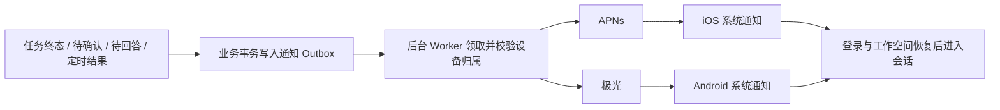

# 移动端系统通知迁移分析

分析日期：2026-09-10。本文保留迁移前的源码分析，表格中的“新版现状”指迁移前基线。后续已按用户确认实现通知 API、双端接入和单手机登录；最终接口、配置和验证见 [MOBILE_NOTIFICATIONS.md](MOBILE_NOTIFICATIONS.md)。尚未部署。

新版本基线为 OpenBox `a69b141`；分析分支为 `codex/mobile-notifications`，合并后的主工作目录为 `/Users/wang/workspace/OpenBox`。旧版本参考 `/Users/wang/workspace/bossip` 的 `f1ff9119`，完整推送实现位于 `apps/codex/v2`。

用户所说的“报名一样”按“包名一样”理解；“沿用旧授权”按沿用旧推送应用和服务端凭据处理。手机上的通知权限仍读取系统真实状态。

## 结论

可以继续使用旧版的 iOS APNs 和 Android 极光应用。两代客户端的 iOS Bundle ID、Android Application ID 都是 `com.bossip.bipmobile`。原生桥接与通知展示策略有较多可复用代码；服务端需要按新版 Python、用户和工作空间模型重新接入。

这项功能需要同时覆盖原生客户端、Flutter 生命周期及路由、后端设备绑定、可靠投递和业务终态。只移植通知弹窗或在手机上监听 WebSocket，不能完成后台与锁屏通知链路。

| 层面 | 旧版已有 | 新版现状 | 迁移动作 |
| --- | --- | --- | --- |
| iOS | APNs 注册、权限、前台展示控制、点击、冷启动、签名环境识别 | 无 APNs 注册与推送 entitlement 接线 | 提取通知桥接，接入现有 AppDelegate/SceneDelegate |
| Android | JPush 6.2.0 / JCore 5.5.0、权限、Channel、Receiver、Registration ID、点击缓存 | 无极光依赖及通知权限 | 复用旧 SDK 组合及桥接；核对当前构建兼容性 |
| Flutter | `SystemNotifications` + `CodexNotificationCoordinator` | Riverpod + GoRouter，无系统通知管理 | 保留桥接契约，重写适配新事件与作用域的协调层 |
| 服务端 | Fastify、APNs/JPush client、设备表、Outbox、delivery、事件游标 | FastAPI + SQLAlchemy + PostgreSQL；无系统推送服务 | 移植投递机制，使用新版认证、数据库迁移与生命周期 |
| 事件 | Codex `thread/turn` 协议与 `conversation_events` 持久化日志 | `session/message`、问题检查点、运行 generation、实时事件总线 | 在新业务事务中生成可去重的通知事件 |
| 站内通知 | 与系统通知职责分开 | 已有 `/api/notifications` 和 `Notification` 表 | 可以后续接同一投递层；现有表本身不提供系统推送 |

## 授权和凭据复用

| 配置 | 旧版记录 | 处理方式 |
| --- | --- | --- |
| 应用标识 | `com.bossip.bipmobile` | 保持一致 |
| Apple Team ID | `5AN3L8LZL9` | 沿用原开发者团队 |
| APNs Key ID | 旧文档为 `9W29AV52YC`；实际部署为 `8BUB654RH8` | 后续已从旧服务端取得实际 `.p8`，本地签名校验通过；生产有效性仍以实际 APNs 验证为准 |
| 极光应用 | `BossIP-bip` | 沿用；不是另一个包名为 `cn.chuhaivideo.callserver` 的历史应用 |
| 极光 AppKey | `20c609b5064f10d52d8351d8` | 客户端和新服务端使用同一 AppKey |
| APNs 私钥 / 极光 Master Secret | 旧服务端 Secret 配置 | 部署时继续只从服务端受控文件/环境注入，不写进 App 或 Git |

初始标识来自旧版[接入记录](/Users/wang/workspace/bossip/apps/codex/v2/mobile/PUSH_NOTIFICATION_ENABLEMENT.md)和 Gradle/Xcode 配置。后续按用户要求从旧服务端提取了 APNs 私钥和极光 Master Secret，并修正 Key ID；私密内容仅进入本地忽略配置，没有写入文档或 Git。尚未向推送服务验证凭据是否被撤销。

包名相同为复用应用提供了基础，iOS 还必须恢复 Push Notifications capability、`aps-environment` 和相应签名配置。APNs 环境应以实际签名为依据，不能仅凭 Dart 的 Debug/Release 判断；TestFlight 使用 production。[Apple entitlement 说明](https://developer.apple.com/documentation/bundleresources/entitlements/aps-environment?changes=la)

APNs token 认证可以由不同 provider server 使用，但凭据必须覆盖相应团队、Topic 和环境；旧的双环境 Key 仍有兼容支持。因此不因后端从旧项目迁到 OpenBox 就新建或轮换 Key。[Apple token 认证说明](https://developer.apple.com/documentation/usernotifications/establishing-a-token-based-connection-to-apns?changes=_5)

极光通过 AppKey 和包名识别应用；服务端凭据必须匹配客户端 Registration ID 所属的 AppKey。[极光 FAQ](https://docs.jiguang.cn/jpush/client/Android/android_faq)

新 App 启动、登录恢复、token 变化、回前台时，应获取当前 token 和系统授权状态，再绑定到新后端。不能把旧数据库里的 token 归属直接视为新版登录状态。[Apple APNs 注册说明](https://developer.apple.com/documentation/usernotifications/registering-your-app-with-apns?changes=_1)

## 建议的首版行为

旧版当前对话内轻提示、前台其他页面显示系统通知。用户后续明确修改规则：新版所有前台页面均禁止系统通知，只有后台、锁屏或超时推断离线允许；完整状态定义见 MOBILE_NOTIFICATIONS.md。点击后回到对应会话并重新读取任务状态。

| 业务情况 | 新版接入位置 | 通知规则 |
| --- | --- | --- |
| 任务完成 | `agent/loop.py` 与 `question/runtime.py` 的真实执行结算 | 用户可见主任务正常结束后发送一次，使用会话标题和最终结果的短摘要 |
| 任务失败 | 执行最终失败路径 | 只通知不可继续的失败；重试中的暂态错误不直接变成失败通知 |
| 等待操作确认 | `permission/permission.py` | 使用 request ID 去重，点击打开原有确认卡 |
| 等待回答 | `question/question.py` | 使用持久化问题 ID 去重，点击打开原有问题输入界面 |
| 定时任务完成/失败 | `cron/executor.py`、持久化 `cron_runs` | 按 run ID 去重，`silent=true` / `NO_REPLY` 保持静默 |
| 用户主动停止、流式文本、工具进度 | 现有执行/实时事件 | 不额外触发系统通知 |

定时任务使用内部临时会话执行。它的临时会话完成和最终 cron 结果只能产生一条对用户有意义的通知；有来源会话时回来源会话，没有时回定时任务页。内部子任务同样不应逐个冒出完成通知。

新版已有的授权过期、抖音投稿完成等 `Notification` 记录可在后续接同一发送入口；如要增加可查看历史的通知中心，需要另行定义每用户已读状态和业务跳转字段。

## 后端方案

建议增加 `backend/notifications/` 模块，以及 `push_devices`、`push_outbox`、`push_deliveries` 数据表。设备属于登录用户；通知事件明确携带接收用户和业务工作空间。发送前重新校验设备当前归属及该用户对工作空间/会话的权限，避免换号、退组后仍发送旧任务内容。

设备登记使用新版 JWT。拟提供幂等的 `POST /api/push/devices`、当前绑定的禁用/解绑接口；响应返回该 provider 是否真正启用，避免客户端把“已允许通知”误报为“远程推送已连通”。客户端不能通过请求体指定另一个接收用户。

退出登录需要在现有 `AuthController.signOut()` / 后端 logout 链路中撤销该安装的设备绑定；绑定使用版本或租约标识，旧账号晚到的注册、解绑响应不能覆盖新账号绑定。设备换号时应取消属于旧绑定的未发送 delivery，并清理本地待跳转信息。离线退出无法保证立即撤回已进入系统推送通道的通知，需要定义本地清理和服务端绑定过期策略。

用户后续明确采用单手机登录：已在新版增加持久化移动会话，最后登录的 iOS/Android 设备生效，旧手机的 HTTP、刷新、WebSocket 和通知绑定一起失效。网页登录独立；设备表的用户唯一约束与会话撤销联动，不能只移动推送 token。

Outbox 在 PostgreSQL 内保证业务事件去重；delivery 以“事件 + 设备绑定版本”为单位记录投递。Worker 使用领取租约与尝试编号，支持重启恢复和多进程竞争，已成功设备不会因其他设备失败而被重复投递。借鉴旧版的退避、过期、无效 token 清理；永久配置错误应与设备失效分开处理。

新版 `bus.publish()` 是进程内事件加 Redis Pub/Sub；`publish_confirmed()` 确认发布也不等于消费者已持久化处理。不能只靠订阅总线后异步插入 Outbox 来承诺不丢通知。核心通知在业务状态提交时一并入库；总线可用于唤醒发送 Worker，不能成为唯一事实来源。外部推送网络请求必须在业务事务之外执行。

任务完成尤其需要补充明确的终态结算：`agent/loop.py:1311` 发出 finalizing 并设置 idle，`finally` 又调用 `finish_run()`；后者还会处理待回答、恢复和失败。`run_id` 会在结算时清除。应在清除前保存所属执行和结果，并以 `session_id + generation + 终态类型` 等稳定业务键去重，明确一次任务中回答后续跑的边界。不能把每一次 idle、每个 assistant 消息或每条 session.error 当成最终通知。

建议新 payload 包含 `schemaVersion`、`source=openbox`、`eventId`、`type`、`workspaceId`、`sessionId`、执行标识、可选 `actionId`，以及安全的标题/摘要。路由由客户端白名单映射，不直接执行 payload 里的任意 URL。等待确认的通知只打开原有 UI，不直接代替用户批准操作；发送前和点击后都检查请求是否仍有效。

## 客户端方案

Flutter 将通用平台桥接放进 `mobile/lib/shared/notifications/`，在 `mobile/lib/app/` 装配认证、工作空间、GoRouter 和通知协调。设置页提供启用、状态、跳系统设置和测试入口；“本地测试通知”与“服务端测试推送”需要在实现和验收中明确区分。

冷启动点击先缓存目标，等认证与工作空间列表加载后，验证目标工作空间、切换作用域、再进入 `/app/s/:sessionId`。会话不存在或账号不匹配时显示适当提示。每个点击事件只消费一次，不能让后续 token 回调再次跳转。

后续确认所有前台页面禁止系统通知：远程推送就绪后，不让 WebSocket 事件额外安排后台本地通知；iOS 原生前台不展示，Android 保留极光前台抑制及 `onNotifyMessageUnShow` 回调，仅由协调层按当前会话决定页内提示。去重键在不同来源之间保持一致。

iOS 新项目已有 Flutter implicit engine、SceneDelegate、支付宝回调、文件导出桥接。将通知能力拆入独立 Swift 类，再在现有生命周期挂接；不要整份覆盖旧 AppDelegate。补上 capability / entitlement，同时验证 Scene 冷启动的通知点击。

Android 迁移旧 `BossIpPushBridge`、`BossIpJPushReceiver`、`BossIpJCommonService`、通知小图标、权限和受控 `PUSH_OPEN` Intent，接入新版已有的 MainActivity。

新版 Android 已有专用 `AuthCallbackActivity`，与旧版关于 `taskAffinity` 的修复方案不同。保留新版 SSO 回调栈设计，专门回归通知点击与登录回跳；旧 Manifest 不能整体覆盖。

Android 13+ 要处理 `POST_NOTIFICATIONS` 的允许、拒绝和未决定状态；启用入口应由用户操作触发。[Android 通知权限说明](https://developer.android.com/develop/ui/compose/notifications/notification-permission)

极光隐私同意与系统通知权限是两种状态。沿用旧版已做的隐私同意后初始化机制，并在新设置入口衔接；不能因为已登录或包名没变就假定已取得 SDK 所需的同意。[极光 SDK 指引](https://docs.jiguang.cn/jpush/client/jghgzy_a_i_h)

## 复用时需要保留的边界

- 旧接入记录报告过 APNs Sandbox 真机和 Android 极光基础链路验证；这些是旧版记录，本次没有重跑，也不代表新版已通过。
- 旧版没有完整的国内 Android 厂商离线通道。新版后续已加入七个官方厂商适配器、配置文件及正式签名入口，由用户填写参数；见 [Android 厂商推送配置](ANDROID_PUSH_VENDORS.md)。普通后台、最近任务划掉、系统强制停止分别验收。
- 复用同一推送应用时，旧服务器的历史设备绑定可能仍有效。上线前要定义升级设备的旧绑定退役方案；新 payload 增加来源/版本，旧 `threadId` 通知不得误映射为 OpenBox 的 `sessionId`。不能为迁移新客户端直接停掉仍服务旧客户端的整个应用。
- 旧源码的 APNs/JPush provider、测试案例可迁移；旧 Gateway 的 `host_id`、Codex 事件游标、终态轮询与认证 nonce 不能直接搬进新版。

## 实现顺序与验收

1. 定义设备绑定、通知 payload、执行终态及数据库迁移，实现 APNs/JPush provider 和持久化投递。
2. 接通 iOS/Android 原生桥接，Flutter 设置入口、绑定恢复、退出解绑和点击导航。
3. 接任务终态、待确认、待回答、定时任务，并打通前后台统一去重。
4. 验证正常结束、失败重试、主动停止、问题续跑、静默定时任务、内部临时任务过滤；验证账号切换、工作空间切换、解绑与发送并发、Worker 重启恢复及无效 token。
5. 按项目现有规范运行 Flutter analyze/test、相关后端测试、Android debug 和 iOS simulator 构建；保留登录、支付宝与文件导出回归。
6. 使用真实设备验证服务器发送到 iOS 开发包、TestFlight production、Android 的到达及点击；覆盖当前会话、其他页面、后台、锁屏、冷启动。模拟器构建和本地通知测试不作为远程投递通过证据。

本轮已实现基础设施并完成本地测试、Android debug 和 iOS simulator 构建，没有发送真实通知。仍需验证原凭据有效性、真实签名产物的推送 entitlement，以及旧系统与新系统并行期间的设备迁移行为。后续已接入明确业务终态与等待事件，以及仅后台 / 推断离线发送的双端状态策略；实际平台终态证据不足的发布路径不会误报。

## 源码索引

| 依据 | 文件 |
| --- | --- |
| 旧版接入及测试记录 | [PUSH_NOTIFICATION_ENABLEMENT.md](/Users/wang/workspace/bossip/apps/codex/v2/mobile/PUSH_NOTIFICATION_ENABLEMENT.md) |
| 旧 Flutter 平台接口 | [system_notifications.dart](/Users/wang/workspace/bossip/apps/codex/v2/mobile/lib/src/core/system_notifications.dart) |
| 旧通知展示与点击策略 | [codex_notification_coordinator.dart](/Users/wang/workspace/bossip/apps/codex/v2/mobile/lib/src/core/codex_notification_coordinator.dart) |
| 旧发送状态机 | [push-runtime.ts](/Users/wang/workspace/bossip/apps/codex/v2/apps/api/src/services/push-runtime.ts) |
| 旧绑定、去重及投递存储 | [push-store.ts](/Users/wang/workspace/bossip/apps/codex/v2/apps/api/src/services/push-store.ts) |
| 新执行结算 | [loop.py](/Users/wang/workspace/OpenBox/backend/agent/loop.py:1311)、[runtime.py](/Users/wang/workspace/OpenBox/backend/question/runtime.py:159) |
| 新执行和问题持久化 | [question.py](/Users/wang/workspace/OpenBox/backend/db/models/question.py:10) |
| 新事件总线 | [bus.py](/Users/wang/workspace/OpenBox/backend/bus/bus.py:65) |
| 新认证退出 | [routes.py](/Users/wang/workspace/OpenBox/backend/auth/routes.py:402)、[auth_store.dart](/Users/wang/workspace/OpenBox/mobile/lib/shared/api/auth_store.dart) |
| 新工作空间恢复与路由 | [workspace_bootstrap.dart](/Users/wang/workspace/OpenBox/mobile/lib/app/workspace_bootstrap.dart)、[router.dart](/Users/wang/workspace/OpenBox/mobile/lib/app/router.dart) |
| 新原生入口 | [AppDelegate.swift](/Users/wang/workspace/OpenBox/mobile/ios/Runner/AppDelegate.swift)、[AndroidManifest.xml](/Users/wang/workspace/OpenBox/mobile/android/app/src/main/AndroidManifest.xml) |
