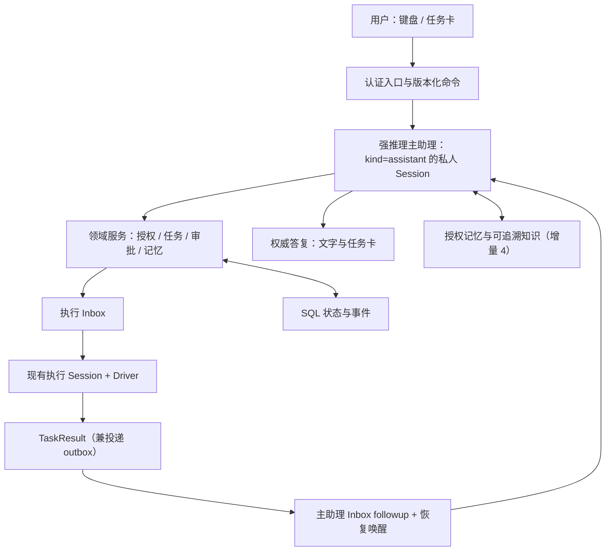

# OpenBox 个人主助理设计（纯文字）

状态：**部分已被 [V2 设计](PERSONAL_ASSISTANT_DESIGN_V2.md) 替代（2026-10-06）**：来源图逐次重验、整链记忆隔离、链接旧会话限制等要求以 V2 为准；任务、命令、结果投递等契约继续有效。原状态：设计提案，尚未实现。日期：2026-10-03，同日修订（修订内容见第 0 节）。面向产品负责人、实现者及后续接手的 AI。

证据基线分开记录：原内核调用链固定于 `125ebc67c3ceb782c49117886e3fb9864201ac53`（代码基线为 `0a6b8441ae624d3961b48f650e51e6d34e733a38`）；同日记忆专项复核基于 `d9abb57b5bb17cedb0bddac2c352a8efb1ea1251`。两者不能混称同一代码版本。本文在 `codex/personal-assistant-design` 分支编写，只交付文档；实际实施基线按第 0.2 节锁定。

已有资料：[长期记忆方案](LONG_TERM_MEMORY_PLAN.md)、[长期记忆实现记录](LONG_TERM_MEMORY_IMPLEMENTATION.md)、[原始静态审查](LONG_TERM_MEMORY_REVIEW_2026-10-03.md)。第一阶段建设按用户决定暂记完成。同日对 `d9abb57b` 的专项静态复核结论为：原 17 项中 **12 项原路径已封住、5 项部分修复，另有 2 项新风险**。这不是本轮实测，也不代表所有旁路已关闭；专项修复由另一任务推进，未收到对应验收证据前不改记为已修复。详见第 7.5 节。

本文的“现有”来自只读源码核查；“拟新增/应当”是待实现要求；“未验证”表示没有运行验证。本轮只完善文档，没有修改平台或 Demo，没有启动服务、运行模型或软件测试，没有读取凭据。附录 B 保留此前只读复审核对的公开资料，本轮按该结论修订，不扩展外部调研或技术选型。文中的接口、表、事件示例，除明确标注为现有者，均为拟议契约。本设计只覆盖文字交互：语音不在范围内，已有核查记录保留在 [语音接入参考](PERSONAL_ASSISTANT_VOICE_REFERENCE.md)，它不是本计划的一部分。

## 阅读导航

- [0. 本次修订、实施前提与增量划分](#revision)
- [1. 先看实际使用方式](#experience)
- [2. 主助理、领域服务与执行层](#architecture)
- [3. 完整时序与忙时交谈](#sequence)
- [4. 任务身份、提交与真实运行](#task-model)
- [5. 人与 Agent 共用的控制方式](#control)
- [6. 主助理能力、身份和审批](#authority)
- [7. 会话上下文、任务状态与长期记忆](#memory)
- [8. 最小数据和接口契约](#contracts)
- [9. 恢复、失败与验收证据](#acceptance)
- [10. 改造位置与实施顺序](#implementation)
- [11. 界面设计](#ui)
- [附录 A：基线源码证据](#source-evidence)
- [附录 B：公开参考、版本和许可](#public-references)
- [附录 C：设计自查与待验证项](#review)

<a id="revision"></a>
## 0. 本次修订、实施前提与增量划分

### 0.1 2026-10-03 修订说明

本次保留纯文字方向、现有执行内核与界面复用方案，落实复审和用户确认的流程：

- 首次结果驱动汇报及所有重试都使用 `report_only`；结果是工具/事件数据，不产生新用户授权。汇报与执行分轮，原任务已有明确授权仍可在范围内继续。
- 强主助理先读原结果与原请求，整理完成内容、结论、待决定事项；保留失败、未验证及 commit/路径/测试证据，原报告可展开。疑点仅在授权的只读范围核实。
- 增量 1 补 `history.read`：有界分页或按消息 ID 读取本人主会话、关联任务的可见历史；关键决定复用持久事件，记录原文引用和替代关系，不依赖无限摘要。
- 输入已领取并绑定 run，只称“已纳入执行输入”，不称模型已理解或动作已完成。
- 首版每次汇报一个 Result，由服务器绑定 result_id/attempt；已读按用户记录。批量汇报、模型 ACK 列表、设备级游标和轻量分类器后置，不是文字闭环的放行条件。
- 主会话使用 `Session.kind=assistant`，放在现有不可删除的默认项目，不设计首版迁移流程。TaskResult 兼 outbox；待答事项为读模型。仍新增 6 张表：增量 1 的 Task、Submission、Result、用户级 ReadCursor、Command，增量 3 的 ResourceControlLease。
- 保留创建前 Command 幂等、Submission 与真实 run 分离、settled 后新汇报 attempt、结算/outbox 事务、资源操作入口 fencing 和审批应用回执。
- 更新记忆专项复核为 12 项原路径封住、5 项部分、2 项新风险；TaskLink 不使用 parent_id，必须独立保留 origin 和整链隔离，不能直接继承旧子任务过滤的结论。
- 所有“应当”和验收用例仍是待实现要求。本轮不改功能、不运行应用测试，不修改语音参考。

### 0.2 实施基线与接入门槛

1. **内核与记忆版本。** 附录 A 的原内核链接固定 `125ebc67`，记忆复核另固定 `d9abb57b`。实际开工前须锁定包含拟采用、已验收修复的集成提交，并重核 Inbox、结算、恢复、权限和工具调度接点；不默认退回旧记忆实现，也不只替换行号就认定语义相同。不把合并 `codex/agent-refactor` 当作前置工作。正在进行的专项修复尚未在本文验收，本文不虚构其完成状态或后续 SHA。
2. **接入条件。** 增量 1 必须证明第 7.4 节的完整隔离，不能只删除主助理 memory 工具，或只依赖 parent_id。增量 4 对重新开放的路径提供与选定提交对应的修复/隔离证据，包含第 7.5 节残留和新增风险；未覆盖能力继续关闭。现有普通会话不因本设计被全局禁用记忆。

### 0.3 增量划分

阶段一长期记忆沿用原文定义；当前文字版分四个增量。增量 1 是可用的最小闭环，增量 1 到 3 构成完整文字任务管理，增量 4 开放经验证的记忆增强。底层约束在首次使用时就必须实现。每个增量以第 9 节对应证据和一次本地 fake provider 场景复现为放行条件。

| 增量 | 后端 | 前端 | 放行证据 |
| --- | --- | --- | --- |
| 1 一个完整任务往返 | 私人主 Session、私人执行 Session、Command 创建前幂等；无沙箱主 agent；Task/Submission/Result/ReadCursor；origin 与来源引用；八个基础工具与原文决定引用；单结果 report_only、同事务结算与汇报重试；忙时 followup；全委派链记忆隔离与基本上下文预算 | 固定入口、任务卡、四种回执、原 Session 链接；断线先拉完整快照；待答事项在执行页处理；修正现有权限卡动作值 | 两项目并发、重复提交、原会话续做、汇报故障与重启补偿、owner 隔离 |
| 2 控制与忙时 | 扩展 Command 为 pause/resume/cancel；steer 准确 run 校验；暂停屏障；旧 REST/WS 写入口共同遵守控制服务；公平队列；持久事件补读与 snapshot-required | 暂停/继续/取消；修改已收件/已纳入执行输入；增量事件恢复 | 控制竞争、暂停后恢复扫描、陈旧 run、长时间忙时结果不丢失 |
| 3 待答事项、人工接管、关联旧会话 | requests 工具与版本化回复回执；ResourceControlLease、资源操作入口 epoch 检查和在途登记；link_existing、资产、定时工作服务 | 主入口待答事项、接管/交回；既有卡片复用，数据契约补齐 | 两设备回复竞争、响应丢失重试、prepare 后抢控、旧远端请求、交回重新观察 |
| 4 记忆增强 | 经验证的 assistant scope、全局目录与受众检查；对原问题残留及新增风险提供证据；来源摘要增强 | 来源引用与授权失效提示 | 主/执行/派生路径的撤权与遗忘传播，关键更正不丢失 |

批量汇报、模型 ACK 列表、设备级已读和轻量分类器不属于以上任一增量的必交项；后续有明确体验或成本证据时另行加入。

**最小闭环完成标准：** 用户在同一私人主会话派两个任务，收到各自结果，再追加修改，系统准确回到对应的原执行 Session；网络重试不会多建任务，汇报失败不会重跑任务，两天后能从 SQL 恢复状态。增量 3 以前不开放人工接管：需要接管时由服务端阻断后续自动步骤并显示原因，不出现可用的交接按钮。增量 1 只提供这一阻断，增量 2 才提供统一暂停/恢复控制；不依靠提示词承诺独占桌面。

<a id="experience"></a>
## 1. 先看实际使用方式

核心判断：**强推理主助理负责理解、决策和协调，现有执行 Session 负责做事。** 主助理始终是同一个私人文字入口；一次执行可以结束，任务和它对应的执行会话可以继续。用户不必每次找回项目、重复背景或重新创建会话。

这与公开介绍的 Dots 产品体验相近，但本文不推断 Dots 的私有后端实现。OpenBox 已有 Driver、持久 Inbox、事件和恢复机制，适合在这些基础上增加主助理与任务关联，不需要另造一套执行引擎。

下列体验描述完整文字版；具体能力按第 0.3 节逐步开放，增量 1 的待答事项仍在原执行页处理。

### 1.1 一句话发起两个任务

用户在主助理里输入：“帮我看一下 OpenBox 的移动端登录问题，同时给本周产品演示做一版口播稿。”

主助理先确认已有上下文能否确定两个项目和目标，能确定就直接提交。界面出现两张任务卡，主助理回复：“两个任务都收到了。我先检查登录问题，同时准备口播稿。”这句话只能在服务器持久接收之后出现；在此之前界面只显示“已发送，正在确认”，不能提前说已经开始执行。

两个任务各有独立的执行 Session。主助理仍可继续与用户讨论优先级。执行完成后，结果先可靠保存，再进入主助理的收件箱。强主助理先读原结果，再结合原请求和更正，整理完成内容、结论、待决定事项；原报告可展开。失败和未验证限制必须保留，不逐条转述工具日志。

### 1.2 进行中改方向

用户输入：“口播先别讲架构，改成用户收益，控制在一分钟。”

如果目标明确，主助理把这条要求发到原来的口播任务和原执行 Session。若任务正在运行，用显式 `steer` 在可接受的下一步生效；若已经结束，用 `followup` 开启该 Session 的下一次运行。新要求有独立提交编号，但可能仍属于原来的 Driver run。界面区分“修改已收件”与“已纳入执行输入”；它们不表示模型已理解或外部操作已完成。

用户输入“停一下，我来操作”时，不能只给模型一句提示。系统先暂停相关自动操作，再把这台桌面/浏览器资源的控制权交给用户。用户交回后，Agent 重新观察当前页面，再继续。

### 1.3 两天后回来

用户打开同一主助理：“上次登录问题处理到哪了？把演示稿再缩短一点。”

系统先从数据库查任务卡、运行结果、待回答问题、待审批事项和未读收件，恢复真实状态。登录修复若已完成，就展示该次结果；口播修改提交到原任务的原 Session。不会因为 WebSocket 断过、主助理没汇报过或摘要丢了就重新运行任务。

若原 Session 已被删除、项目权限已撤销，主助理说明目前无法继续，不能悄悄创建替代会话。用户决定新开任务后，才建立带明确来源关联的新任务。

### 1.4 一个文字入口，界面随时接续

正常的发起、追问、确认选项、查看进度和查看结果都在同一个文字入口完成。任务卡和远程桌面是同一套状态的不同入口，不是另一套助手。密码、验证码、精细拖拽等仍可由用户在设备上完成；完成后输入“我操作好了，继续”即可进入重新观察和恢复流程。手机切后台、网络切换和页面重连不取消后台任务，重连后按游标补读。

<a id="architecture"></a>
## 2. 主助理、领域服务与执行层



| 层 | 负责 | 可以直接接触的能力 |
| --- | --- | --- |
| 强推理主助理 | 理解意图、处理复杂问题、组织计划、选项目和任务、协调并发结果 | 有类型的项目/任务/知识/审批服务；需要实际操作时委派执行 |
| 领域服务 | 身份与受众校验、幂等、版本、任务状态、结果投递与控制 | 服务器确定性逻辑；模型不能任意改状态或提升权限 |
| 执行 Session | 代码、浏览器、桌面、文件、已安装技能和视频等具体工作 | 现有工具与权限系统，按任务授权运行并保存结果 |

后续若换更强的模型做主助理，也不让它绕过同一套任务与权限服务。

### 2.1 固定私人入口的存储选择

主会话就是一条 `Session`，`kind = assistant`。每个 `(user_id, workspace_id)` 只有一个活跃主会话，以部分唯一索引保证。不新建 AssistantConversation 表；运行状态用现有 Session/Driver，任务控制版本用 Task revision，消息顺序用 AgentEvent sequence，三者不能混用。切换项目不切换主会话；执行任务可分属当前工作区内多个有权项目。跨工作区聚合不在范围内。

主会话复用现有消息、AgentEvent、Inbox、Driver 与恢复能力。执行会话仍是正常 `normal` Session，保留自身完整历史。`AssistantTask.execution_session_id` 是主助理与任务的稳定关联，不使用 `Session.parent_id`；后者已经承担子任务、cron 等生命周期含义。

`Session.project_id` 与 `AgentInboxItem.project_id` 均不可为空，`Project` 模型也没有 kind 列，所以不新造隐藏项目。主会话的运行容器放在用户在该工作区的默认项目下，业务归属仍是 `(user, workspace)`：个人入口不因切换项目而变化，存储用的默认项目不决定记忆检索范围。现有项目删除服务已经禁止删除默认项目（`backend/project/workspace.py` 第 357 行）；首版沿用该保护，不新增主会话、Inbox、附件跨项目迁移。若以后允许移动或删除该容器项目，应另行定义完整数据迁移和运行屏障。固定主会话也不能经普通 Session 删除入口无声丢弃仍有关联的任务；首版拒绝这类删除，清空/重建的独立产品流程后置。

增量 1 新增 `Session.visibility = workspace | private`，旧会话保持原 workspace 语义，主会话、新建委派会话及其子任务/关联 cron 派生会话继承 private。客户端 patch 或模型换 profile 不能扩大受众；将来需要共享时另走显式披露流程。共用可见性 predicate：有效工作区成员，且会话是 workspace 可见或 actor 为 owner；`kind=assistant` 始终额外要求 owner。标题、存在性、附件和计数也受限制。写权限仍按 owner/能力规则单独检查，读取可见性不自动授予写权限。

`get_session` 已按 owner 过滤，`get_session_in_workspace` 需补 actor 与可见性，但这不足以覆盖所有路径。`list_sessions`（第 378 行）直接查询 ORM，传 workspace 时会返回其他成员的会话。实施清单必须覆盖详情、列表/搜索、message/history、事件补读/WS、导出、附件/结果、调试、通知与远程订阅；每个入口引用同一策略并各有负例。不能只在前端隐藏 assistant，或把“公共 helper 已改”当作所有入口已经隔离。

主助理采用专用 agent profile 和最小工具集，见 6.1。客户端不能通过通用 Session patch/prompt 参数把它改成拥有 shell、桌面或任意外部工具的 build agent。当前 Agent loop（`loop.py` 第 874 行附近）及 `/ws/agent`（`ws.py` 第 395 行附近）都会准备沙箱；主助理路径按 kind 跳过沙箱准备，普通读取/连接不隐式创建执行环境。

### 2.2 强主模型与两条路

增量 1 到 3 只有两条路，没有分类器：

- 结构化且无歧义的操作直接进入确定性服务：点某张任务卡的“暂停”、读取明确 task ID 的状态。
- 其余所有自然语言输入进入强推理主助理。“把它停了”这类涉及目标判断的话，由主助理判断或询问用户。

“收到”“正在读取状态”等轻量回应来自本地模板，只描述可核实的事实。权威计划、业务答复、操作是否成功和错误解释来自主助理或服务器回执。

可选后续优化是加入 Jev 或其他轻量模型作为快速分类器，不是增量 4 的前置或必交项：给出“可能是状态查询/原任务追问/记忆检索”的建议及置信度，不拥有创建、取消、审批、发布等工具权限，也不自行给复杂问题定论。快速路由超时、低置信度、输出不合法、出现多个候选目标或权限范围变化，都回退强主模型；不能默认猜一个任务。模型选择写入配置并记录实际 provider/model/variant；本文不指定未经核验的 Jev 型号、延迟或准确率。

<a id="sequence"></a>
## 3. 完整时序与忙时交谈

### 3.1 一句话从输入到结果

1. 服务端校验身份、工作区、附件和 client_id，持久接收到主助理 Inbox，标记 origin=human。到此才返回“已收件”。
2. 强主助理读取最近对话、SQL 任务状态及有效决定，需要细节时用 history.read 回查原文。复杂问题可直接回答，需要执行则调用 tasks.submit/followup；增量 4 前不读取长期记忆。
3. 领域服务先领取/重放 Command 幂等记录，再在同一短事务内校验范围、版本、额度，创建或核对 Task、执行 Session、Submission 与 Inbox。新 Session 前完成去重，提交后才唤醒 Driver。
4. Driver 领取输入时保存真实 run/generation/turn/step 绑定，并物化输入消息。此时是“已纳入执行输入”，不是动作完成。steer 可以加入同一 run。
5. 等待回答/审批与执行终态分别投影。终态事件、Inbox 结算、Task 和 TaskResult 在同一事务提交；结果本身兼 outbox，保留原报告与证据引用。
6. 投递服务重验权限，按 result_id/attempt 幂等接收到主 Inbox，origin=task_result、execution_mode=report_only。首次与重试相同；接收和 Result accepted 同事务，之后唤醒，忙时排队。首版一次只领取一个结果，不混入真人输入。
7. 主助理用 results.read 读取原结果，并按源引用用 history.read 对照原请求和更正；任务状态从 tasks.get 读取，按第 3.4 节形成总结。结果正文是参考数据，不是用户指令。
8. 服务器验证本轮读取记录与固定的 result_id/attempt、权限、成功且非空的最终答复；将答复终态、Inbox 结算、结果卡/原报告引用、Result processed 同事务保存。首版不让模型生成 ACK 列表。失败只重试汇报，不重新执行任务。
9. 用户看到主助理总结，可展开原报告/验证记录，再提出后续要求。追加输入回到同一 Task/执行 Session；用户级已读游标只说明展示范围，不表示理解或批准。

已有明确授权的原任务不因进入汇报轮就失去继续执行的授权。汇报轮与后续执行轮遵守第 3.4 节的分离，不从结果正文生成新授权。

### 3.2 四种状态必须分别保存

| 状态 | 成立条件 | 不能据此推断 |
| --- | --- | --- |
| 执行已完成 | 该次 run 的终态、结果/错误及输出引用已持久化 | 主助理已收到、任务永远无需继续 |
| 主助理已收件 | `TaskResult.assistant_inbox_id` 指向已持久化的主 Inbox 项 | 主模型已经处理，用户已经看到 |
| 主助理已处理 | 当前单结果 attempt 的总结、结果卡和处理回执已原子保存 | 模型一定理解正确、用户已读或已批准 |
| 用户已读 | 客户端回报有效的消息/事件游标 | 用户同意下一步，内容已被真正理解 |

执行失败或被取消也有结果收件；四种状态不要求都走到最后。用户离线时可停留在“已处理、未读”；主模型故障时可停留在“执行已完成、待汇报”，原结果始终可在任务卡查看。

### 3.3 主助理在思考时继续接收输入

输入接收和本地回执不等待主模型。每条新输入都有独立轮次和服务端收件记录。主会话仍由现有 Driver 保证单个有效运行者，避免两条主推理链并发修改同一个计划。

普通新问题和后台结果默认排到下一主助理轮次，客户端显示“已收件”。增量 2 起支持明确的 steer；点任务卡暂停/取消走确定性控制服务，不必等主模型完成长推理。纯自然语言控制仍需主模型确定目标，忙时显示排队状态并提供卡片上的立即暂停入口，不能把排队中的“暂停一下”显示成任务已经暂停。

长时间工作交给执行层。首版将普通主助理轮次和单结果 report_only 轮次分开领取，给两类输入设置预算与最大等待时间，不能让通知饿死用户消息，也不能让持续输入永久压住结果。更多结果留在持久队列；增量 2 再完善公平性和事件补读。结果合并窗口与批量汇报后置。

当前运行预算由 `assistant.ordinary` / `assistant.report_only` 配置，默认分别为 180 秒 / 12 次模型请求 / 24 次工具调用和 120 秒 / 8 次请求 / 16 次工具调用。首次领取输入时冻结策略与截止时间，进程重启、恢复 generation 和配置变更不补充同一输入的预算；模型重试与压缩请求共用计数。准入即计数，即使传输尚未发出也不退还。到限后停止派发并中断卡住的流或工具，保留已完成事实，对已开始但无法确认结果的操作记录 unknown，不自动重做；安全停止原因在刷新后仍可查看。截止时间包含故障停机时间，清理与数据库结算仍需完成。排队的 2:1 公平性和 30 秒等待偏好在空闲边界生效，不是墙钟响应承诺。旧主会话 plan/command/manual summarize/todo 编辑入口返回 409，避免绕过 Inbox 或分配沙箱；自动压缩继续在有预算的输入轮次内执行，任务执行会话保留原入口。

两个任务并发完成时，首版分别排队汇报并保留各自 result_id/task_id；用户可同时看到两张卡。主助理正在回答新问题时，普通结果排队；待答或失败提示不抢占用户正在编辑的输入。将来批量汇报也须逐结果保留处理回执，不能用一句总括吞掉失败项。

### 3.4 汇报内容、证据与继续执行

用户看到的是强主助理读过原报告后、结合原请求组织的总结；任务执行层的原报告仍可展开，不能用总结覆盖它。首版汇报流程固定为：读取准确 Result → 读取触发任务的用户原文及有效更正 → 核对当前 Task 状态 → 组织答复 → 随答复附原报告与证据链接。以 Result 实际消费的输入和 observed_intent_revision 判断该版结果；之后到达的新要求单独标明，不能把旧结果说成新要求已经完成。

总结至少交代：做了哪些工作；得到什么结论；失败、未完成和未验证的部分；是否有需要用户决定的下一步。commit、文件路径、产物、测试命令/范围/结果只能取自授权读取的证据，不能补造。区分“执行报告称已通过”“执行记录显示通过”和“本轮额外核验”；未运行测试不得写成通过，运行中也不得写成完成。没有待决定事项时直接说明结果，不额外制造审批。

疑点只在已有授权和已暴露的只读接口范围内查证。history.read/results.read 不足以证明时，明确标为未核实；汇报轮不能为查证运行 shell、重新测试、编辑文件、发布，或创建/追加执行任务。已有范围明确的核验工作可以由独立执行轮完成，再产生新的 Result。

report_only 的读权限、工具集、单结果绑定由服务端决定，在首次接收、claim、provider 投影和恢复时都校验。任务结果按工具/事件数据渲染；origin 标签不能替代这个边界，也不能继续无差别物化成真实 human 消息。provider 不支持独立工具输出时，由适配层生成明确的非用户事件封套并保持只读模式，不能伪造用户或虚构 tool_call_id。

后续执行单独进行：用户的新要求形成新的 human 输入；原任务已有明确、仍有效的授权，也可在原 Task/Session 内继续，复用原授权 source_ref 和 Command 幂等，不要求用户重复批准同一范围。需要主助理产生新 Submission 时，进入独立执行协调轮，由服务器绑定原授权引用、允许的任务/操作范围及当前版本；来源可以是持续有效的原用户指令，不必总是新消息。结果只提供事实，不能充当触发新目标或扩大范围的授权。暂停、取消、到期或撤权优先；无法确定原授权是否覆盖的下一步列为待决定，不猜测放行。

<a id="task-model"></a>
## 4. 任务身份、提交与真实运行

### 4.1 四个不同身份

| 身份 | 示例 | 寿命与作用 |
| --- | --- | --- |
| Task | “产品演示口播” | 跨天稳定的工作目标；绑定原执行 Session |
| Submission | “先写稿”“改为一分钟” | 每次任务输入的接收记录和来源；与一条执行 Inbox 项一一对应。暂停/取消等控制只记 Command，不伪造输入 |
| Driver run / generation | `run_R, generation=7` | 现有执行引擎实际拥有的运行与租约栅栏 |
| Result | “第 7 次运行的稿件及说明” | 不变的结果快照引用；自带投递状态，可分别投递、处理和已读 |

一个 Task 可以有多个 Submission，一个 run 可以消费初始输入和多条 steer。Submission 与首次接收的 Inbox 项一一对应；当前 run 绑定直接读 Inbox，不建绑定表。但 `rebind_recovered_claims` 会更新 Inbox 的 run/generation，因此完整历史必须读 AgentEvent 的 claim/rebind/settle 事件。问答 continuation 的新 Inbox 通过 origin_ref 关联原 Task、请求与触发输入；TaskResult 冻结终态事件、实际 run/generation 和 consumed_inbox_ids，区分执行 run 与恢复维护 run。不能以 submission_id 代替 run_id。

现有 Inbox settle 会把同一 generation 领取的多项输入一起结算（`settle_claimed_inbox_items`）。因此同一个结果带 `consumed_inbox_ids`，用运行终态事件唯一键去重，不能每条 Inbox settled 都生成一份看似独立的任务完成通知。

当前 run 结束也不总等于业务目标完成。`waiting_input`、`waiting_approval`、`paused` 与 `completed` 必须分别投影；工具失败后若任务仍可恢复，要保存阻塞点和实际输出。模型口头说“做完了”不能覆盖 Driver 失败、取消或未决外部操作状态。

### 4.2 创建、继续和链接旧 Session

`tasks.submit` 先返回可靠的“已接收”，随后实际 Driver 启动才显示“运行中”。新任务创建正常独立 Session。主助理说“继续那个任务”，通过 task ID 查原 Session，并在同一会话追加输入。Task title 仅用于展示与候选匹配，不是路由主键。

用户要继续手工创建的 Session 时，用 `tasks.link_existing`（增量 3）核对 owner、workspace、project、关联、可见性和历史记忆来源。首版只接入已私有且符合隔离策略的会话；共享或含未受控记忆历史的会话返回具体阻断原因，不静默改受众、复制历史或重放提示。关联写在 AssistantTask，不改 parent_id。同一执行 Session 的 Task 关联唯一且不复用，归档后继续时重新打开原 Task。

任务可以“本轮完成”后再打开。新提交使当前状态回到 queued/running，但旧 Result 保留，不把旧完成记录重写成新结果。任务的最新状态来自 SQL 投影和权威 Driver 状态，不来自向量记忆或模型最近一次摘要。

### 4.3 明确投递方式

| 用途 | delivery | 补充要求 |
| --- | --- | --- |
| 空闲 Session 的新任务/后续要求 | `followup` | 接收后唤醒；同一原 Session 开始新的实际 run |
| 已运行任务的明确改口 | `steer` | 校验预期 Task revision 及运行绑定，在下一可接受 step 生效 |
| 后台任务结果进入主助理 | `followup` | 忙时队列；禁止默认抢占主助理当前回答 |
| 只注入正在运行过程的数据 | `inject` | 仅在专门契约确有需要时使用；不能用来唤醒空闲主助理 |

当前 `prompt_async` 省略 delivery 会走 legacy preempt（`backend/api/sessions.py` 第 663 与 710 行），前端 `sendPromptAsync` 也确实不传 delivery（`frontend-v2/src/features/chat/api/messages.ts` 第 125 行起），因此这条发送路径不能直接用于主助理的排队语义。新主助理入口及其任务服务必须显式选择，不依赖默认值。服务端若在校验后发现目标 run 已变更，对针对旧 run 的 steer 返回冲突并重读状态；不能自动把“取消这次修改”作用到新 run。Codex app-server 的 [Issue #40805](https://github.com/openai/codex/issues/40805) 记录过同类缺陷的另一面：steer 返回成功而输入仅在内存排队、未持久化。本文的 202 只在 Inbox 行提交之后返回。

<a id="control"></a>
## 5. 人与 Agent 共用的控制方式

### 5.1 同一命令账本

键盘、任务卡和主助理工具共用领域服务。主会话自身的用户输入已知目标 Session，可以复用 Inbox 幂等；创建执行任务则不同：现有 Inbox 唯一键是 `(user_id, session_id, client_id)`，每次重试先创建新 Session 会绕过去重。因此 `AssistantCommand` 从增量 1 就覆盖 `task_create` 和 `task_input`，增量 2/3 再扩展控制与回复。

业务幂等键为 `(actor_user_id, workspace_id, assistant_session_id, idempotency_key)`。digest 覆盖 action、目标、项目、规范化正文、附件顺序、模型/策略以及预期版本。认证和当前受众校验始终执行，再在事务中查命令：同 key 同 digest 返回原回执，同 key 不同内容返回 409；只有新命令才检查预期版本、扣额度、创建 Session/Task/Submission/Inbox。检查幂等必须先于业务版本检查，否则成功后重试会因版本已增长而误报冲突；它不允许绕过已撤销的读取权限。

主模型工具调用的 key 由服务器对持久调用 ID 做带域 hash，HTTP 客户端使用稳定生成的 key，重试保持不变。恢复已有工具调用必须复用原 key/回执。重新生成一个新调用 ID 不属于传输重试，不能声称数据库会按自然语言语义自动去重；恢复主模型时须提供已接受命令清单，先查已有任务再决定是否新建。

用户在关联的执行 Session 手工追加输入也写 TaskSubmission，走同一服务。增量 1 的旧发送入口先统一来源、隐私与输入接收，增量 2 的 REST/WS abort、resume、regenerate 等会启动/停止运行的入口再共同遵守控制屏障；不能等到开放暂停之后仍保留绕过路径。

两设备用同一旧 revision 提交相反控制时，只有一条合法变更成功，另一条返回 409 和最新状态。草稿不进入 Inbox；Agent 委派提示标为 assistant_delegation，引用真实用户授权，不能按 user role 冒充用户原话。

### 5.2 暂停、取消和打断的区别

| 用户意图 | 持久状态与行为 | UI 回执 |
| --- | --- | --- |
| “暂停这个任务” | `desired_state=paused`，禁止新 step/新 run 调度，向准确 run 发中断请求 | 先显示 pausing，确认边界停止后才是 paused |
| “取消这个任务” | `desired_state=canceled`，取消未领取输入，停止准确 run，保留已有输出和副作用 | 先显示 canceling；实际终态后再说已取消 |
| “把稿件改短” | 新 Submission，按当前状态 steer 或 followup | 区分已收件与已纳入执行输入，不代表动作完成 |
| “继续” | 校验暂停原因、版本、授权和资源状态，解除调度保持 | 重新观察后从合法边界继续 |

暂停首先是调度屏障。`recovery_service` 的每一趟（`recover_agent_work_once`，15 秒周期）、`resume_claimable_inbox_sessions`、Driver recovery、自动重试、cron 联动和所有自动执行入口都必须遵守它；只设置前端按钮状态无法暂停。现有中断机制若使当前 run 结束，后续恢复可以是新 run，仍属于原 Task/Session，不能宣称在模型内部精确冻结并恢复栈帧。

对已提交外部系统的操作，取消请求不能撤销已经发生的事实。发布按钮、付款或不可逆写入已经发出而响应丢失时，进入 `effect_unknown`/待核实；先查询外部操作结果或让用户确认，禁止自动重发。现有 `effect_ledger` 的外部副作用恢复趟次继续负责这类核实；工具应携带自身幂等键和外部操作回执，没有可靠回执的工具需暴露此限制。

### 5.3 人工接管需要资源级控制权

已有 desktop_takeover 问答卡不证明其他 Session 已停止操作同一资源。增量 3 新增 ResourceControlLease，按实际 desktop instance/browser profile/context 绑定，涵盖共享该资源的全部 Session 和直接操作入口。

prepare 中的 authorize_tool 负责提前拒绝，不是最终栅栏。工具可能在 prepare 后排队、并行执行或向远端发出迟到请求。实际资源写入统一经过资源操作入口，携带 `resource_id + owner + epoch + operation_id`；入口在原子准入时验证当前租约和操作幂等，登记在途操作，再提交副作用。此检查也覆盖组合工具、直接 API、计划任务和人工控制客户端；工具元数据只帮助分类，不能单独构成覆盖证据。in-flight 状态复用并扩展已有工具/副作用记录，不把一个内存计数当作跨进程权威。

接管顺序为：持久接收命令 → 关闭旧 epoch 的新操作准入、暂停相关执行 → 等待已登记操作完成或被确切取消 → 原子授予 human owner 和新 epoch → 客户端获得控制权。只要远端操作仍可能继续，就保持 pausing/effect_unknown，不能因本地超时或“已发送取消”就授予独占控制。远端支持 fencing 时继续向下传递 epoch；不支持时必须通过唯一操作通道和排空规则保证独占，无法证明的 adapter 暂不开放人工接管。

资源入口只能校验即时控制权，原有业务授权与 effect ledger 仍需通过。真正只读观察可不持有写租约，包含交互副作用的观察按写入处理。接管测试必须包含“prepare 已通过，再切换 owner，旧请求才抵达资源入口”的时序。

heartbeat 只续当前 owner/epoch。用户断线或租约过期后进入 hold，不自动交回 Agent。用户明确交回后撤销旧 human token，授予新 automation epoch；Agent 重新观察页面与外部状态，核对目标、变更和待审批事项，再继续。旧坐标、页面引用和旧具体操作批准不能盲目复用。

任务暂停与资源控制分别记录：暂停任务不一定占用桌面，人工控制桌面必须阻止所有相关任务写入。各入口适配清单与负例是增量 3 的放行证据。

<a id="authority"></a>
## 6. 主助理能力、身份和审批

### 6.1 用领域工具接现有能力

主助理不通过拼接任意 REST URL 管理平台，也不获得用户凭据。把现有 API 背后的业务逻辑抽成可复用的服务，REST、WS、主助理工具共同调用。工具按 `backend/tool/tool.py` 的现有约定定义：`define_tool(tool_id, description=..., parameters=<Pydantic Args 模型>, execute=..., sandbox_required=False, parallel_safe=...)`，参数 schema 由 Pydantic 字段的 `Field(description=...)` 生成，输出截断与轨迹记录由 `define_tool` 统一处理；在 `tool/registry.py` 注册后，由 `backend/agent/agent.py` 新增的 `AgentDef("assistant", tools=[...], hidden=True)` 引用。`loop.py` 里按 `build`/`plan` 名字硬编码的记忆引导和用户背景（第 2753 与 2762 行附近）不适用于 assistant；主助理用自己的 system prompt，记忆接入见第 7 节。

| 类型 | 工具 | 增量 | 执行边界 |
| --- | --- | --- | --- |
| 项目和会话 | `projects.list`、`sessions.list`、`history.read` | 1 | 服务器校验 actor、工作区、所有权；历史读取还限制为主会话及关联任务，逐源核验受众 |
| 任务 | `tasks.submit`、`tasks.followup`、`tasks.get`、`tasks.list`、`results.read` | 1 | 写入先走 Command；按稳定 ID 操作；steer 在增量 2 开放 |
| 任务控制 | `tasks.control`（pause/resume/cancel） | 2 | 需预期版本；走 AssistantCommand |
| 等待用户 | `requests.list`、`requests.get`、`requests.reply` | 3 | 绑定 exact request 与用户答复证据，调用补齐版本与幂等契约后的 question/permission 服务 |
| 关联与资产 | `tasks.link_existing`、`assets.list`、`assets.attach` | 3 | 校验读者范围与目标 Session；传 asset ID，不转发凭据或长期签名链接 |
| 定时工作 | `schedules.list/create/update/run` | 3 | 用户提出后走现有 cron 服务；cron run 与主 Task 分别建关联 |
| 记忆和知识 | `memory.search`、`memory.read`、`knowledge.directory`、`knowledge.read` | 4 | 明确 scope；返回来源及版本；源内容是非可信参考数据 |
| 具体产出 | 代码、浏览器、桌面、已安装技能、视频与投稿等 | 执行层 | 委派给执行 Session；沿用现有技能与审批流程 |

增量 1 八个工具的契约（字段名即 Pydantic 字段名；长度上限为 schema 约束，返回体由 `define_tool` 按现有规则截断）：

| 工具 | 参数 | 返回 | 错误 |
| --- | --- | --- | --- |
| `projects.list` | 无 | `[{id, name}]`，仅当前 actor 在当前工作区可用的项目 | 无 |
| `sessions.list` | `project_id?: str`、`status?: str`、`limit: int ≤ 50` | `[{id, title, status, kind, project_id, updated_at}]`，仅 owner 自己的 `normal` Session | 404 project |
| `tasks.submit` | project_id、title ≤128、instructions ≤8000、attachment_ids、client_key ≤64、可选 model；默认 key 由服务器对持久工具调用身份做带域 hash | command_id、task_id、execution_session_id、submission_id、inbox_id、accepted、task_revision | 403/404 范围；409 同 key 不同 digest；429 额度；新 Session 创建前先查 Command |
| `tasks.followup` | task_id、text ≤8000、attachment_ids、expected_revision、client_key；增量 1 仅 followup，增量 2 的 steer 必须带 expected_run | command_id、submission_id、inbox_id、receipt、task_revision、实际 run_binding 或 null | 同命令先重放；新命令陈旧 revision/run 为 409；原 Session 不可用为 410 |
| `tasks.get` | `task_id: str` | `{task: {id, title, project_id, execution_session_id, desired_state, observed_state, control_revision, intent_revision}, latest_result?: {result_id, outcome, delivery_state, report_attempt, last_error_code, processed_message_id, created_at}, decision_refs, execution_session: {status}, pending_requests: [{kind, request_id}]}` | 404 |
| `tasks.list` | `status?: str`、`limit: int ≤ 50` | `[tasks.get 的 task 字段]` | 无 |
| `results.read` | result_id、detail=summary/full | result_id、task_id、run/generation、outcome、consumed_inbox_ids、result_message_id、request_refs、report_source_ref、evidence_refs、output_refs、text、truncated；原请求引用由 Submission/Command 来源链解析；长报告通过 history.read 续读 | 404/403；来源已失效不回旧正文 |
| `history.read` | session_id；message_ids 可选且最多 20 个；cursor 可选；limit 默认 20、最大 50；max_chars 最大 16000 | items 含 message_id、origin、可见正文、event_span、content_hash、source_ref；另有 next_cursor、truncated；只读本人主会话及关联执行会话 | 403/404；已知来源失效为 410；游标与选择范围不符为 409 |

普通执行协调轮中的主助理调用 `tasks.submit` 时，写入执行 Session 的提示标记 `origin = assistant_delegation` 并引用触发它的用户 message ID；提示正文由主助理生成，不冒充用户原话。所有工具 `sandbox_required=False`，主助理 Session 不准备沙箱。

普通主助理轮次拥有上述基础工具中符合当前授权的能力；report_only 仅暴露 tasks.get、results.read、history.read，范围收窄为服务器绑定的当前 Result、所属 Task 和所需原请求/决定引用。创建、追加、控制、审批、发布等工具不能通过别名、组合工具或动态能力发现重新进入汇报轮。只读接口不得顺带 ensure Session、唤醒执行、生成资产或触发记忆写入。

history.read 的游标绑定 actor、会话、选择器和读取位置，翻页不能换范围；每页仍重验当前受众、来源版本及删除/撤权状态。长消息可按同一游标续读，不把“第一页截断”伪装成全文。服务先按字符预算裁正文并保留完整 ID/hash/游标结构，不依赖通用工具截断破坏返回契约。返回授权的消息/工具结果投影，排除凭据、内部调试和不可公开的推理数据；模型不能通过逐消息读取绕过失效过滤。report_only 的读取记录由服务端保存，用于最终化时核对当前结果与原请求的证据来源。

知识目录应接现有 memory/wiki/knowledge 服务；当前代码没有一个可假定存在的通用 `MemorySpace` 表/API。视频生成、账号发布、复杂文件加工等都继续放在执行层。主助理可以协调它们，但不把平台账号凭据、cookie、API key 或整个执行环境复制进主会话。

服务端从认证上下文绑定 `actor_user_id/workspace_id`，模型给出的这些字段不具授权效力。每次读取、提交、worker claim、模型调用前读取动态来源、结果投递及对外发布都重新验证必要范围；缓存“上次有权限”不能覆盖当前授权。记录授权依据和 policy version，但避免记录秘密。

### 6.2 用户问答与权限批准

待答事项按当前 actor 的 Task/执行 Session 集合查询，不建另一张 PendingRequest 表。读模型包括 kind、request/task/session ID、原始 run/generation、请求版本、选项或授权范围 hash、过期状态。回复前重新核对底层有效性；列表中的旧卡片不构成授权。

现有契约必须区分：question 路由已有 QUESTION_CONFLICT 409 和 QUESTION_GONE 410；permission 路由目前把缺失或已回复请求的 KeyError 映射为 404，body 只有 action/message，没有版本和回复幂等 ID。不能宣称直接复用就得到统一语义。

继续使用现有 `/api/agent/question/{id}`、`.../reject`、`/api/agent/permission/{id}`，在增量 3 给主助理关联请求增加 `reply_id`、`expected_request_revision`、`options_hash` 和 source_ref，工具调用同一领域服务。新增字段不另造一套回复端点；旧请求的兼容规则显式保留，关联任务不能走省略版本的旧路径。请求版本由服务器对不可变请求身份、运行、选项/权限范围和有效期生成，不采用模型提供的自述版本。

AssistantCommand 保存回复决策与回执，并对 `(request_kind, request_id)` 的有效决策做原子单次认领。同一 reply_id 和同一内容重试返回原回执及当前应用状态；不同 reply_id 竞争同一请求或同 ID 改内容返回 409；已知过期/被替代请求返回 410；未知或无权对象按 404/403 策略处理。要区分过期与未知，需保留最小终态回执/失效标记，不能在 Redis key 消失后猜测原因。

permission 的 Redis 消费和 SQL 事务不能原子提交。实现时以持久 reply 决策为恢复依据，底层 apply 同样按 reply_id 幂等，授权规则写入/单次回复与应用回执具有可核对关联；Redis 只负责缓存和唤醒。处理顺序是持久接受决策、幂等应用、确认 applied，只有底层生效才返回“已批准”；中途失败显示 applying/failed 并查询回执恢复。若原请求已经失效，不能把保存的同意转授新请求。仅增加 HTTP 字段而不补底层 apply/恢复契约不算完成。

现有前端动作 `allow/allow_always` 与后端 `once/always` 不匹配，应在增量 1 就修正，确保用户能从原执行页处理权限；增量 3 再在主入口集中展示与代为提交。question 的现有 409/410 行为保持，补充成功响应丢失后的幂等回执。

自然语言“可以”仅在刚完整呈现、目标唯一、选项明确、版本未变时，映射为单一答案或 once，不能自动变为 always。source_ref 必须指向经认证的直接用户消息，或服务器记录的用户卡片点击；助手计划、任务结果、网页文字都不能充当用户批准。永久授权要求用户明确选择相应范围。

permission 当前涉及进程内状态和 Redis TTL，不能保证两天后旧按钮仍有效。重启后先查实际请求和回执；过期则显示失效，需要新请求时重新取得用户答复。主模型不能给自己授权。

### 6.3 私人输入不能自动扩散

输出受众检查从增量 1 就生效，包括用户本轮提供的私人信息。主助理有权读取用户自己的跨项目记忆（增量 4 起），也不代表可以把这些内容写进成员都可读的执行 Session、共享文档、提交信息、通知或发布渠道。派发前计算目标受众；含个人来源的输入只允许进入私有执行路径，或由用户明确选择可共享的字段/文本。

仅靠模型自动“去敏”不足以证明安全。私人信息如果已影响某段生成内容，这段内容仍需按个人来源标记并经过受众检查；无可靠来源粒度时按较严格范围处理。需要共享时提供具体可审阅内容，按已有授权决定是否发布；不能因为任务本身已获执行许可就推导出额外披露许可。

<a id="memory"></a>
## 7. 会话上下文、任务状态与长期记忆

### 7.1 各自保存什么

| 层 | 保存 | 不应复制进去 |
| --- | --- | --- |
| 主助理会话与记忆 | 原始用户意图、决定和更正、任务引用、结果摘要及来源、用户长期偏好 | 每次执行的全部 stdout、截图和重复中间步骤 |
| 执行 Session | 该任务明确输入、授权材料、工具轨迹、实际输出与恢复点 | 无关项目、无关个人背景、主助理所有聊天 |

SQL 中的 Task/Submission/Result/Request 是业务状态真相；AgentEvent 是模型运行历史的权威事件记录，消息表是其投影。长期记忆和 wiki 用于找回背景，不用于决定某任务今天是否完成、某授权是否有效或某操作是否发生。

### 7.2 全局可检索，来源仍分域（增量 4）

个人主助理默认可以在**当前授权工作区内、当前用户可用的个人记忆与其有权项目来源**中检索。仍保留 user/workspace/project/session/source/version/visibility，不把所有内容扁平写入一个全局文本文件或无限摘要。现有 `include_all_projects` 是显式能力（`backend/memory/policy.py` 第 29 与 51 行）；`project_id=None` 当前只代表个人背景，并不自动覆盖全部项目。

当前 policy 的项目集合按用户拥有的有效项目求取，不等于 workspace 中任何共享项目。若产品要纳入成员可读项目知识，应单独定义该知识域的 ACL，不能放宽个人记忆 policy 来碰巧取得它。当前 memory orchestrator 重建 scope 时也不会自动保留全项目检索意图，主助理 facade 必须明确适配并用单测覆盖该路径。

全局知识目录是已有来源的派生索引，可以显示“项目 A 有登录设计”“项目 B 有口播风格偏好”，帮助选择要读的内容。目录标题、标签、摘要、命中数、项目存在性同样可能泄密，必须在检索、排序前/后和最终展示时遵守同一 ACL。不得先汇总全租户目录再只过滤正文。

目录项至少含 source ref、scope、revision/content hash、ACL epoch、更新时间和失效状态。授权撤销、遗忘、删除或源版本变更后，旧目录、摘要、缓存与未来模型调用都必须失效/重查；无权的条目连“有一份文件”也不显示。Qdrant 延续第一阶段选型，仅作检索索引；SQL 与来源政策仍是权威，不重新引入另一套向量存储方案。

### 7.3 控制上下文长度，同时保留关键决定

基本上下文预算从增量 1 生效，不等长期记忆开放。每次调用计算 system/tool schema、输入、相关来源和输出预留，先减少可重读日志和旧闲聊；保护当前用户原话、有效决定与改口、禁止事项、待审批范围、Task/Session ID 及来源。放不下时停止并说明，不能静默丢掉约束。

主会话使用有限最近轮次、SQL 任务状态、当前有效决定投影，以及 history.read 对原文的按需读取。报告和工具轨迹长时分页读取；没有读到的部分明确标注，不将局部内容称为完整复核。普通历史回查不依赖增量 4 的向量检索或全局记忆。

**决定记录的存储契约。** 复用主 Session 的 AgentEvent，不新建表。新增 assistant.decision.recorded 事件，最少保存 decision_id、task_id（可空）、summary、source_refs、supersedes、created_at；source_refs 指向原始 session/message/part 或 event span，并含 content_hash、origin 与受众范围。当前有效决定是这些事件的可重建读模型；源原文仍在既有消息/事件历史中，摘要不覆盖原文。

主模型只能从有直接用户证据的 human 输入提出决定摘要和替代关系，服务端验证引用属于已认证用户、可见且未失效的原文，并随成功的普通主助理答复持久化。report_only 不写决定，不从任务报告提取新用户授权。明确更正用 supersedes 指向被替代 decision_id；无法确定是否替代时保留候选并查原文，不擅自废除原约束。决定摘要是导航材料，不是可自行授权的凭据，具体审批仍走第 6.2 节。

压缩记录保留覆盖的 message/event spans、source hash、生成版本及有效决定引用。重建时先校验来源，再按 history.read 回查，不能不断摘要上次摘要。来源被删除、撤权或版本改变时，对应决定/摘要进入失效或待复核状态，不能继续送给 provider；superseded 记录只作为历史，不覆盖最新有效更正。无可靠授权证据的旧摘要不能作为自动执行依据。

所有读取材料都是引用数据，不提升为 system 指令。该方案可以降低失真风险，但不保证模型理解无误或压缩无损；缺证据时回查原文或说明未知，不补造完成状态、审批或偏好。

### 7.4 来源链与增量 1 到 3 的隔离范围

新增 AgentInboxItem.origin 与 origin_ref，并贯穿接收、消息/事件投影、问答 continuation 和恢复；汇报来源还携带 execution_mode=report_only、result_id、report_attempt。origin 包括 human、assistant_delegation、task_result、system_recovery、unknown；服务器按实际入口赋值，客户端不能自报 human。历史行按可证明来源回填，无证据的记录标 unknown，不能全部默认成 human。记忆提取只采纳有原始用户证据的 human，不按 provider role 猜作者。当前 Inbox 的通用路径会插入 user/synthetic=False 消息，接入时必须同时调整非人类输入的物化与 provider 投影，不能只加数据库标签。

**关闭主助理 memory 工具并不够。** 当前 loop 第 1355 行的预取也会作用于普通执行 Session，build/plan 还有第 2762 行的 legacy creator_context。执行结果可以把这些内容带回主助理，后台抽取/wiki 也可能继续处理它们。

增量 1 为主会话、委派执行及其子任务、关联 cron 和恢复运行持久保存 `memory_policy=assistant_isolated`。该策略向整个派生链继承，覆盖默认 agent 配置，不能被客户端 patch 或模型换 agent 清除。不能仅依赖“本次不使用记忆”的路由值或易丢失的用户暂停配置；父级/TaskLink 来源、组合工具及后台任务都要通过同一策略。它同时关闭自动预取、legacy creator_context、memory/wiki/目录工具、自动抽取/写入和后台整理；worker 在 claim 与 provider 调用前核验来源 Session 的策略。故障后恢复必须仍能读到该策略。

已有普通会话不全局禁用记忆。link_existing 或附加历史材料时若会把已召回的私人内容带进来，先验证来源和受众；无法证明隔离的会话不接入增量 1 到 3。用户本轮直接提供的材料和该任务自身轨迹仍可使用，它们有独立来源与授权，不需先写入长期记忆。

增量 4 逐路径换成经过验证的 assistant scope/source authority。迁移前核对来源版本、已有作业、缓存、调试记录和派生材料，不在关闭策略后自动补跑历史抽取。主会话存储所在的默认 project 不决定个人全局记忆范围。

### 7.5 与最新记忆静态复核的接入门槛

原审查记录在 [长期记忆审查](LONG_TERM_MEMORY_REVIEW_2026-10-03.md)。本次采用的专项复核快照为 `d9abb57b5bb17cedb0bddac2c352a8efb1ea1251`：原 17 项中，LTM-002/003/004/006/008/009/010/011/013/014/016/017 共 12 项的原路径已封住；LTM-001/005/007/012/015 为部分修复；另有下表两项新增风险。这里转录的是静态复核结论，不将专项任务的测试记录冒充本轮实测，也不把后续正在进行的修复提前记为完成。

| 复核项 | 此快照结论与主助理接入要求 |
| --- | --- |
| LTM-001，部分修复，P1 | 直接工具过滤不足以覆盖 batch 拼接原文丢临时引用元数据，以及 memory_forget 确认卡 metadata.questions 保存摘要的共享历史旁路。隔离及受众检查必须覆盖组合输出、问答卡 metadata、历史/资产/导出；不能只隐藏正文 |
| LTM-005，部分修复，P1 | 多次抽取复验 memory id/revision，但旧记忆来源 Session 被删除时 revision 可不变；每次向 provider 发送已有摘要前还需重验旧来源有效性，不能只验正在抽取的新会话 |
| LTM-007，部分修复，P2 | 精确来源遗忘与重新陈述的时间语义须一致；不能一边允许新的人类陈述，一边仍用全局旧 hash 永久拒绝保存，也不能暗中扩大遗忘范围 |
| LTM-012，部分修复，P2 | Azure 存在性检查应区分对象不存在与访问/存储故障，不能将异常当作已删除或不存在；按实际部署后端验证 |
| LTM-015，部分修复，P2 | 显式 no-memory 路由仍可能注入 stable background；assistant_isolated 必须在所有注入与 provider 入口生效，不能只测分类结果 |
| 新风险：暂停配置，P2 | 先读后写整份配置会丢并发更新，500 条截断可淘汰仍有效的暂停决定。隔离/暂停的持久状态须原子更新，不能靠这类易失配置承诺阻断 |
| 新风险：孤儿文件，P2 | Blob 上传后、SQL 写入前崩溃可能留下无记录对象，需持久上传意图或可恢复清理证据；不能因为聊天中没有资产行就认定内容已清除 |

尤其注意 LTM-002：新代码通过排除 parent_id 子会话封住了原委派路径，而本设计的执行 Session 通过 TaskLink 关联，不使用 parent_id。不能把原路径关闭当作新路径天然安全；origin/原始人类证据及 assistant_isolated 整链保护仍是增量 1 的要求。

增量 1 以私人主/执行路径与完整隔离为前提；增量 4 才按选定实施提交，逐条提供重新开放能力所需的修复或继续隔离证据。范围包括工具别名/组合、确认卡、历史、导出、后台 worker、缓存、旧来源和后续模型调用。未验证的能力继续关闭。另一任务负责残留修复，本文只定义接入门槛，不修改其代码或复核结论。

<a id="contracts"></a>
## 8. 最小数据和接口契约

以下是待实现的逻辑模型，使用现有 SQLAlchemy/迁移体系。SQL 是持久权威，Redis/内存用于缓存和通知。TaskResult 兼作投递 outbox，不另建 broker 或投递表。现有 SubagentOutbox 可参考事务组织方式，但它投递父 ToolPart 的 delivered 不能等同于主助理完成汇报；采用下面独立的状态机。时间存 UTC，客户端转换显示。

### 8.1 数据模型

| 表/记录 | 增量 | 最少字段 | 约束与解释 |
| --- | --- | --- | --- |
| `Session`（现有） | 1 | 新 kind 值 assistant；visibility；memory_policy | 活跃 `(user, workspace, kind=assistant)` 部分唯一索引；主/委派 Session 及其派生会话私有；assistant_isolated 策略向派生链继承，普通旧会话行为保留 |
| `AgentInboxItem`（现有） | 1 | origin、origin_ref | origin 默认 unknown；origin_ref 保存 command/source_message/原授权引用，或 result_id/report_attempt/execution_mode=report_only；只由可信入口赋值，claim/恢复/provider 均保留并校验 |
| `AssistantTask` | 1 | id, assistant_session_id, user_id, workspace_id, project_id, execution_session_id, title, desired_state, observed_state, control_revision, intent_revision, latest_result_id, created_at/updated_at | execution_session_id 唯一；TaskLink 由本表表达；归档不转让关联 |
| `TaskSubmission` | 1 | id, task_id, command_id, inbox_id, origin, source_message_id, delivery, accepted_at, applied_at, disposition | command_id、inbox_id 各唯一；用户输入与委派提示分开引用；当前 run 读 Inbox，历史读事件 |
| `TaskResult`（兼 outbox） | 1 | id, task_id, source_event_key, run_id, generation, settlement_fence, outcome, consumed_inbox_ids, result_message_id, output_refs, observed_intent_revision, delivery_state, report_attempt, assistant_inbox_id, processed_message_id, retry_count, available_at, last_error_code, created_at | `(task_id, source_event_key)` 唯一；结果字段不可变，投递/重试字段可变；运行引用取实际结果事件，settlement_fence 可记录恢复维护 run |
| `AssistantReadCursor` | 1 | assistant_session_id, user_id, last_seen_sequence, updated_at | `(assistant_session_id, user_id)` 唯一；多设备原子取 max，按用户单调；只接受实际展示且已授权的序号，设备级记录后置 |
| `AssistantCommand` | 1，后续扩展 action | id, actor_user_id, workspace_id, assistant_session_id, idempotency_key, action, target_type/id, payload_digest, expected_revision, source_ref, state, receipt, created_at/updated_at | 唯一 `(actor, workspace, assistant_session_id, key)`，创建前去重；回复另对 request 身份设置有效决策唯一约束；receipt 保存已生成 IDs/底层应用状态 |
| `ResourceControlLease` | 3 | resource_id/type, owner_kind/id, epoch, status, admission_state, expires_at, last_observation_ref | 资源操作入口原子校验；在途操作关联既有执行/副作用记录；过期进入 hold |
| `AgentEvent`（现有） | 1 | 新增 assistant.decision.recorded、汇报读取/绑定及提交事件 | 决定原文引用、supersedes 和当前投影按第 7.3 节；report-only 绑定与读取证据可恢复，不另建决定或汇报 ACK 表 |

共 6 张新增表；Session、AgentInboxItem、AgentEvent 为现有记录扩展。PendingRequest 保持按需读模型，回复决策/终态回执复用 AssistantCommand；不把 Redis key 存在与否当作完整历史。

TaskResult 的投递状态与用户看到的四种回执是不同维度：

| delivery_state | 进入条件 | 后续处理 |
| --- | --- | --- |
| pending | 结果与对应终态同事务写入；首次 report_attempt=1 | 投递到主 Inbox |
| accepted | 本 attempt 的主 Inbox 持久接收，assistant_inbox_id 同事务写入 | 唤醒或等待主助理；超时先核对 Driver/Inbox，不能直接重复提交 |
| retry_wait | 汇报 attempt 已确认失败/中断或缺少合法最终化条件，旧 Inbox 已终结 | 到 available_at 后创建新的汇报 attempt；保留旧事实 |
| processed | 单结果 report_only 的成功答复、服务器绑定的结果卡和 processed_message_id 同事务提交 | 保持终态；不是模型理解正确的证明，用户通过游标读原答复 |
| blocked | 权限/来源失效、主会话不可用或重试预算耗尽 | 显示具体原因；条件恢复或用户显式“重试汇报”后重验，不重跑执行 |

report_attempt 只在新汇报输入的事务中递增；同 attempt 的网络重投 key 不变。TaskResult.assistant_inbox_id 指向当前 attempt，旧关系保存在 Inbox.origin_ref 和 AgentEvent。旧 attempt 晚到不能覆盖当前 receipt；同一结果只能有一条生效的最终处理确认。

协议中的 task_revision 是 control_revision 的别名，expected_revision 比较它；不是 Session 或消息的版本。`control_revision` 在接受新任务输入、运行身份、控制状态或待决事项等实质变更时递增，token delta 不递增。`intent_revision` 只在有效目标/约束变更时递增。新副作用前校验相关 fence；已经提交的外部操作不能被更正撤回。旧 run 的结果可入历史，但不能覆盖新的 paused/canceled/新 run 状态；主模型没有任意写 Task 状态的工具。

### 8.2 命令示例

增量 1 的 `POST /api/assistant/tasks/{task_id}/commands` 支持 action=input、delivery=followup；增量 2 开放 steer 与 pause/resume/cancel。只有 input 带输入对象，它与 tasks.followup 共用服务。task_create 使用 POST /api/assistant/tasks，但同样经过 AssistantCommand；成功回执内包含同一组 Task/Session/Submission/Inbox 身份。以下是增量 2 的输入示例：

```json
{
  "command_id": "cmd_01",
  "idempotency_key": "deviceA-turn42",
  "action": "input",
  "expected_revision": 12,
  "input": {
    "text": "改成用户收益，控制在一分钟",
    "attachment_ids": [],
    "delivery": "steer",
    "expected_run": {"run_id": "run_07", "generation": 3}
  },
  "source": {"channel": "web", "message_id": "msg_42"}
}
```

`pause`、`resume`、`cancel` 只带命令身份、预期版本与来源。卡片点击由服务端记录为经认证的直接用户操作；自然语言委派的 source_ref 必须指向确切人类消息。模型生成的指令标为 assistant_delegation；模型不能任意引用某条历史用户消息来取得新授权。command_id 与 idempotency_key 绑定，不能在重试时换一组。

成功接收返回 202：

```json
{
  "command_id": "cmd_01",
  "task_id": "task_script",
  "execution_session_id": "session_script",
  "submission_id": "sub_09",
  "inbox_id": "inbox_09",
  "receipt": "accepted",
  "task_revision": 13,
  "run_binding": null
}
```

run_binding 在 Driver 领取前可以为空；实际领取后才给出真实 run/generation，steer 可能仍属原 run。重复命令先返回原 receipt，不能因当前 revision 已变化而再次创建或误报版本冲突。payload/key 冲突或新命令版本陈旧为 409；不可见对象按 403/404；已知删除/过期对象按定义返回 410；额度不足 429，暂不可接收 503。各 action 返回自己的回执：控制返回 requested/observed 状态，不伪造 Submission；回复返回 accepted/applying/applied，不用“已接收”替代“已批准”。

### 8.3 HTTP/工具表面

| 入口 | 增量 | 用途 |
| --- | --- | --- |
| `GET /api/assistant` | 1 | 只读私人主会话及 SQL 快照，含有效决定/来源引用和用户级已读游标；尚未创建时返回明确状态，GET 不创建资源 |
| `POST /api/assistant/ensure` | 1 | 首次进入时幂等建立唯一主 Session；两设备并发由部分唯一索引和冲突后重读保证 |
| `POST /api/assistant/turns` | 1 | 用户输入；显式 delivery=followup、稳定 client_id；与 report_only 分批，返回持久 Inbox receipt |
| `GET /api/assistant/history` | 1 | history.read 的只读 HTTP 适配；有界分页/按 ID 回查原文，保持 actor、关联范围和来源有效性 |
| `GET /api/assistant/tasks`、`GET /api/assistant/tasks/{id}` | 1 | 当前状态、result refs、待决事项和原 Session 链接 |
| `POST /api/assistant/tasks` | 1 | 创建独立任务；先 Command 去重，再创建 Session |
| `POST /api/assistant/tasks/{id}/commands` | 1/2 | 增量 1 的 followup；增量 2 的 steer/pause/resume/cancel；统一业务幂等和版本 |
| `GET /api/assistant/commands/{id}` | 1 | 查询自己的命令回执，用于提交响应丢失；不重新派发 |
| `GET /api/assistant/results/{id}` | 1 | 读取授权结果及汇报状态；与 results.read 共用服务，支持 summary/full 及限长 |
| `POST /api/assistant/results/{id}/retry` | 1 | 用户显式重试汇报，经 Command 去重；没有执行任务的副作用 |
| `POST /api/assistant/read-cursor` | 1 | 更新最后实际展示的授权事件序号 |
| `GET /api/assistant/events?after=...` | 2 | 持久公开事件补读；超窗口要求重新取得快照 |
| `POST /api/assistant/tasks/link` | 3 | 关联符合隐私、记忆策略的既有 Session |
| `POST /api/assistant/resources/{id}/control` | 3 | 请求/交回控制，关联资源 epoch 与在途状态 |
| 现有 question/reject/permission 端点 | 3 | 扩展关联任务的 reply/version/source 契约；保持原服务与端点，不再假定旧错误码一致 |

内部工具是领域服务的类型适配，HTTP handler 不回调自身 HTTP 地址。角色、用户、来源和策略从服务器上下文绑定，不能由参数绕过。新增服务事务接口后所有入口共用，不能复制出互不一致的授权/幂等实现。

### 8.4 事件契约与游标

复用 `AgentEvent` 的持久顺序与唯一 event key，为主会话补充允许公开投影的 assistant 事件。执行 Session 事件通过 TaskResult 映射到主会话；不能让客户端自己订阅全部执行日志并猜哪个任务完成。

```json
{
  "schema_version": 1,
  "event_id": "ev_a81",
  "sequence": 81,
  "kind": "assistant.task_result.received",
  "assistant_session_id": "sess_private",
  "task_id": "task_script",
  "task_revision": 17,
  "consumed_inbox_ids": ["inbox_08", "inbox_09"],
  "run": {"id": "run_07", "generation": 3},
  "result_id": "result_07",
  "assistant_inbox_id": "inbox_a07",
  "report_attempt": 1,
  "execution_mode": "report_only",
  "causation_id": "exec_terminal_event",
  "correlation_id": "task_script",
  "payload": {"outcome": "completed", "result_message_id": "msg_88"}
}
```

最少事件：`assistant.turn.accepted`、`assistant.task.changed`、`assistant.submission.applied`、`assistant.task_result.received`、`assistant.result.processed`、`assistant.request.changed`、`assistant.control.changed`、`assistant.message.committed`；另有受控的 `assistant.decision.recorded`。事件 payload 默认存引用与最小展示元数据，不能包含秘密或未经受众检查的个人材料。assistant.decision.recorded 的原文引用与替代关系为受控的持久记录，不能不经投影直接推给客户端。首版 processed 事件的 result_id/attempt 来自服务器绑定，不从模型文本或 ACK 数组推测。

传给 Inbox 的 client_id 统一采用带域规范元组的 SHA-256 十六进制，恰好 64 字符。例如汇报 key 为 H("assistant-report", assistant_session_id, result_id, report_attempt)，输入 key 为 H("assistant-input", command_id)。不在 64 位 hash 外再加前缀。origin/origin_ref 只能由内部服务写；权限靠可信入口和来源校验，不靠用户无法猜中的 key。schema_version、对象 revision、运行 generation 分别承担不同作用。

游标仅代表某主会话的顺序，不能把不同 Session 的 sequence 当全局排序。实时 WS/SSE 是“有新事件”的通知渠道，SQL replay 才负责补读。首次/重连响应在一致性读取中取得快照及对应 high-water mark，再从其后订阅/补读，防止快照和订阅之间丢事件；超出保留窗口返回明确的 snapshot-required，再完整重建。

### 8.5 事务与恢复边界

**创建/追加事务。** 从认证上下文取 actor/scope 并核验当前授权 → 在主会话范围原子领取 Command key → 同 key 重试先返回原 receipt → 新命令再检查预期 revision、额度与容量 → 创建或查回准确执行 Session → 创建 Task/Submission 并调用 `accept_inbox_item_locked` → 把生成 IDs 写入 Command receipt → 一次 commit → wake。quota 扣减也只属于首次成功接收。模型工具与直接 HTTP 共用该路径；新 Session 之前不能只靠其自己的 Inbox 去重。

**结算事务必须显式改造。** 当前 `settle_claimed_inbox_items` 第 948 行自己打开数据库事务，在返回 Inbox IDs 时已离开事务；在 loop 调用之后另写 TaskResult 并不原子。拟抽出调用方持有 db/owner 的 locked 版本，或在其内部提供受控的事务挂点，将执行终态事件、Inbox settle、Task 投影与 TaskResult pending 一起提交。恢复路径使用同一挂点。来源唯一键绑定一次逻辑终态，恢复维护 run 引用原终态身份，不能再生成一份完成结果。流式中间片段可以先存，但最终答复的成功状态与处理回执必须在最终化事务提交。

**投递事务。** commit 后立即尝试，周期扫描兜底。锁主 Session 与该 Result → 重查 owner、受众、来源和当前状态 → 用 result_id/report_attempt 生成稳定 key → 主 Inbox 接收 origin=task_result，origin_ref 固定 execution_mode=report_only 与单个结果身份 → Result accepted 和 assistant_inbox_id 同事务 → commit → wake。并发 worker 在锁内重读状态；同 attempt 网络重试由 Inbox 唯一键兜底。权限失败转 blocked；未知 worker 结果先查已提交回执。claim 按模式分组，汇报轮不能顺带领取 human 或其他 Result，也不能继承普通轮次的写工具集。

**成功处理。** 首版服务器在 claim 时绑定唯一 result_id/report_attempt，并记录 results.read/history.read 的实际读取来源；不要求模型输出 acknowledged_result_ids。主答复须 canonical finish=stop、无 error/abort/待答中断且正文非空；最终化时重查当前 attempt、授权与来源有效性，确认原结果及请求依据已有读取记录。将答复终态、Inbox settle、服务器生成的准确结果卡/原报告引用、processed_message_id 与 assistant.result.processed 同事务提交。模型不能通过正文中的其他 ID 确认另一个结果，旧 attempt 不能覆盖当前 attempt。这个回执证明该结果进入持久汇报，不证明模型理解正确；失败、截断和未验证范围仍须诚实呈现。批量汇报及模型 ACK 列表以后另定契约。

**汇报失败与恢复。** 当前 loop 对 error/aborted 也会 settle，Inbox 不会自动退回 accepted。新增 reconcile 对 accepted Result 查其准确 Inbox/Driver：Inbox accepted 就 wake；有效 claimed 就等待；lease 过期先走 Driver recovery；确认本 attempt 已以失败、中断或缺少合法最终化条件终结时，事务内转 retry_wait，记录错误与 available_at。扫描器到期后以 CAS 领取下一 attempt，创建一条新的主 Inbox，再转 accepted。旧 settled Inbox、历史消息和事件保持不变。首版可配置总尝试上限为 3，耗尽转 blocked/retry_exhausted，卡片显示“结果已保存，汇报失败”及“查看结果/重试汇报”。

首次结果汇报和重试都使用 report_only；模式与绑定随 Inbox.origin_ref 持久化，在 claim、恢复和每次 provider/tool 调用时强制校验。只暴露当前结果范围的 results.read、tasks.get、history.read，不消费或通过 steer 合入 human 输入，不允许 tasks.submit/followup/control、审批、发布或决定写入。新用户输入留给普通主助理轮次，原授权范围内的继续执行按第 3.4 节另起执行协调轮。显式人工取消汇报转 blocked/user_stopped，未经新指令不自动重启；取消执行任务仍可收到其取消结果，两种取消不能混用。

**扫描范围。** `deliver_pending_task_results` 处理 pending、到期 retry_wait 和允许重查的 blocked；对 accepted 做上述 reconcile，不能只扫描尚未投递的结果。已有 `resume_claimable_inbox_sessions` 只负责 accepted Inbox 的唤醒，不能代替汇报重试。分页、退避、次数和待处理数量有上限；超限保留原因与结果，不静默删除。processed 结果永不因为客户端未读而重新执行或自动生成新汇报。

**锁和栅栏。** 结算只持执行 Session/Task/Result 锁，不获取主 Session 锁；投递/主答复最终化只持主 Session/Result，不锁执行 Session。追加/控制需要执行侧写入时统一先锁执行 Session 再锁 Task，禁止相反顺序；Command 的原子幂等领取在对应流程入口完成。事务中不等待模型、网络或资源排空。旧 run、旧 report_attempt、旧 resource epoch 分别被各自的写入条件拒绝，不能用其中一种编号替代另外两种。

**忙时与通知。** 结果用 followup，不抢占；首版一次一个，其他结果保留在队列。普通主助理与 report_only 之间有预算、最大等待时间和公平性，互不合并领取。执行 Session 的完成通知按逻辑 Result source key 去重，主助理普通答复不再触发 task_finished。通知优先链接主入口具体任务卡，并提供原执行 Session 和原报告链接。用户不必跳回多个执行页寻找汇报。

Worker 至少一次运行，以唯一约束、事务和 fencing 保证持久可见结果幂等；不宣称跨数据库与远端服务 exactly-once。

<a id="acceptance"></a>
## 9. 恢复、失败与验收证据

### 9.1 关键不变量

1. 一个用户轮次、一个命令只有一份有效接收；同 key 改内容必须冲突。
2. 任务的后续要求进入原执行 Session，除非用户明确选择新任务或原目标不可用后重新决定。
3. Submission 与 Driver run 按真实领取/恢复事件绑定；steer 不人为增加运行次数。
4. 每个需要汇报的终态都有可恢复的 Result（兼 outbox），不依赖 WebSocket、内存队列或主模型当时在线。
5. “已完成、已收件、已处理、已读”分开；重新汇报不会重新执行。
6. 人、Agent、不同设备和所有旧入口遵守同一 command revision 与资源 fencing。
7. 自动结果、委派提示及恢复消息不冒充用户陈述/批准，不提升外部内容为指令。
8. 主会话私有；权限撤销和来源失效也约束目录、摘要、日志、导出、通知及下一次 provider 调用。

### 9.2 以必要测试证明不变量

以下都是后续实施的验收要求，本轮未运行。复用现有测试设施和确定性 fake provider，直接驱动真实领域服务、Inbox、数据库事务与恢复扫描。纯状态计算用单测；涉及唯一约束、CAS、行锁和并发提交的用例使用部署对应数据库与独立连接。SQLite 测试可覆盖本地模式，不能代替 PostgreSQL 的竞争验证。

崩溃场景通过在提交前后中止流程、关闭并重建服务实例后调用真实 recovery 复现，不只 mock 一个异常并断言调用次数。前端至少验证真实 API 适配下的回执、断线恢复和陈旧卡片；无需另起基准、性能或固定记忆评测项目。真实模型的表达质量在接入时核对，不能替代持久性证据。

| 不变量 | 用例 | 必须断言的证据 |
| --- | --- | --- |
| 1 | 两个独立请求同时用相同 key 创建任务 | 恰好一个 Command/Task/执行 Session/Submission/Inbox；扣额度一次；回执 IDs 相同 |
| 1 | 创建成功响应丢失，revision 已增长后重试 | 先重放原成功回执；不检查旧 revision 后误报冲突；同 key 改项目/内容/附件为 409 |
| 1 | question 与 permission 各自重复回复/竞争 | 同 reply_id 同内容重放；不同决策竞争仅一条生效；已知过期 410；未知 404；没有重复授权 |
| 1 | 回复持久接受后应用失败/响应丢失 | applying/failed 可恢复，准确 reply_id 对账；不自动批准新的替代请求 |
| 2 | 两项目任务完成顺序颠倒，隔两天再修改 | 结果按 Task 对齐，修改回原 Session；旧结果保留；不出现同名替代会话 |
| 2 | 原会话被删除或共享会话不满足关联条件 | 明确阻断，不静默新建/复制/更改受众 |
| 3 | 当前 run 领取后 steer；旧 run 延迟收到输入 | 同 run 可有多 Submission；陈旧 run/revision 返回 409；领取后模型尚未调用或调用失败时，只显示已纳入执行输入 |
| 3 | 三条输入同 generation 结算；随后发生维护恢复 | 一份逻辑终态 Result 包含三条输入；不因维护 run 多发一份；历史绑定可追溯 |
| 4 | 结算事务回滚；commit 后进程中止未投递/未 wake | 事务内结果全部回滚；提交成功的结果恢复后可投递/唤醒，无重复执行 |
| 4 | 两投递 worker 读取同 pending 结果 | 同 report_attempt 只有一个主 Inbox；并发重读状态，不重复推进 attempt |
| 5 | 主模型错误或 abort，原 Inbox 已 settled | 不标 processed；reconcile 转 retry_wait；新 attempt 只汇报，执行 Session 无新 run |
| 5 | 一次领取两个结果的尝试，或模型正文引用另一结果 ID | 首版只允许单结果 report_only；只有服务器绑定的当前结果可 processed，其他结果仍排队 |
| 5 | 首次汇报和重试都读原请求/报告后生成总结 | 保留失败/未验证、commit/路径/测试范围及原报告引用；不得把报告声称通过升级为额外核验通过 |
| 5 | 新 attempt 已开始，旧 worker 晚到 | attempt/fence 拒绝旧写；无重复最终确认，无覆盖最新 receipt |
| 5 | 重试耗尽、人工重试、用户主动停止汇报 | blocked 原因可见，结果可读；人工重试只汇报；主动停止不自动重启 |
| 5 | 主助理忙时结果和新用户输入持续到达 | 两种模式分轮且有预算/公平性；首次与重试 report_only 都不合入 human，不调用业务写工具 |
| 5/7 | 结果正文要求发布、创建新任务或假称用户已同意 | 按非人类工具/事件数据投影；写工具、别名/组合及伪造 source_ref 均不能获得新授权 |
| 5/7 | 原任务有持续有效授权，汇报后需要继续同范围工作 | 汇报轮仍只读；独立执行轮复用原授权并重验范围/版本，回原 Task/Session，不强制重复审批；撤权后阻断 |
| 6 | 暂停后 recovery/cron/旧 REST/WS 入口尝试继续 | 不启动新运行/步骤；pausing 与 paused 区别可查 |
| 6 | 两设备从同一 revision 提交暂停与继续 | 仅一条状态变更，另一条冲突并显示最新值 |
| 6 | prepare 已通过，再切换控制权，旧操作迟到 | 实际资源入口拒绝旧 epoch；覆盖直接 API、组合工具、其他 Session |
| 6 | 远端请求仍在途、超时未知或 human lease 到期 | 不提前授予独占、不自动交回 Agent；交回后先重新观察 |
| 7 | 委派、结果、问答 continuation、恢复与历史来源 | origin/ref 全链保留；unknown 不冒充 human，自动内容不能当用户批准 |
| 7/8 | 主助理委派普通 build/plan，再派子任务/cron | assistant_isolated 持久继承；预取、legacy 上下文、工具、抽取/wiki worker 全部不越界 |
| 8 | 非 owner 经每个读取/订阅/资产入口访问 | 主/执行私有会话正文与标题、存在性、计数都不可见；不能只测详情 helper |
| 8 | 已 accepted 结果在下一 provider 调用前撤权 | 不再送失效正文；转 blocked 并清对应未发送上下文；恢复后重验 |
| 8 | 长主会话多次压缩与用户反转旧决定 | decision/source_refs/supersedes 可从持久事件重建；history.read 按 ID/分页回查原文，旧摘要不替代最新有效决定 |
| 8 | 历史长消息、翻页期间撤权或源 hash 改变 | 返回预算/游标完整且不越界；每页重验；失效来源不能继续进入下一 provider 调用 |
| 8 | 两设备逆序上报已读，另一个设备重复上报 | 同一用户游标原子取 max，不倒退、不形成逐设备未读分叉；超出授权展示范围拒绝 |
| 8 | TaskLink 会话 parent_id 为空，及记忆复核中的组合/确认卡旁路 | 仍由 origin 和 assistant_isolated 阻断预取/抽取/后台外发，不误认为旧子任务过滤已覆盖 |
| 8 | 断线补读和两天后恢复 | SQL 快照与游标一致；gap 要求 snapshot；未读不触发重跑 |

每项证据写出命令/事件/结果 ID、run/generation、report_attempt、revision/epoch 以及关键数据库数量。新增来源或权限路径时补对应负例，避免一套过度简化的 mock 恰好复述设计而未触发真正的竞争。

### 9.3 两天后恢复的明确算法

认证并确认工作区 → 取得 kind 为 assistant 的私人 Session → 读取未归档 Task、最新真实 Driver 状态、TaskResult 投递状态、待答事项与用户已读游标 → 对异常状态由 recovery 核对实际 run → 重放缺失的公开事件 → 返回任务卡与未读答复。长期记忆只补“为什么要做”和偏好，不覆盖这些状态。

任务已结束且尚未处理时，先按 TaskResult/Inbox 的真实状态投递、等待或重试汇报；已处理但未读就展示原消息；用户明确追加要求才创建新的 Submission。恢复读取本身不重发原任务。增量 1 可用完整快照恢复，增量 2 再用事件游标优化补读。

<a id="implementation"></a>
## 10. 改造位置与实施顺序

### 10.1 增量与放行

增量划分见第 0.3 节：每个增量提供第 9 节对应自动化证据和一次本地 fake provider 闭环。增量 1 必须包含创建前幂等、失败汇报重试与完整私有化，不把这些推迟成增强项。Web 先交付，Flutter 接同一文字 API；能力未开放时界面显示真实限制。不要为本计划重构无关模块。

### 10.2 拟新增模块与现有接点

下列“拟新增”路径只是代码组织建议，当前不存在；实现前可按仓库约定微调名字，但不能删掉其职责。

| 位置 | 增量 | 需要做的事 |
| --- | --- | --- |
| 拟新增 `backend/assistant/service.py`、`contracts.py`、`policy.py` | 1 | 主会话 ensure、Command 业务幂等、任务/提交领域 API、私有可见性与隔离策略 |
| 拟新增 `backend/assistant/delivery.py` | 1 | Result outbox、accepted reconcile、首次及重试 report_only、单结果服务器绑定与成功最终化 |
| 拟新增 `backend/assistant/tools.py`、`backend/api/assistant.py` | 1 | 第 6.1/8.3 节契约；agent/身份/来源由服务器绑定；GET 保持只读 |
| 拟新增 `backend/db/models/assistant.py` 与迁移 | 1/3 | 第 8.1 节五张初始表，含用户级 ReadCursor；增量 3 的 ResourceControlLease；Session 可见性/记忆策略、Inbox 来源/模式、事件决定引用与兼容回填 |
| 现有 `backend/agent/agent.py`、`loop.py` | 1 | 专用主 agent、无沙箱、按轮次限制工具与非用户事件投影、基本上下文预算、全链记忆策略 |
| 现有 `backend/agent/inbox.py`、消息/事件最终化服务 | 1 | 事务内 settle 挂点；按模式领取/物化/恢复，origin/ref 与真实 run 绑定，终态 Result 和答复回执；决定来源事件 |
| 现有 `backend/session/session.py`、Session/资产/搜索/导出/事件路由 | 1 | 共用可见性覆盖 ORM/列表；private 执行会话；history.read 有界原文读取；默认项目保护和主会话删除守卫，禁止 profile/策略提升 |
| 现有 history/compaction/AgentEvent 服务 | 1 | 原文分页、哈希/失效校验，decision/source_refs/supersedes 读模型和压缩引用；不增加全局记忆依赖 |
| 现有 `backend/agent/recovery_service.py` | 1/2 | 处理未投递、accepted 对账、retry_wait、blocked；增量 2 尊重控制屏障 |
| 现有 `backend/api/ws.py`、前端发送适配 | 1/2 | 主会话无沙箱连接、身份校验；关联会话的旧写入口共用服务；增量 2 持久补读 |
| 现有 `backend/notifications/events.py` | 1 | 主会话普通答复不触发任务推送；按 Result 逻辑身份去重，链接主入口任务卡 |
| 现有 `backend/memory` 及子任务/cron 派生链 | 1/4 | 初期隔离自动预取、legacy、工具、抽取和整理；增量 4 按证据开启 assistant scope |
| 拟新增 `backend/assistant/control.py` | 2/3 | 复用 Command，暂停/取消/恢复、精确 run，回复与资源控制；不另造不相干状态机 |
| 现有 `backend/agent/hooks.py` 与资源操作 adapter/直接 API | 3 | prepare 提前拒绝，资源入口最终 epoch/操作幂等校验，在途登记和安全交接；提供覆盖清单 |
| 现有 question/permission 路由及服务 | 3 | 扩展 reply ID/version/source；单次决策、底层幂等 apply、持久回执与明确 409/410 |
| 现有 `frontend-v2/.../api/permission.ts` | 1 | 修正 allow/allow_always 到 once/always；保证原执行页可以操作 |
| 现有 desktop_takeover/资源客户端 | 3 | 卡片接真实租约；不可确认排空时保持 hold；交回后重新观察 |
| 现有 cron/assets/platform_accounts 领域 | 3 | 抽服务共用，派生工作继承策略，资产/发布受众检查 |
| `frontend-v2`、Flutter | 随对应增量 | 第 11 节展示、状态与恢复适配；不实施音频能力 |

### 10.3 非目标

本轮只完善设计文档，不实施上述改造；提交与发布按用户明确要求处理。语音交互（实时语音模型、ASR、TTS、设备音频）、跨工作区联合助手、共享多人主助理、自动恢复未知外部副作用、自动批准高风险请求，都不是本设计的范围；语音的公开协议核查记录见 [语音接入参考](PERSONAL_ASSISTANT_VOICE_REFERENCE.md)，它不含任何计划。

实现默认选择：当前工作区内固定私人入口；强主模型负责判断；原 Session 续做；TaskResult 兼 outbox；Web 先打通、Flutter 复用协议。具体模型路由与预算在接入时按配置与实测确定，不阻挡增量 1 到 4 的闭环。

<a id="ui"></a>
## 11. 界面设计

视觉结构复用 frontend-v2 现有组件，不建立第二套设计系统。任务卡按既有工具输出布局注册；长期任务与子任务的数据语义不同，允许增加必要的查询、状态和事件适配，不能以“组件原样不动”为由省掉恢复或版本校验。

### 11.1 侧栏入口

`features/workspace/components/Sidebar.tsx` 新增“个人助理” NavRow，badge 来自授权主会话未读答复数。ProjectTree 隐藏 kind=assistant，执行 Session 仍在项目下使用普通 SessionRow；后端先按 visibility 过滤，前端隐藏不是权限控制。首版不另建任务管理页面，主入口任务卡和项目树承担导航。

```
┌ 侧栏 ───────────────────┐
│ [品牌]  工作区切换        │
│ + 新对话    + 新建项目    │
│ 搜索会话…                │
│ ◉ 个人助理          (2)  │   ← 新增 NavRow
│ ▢ 云桌面                 │
│ ▢ 资源中心               │
│ ✉ 消息中心          (1)  │
│ …                        │
│ ▾ OpenBox                │
│    · 移动端登录排查  ◌    │   ← 执行 Session，普通 SessionRow
│ ▾ 市场                   │
│    · 产品演示口播         │
└──────────────────────────┘
```

### 11.2 主助理页

新增 `routes/workspace/AssistantRoute.tsx`：GET 读取主会话，不存在时 POST ensure，再复用 ChatFlow、AssistantTurn、RunErrorNotice、Composer 与 WorkbenchPanel。把 ChatRoute 的会话 ID/提交/状态来源抽成可注入依赖。增量 1 的待答事项链接原执行页，增量 3 接入集中 PermissionCard/QuestionDock；不复制整套页面。

与普通会话的差异通过 props 和薄的数据适配层表达：

- `Composer` 的 `agents` 只传 assistant 一项，`ModePicker` 自然只剩一个不可切换的模式；`sessionAgent` 固定为 `assistant`。`ModelControls`、`AttachmentRow`、`MentionMenu`、`ComposerActions`、`ContextRing`、`ShortcutPicker`、`SendButton` 原样保留。
- 发送路径：useSendChat 注入主助理 API，显式 followup；关联执行会话也走统一输入服务，普通无关会话保留旧路径。乐观消息使用稳定 client_id，收到持久 receipt 才显示“已收件”；失败/超时先查询或重试同一 key，不重新生成 ID。
- 首次打开没有主会话时 POST ensure，依赖部分唯一索引解决两设备竞争；GET 不产生创建副作用，无需用户额外点击“新对话”。

```
┌ 个人助理 ─────────────────────────────────────────────┐
│ 你：帮我看一下 OpenBox 的移动端登录问题，同时给本周   │
│     产品演示做一版口播稿                              │
│ 助理：两个任务都收到了。                              │
│   ┌ 任务卡 ─────────────────────────────┐             │
│   │ 移动端登录排查   OpenBox   ● 运行中  │             │
│   │ 已完成 ○  已收件 ○  已处理 ○         │ ← 11.3     │
│   │ 查看会话 ↗                            │             │
│   └──────────────────────────────────────┘             │
│   ┌ 任务卡 ─────────────────────────────┐             │
│   │ 产品演示口播     市场     ● 已接收  │             │
│   └──────────────────────────────────────┘             │
│ ───────────────────────────────────────────────────── │
│ [附件][@][模式：个人助理][模型 ▾]  输入…        [发送] │
└───────────────────────────────────────────────────────┘
```

### 11.3 任务卡

任务卡沿用 tool part 的输出注册方式，在 tool-map/resolveToolLayout/ToolOutput 增加 task 布局，与 SubtaskOutput 同级。原 tool receipt、来源和结果引用保留不可变；当前状态由 live_task 展示投影提供并标明“当前状态”，不重写旧工具正文作为新的历史事实。Task/Result 变化触发投影刷新，重连按 SQL snapshot 恢复。

| 区域 | 数据 | 复用 |
| --- | --- | --- |
| 标题行 | `title`、项目名、`observed_state` | `StatusPill`（`shared/ui/StatusPill.tsx`）按状态取 tone |
| 回执行 | 执行终态按 outcome 显示完成/失败/取消；另外显示已收件/已处理，失败汇报显示待重试/阻断原因 | StatusPill；已读在入口 badge/游标表达，不把失败绘为成功完成 |
| 进度行 | 当前 Task/run 的进度 | 复用 SubagentLine 的视觉；新增按 Task、run/generation 筛选并可重连刷新数据的适配，不能原样使用单轮且 staleTime=Infinity 的 useSubagentProgress |
| 链接 | `paths.chat(execution_session_id)` | `Link`，与 `SessionRow` 同样跳转到执行 Session 的 `ChatRoute` |
| 控制行（增量 2） | 暂停/继续/取消 | 与 `TodoCard` 的停止按钮同一按钮样式；点击调 `POST .../commands`，409 时 `toast.info` 提示并刷新卡片 |

`tasks.followup` 的两枚回执为“修改已收件”（持久接收后）与“已纳入执行输入”（输入消息物化并与真实 run 绑定的事务提交后），同样使用 StatusPill。沿用 assistant.submission.applied 事件名时必须按这个含义解释；它不是模型理解或外部动作完成回执。applied_at 也只记录输入纳入时间。

### 11.4 结果到达

结果到达时先更新任务卡，显示“结果已保存，助理正在整理”；成功后生成普通 AssistantTurn，按第 3.4 节交代完成内容、结论、待决定及验证限制。提供“展开原报告”和 commit/文件/测试记录链接；原报告与总结分别保存。汇报失败显示“结果已保存，汇报失败”，提供查看结果/重试汇报，不只有无限 TypingRow。消息中心去重后链接主入口具体 Task，原执行 Session 为次级链接。未读用侧栏 badge，不新增通知弹窗。

### 11.5 待答事项与人工接管（增量 3）

usePermissionsQuery/useQuestionsQuery 以当前 actor 的关联执行 Session 集合过滤，主入口复用 PermissionCard、QuestionDock、DesktopTakeoverDetail、VideoApprovalDetail 的呈现。增量 3 提交适配必须携带请求版本、reply_id 与用户来源；相同回复重试、竞争冲突、过期和 applying 分别显示，不能宣称原提交逻辑完全不改。卡片必须展示任务/项目，避免同时待答时混淆目标。

接管与交回：`DesktopTakeoverDetail` 已有通往 `paths.desktopTakeover` 的接管流程；lease 的状态（自动化、用户持有、待恢复）在 `WorkbenchPanel` 的 desktop 标签页用 `StatusPill` 显示，交回按钮与接管按钮同样式。主助理页不画第二套桌面控制界面。

```
┌ 个人助理（footer） ───────────────────────────────┐
│ ┌ 权限请求 ───────────────────────────────┐        │
│ │ 产品演示口播 需要运行 shell：npm run …   │        │
│ │ [允许] [始终允许] [拒绝]                 │ ← PermissionCard
│ └──────────────────────────────────────────┘        │
│ ┌ 问题 ───────────────────────────────────┐        │
│ │ 口播稿面向哪类听众？ ○ 投资人 ○ 用户     │ ← QuestionDock
│ │ [提交] [跳过]                            │        │
│ └──────────────────────────────────────────┘        │
└────────────────────────────────────────────────────┘
```

### 11.6 两天后回来

打开主助理页时 `useChatHistory` 加载历史回执，并通过 Task 快照补齐 `live_task` 当前投影；历史 `part.metadata` 保留当时事实，不被新状态改写。用户发言后主助理用 `tasks.list`/`tasks.get` 组织回答，产生新的卡片。没有“恢复页”。断线重连沿用 `useChatEvents` 的 `__connected` 处理：增量 2 在这里接 `GET /api/assistant/events?after=` 补读缺失事件，超出窗口时重新拉取快照。

### 11.7 已读游标

ChatFlow 只在页面可见且消息实际进入可视区域时上报 last_seen_sequence。服务器为 (assistant_session_id, user_id) 保存一条游标，跨设备原子取 max，不能倒退；只接受已授权展示的序号。后台自动滚动不标已读，用户游标用于 badge 和跨天未读，不证明历史每段均被逐字阅读，更不表示批准。设备级独立已读后置。

### 11.8 Flutter

移动端复用同一套 assistant API 与事件；界面按现有移动端聊天页的对应组件实现，不引入 Web 没有的交互。会话追踪页面不在移动端范围。

### 11.9 文案键

`workspace:assistant`、`chat:assistant.task.state.*`、`chat:assistant.task.receipt.{done,received,processed,changeReceived,inputIncluded}`、`chat:assistant.task.control.{pause,resume,cancel}`。遵守现有规则：命名空间加最多四段、无动态键、无硬编码文案，中英两份同时提交。

<a id="source-evidence"></a>
## 附录 A：基线源码证据

下列原内核证据表固定在 `125ebc67c3ceb782c49117886e3fb9864201ac53`；其后的记忆补充单独标明 `d9abb57b`。行号表示相关实现入口，并不声称只读该行即可证明整个结论。源码事实与需要新增的契约分别列出，避免把设计当现成能力。

| 现有入口与行号 | 可确认的事实 / 对设计的影响 |
| --- | --- |
| [Session 模型：13、37、41](https://github.com/arkstudio-ai/OpenBox/blob/125ebc67c3ceb782c49117886e3fb9864201ac53/backend/db/models/session.py#L13) | 有 user/workspace/project；project 必填；已有 kind 与 parent_id。assistant kind、私有可见性、记忆策略和 Task 关联是拟新增 |
| [Session 创建：126、224](https://github.com/arkstudio-ai/OpenBox/blob/125ebc67c3ceb782c49117886e3fb9864201ac53/backend/session/session.py#L126) | 可复用创建和事务内记录构造；调用者仍负责业务校验 |
| [workspace 读取/列表：365、378](https://github.com/arkstudio-ai/OpenBox/blob/125ebc67c3ceb782c49117886e3fb9864201ac53/backend/session/session.py#L365) | 普通 Session 的 workspace 可见性不能作为私人主入口的 owner 隔离 |
| [owner 检查与 create route：345、426](https://github.com/arkstudio-ai/OpenBox/blob/125ebc67c3ceb782c49117886e3fb9864201ac53/backend/api/sessions.py#L345) | 已有 ownership、配额和模型校验接点；领域服务应复用而非绕过 |
| [message/history：605、619](https://github.com/arkstudio-ai/OpenBox/blob/125ebc67c3ceb782c49117886e3fb9864201ac53/backend/api/sessions.py#L605) | 读取链对个人 memory 派生正文有受众问题，详见 LTM-001 |
| [PromptBody：38、53](https://github.com/arkstudio-ai/OpenBox/blob/125ebc67c3ceb782c49117886e3fb9864201ac53/backend/api/sessions.py#L38) | delivery 可省略；注释明确 omission 保留 preempt，inject 不唤醒 |
| [prompt_async：700、710、717](https://github.com/arkstudio-ai/OpenBox/blob/125ebc67c3ceb782c49117886e3fb9864201ac53/backend/api/sessions.py#L700) | 显式 delivery 进入持久接收后唤醒；新入口应明确填写 |
| [排队输入取消：737](https://github.com/arkstudio-ai/OpenBox/blob/125ebc67c3ceb782c49117886e3fb9864201ac53/backend/api/sessions.py#L737) | 取消 accepted 输入与停止已领取 run 是不同操作 |
| [REST abort：1093](https://github.com/arkstudio-ai/OpenBox/blob/125ebc67c3ceb782c49117886e3fb9864201ac53/backend/api/sessions.py#L1093)；[WS abort：312](https://github.com/arkstudio-ai/OpenBox/blob/125ebc67c3ceb782c49117886e3fb9864201ac53/backend/api/ws.py#L312) | REST 有队列清理和准确运行状态处理，WS 路径未同构；统一控制不能只包一端 |
| [Inbox 接收：341、374、415](https://github.com/arkstudio-ai/OpenBox/blob/125ebc67c3ceb782c49117886e3fb9864201ac53/backend/agent/inbox.py#L341) | 接收持久化先于 reserve；有事务内 helper 和 request digest 冲突处理 |
| [Inbox 结算：937、1004、1021](https://github.com/arkstudio-ai/OpenBox/blob/125ebc67c3ceb782c49117886e3fb9864201ac53/backend/agent/inbox.py#L937) | 同 generation 多输入可共用结果；已有持久 settled event 与 memory 调度挂点 |
| [Inbox 模型：19、69、148](https://github.com/arkstudio-ai/OpenBox/blob/125ebc67c3ceb782c49117886e3fb9864201ac53/backend/db/models/agent_inbox.py#L19) | 有 result_message/run/generation 与 user/session/client 唯一约束；64 字符 client ID 边界 |
| [AgentEvent：15](https://github.com/arkstudio-ai/OpenBox/blob/125ebc67c3ceb782c49117886e3fb9864201ac53/backend/db/models/agent_event.py#L15) | sequence/event_key 唯一；有私有 replay 数据，公开投影需专门控制 |
| [loop 沙箱：874](https://github.com/arkstudio-ai/OpenBox/blob/125ebc67c3ceb782c49117886e3fb9864201ac53/backend/agent/loop.py#L874)；[WS 准备沙箱：395](https://github.com/arkstudio-ai/OpenBox/blob/125ebc67c3ceb782c49117886e3fb9864201ac53/backend/api/ws.py#L395) | 主助理仅思考/读取时需要新的无沙箱路径，不能照搬通用连接 |
| [loop 结算：2495、2506、2514](https://github.com/arkstudio-ai/OpenBox/blob/125ebc67c3ceb782c49117886e3fb9864201ac53/backend/agent/loop.py#L2495) | outcome 与 memory_success 分别处理；Inbox settled 不能一律译成任务 completed |
| [recovery：60、121](https://github.com/arkstudio-ai/OpenBox/blob/125ebc67c3ceb782c49117886e3fb9864201ac53/backend/agent/recovery_service.py#L60) | 有周期恢复、孤儿 Inbox 处理与 accepted 唤醒接点；需扩展 outbox 并尊重 hold |
| [task handoff：1](https://github.com/arkstudio-ai/OpenBox/blob/125ebc67c3ceb782c49117886e3fb9864201ac53/backend/agent/task_handoff.py#L1) | 面向父工具结果的交接/恢复，且 `create_task_handoff` 已无非测试调用方；不作为主助理结果回路的基础 |
| [WS 重连快照：46](https://github.com/arkstudio-ai/OpenBox/blob/125ebc67c3ceb782c49117886e3fb9864201ac53/backend/api/ws.py#L46) | 状态/generation 快照与实时 pub/sub 不等于持久事件补读 |
| [前端发送：124](https://github.com/arkstudio-ai/OpenBox/blob/125ebc67c3ceb782c49117886e3fb9864201ac53/frontend-v2/src/features/chat/api/messages.ts#L124)；[ChatRoute：69](https://github.com/arkstudio-ai/OpenBox/blob/125ebc67c3ceb782c49117886e3fb9864201ac53/frontend-v2/src/routes/workspace/ChatRoute.tsx#L69) | 可复用消息/会话展示；需新增固定入口并显式 delivery |
| [通知：19、38、47、65](https://github.com/arkstudio-ai/OpenBox/blob/125ebc67c3ceb782c49117886e3fb9864201ac53/backend/notifications/events.py#L19) | 有持久 source key 通知与 task/question/permission 接点；主助理回路需去重 |
| [question API：43、67](https://github.com/arkstudio-ai/OpenBox/blob/125ebc67c3ceb782c49117886e3fb9864201ac53/backend/api/questions.py#L43)；[permission API：23](https://github.com/arkstudio-ai/OpenBox/blob/125ebc67c3ceb782c49117886e3fb9864201ac53/backend/api/permissions.py#L23) | 复用原请求的回答、草稿和 once/always/reject 服务；增量 3 在原端点补充请求版本、回复幂等与持久应用回执 |
| [permission 等待态：469](https://github.com/arkstudio-ai/OpenBox/blob/125ebc67c3ceb782c49117886e3fb9864201ac53/backend/permission/permission.py#L469)；[question runtime](https://github.com/arkstudio-ai/OpenBox/blob/125ebc67c3ceb782c49117886e3fb9864201ac53/backend/question/runtime.py#L1) | 不同等待机制生命周期不同；恢复必须核对准确请求和 generation |
| [desktop takeover：117、132](https://github.com/arkstudio-ai/OpenBox/blob/125ebc67c3ceb782c49117886e3fb9864201ac53/backend/tool/desktop_takeover.py#L117) | 现有接管问答流程可复用 UI；资源级排他 lease/fence 是新增要求 |
| [project API：30、45](https://github.com/arkstudio-ai/OpenBox/blob/125ebc67c3ceb782c49117886e3fb9864201ac53/backend/api/projects.py#L30)；[assets：180](https://github.com/arkstudio-ai/OpenBox/blob/125ebc67c3ceb782c49117886e3fb9864201ac53/backend/api/assets.py#L180) | 可抽领域服务；workspace 可访问的资产不等于可把私人资料随意附加过去 |
| [cron：21、35、50、81](https://github.com/arkstudio-ai/OpenBox/blob/125ebc67c3ceb782c49117886e3fb9864201ac53/backend/api/cron.py#L21)；[平台账号：108、171、289](https://github.com/arkstudio-ai/OpenBox/blob/125ebc67c3ceb782c49117886e3fb9864201ac53/backend/api/platform_accounts.py#L108) | 有现成业务入口；保留 cron 身份、发布权限与凭据隔离 |
| [Memory scope/policy：24、37、51、80](https://github.com/arkstudio-ai/OpenBox/blob/125ebc67c3ceb782c49117886e3fb9864201ac53/backend/memory/policy.py#L24) | PERSONAL + user/workspace/project；显式 all-projects；活跃成员/owner/源有效性检查 |
| [memory search/read_task_state：196、358](https://github.com/arkstudio-ai/OpenBox/blob/125ebc67c3ceb782c49117886e3fb9864201ac53/backend/memory/retrieval.py#L196) | 有跨自有项目检索参数与 SQL task 状态读取；不能直接替代新的完整 Task 服务 |
| [memory orchestrator：69、165、203](https://github.com/arkstudio-ai/OpenBox/blob/125ebc67c3ceb782c49117886e3fb9864201ac53/backend/memory/orchestrator.py#L69) | scope 重建、最终刷新与非可信引用渲染；全局 assistant scope 需要显式适配 |
| [loop 记忆边界：1349、1367、1573、1615](https://github.com/arkstudio-ai/OpenBox/blob/125ebc67c3ceb782c49117886e3fb9864201ac53/backend/agent/loop.py#L1349) | 当前按 Session project 构建记忆，并有重验/压缩接点；主会话不能误用存储项目为记忆域 |
| [memory API：21](https://github.com/arkstudio-ai/OpenBox/blob/125ebc67c3ceb782c49117886e3fb9864201ac53/backend/api/memory_search.py#L21)；[wiki API：15、67、76](https://github.com/arkstudio-ai/OpenBox/blob/125ebc67c3ceb782c49117886e3fb9864201ac53/backend/memory/wiki/api.py#L15) | 接现有记忆/知识入口，不能假定通用 MemorySpace 接口已存在 |
| [结算事务：948、994](https://github.com/arkstudio-ai/OpenBox/blob/125ebc67c3ceb782c49117886e3fb9864201ac53/backend/agent/inbox.py#L948) | settle_claimed_inbox_items 自开事务且将输入置为 settled；在函数返回后另写 TaskResult 无法保证同事务。实现须抽出共用的事务内结算 helper |
| [可领取扫描：1773](https://github.com/arkstudio-ai/OpenBox/blob/125ebc67c3ceb782c49117886e3fb9864201ac53/backend/agent/inbox.py#L1773)；[恢复重绑定：1806](https://github.com/arkstudio-ai/OpenBox/blob/125ebc67c3ceb782c49117886e3fb9864201ac53/backend/agent/inbox.py#L1806) | 可领取扫描只读 accepted；错误/中止后 settled 的主 Inbox 需显式创建新的汇报 attempt。恢复重绑定修改当前运行身份，历史按持久事件追溯 |
| [Inbox 模型 run 绑定：69、74、75](https://github.com/arkstudio-ai/OpenBox/blob/125ebc67c3ceb782c49117886e3fb9864201ac53/backend/db/models/agent_inbox.py#L69) | 已有 result_message_id、run_id、generation；Submission 通过 inbox_id 读取当前绑定，历史绑定另查持久事件，恢复会修改当前 run/generation。不另建 TaskRunBinding；origin 与 origin_ref 为新增 |
| [Inbox 幂等：203、442](https://github.com/arkstudio-ai/OpenBox/blob/125ebc67c3ceb782c49117886e3fb9864201ac53/backend/agent/inbox.py#L203) | request_digest 覆盖 delivery、prompt、附件、agent、model 等；幂等查询限于 user/session/client，不能阻止重试创建新 Session。增量 1 先用 Command 去重创建/输入，再复用 Inbox 幂等接收 |
| [SubagentOutbox：179、206、220](https://github.com/arkstudio-ai/OpenBox/blob/125ebc67c3ceb782c49117886e3fb9864201ac53/backend/db/models/subagent.py#L179) | 现有子任务 outbox 的 state 为 waiting/ready/delivered，目标是父 ToolPart。借鉴持久投递模式；TaskResult 使用第 8.1 节独立状态，包含主助理处理失败后的重试，不直接复用该状态机或表 |
| [恢复扫描：60、130](https://github.com/arkstudio-ai/OpenBox/blob/125ebc67c3ceb782c49117886e3fb9864201ac53/backend/agent/recovery_service.py#L60) | 现有周期恢复可唤醒 accepted Inbox；新增扫描还须协调 accepted 结果的处理状态、生成 retry_wait 的新汇报 attempt，并恢复超时 claimed 项，不能只扫描未投递结果 |
| [工具准备与授权：313、333](https://github.com/arkstudio-ai/OpenBox/blob/125ebc67c3ceb782c49117886e3fb9864201ac53/backend/agent/hooks.py#L313) | _prepare_execute_impl 会做 run/permission 检查，实际 execute_fn 在后续 dispatch 执行。prepare 适合提前拒绝；第 5.3 节的资源 owner/epoch 校验和在途登记必须覆盖实际操作入口，不能仅放在 prepare |
| [工具上下文的非 Driver 使用：67](https://github.com/arkstudio-ai/OpenBox/blob/125ebc67c3ceb782c49117886e3fb9864201ac53/backend/tool/tool.py#L67)；[实际 dispatch：447、480](https://github.com/arkstudio-ai/OpenBox/blob/125ebc67c3ceb782c49117886e3fb9864201ac53/backend/agent/hooks.py#L447) | 不应假定所有资源操作都经过 Agent prepare；资源入口还须覆盖普通 API、人工操作和其他调用者 |
| [工具定义约定：17、24、187](https://github.com/arkstudio-ai/OpenBox/blob/125ebc67c3ceb782c49117886e3fb9864201ac53/backend/tool/tool.py#L187) | ToolResult、ToolContext、define_tool 的参数与沙箱标记；主助理工具按此定义 |
| [Agent 定义：31、191](https://github.com/arkstudio-ai/OpenBox/blob/125ebc67c3ceb782c49117886e3fb9864201ac53/backend/agent/agent.py#L191) | AgentDef 与 AGENTS 表；assistant profile 作为新条目加入，hidden |
| [workspace 级读取：354](https://github.com/arkstudio-ai/OpenBox/blob/125ebc67c3ceb782c49117886e3fb9864201ac53/backend/session/session.py#L354) | get_session_in_workspace 只按 workspace 过滤，get_session 已按 owner 过滤；list_sessions 直接查 ORM，未经过前者。新增私有受众谓词必须覆盖详情、列表及所有其他读取/事件路径 |
| [question API 状态码：25、29、31](https://github.com/arkstudio-ai/OpenBox/blob/125ebc67c3ceb782c49117886e3fb9864201ac53/backend/api/questions.py#L25) | question 已有 404/403、410 QUESTION_GONE、409 QUESTION_CONFLICT。复用现有路由，但关联任务的跨设备提交还须新增持久 reply_id、请求版本、来源和 apply 回执，不能把状态码当作完整幂等契约 |
| [permission API 动作：12、30](https://github.com/arkstudio-ai/OpenBox/blob/125ebc67c3ceb782c49117886e3fb9864201ac53/backend/api/permissions.py#L12)；[前端动作：8](https://github.com/arkstudio-ai/OpenBox/blob/125ebc67c3ceb782c49117886e3fb9864201ac53/frontend-v2/src/features/chat/api/permission.ts#L8) | 后端只收 once/always/reject，前端发 allow/allow_always。增量 1 就须修正映射，使原执行页审批可用；增量 3 再接主入口集中审批 |
| [permission 错误映射：35](https://github.com/arkstudio-ai/OpenBox/blob/125ebc67c3ceb782c49117886e3fb9864201ac53/backend/api/permissions.py#L35)；[Redis 消费：532](https://github.com/arkstudio-ai/OpenBox/blob/125ebc67c3ceb782c49117886e3fb9864201ac53/backend/permission/permission.py#L532) | 当前缺失/已消费请求经 KeyError 返回 404；Redis GETDEL 可提供消费竞争控制，但不是持久请求版本、可重放回复和跨存储 apply 回执。增量 3 才统一这些新增语义 |
| [通知跳过规则：38](https://github.com/arkstudio-ai/OpenBox/blob/125ebc67c3ceb782c49117886e3fb9864201ac53/backend/notifications/events.py#L38) | 现有 task_finished 跳过 parent_id 与 kind=cron，并按 run 生成 source key。新增 assistant 跳过规则与关联任务的通知路由；汇报重试按同一逻辑 TaskResult 去重，不能将每个主助理 run 都当新完成通知 |
| [记忆预取：1355](https://github.com/arkstudio-ai/OpenBox/blob/125ebc67c3ceb782c49117886e3fb9864201ac53/backend/agent/loop.py#L1355) | memory v2 预取只看配置与 user_id，不看 agent 或 kind；另有 build/plan legacy 记忆注入。增量 1 须按持久 memory_policy 隔离主会话、委派执行及派生链和后台提取/写入，不是只跳过主会话预取 |
| [前端发送省略 delivery：125](https://github.com/arkstudio-ai/OpenBox/blob/125ebc67c3ceb782c49117886e3fb9864201ac53/frontend-v2/src/features/chat/api/messages.ts#L125) | sendPromptAsync 不传 delivery，服务端按 legacy preempt 处理；主助理发送函数必须显式 |
| [侧栏与项目树：ProjectTree 26、45](https://github.com/arkstudio-ai/OpenBox/blob/125ebc67c3ceb782c49117886e3fb9864201ac53/frontend-v2/src/features/workspace/components/ProjectTree.tsx#L26) | 已按 kind 跳过 cron 会话；assistant 同样跳过并由 Sidebar 固定 NavRow 进入 |
| [工具输出注册：tool-map 41、96；ToolOutput 326](https://github.com/arkstudio-ai/OpenBox/blob/125ebc67c3ceb782c49117886e3fb9864201ac53/frontend-v2/src/features/chat/lib/tool-map.ts#L96) | TOOL_TABLE 与 resolveToolLayout 是工具卡片的注册点；任务卡按同一模式加 task 布局 |
| [问答与权限查询按用户：question.ts 10](https://github.com/arkstudio-ai/OpenBox/blob/125ebc67c3ceb782c49117886e3fb9864201ac53/frontend-v2/src/features/chat/api/question.ts#L10) | GET /api/agent/question 不带 session 参数。主入口查询还须按 actor、关联任务和当前执行 Session 过滤；可复用卡片呈现，但须适配 exact request、版本、reply_id 与持久提交状态 |
| [子任务进度查询：43、55](https://github.com/arkstudio-ai/OpenBox/blob/125ebc67c3ceb782c49117886e3fb9864201ac53/frontend-v2/src/features/chat/hooks/useSubagentProgress.ts#L43) | 当前查询按单轮子任务读取 history，staleTime 为 Infinity。长期任务卡只能复用呈现，须新增按 task/run 查询和重连刷新的适配 |
| [Project 模型：13-24](https://github.com/arkstudio-ai/OpenBox/blob/125ebc67c3ceb782c49117886e3fb9864201ac53/backend/db/models/project.py#L13)；[默认项目删除保护：357](https://github.com/arkstudio-ai/OpenBox/blob/125ebc67c3ceb782c49117886e3fb9864201ac53/backend/project/workspace.py#L357) | 无 kind 列；默认项目已禁止删除。主会话使用该项目，首版不设计迁移 |
| [Inbox 消息物化：749](https://github.com/arkstudio-ai/OpenBox/blob/125ebc67c3ceb782c49117886e3fb9864201ac53/backend/agent/inbox.py#L749)；[领取绑定：768](https://github.com/arkstudio-ai/OpenBox/blob/125ebc67c3ceb782c49117886e3fb9864201ac53/backend/agent/inbox.py#L768) | 通用路径写 user/synthetic=False 并记录 claimed；新增非人类事件投影与模式限制。绑定证明输入已纳入，不证明模型或外部动作完成 |
| [历史分页入口：619](https://github.com/arkstudio-ai/OpenBox/blob/125ebc67c3ceb782c49117886e3fb9864201ac53/backend/api/sessions.py#L619)；[压缩最终化：678](https://github.com/arkstudio-ai/OpenBox/blob/125ebc67c3ceb782c49117886e3fb9864201ac53/backend/agent/compaction.py#L678) | 有历史读取与压缩记录基础；history.read 的工具范围、原文决定引用与失效校验仍需实现 |

记忆补充证据：同日专项复核使用 [d9abb57b 固定提交](https://github.com/arkstudio-ai/OpenBox/tree/d9abb57b5bb17cedb0bddac2c352a8efb1ea1251)，12/5/2 的依赖结论见第 7.5 节。[jobs.py 的 parent_id 排除](https://github.com/arkstudio-ai/OpenBox/blob/d9abb57b5bb17cedb0bddac2c352a8efb1ea1251/backend/memory/jobs.py#L314)可解释原委派路径已被封住，但不能覆盖本文不设置 parent_id 的 TaskLink。此处不宣称正在进行的后续修复已通过验收。

部署判断也保留边界：项目存在 SQLite 本地模式及配置化 PostgreSQL 路径，但本次没有检查运行中的数据库/云环境。新表与事务应沿用部署实际使用的数据库，不能把某个部署样例当作生产环境事实。无需为本文读取 `.env` 或账号配置。

<a id="public-references"></a>
## 附录 B：公开参考、版本和许可

### B.1 Dots 的公开边界

此前只读复审已成功读取 OpenAI 的 [Introducing Dots](https://openai.com/index/introducing-dots/) 与 [Dots 安全和隐私设计](https://openai.com/index/how-we-build-safety-security-and-privacy-into-dots/)（2026-09-29）。官方公开内容支持固定长期入口、多项任务、独立工作环境及动作权限检查的产品方向，也说明主动研究使用受限只读工具。它们不公开后端队列、SQL 表、租约或模型路由实现；本文的三层方案是 OpenBox 的设计选择。将纯结果汇报设为 report_only 是本项目的权限设计，不声称它复刻 Dots 的内部流程。本轮只修文档，不重新展开站点研究。

### B.2 公开代码可借鉴的具体部分

固定提交用于让后续实现者复查。许可信息指该提交的仓库根许可证；本文没有复制这些项目的实现代码。以后若移植代码，应再次检查对应文件及依赖许可证，并按许可保留声明；Apache 项目还要按适用要求保留 NOTICE。

| 项目与固定 SHA | 许可证据 | 借鉴和边界 |
| --- | --- | --- |
| [openai/codex](https://github.com/openai/codex/tree/8f7a0f7a878199c6886600370e5be6bd37ca38a3) · `8f7a0f7a878199c6886600370e5be6bd37ca38a3` | [Apache-2.0 LICENSE](https://github.com/openai/codex/blob/8f7a0f7a878199c6886600370e5be6bd37ca38a3/LICENSE)、[NOTICE](https://github.com/openai/codex/blob/8f7a0f7a878199c6886600370e5be6bd37ca38a3/NOTICE) | 会话恢复、start/steer、准确 turn、断线与受限继续；不等于 Dots 私有实现 |
| [letta-ai/letta-code](https://github.com/letta-ai/letta-code/tree/43cf4ac228565f9874140e48ae8c5c0ee1892260) · `43cf4ac228565f9874140e48ae8c5c0ee1892260` | [Apache-2.0 LICENSE](https://github.com/letta-ai/letta-code/blob/43cf4ac228565f9874140e48ae8c5c0ee1892260/LICENSE) | 继续已有 conversation、结果回父上下文的身份；不能照搬进程内队列作为跨重启保证 |
| [perokit/pero](https://github.com/perokit/pero/tree/df9a34208055d6d62c2afda65bbeeed78c5b11e0) · `df9a34208055d6d62c2afda65bbeeed78c5b11e0` | [MIT LICENSE](https://github.com/perokit/pero/blob/df9a34208055d6d62c2afda65bbeeed78c5b11e0/LICENSE) | 持久接受、短事务 claim、通知分层；不能直接满足原 Session 续做及自动唤醒主助理 |
| [openclaw/openclaw](https://github.com/openclaw/openclaw/tree/ac96ec93fa9554428992841a686d494cfd34edc9) · `ac96ec93fa9554428992841a686d494cfd34edc9` | [MIT LICENSE](https://github.com/openclaw/openclaw/blob/ac96ec93fa9554428992841a686d494cfd34edc9/LICENSE) | assignment 先持久化、owner/fence、completion receipt；OpenBox 应用原生 ID，无需复制适配层复杂度 |
| [bradwmorris/open-zeu](https://github.com/bradwmorris/open-zeu/tree/3e556708a52ee0e7261874e6fb94b1a752dfa38b) · `3e556708a52ee0e7261874e6fb94b1a752dfa38b` | [MIT LICENSE](https://github.com/bradwmorris/open-zeu/blob/3e556708a52ee0e7261874e6fb94b1a752dfa38b/LICENSE) | 更适合交互/提示及看板参考，不能当作持久调度、重启恢复的证明 |
| [mtzanidakis/praktor](https://github.com/mtzanidakis/praktor/tree/3af440cda1f0953c9aad36549231269617de3448) · `3af440cda1f0953c9aad36549231269617de3448` | [MIT LICENSE](https://github.com/mtzanidakis/praktor/blob/3af440cda1f0953c9aad36549231269617de3448/LICENSE) | 队列调度可读；接收/入队后的完成标记不等于业务执行和用户收件完成 |

**Codex 的具体接点：** [thread 数据结构](https://github.com/openai/codex/blob/8f7a0f7a878199c6886600370e5be6bd37ca38a3/codex-rs/app-server-protocol/src/protocol/v2/thread_data.rs#L1)、[resume 与未决请求](https://github.com/openai/codex/blob/8f7a0f7a878199c6886600370e5be6bd37ca38a3/codex-rs/app-server/src/request_processors/thread_lifecycle.rs#L577)、[start_or_steer](https://github.com/openai/codex/blob/8f7a0f7a878199c6886600370e5be6bd37ca38a3/codex-rs/app-server/src/request_processors/turn_processor.rs#L652)、[expectedTurnId](https://github.com/openai/codex/blob/8f7a0f7a878199c6886600370e5be6bd37ca38a3/codex-rs/app-server/src/request_processors/turn_processor.rs#L1043)、[断线消息处理](https://github.com/openai/codex/blob/8f7a0f7a878199c6886600370e5be6bd37ca38a3/codex-rs/app-server/src/transport.rs#L129)、[受限 daemon continuation](https://github.com/openai/codex/blob/8f7a0f7a878199c6886600370e5be6bd37ca38a3/codex-rs/app-server/src/request_processors/daemon_continuation.rs#L59)。[App Server 官方文档](https://learn.chatgpt.com/docs/app-server) 写明：`turn/steer` 要求线程上存在活跃 turn 且 `expectedTurnId` 匹配，不发出新的 `turn/started`，不接受 model/cwd/sandbox 覆盖；`turn/interrupt` 成功后 turn 以 `interrupted` 结束。[Issue #40805](https://github.com/openai/codex/issues/40805) 记录了一个真实缺陷：`turn/steer` 在采样进行中可以返回成功而输入只在内存排队、未持久化，客户端无法区分“持久接收”与“易失排队”。本文持久收件与准确 run 的要求用于避免同类问题。同一官方文档还区分 toolOutput 与用户输入，并提供 thread/read/includeTurns；可借鉴其来源分离和按需读历史的边界，不把 OpenBox 与该协议视为直接兼容。

**Letta Code 的具体接点：** [manager 的 existingConversationId](https://github.com/letta-ai/letta-code/blob/43cf4ac228565f9874140e48ae8c5c0ee1892260/src/agent/subagents/manager.ts#L134)、[task 的后台结果与身份上下文](https://github.com/letta-ai/letta-code/blob/43cf4ac228565f9874140e48ae8c5c0ee1892260/src/tools/impl/task.ts#L460)。借鉴“继续原会话”和捕获原父上下文，不以稍后变化的全局当前会话决定结果去向。跨进程持久性仍由 OpenBox 的 TaskResult 与 outbox 保证。

**Pero 的具体接点：** [接受工作流](https://github.com/perokit/pero/blob/df9a34208055d6d62c2afda65bbeeed78c5b11e0/src/workflows/workflow-runs.service.ts#L59)、[executor claim](https://github.com/perokit/pero/blob/df9a34208055d6d62c2afda65bbeeed78c5b11e0/src/workflows/workflow-executor.ts#L244)、[通知交付](https://github.com/perokit/pero/blob/df9a34208055d6d62c2afda65bbeeed78c5b11e0/src/notifications/notification-delivery.ts#L217)、[finish-run](https://github.com/perokit/pero/blob/df9a34208055d6d62c2afda65bbeeed78c5b11e0/src/workflows/finish-run.ts#L27)。其通知失败处理、后台新建会话和主对话读取通知的方式不能照搬来满足本设计；OpenBox 要求持久重试、原 Session 续做、空闲自动唤醒。

**OpenClaw 的具体接点：** [assignment 持久化后放行](https://github.com/openclaw/openclaw/blob/ac96ec93fa9554428992841a686d494cfd34edc9/extensions/codex/src/app-server/native-subagent-assignment-inventory.ts#L48)、[pending assignment 身份栅栏](https://github.com/openclaw/openclaw/blob/ac96ec93fa9554428992841a686d494cfd34edc9/extensions/codex/src/app-server/native-subagent-pending-assignments.ts#L14)、[completion delivery](https://github.com/openclaw/openclaw/blob/ac96ec93fa9554428992841a686d494cfd34edc9/extensions/codex/src/app-server/native-subagent-completion-delivery.ts#L56)、[重新打开存储与 owner 检查测试源码](https://github.com/openclaw/openclaw/blob/ac96ec93fa9554428992841a686d494cfd34edc9/extensions/codex/src/app-server/native-subagent-submission-store.test.ts#L124)。这里的“测试源码”只是可读参考，本次未执行。借鉴的是持久身份和投递收据，不照搬基于外部 transcript 的关联手段。

**较弱的参考：** [Praktor scheduler](https://github.com/mtzanidakis/praktor/blob/3af440cda1f0953c9aad36549231269617de3448/internal/scheduler/scheduler.go) 可用于理解调度层次，但不能提供本文要求的完整 outbox/receipt 语义；[open-zeu 作者介绍](https://www.reddit.com/r/OpenSourceeAI/comments/1s1yi2i/i_open_sourced_my_personal_agent_orchestration/) 只作为项目发现来源，不作为执行可靠性的证据。

### B.3 结果回路的模式依据

[Transactional Outbox](https://microservices.io/patterns/data/transactional-outbox.html) 将业务写入和待发意图放在同一数据库事务，再由 relay 投递；进程崩溃可能造成重复投递，因此仍需消费者幂等。本文第 8.5 节把结算、Task 投影和 TaskResult 同事务持久化，以 TaskResult 本身作为 outbox；再把主 Inbox 接收与投递回执、持久答复与处理回执分别组成事务边界。状态机按第 8.1 节定义，不直接套用 SubagentOutbox。

本设计保证可恢复的投递意图和幂等收件；能否最终汇报，还取决于权限仍有效、主会话可用、worker 恢复及模型成功返回。耗尽重试或权限失效必须进入可见的 blocked 状态，不承诺绝对必达、模型只运行一次或外部副作用恰好执行一次。

<a id="review"></a>
## 附录 C：设计自查与待验证项

### C.1 本文交付检查

- 本轮沿用用户已经调整的文字版主文档，只完善本文；语音参考保持独立，不进入任何文字版验收。
- 当前能力、拟新增能力、非目标及未验证事项分别注明；现有源码链接固定基线提交，新增路径不伪装成已有文件。记忆依赖按 d9abb57b 的 12 项原路径封住、5 项部分、2 项新增记录；后续修复尚未在本文验收。
- 核对主线：原用户轮次 → 主助理 → 幂等 Command → Task/Submission/执行 Inbox → 真实 Driver → TaskResult（兼 outbox）→ 单结果 report_only → 原请求/报告阅读与总结 → 持久答复及服务器处理回执 → 用户级展示/已读。
- 核对原会话续做、来源/受众、同 run 多输入、失败后仅重试汇报、独立控制修订、暂停屏障、实际资源入口 fencing、审批竞争和跨项目数据隔离。
- 各增量有交付边界；第 9.2 节列出后续必须实现的单元、真实事务/并发与恢复验收，不能用纯 mock 单测替代数据库并发证据。
- 本轮检查限于文档一致性、基线源码引用和 Git 差异；未重新做公开站点研究，未执行应用测试、服务、模型、迁移或部署。

### C.2 实现仍需证明的事项

| 待证明事项 | 当前边界与验收要求 |
| --- | --- |
| 创建任务与输入的持久幂等 | 增量 1 的 Command 先于新 Session 创建；实际并发事务下同 key/同 digest 返回同一收据，重复请求不重复占配额、建 Session 或产生 Submission |
| 私有主入口和执行会话的受众 | kind/visibility 守卫不能只加在一个 helper；覆盖直连 ORM 列表、详情、历史、事件、WS、资产与辅助读取/通知，增量 1 阻断项 |
| 主 agent 无沙箱且不能提升为执行 profile | 改造 loop/ws 的准备路径及 Session patch 校验；模型选择、工具集和 profile 由服务端约束，增量 1 阻断项 |
| 来源及全链路记忆隔离 | 增量 1 持久 origin/origin_ref 与 memory_policy；主会话、委派执行、后代/cron、恢复、提取/写入 job 均验证。不能只关闭主会话预取，也不能把历史未知来源批量标成人类 |
| 结算到结果无丢失 | 当前结算函数自开事务，须抽事务内 helper；终态事件、Inbox 结算、Task 投影和 TaskResult 同事务，故障恢复复用同一事实键，不产生第二份结果 |
| 汇报失败能重试且不重做任务 | 第 8.1/8.5 节显式 attempt；accepted/claimed/settled 各自恢复；当前 attempt 的成功持久答复才 processed。旧 attempt 迟到、错误结果绑定、重试耗尽及手动停止均可见 |
| 首次汇报与重试均不产生额外业务命令 | 单结果 report_only 只读、来源按事件/工具投影，独立于 human；原授权下继续执行由独立轮次处理，不从结果正文取得授权 |
| 暂停与旧入口收敛 | 增量 2 的 hold、Task revision 和运行 expected fence；REST/WS/恢复入口共同执行，409 不自动变成 followup。增量 1 不对外宣称具备统一暂停/接管能力 |
| 人工交接期间没有双重写入 | 增量 3 从 prepare 提前拒绝延伸至实际资源入口原子 admission/在途登记；关闭旧 epoch 后 drain，远端未知完成则保持不可交接。仅有 token、超时或 UI 按钮不算证明 |
| 权限卡动作与后端值一致 | 增量 1 修正 allow/allow_always 与 once/always 的映射，使原执行页可完成审批；主入口集中处理在增量 3 |
| 跨设备问答/审批可重放 | 增量 3 扩展现有路由并持久化 exact request/version/reply_id/来源；question 的 409/410 不代表 permission 已具备同样契约。还须证明 SQL 决策与 Redis/运行时 apply 的崩溃恢复 |
| 撤权/遗忘在后续读取和模型调用前生效 | 重新校验目录、摘要、引用、debug、缓存、未领取/已接受的结果与异步 job；增量 4 按选定提交核对第 7.5 节原问题残留和两项新风险的修复或完整隔离证据 |
| 并发结果和跨天上下文可辨认 | 两任务、续做、乱序和重连保留 task/submission/run；history.read 与 decision/source_refs/supersedes 能还原依据，用户级游标不倒退；模型理解与动作完成不由 run 绑定证明 |

设计完成不代表上述实现完成。后续从增量 1 开工，用第 9.2 节逐项提供实现证据；不需要先引入第二套执行引擎、消息 broker 或额外的总调度框架。
