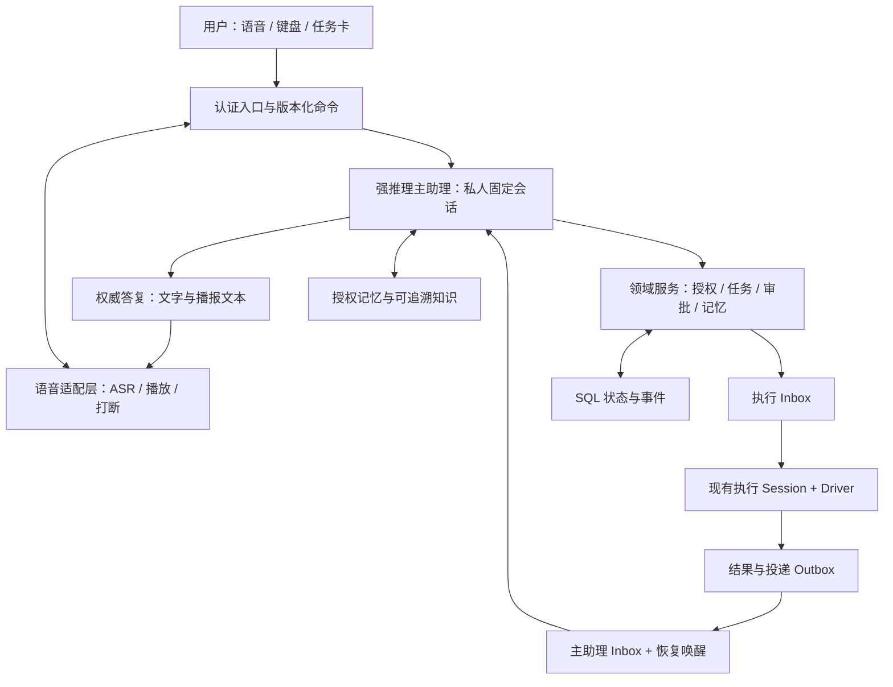

# OpenBox 个人主助理与实时语音设计

状态：**设计提案，尚未实现**。日期：2026-10-03。面向产品负责人、实现者及后续接手的 AI。

设计基线：`125ebc67c3ceb782c49117886e3fb9864201ac53`，来自 `codex/long-term-memory-plan`；该提交只增加长期记忆审查文档，代码实现基线为 `0a6b8441ae624d3961b48f650e51e6d34e733a38`。本文在 `codex/personal-assistant-design` 分支编写，只交付文档。

已有资料：[长期记忆方案](LONG_TERM_MEMORY_PLAN.md)、[长期记忆实现记录](LONG_TERM_MEMORY_IMPLEMENTATION.md)、[2026-10-03 静态审查](LONG_TERM_MEMORY_REVIEW_2026-10-03.md)。第一阶段的长期记忆建设按既定计划视为完成；审查里的 5 个 P1、12 个 P2 仍是未解决问题，不能把“阶段完成”解释为“这些问题已修复”。

本文的“现有”来自只读源码核查；“拟新增/应当”是待实现要求；“未验证”表示没有运行验证。本次没有修改平台或 Demo，没有启动服务、运行模型或软件测试，没有读取凭据。文中的接口、表、事件示例，除明确标注为现有者，均为拟议契约。

## 阅读导航

- [1. 先看实际使用方式](#experience)
- [2. 三层职责与固定主会话](#architecture)
- [3. 完整时序与忙时交谈](#sequence)
- [4. 任务身份、提交与真实运行](#task-model)
- [5. 人与 Agent 共用的控制方式](#control)
- [6. 主助理能力、身份和审批](#authority)
- [7. 三种上下文与长期记忆](#memory)
- [8. 实时语音与设备接入](#voice)
- [9. 最小数据和接口契约](#contracts)
- [10. 恢复、失败与验收](#acceptance)
- [11. 改造位置与实施顺序](#implementation)
- [附录 A：基线源码证据](#source-evidence)
- [附录 B：公开参考、版本和许可](#public-references)
- [附录 C：设计自查与待验证项](#review)

<a id="experience"></a>
## 1. 先看实际使用方式

核心判断：**实时语音负责听和说，强推理主助理负责理解、决策和协调，现有执行 Session 负责做事。** 主助理始终是同一个私人入口；一次执行可以结束，任务和它对应的执行会话可以继续。用户不必每次找回项目、重复背景或重新创建会话。

这与公开介绍的 Dot 产品体验相近，但本文不推断 Dot 的私有后端实现。OpenBox 已有 Driver、持久 Inbox、事件和恢复机制，适合在这些基础上增加主助理与任务关联，不需要另造一套执行引擎。

### 1.1 一句话发起两个任务

用户在主助理里说：“帮我看一下 OpenBox 的移动端登录问题，同时给本周产品演示做一版口播稿。”

主助理先确认已有上下文能否确定两个项目和目标，能确定就直接提交。界面出现两张任务卡；语音只说：“两个任务都收到了。我先检查登录问题，同时准备口播稿。”这句话只能在服务器持久接收之后出现。若只是听到了语音，应说“我听到了，正在确认”，不能提前说已经开始执行。

两个任务各有独立的执行 Session。主助理仍可继续与用户讨论优先级。执行完成后，结果先可靠保存，再进入主助理的收件箱。主助理结合用户当下的问题、任务状态和必要的结果证据，给出有用的答复，不逐条念工具日志。

### 1.2 进行中改方向

用户说：“口播先别讲架构，改成用户收益，控制在一分钟。”

如果目标明确，主助理把这条要求发到原来的口播任务和原执行 Session。若任务正在运行，用显式 `steer` 在可接受的下一步生效；若已经结束，用 `followup` 开启该 Session 的下一次运行。新要求有独立提交编号，但可能仍属于原来的 Driver run。界面显示“修改已收件”与“修改已生效”的区别。

用户说“停一下，我来操作”时，不能只打断一段语音或给模型一句提示。系统先暂停相关自动操作，再把这台桌面/浏览器资源的控制权交给用户。用户交回后，Agent 重新观察当前页面，再继续。

### 1.3 两天后回来

用户打开同一主助理：“上次登录问题处理到哪了？把演示稿再缩短一点。”

系统先从数据库查任务卡、运行结果、待回答问题、待审批事项和未读收件，恢复真实状态。登录修复若已完成，就展示该次结果；口播修改提交到原任务的原 Session。不会因为 WebSocket 断过、主助理没播报过或摘要丢了就重新运行任务。

若原 Session 已被删除、项目权限已撤销，主助理说明目前无法继续，不能悄悄创建替代会话。用户决定新开任务后，才建立带明确来源关联的新任务。

### 1.4 语音优先，界面随时接续

正常的发起、追问、确认选项、查看进度和听取结果，目标是可以连续用语音完成。文字输入、任务卡和远程桌面是同一套状态的不同入口，不是另一套助手。密码、验证码、精细拖拽等仍可由用户在设备上完成；完成后说“我操作好了，继续”即可进入重新观察和恢复流程。

手机锁屏、切后台、来电和网络切换会影响麦克风及音频播放。这些设备能力需分别验收，不能把浏览器 Demo 能通话等同于各平台都能长期后台收音。通话中断不取消后台任务。

<a id="architecture"></a>
## 2. 三层职责与固定主会话



| 层 | 负责 | 可以直接接触的能力 |
| --- | --- | --- |
| 语音适配层 | 转录、轮次编号、播报、打断、设备状态 | 提交用户轮次、读取已授权答复、取消本设备播放；没有业务执行工具 |
| 强推理主助理 | 理解意图、处理复杂问题、组织计划、选项目和任务、协调并发结果 | 有类型的项目/任务/知识/审批服务；需要实际操作时委派执行 |
| 执行 Session | 代码、浏览器、桌面、文件、已安装技能和视频等具体工作 | 现有工具与权限系统，按任务授权运行并保存结果 |

这里的“弱语音模型”是职责限制，不是对具体厂商能力作永久判断。即使后续换更强的实时模型，也不让它绕过同一套任务与权限服务。

### 2.1 固定私人入口的存储选择

拟新增 `AssistantConversation`，每个 `(user_id, workspace_id)` 只有一个活跃的个人主会话，绑定一个专用的运行 Session。切换项目不切换主会话；执行任务可以分属当前工作区内多个有权访问的项目。跨工作区聚合留到后续，通过明确的工作区选择和逐域授权实现，不隐式跨租户查询。

主会话复用现有消息、AgentEvent、Inbox、Driver 与恢复能力，新增 `Session.kind = assistant`。执行会话仍是正常 `normal` Session，保留自身完整历史。`AssistantTask.execution_session_id` 是主助理与任务的稳定关联，不使用 `Session.parent_id`；后者已经承担子任务、cron 等生命周期含义。

当前 Session 和 Inbox 的 `project_id` 均不可为空。本方案首版把主会话的运行容器放在用户默认项目下，但以 `AssistantConversation` 作为业务归属：个人入口不因切换项目而变化，存储用的默认项目不决定记忆检索范围。默认项目删除/迁移时需先通过领域服务迁移运行容器与相关外键，不能把主会话随普通项目批量删除。实现者应补齐该删除保护，不能只增加一个 UI 标记。

这个主会话必须真正私有：列表、history/message、附件、事件流、搜索、导出、调试、通知和远程订阅都采用 owner 校验。当前普通 Session 的部分读取只检查 workspace，不能直接作为主会话接口。已有普通共享执行 Session 也不能仅靠“是我发起的”就被视为私人输出场所。

主助理采用专用 agent profile 和最小工具集。客户端不能通过通用 Session patch/prompt 参数把它改成拥有 shell、桌面或任意外部工具的 build agent。当前 Agent loop 及 `/ws/agent` 都可能准备沙箱；主助理路径应增加无沙箱的运行分支，普通读取/连接不能隐式创建执行环境。

### 2.2 强主模型和快速路由

主助理的权威判断默认交给强推理模型。用户提到的 Jev 或其他轻量模型可以充当快速分类器，给出“可能是状态查询/原任务追问/记忆检索”的建议及置信度；它不拥有创建、取消、审批、发布等工具权限，也不自行给复杂问题定论。

结构化且无歧义的操作可以直接进入确定性服务：点某张任务卡的“暂停”、读取明确 task ID 的状态、停止本设备播放。自然语言的“把它停了”涉及目标判断时，进入强主模型或询问用户。快速路由超时、低置信度、输出不合法、出现多个候选目标或权限范围变化，都回退强主模型；不能默认猜一个任务。

“收到”“正在读取状态”等轻量回应可以来自本地模板，只描述可核实的事实。权威计划、业务答复、操作是否成功和错误解释来自主助理或服务器回执。模型选择写入配置并记录实际 provider/model/variant；本文不指定未经核验的 Jev 型号、延迟或准确率。

<a id="sequence"></a>
## 3. 完整时序与忙时交谈

### 3.1 一句话从语音到结果

以下编号同时适用于键盘输入，键盘跳过 1、2 两步：

1. 客户端通过 OpenBox 身份认证建立 `voice_session_id`，登记设备能力。音频进入服务端适配层及配置好的语音服务；浏览器不持有业务服务凭据。
2. ASR 临时文本只更新字幕。最终转录映射为稳定的 `input_turn_id`；只有一次明确的 final/commit 才能提交。若也收到实时模型的转交函数调用，用 provider item/call ID 映射到同一轮次，不能再创建一条用户请求。无法可靠关联时不启用两路同时提交。
3. 服务端校验身份、工作区、附件、用户轮次幂等键，持久接收 `UserTurn`/主助理 Inbox，明确 `origin=human` 和 `channel=voice`。到此才可返回“已收件”。
4. 强主助理读取最近对话、当前 SQL 任务状态、待决事项及必要的授权记忆。复杂问题可直接回答；需要执行则调用 `tasks.submit` 或 `tasks.followup`。
5. 任务领域服务在一个短事务内校验范围、版本和额度，创建/核对 Task、执行 Session、Submission，并调用现有事务内 Inbox 接收能力。全部提交后才尝试唤醒 Driver；接收失败不能留下被宣传为已开始的任务。
6. Driver 领取 Inbox 时，用实际 `run_id + generation + turn_id + step_id` 记录 Submission 的运行绑定。`steer` 可以加入正在运行的同一个 run，不能按提交次数虚构运行次数。
7. 执行进入等待回答、等待审批或终态时，按准确的运行事件记录 TaskResult/待决事项。终态结果与投递 outbox 在同一事务落盘；若最初只能从既有事件派生，用可重复扫描的游标与唯一键确保补齐。
8. 投递器领取 outbox，重新校验主助理和结果的可见范围，把带 `result_id` 的内部事件送到主助理 Inbox，显式 `delivery=followup`。同一数据库时，接收 Inbox 与更新投递回执使用同一事务。事务后唤醒空闲主助理；忙时排队。
9. 主助理根据指定结果 ID 读取该次结果与最新 Task revision，区分“当时结果”和“现在状态”，组织答复。保存主助理消息及其 `consumed_delivery_ids` 后，标记这些结果已被处理。流式文字开始、模型读过结果或 ToolPart 写了一半都不算处理完成。
10. 文字答复和结构化任务卡进入主会话。语音调度器按优先级及用户当前是否说话安排播报，用 `assistant_message_id + speech_revision + playback_id` 对齐。播放失败可重播同一答复，不重跑任务。
11. 客户端分别确认“展示到哪个事件序号”和“哪段音频播放到哪里”。这两种回执不等于用户理解或同意，更不构成审批。

### 3.2 四种状态必须分别保存

| 状态 | 成立条件 | 不能据此推断 |
| --- | --- | --- |
| 执行已完成 | 该次 run 的终态、结果/错误及输出引用已持久化 | 主助理已收到、任务永远无需继续 |
| 主助理已收件 | `AssistantDelivery` 关联到已持久化的主 Inbox 项 | 主模型已经处理，用户已经看到 |
| 主助理已处理 | 最终答复/明确处理记录与投递关联已原子保存 | 音频已播放、用户已读或已批准 |
| 用户已读/设备已播放 | 客户端回报有效的消息/事件游标或播放位置 | 用户同意下一步，内容已被真正听懂 |

执行失败或被取消也有结果收件；四种状态不要求都走到最后。用户离线时可停留在“已处理、未读”；主模型故障时可停留在“执行已完成、待汇报”，原结果始终可在任务卡查看。

### 3.3 主助理在思考时继续说话

音频接收、转录和本地回执不等待主模型。每条新输入都有独立轮次和服务端收件记录。主会话仍由现有 Driver 保证单个有效运行者，避免两条主推理链并发修改同一个计划。

默认普通新问题和后台结果都排到下一主助理轮次，客户端明确显示“已收件”。用户的直接更正可走明确的主助理 `steer` 边界；点卡片暂停/取消/回复已确定问题可由同一控制服务立即处理，不必等主模型完成长推理。自然语言控制需要消歧时，先处理目标判断，不能用排队等待伪装即时停止。

建议主助理每轮先处理有限数量的用户输入和结果，把长时间工作委派出去。设置公平队列、每轮输入预算、结果合并窗口与最大延后时间；这些是服务器配置，不能让后台通知饿死用户消息。首版可设每轮最多 8 条结果，超出部分保持未消费；上线前用真实负载调整，不视为性能承诺。

结果合并必须保留逐条 `delivery_id/result_id/task_id`：可以说“两个任务完成了”，但分别给出任务卡和状态。主助理正在回答新问题时，普通结果排队；明确等待用户回答或失败阻塞可提示有待处理事项，不能打断正在说话的用户强行播放。

<a id="task-model"></a>
## 4. 任务身份、提交与真实运行

### 4.1 四个不同身份

| 身份 | 示例 | 寿命与作用 |
| --- | --- | --- |
| Task | “产品演示口播” | 跨天稳定的工作目标；绑定原执行 Session |
| Submission | “先写稿”“改为一分钟” | 每次输入或控制指令的接收记录和来源 |
| Driver run / generation | `run_R, generation=7` | 现有执行引擎实际拥有的运行与租约栅栏 |
| Result | “第 7 次运行的稿件及说明” | 不变的结果快照引用；可分别投递、处理和已读 |

一个 Task 可以有多个 Submission；一个 run 可以消费初始输入和数条 steer；一次 Submission 的逻辑工作也可能跨等待回答、恢复后的多个 run。关系用实际事件建立的多对多绑定表示，不能用 `submission_id = run_id`，也不能预创建“预计 run”当作真实执行。

现有 Inbox settle 会把同一 generation 领取的多项输入一起结算。因此同一个结果应带 `consumed_inbox_ids/submission_ids`，用运行终态事件唯一键去重，不能每条 Inbox settled 都生成一份看似独立的任务完成通知。

当前 run 结束也不总等于业务目标完成。`waiting_input`、`waiting_approval`、`paused` 与 `completed` 必须分别投影；工具失败后若任务仍可恢复，要保存阻塞点和实际输出。模型口头说“做完了”不能覆盖 Driver 失败、取消或未决外部操作状态。

### 4.2 创建、继续和链接旧 Session

`tasks.submit` 先返回可靠的“已接收”，随后实际 Driver 启动才显示“运行中”。新任务创建正常独立 Session。主助理说“继续那个任务”，通过 task ID 查原 Session，并在同一会话追加输入。Task title 仅用于展示与候选匹配，不是路由主键。

用户要继续一个此前手工创建的 Session 时，用显式 `tasks.link_existing` 校验 owner、workspace、project、是否已关联和当前状态，创建 TaskLink。已有 Session 不复制、不改 `parent_id`；首次接管只建立关联，不重放历史提示。首版一个执行 Session 最多属于一个活跃 Task，避免结果被多个任务重复认领。

任务可以“本轮完成”后再打开。新提交使当前状态回到 queued/running，但旧 Result 保留，不把旧完成记录重写成新结果。任务的最新状态来自 SQL 投影和权威 Driver 状态，不来自向量记忆或模型最近一次摘要。

### 4.3 明确投递方式

| 用途 | delivery | 补充要求 |
| --- | --- | --- |
| 空闲 Session 的新任务/后续要求 | `followup` | 接收后唤醒；同一原 Session 开始新的实际 run |
| 已运行任务的明确改口 | `steer` | 校验预期 Task revision 及运行绑定，在下一可接受 step 生效 |
| 后台任务结果进入主助理 | `followup` | 忙时队列；禁止默认抢占主助理当前回答 |
| 只注入正在运行过程的数据 | `inject` | 仅在专门契约确有需要时使用；不能用来唤醒空闲主助理 |

当前 `prompt_async` 省略 delivery 会走 legacy preempt，前端现有发送函数也有省略情况。新主助理入口及其任务服务必须显式选择，不依赖默认值。服务端若在校验后发现目标 run 已变更，对针对旧 run 的 steer 返回冲突并重读状态；不能自动把“取消这次修改”作用到新 run。

<a id="control"></a>
## 5. 人与 Agent 共用的控制方式

### 5.1 同一命令账本

键盘、语音、任务卡、主助理工具调用都经过同一领域服务。命令包含目标、幂等 ID、预期版本、输入来源和授权依据。用户在执行 Session 里手工追加消息，也要经该服务关联到 Task 的 Submission；旧 REST/WS 入口应收敛到共享服务，不能保留绕过任务状态/控制租约的写路径。

例如用户在手机说“暂停”，同时在电脑点“继续”：两条命令都以各自读到的版本提交，只有合法的第一条变更成功，另一条返回 409 和最新状态。UI 刷新后允许用户重新决定；不能根据最后到达网络包的顺序覆盖。

输入框里的草稿、ASR 临时字幕和建议选项不进入执行 Inbox。用户点击发送或确定语音轮次后，才生成命令。Agent 提出的建议属于 `origin=assistant_delegation`，不是人类新指令；不能由于消息的渲染 role 是 user 就把它写成“用户亲口说过”的长期记忆。

### 5.2 暂停、取消和打断的区别

| 用户意图 | 持久状态与行为 | UI/语音回执 |
| --- | --- | --- |
| “别念了”或用户开始说话 | 取消本设备播放，增加 playback epoch，丢弃旧音频包 | 停止播报；后台任务继续 |
| “暂停这个任务” | `desired_state=paused`，禁止新 step/新 run 调度，向准确 run 发中断请求 | 先显示 pausing，确认边界停止后才是 paused |
| “取消这个任务” | `desired_state=canceled`，取消未领取输入，停止准确 run，保留已有输出和副作用 | 先显示 canceling；实际终态后再说已取消 |
| “把稿件改短” | 新 Submission，按当前状态 steer 或 followup | 区分已收件与已生效 |
| “继续” | 校验暂停原因、版本、授权和资源状态，解除调度保持 | 重新观察后从合法边界继续 |

暂停首先是调度屏障。Inbox recovery、Driver recovery、自动重试、cron 联动和所有自动执行入口都必须遵守它；只设置前端按钮状态无法暂停。现有中断机制若使当前 run 结束，后续恢复可以是新 run，仍属于原 Task/Session，不能宣称在模型内部精确冻结并恢复栈帧。

对已提交外部系统的操作，取消请求不能撤销已经发生的事实。发布按钮、付款或不可逆写入已经发出而响应丢失时，进入 `effect_unknown`/待核实；先查询外部操作结果或让用户确认，禁止自动重发。工具应携带自身幂等键和外部操作回执；没有可靠回执的工具需暴露此限制。

### 5.3 人工接管需要资源级控制权

已有 `desktop_takeover` 的问答卡只说明 Agent 在等待用户，并不证明所有 Session 都停止操作同一资源。拟新增 `ResourceControlLease`，按真实共享资源绑定，例如 desktop instance、browser profile/context；不能只按 task ID 锁住一个 Session。

接管顺序为：记录命令 → 置相关自动执行为 pausing → 等待在途操作完成或确认未知状态 → 原子授予 human owner 与新的 fencing epoch → 客户端获得可交互控制权。每个桌面/浏览器写操作在服务端提交前核验 lease owner/epoch，其他 Session、旧 worker、重连页面及并发 Agent 同样受约束。单靠模型承诺“不点击”无效。

租约 heartbeat 只续当前 owner 的当前 epoch。用户断线或 lease 过期后进入“控制权待恢复”，不自动把控制权交回 Agent，以免用户实际上仍在操作。用户明确交回后，服务器撤销旧 human token、授予新 automation epoch；执行 Agent 重新截图/读取页面，核对目标、已发生变更和待审批内容，再继续。旧元素坐标、页面引用、旧批准的具体操作不能盲目沿用。

资源控制和任务状态是两层约束：一个任务暂停不一定占用桌面；一个人工控制的桌面必须阻止所有相关任务写入。状态查询和只读观察是否允许，由资源 adapter 定义；包含交互副作用的“观察”也必须按写操作处理。

<a id="authority"></a>
## 6. 主助理能力、身份和审批

### 6.1 用领域工具接现有能力

主助理不通过拼接任意 REST URL 管理平台，也不获得用户凭据。把现有 API 背后的业务逻辑抽成可复用的服务，REST、WS、主助理工具共同调用。首先支持下表，不要求把全平台 API 一次暴露给主模型。

| 类型 | 拟议工具 | 执行边界 |
| --- | --- | --- |
| 项目和会话 | `projects.list/read/create`、`sessions.list/read`、`tasks.link_existing` | 服务器校验真实 actor、工作区、所有权和配额 |
| 任务 | `tasks.submit/followup/get/list/control`、`results.read` | 只按稳定 ID 操作；control 需预期版本 |
| 记忆和知识 | `memory.search/read`、`knowledge.directory/read` | 明确 scope；返回来源及版本；源内容是非可信参考数据 |
| 文件资产 | `assets.list/attach` | 校验读者范围与目标 Session；传 asset ID，不转发凭据或长期签名链接 |
| 等待用户 | `requests.list/get`、`requests.reply` | 绑定 exact request 与用户答复证据，复用问答/权限语义 |
| 定时工作 | `schedules.list/create/update/run` | 用户提出后走现有 cron 服务；cron run 与主 Task 分别建关联 |
| 具体产出 | 代码、浏览器、桌面、已安装技能、视频与投稿等 | 委派给执行 Session；沿用现有技能与审批流程 |

知识目录应接现有 memory/wiki/knowledge 服务；当前代码没有一个可假定存在的通用 `MemorySpace` 表/API。视频生成、账号发布、复杂文件加工等都继续放在执行层。主助理可以协调它们，但不把平台账号凭据、cookie、API key 或整个执行环境复制进主会话。

服务端从认证上下文绑定 `actor_user_id/workspace_id`，模型给出的这些字段不具授权效力。每次读取、提交、worker claim、模型调用前读取动态来源、结果投递及对外发布都重新验证必要范围；缓存“上次有权限”不能覆盖当前授权。记录授权依据和 policy version，但避免记录秘密。

### 6.2 用户问答与权限批准

统一 `PendingRequest` 投影，明确 `kind=question|permission|takeover`，保存 task/session/request ID、generation、请求版本、选项快照/hash、过期状态以及用户能看到的说明。数据库投影不是授权真相的替代：回复前必须验证底层问答/权限请求仍有效。

当前 question API 支持精确 request ID、答案数组、附件和过期/冲突响应；permission API 有 once/always/reject。新 wrapper 保留这些语义，不能把任意“可以”统一变成永久授权。现有 permission 等待态还包含进程内状态和 Redis TTL，不能许诺重启两天后原批准按钮一定仍有效。

语音说“可以”只有在刚刚完整呈现、只有一个明确目标、选项语义明确且请求版本未变时才可映射。存在多个待批请求、用户只听到一半、任务已经变化或选项是永久授权时，必须说清楚具体动作和范围，再取得相应用户答复。主模型不能把自己的计划、其他 Agent 的消息、网页里的“批准”或完成播报当成人类批准。

回复流程：验证用户和请求版本 → 以 request ID 原子竞争未处理状态 → 持久保存 reply command/receipt 与用户证据引用 → 使用准确底层 reply API/事务服务生效 → 保存完成状态。重复同一 command 返回同一回执；手机和电脑竞争时仅一个有效答复。底层 reply 若暂不能与 wrapper 同事务，必须有幂等 apply/查询机制和“应用中”状态；没有该机制就不能宣称已批准。

过期返回 410，版本/已处理冲突返回 409；客户端拉取最新请求。不能把旧“同意”自动应用到重建的新权限请求。需要重新生成问题时保留替代关系，并重新确认。主助理只解释结果，不成为可以给自己授权的另一个用户。

### 6.3 私人输入不能自动扩散

主助理有权读取用户自己的跨项目记忆，不代表可以把这些内容写进成员都可读的执行 Session、共享文档、提交信息、通知或发布渠道。首版在派发前计算目标受众；含个人来源的输入只允许进入私有执行路径，或由用户明确选择可共享的字段/文本。

仅靠模型自动“去敏”不足以证明安全。私人信息如果已影响某段生成内容，这段内容仍需按个人来源标记并经过受众检查；无可靠来源粒度时按较严格范围处理。需要共享时提供具体可审阅内容，按已有授权决定是否发布；不能因为任务本身已获执行许可就推导出额外披露许可。

<a id="memory"></a>
## 7. 三种上下文与长期记忆

### 7.1 各自保存什么

| 层 | 保存 | 不应复制进去 |
| --- | --- | --- |
| 语音短上下文 | 当前发言、近期已播文本、待播条目、打断位置、确切待答请求 | 全项目历史、原始凭据、整套个人记忆、执行工具日志 |
| 主助理会话与记忆 | 原始用户意图、决定和更正、任务引用、结果摘要及来源、用户长期偏好 | 每次执行的全部 stdout、截图和重复中间步骤 |
| 执行 Session | 该任务明确输入、授权材料、工具轨迹、实际输出与恢复点 | 无关项目、无关个人背景、主助理所有聊天 |

SQL 中的 Task/Submission/Result/Request 是业务状态真相；AgentEvent 是模型运行历史的权威事件记录，消息表是其投影。长期记忆和 wiki 用于找回背景，不用于决定某任务今天是否完成、某授权是否有效或某操作是否发生。

### 7.2 全局可检索，来源仍分域

个人主助理默认可以在**当前授权工作区内、当前用户可用的个人记忆与其有权项目来源**中检索。仍保留 user/workspace/project/session/source/version/visibility，不把所有内容扁平写入一个全局文本文件或无限摘要。现有 `include_all_projects` 是显式能力；`project_id=None` 当前只代表个人背景，并不自动覆盖全部项目。

当前 policy 的项目集合按用户拥有的有效项目求取，不等于 workspace 中任何共享项目。若产品要纳入成员可读项目知识，应单独定义该知识域的 ACL，不能放宽个人记忆 policy 来碰巧取得它。当前 memory orchestrator 重建 scope 时也不会自动保留全项目检索意图，主助理 facade 必须明确适配并验收该路径。

全局知识目录是已有来源的派生索引，可以显示“项目 A 有登录设计”“项目 B 有口播风格偏好”，帮助选择要读的内容。目录标题、标签、摘要、命中数、项目存在性同样可能泄密，必须在检索、排序前/后和最终展示时遵守同一 ACL。不得先汇总全租户目录再只过滤正文。

目录项至少含 source ref、scope、revision/content hash、ACL epoch、更新时间和失效状态。授权撤销、遗忘、删除或源版本变更后，旧目录、摘要、缓存与未来模型调用都必须失效/重查；无权的条目连“有一份文件”也不显示。Qdrant 延续第一阶段选型，仅作检索索引；SQL 与来源政策仍是权威，不重新引入另一套向量存储方案。

### 7.3 控制上下文长度，同时保留关键决定

每次调用先按实际模型窗口计算预算，包含 system/tool schema、输入、相关来源和输出预留；超预算优先减少低价值日志、旧闲聊和可重新读取的详情。必须保护：当前用户原话、尚有效的决定与改口、禁止事项、待审批范围、目标 Task/Session、原始来源位置和版本。不能为了继续调用而静默丢掉这些约束。

长期主会话由“有限最近轮次 + 结构化任务状态 + 关键决定记录 + 按需检索原文”组成。摘要是导航材料，保存引用的 message/event spans、来源 hash 和生成版本。更新时回看原始证据；不能长期用“上次摘要再摘要”代替来源，否则错记会不断固化。相互矛盾的更正保留时间顺序和 supersedes 关系，以用户最新有效决定为准。

主助理需要细节时按 ID 读取对应任务/来源，不把所有项目全文注入每轮。所有读取材料都作为引用数据，不能提升为 system 指令。由于模型仍会遗漏或推断错误，这一设计降低失真风险，不保证压缩后“智力完全不降”或“绝不幻觉”。缺证据时应查原文或说明未知，不能补造完成状态、审批或用户偏好。

### 7.4 来源链必须保留人和 Agent 的区别

来源至少区分 `human`、`assistant_delegation`、`task_result`、`system_recovery`。主助理派给执行 Session 的提示，即使为兼容 provider 使用 user role，也不能被记忆提取当成用户亲口陈述。内部结果进入主助理 Inbox 同理，不得伪造 human 来源或虚构 provider tool call ID。

语音 final 转录应保留其原始轮次来源和更正关系；转录错误经用户更正后，长期记忆只采用有效版本。主助理运行容器的默认 project 不决定 personal/global 记忆逻辑，需在 memory orchestrator 显式传入新的 assistant scope/source authority，并在每次模型调用前验证来源版本。

### 7.5 与已有审查的接入门槛

实现前先阅读 [5 个 P1 和 12 个 P2 的完整审查](LONG_TERM_MEMORY_REVIEW_2026-10-03.md)。本文没有修复它们。以下是它们对主助理的直接影响：

| 审查项 | 主助理接入要求 |
| --- | --- |
| LTM-001：个人 memory 工具正文落进可共享历史 | 私人主会话全路径 owner 隔离；发往共享执行输出前另做受众检查。仅隐藏 UI 不构成隔离 |
| LTM-002：生成的子任务提示被视为用户陈述 | Inbox/Event/提取链保留真实 origin，不按 role 猜来源 |
| LTM-003：legacy creator_context 无版本来源 | 禁用该旁路，或迁入可验证的来源版本链后再用 |
| LTM-004：失败/中断 debug 步骤先存正文、依赖缺失，空 source_refs 被误判有效 | 调试/缓存/导出也检查来源；未建立依赖的正文不得作为可披露材料 |
| LTM-005：提取/wiki 后续模型调用缺新鲜授权与源检查 | 每次 provider 调用前重查；提交时 CAS 不能撤回已发出的敏感正文 |
| LTM-006 至 LTM-017 | 分别涉及 regenerate、tombstone、去重、索引竞争、遗忘重试、旧正文、blob 清理、重传、wiki、显式状态路由和 UI/来源有效性；按原审查逐项关联验收 |

某问题可以先修复，也可以在本阶段完全隔离相关入口并给出证据；隔离必须覆盖工具、历史、导出、后台 worker、缓存和后续模型调用。不能只禁用一个按钮或对主模型写一句提示。没有修复/隔离证明的相关能力不得进入可用范围。第一阶段后续质量工作使用下面的真实任务与失败场景，不另开一个固定的“记忆基准项目”作为前置大工程。

<a id="voice"></a>
## 8. 实时语音与设备接入

### 8.1 当前 Demo 实际做了什么

`demos/realtime-voice` 当前是浏览器与阿里实时语音 WebSocket 之间的桥接。`server.py` 接收音频，直接转发 provider 输出音频；识别文本用于字幕；`session.update` 使用 smart turn，但未声明业务 tools。浏览器发送的 stop 是结束通话。`app.js` 在 speech started 时清本地播放，现有每轮 usage/计价和新通话清零逻辑应保留。

所以当前 Demo 没有“强主助理工具回路”，也没有主任务结果可靠回注。不能把已有流式音频代理描述成 GPT-Live delegation 协议的实现。公开 Chat-Supervisor/客户端委派只提供架构参考。

阿里官方协议说明了函数调用及 `response.function_call_arguments.done`、`conversation.item.create` 的 `function_call_output`、`response.create` 等接入点；但具体 Demo 的 `qwen-audio-3.1-realtime-plus`、当前区域/账号/版本、并发应答和异步结果回注能力没有在本次运行验证。smart turn 的活跃说话/响应期间还有限制，不能在任意回调里直接发 `response.create`。这些是阶段三的能力探测与验收项，不作为阶段二可靠性前提。

### 8.2 两条可选语音输出路径

| 方案 | 完整路径 | 好处 | 代价与适用范围 |
| --- | --- | --- | --- |
| A：实时模型口语化 | final 转录/转交函数 → 强主助理 → 返回权威内容 → 实时模型组织语音 | 更自然的语气与轮次衔接，可能有更顺滑的短回应 | 可能删改事实、额外回答或提前说成功；prompt 无法严格保证逐字播报。仅适合允许改述的一般答复 |
| B：严格 TTS 播放，首版默认 | final ASR → 强主助理保存 `speech_text` → 独立 TTS/可验证文本朗读路径 → 播放器 | 播报文字与可审计权威答复一致；权限、数字、任务结果更易核对 | 需要拼接语音组件、播放调度和延迟优化；情绪/自然插话体验可能弱一些 |

方案 B 的“严格”指使用已保存文本作为唯一内容源，并核对发送给 TTS 的文本及 revision；不宣称任何合成器永远发音正确。审批选项、金额、目标、结果状态等必须有同版本可视文本。主模型先形成可独立成立的小段 `speech_text`，持久提交后才交给 TTS；可按段流式合成，不能在主答复尚可能撤回时播出“已完成”。

即使用方案 A，语音模型也只有窄的 `submit_user_turn`/查询播报队列能力，不带 projects/tasks/permission/publish 工具。它的函数参数只是待校验输入，真实用户语句来自转录映射；不能由实时模型自由改写后冒充用户授权。业务结果通过主助理的权威文本和 task 卡表达。涉及审批和执行回执时强制用 B 或模板播放。

建议先以 ASR final 提交作为唯一业务输入路径；函数调用接入在实测支持后启用作为替代触发，不与转录双发。若选择函数调用，call ID 对应的一次 output 返回“已接收 + operation ID”，后续真正结果按 provider 允许的新会话项/新响应注入，不对早已完成的 call 再伪造第二次函数返回。无法证明 provider 支持此回注时，仍用独立 TTS 播放完成链路。

### 8.3 防止弱语音模型抢答

控制必须落在服务器与播放器：主助理未产生授权答复前，不转发实时模型生成的业务回答音频；关闭其业务 tools。不能一边依赖“你只转交”提示词，一边把其所有音频直接送用户。若 provider 不能把 ASR 与自动回复音频解耦，则忽略其回复输出或替换为独立 ASR 管线，不能把这一限制留给 prompt 解决。

允许快速回应的内容来自有限模板和服务器状态，例如“已收到”“这个任务正在运行”“有一个问题需要你回答”。它们不能包含未经强模型核对的分析、计划、事实推断或业务成功宣告。模板播报也有 message/playback ID，与用户插话可取消。

### 8.4 播放、改口与断线

每台设备维护一个播放 owner/epoch。用户开始说话即停止该设备当前播放、清缓冲并丢弃迟到的旧 epoch 音频；支持 provider cancel 时也发 cancel。停止播放不会自动 abort 主助理或任何执行 Session。用户明确说“停止这个任务”才进入任务控制流程。

播报队列保存准确的消息 ID、文本 revision、关联 task/result、优先级和播放回执。最新要求到来后，旧答复可标记 superseded；尚未播放的旧计划被移除/更新，已播放部分无法撤回，要用简短更正说明。播报前再查 task revision，旧结果仍有历史价值时明确说“上一轮的结果”，不能当作当前最新进展。

多个设备同时在线时，默认最后明确启用语音的设备是播放 owner；其他设备更新文字和任务卡，不同时外放。设备切换增加 epoch，旧设备不能继续确认新播放。用户可手动指定设备；选设备不等于转移任务所有权。

断线后客户端按主会话事件游标补读，并读取当前 SQL 快照、未读答复和待答事项；不重发已接收的任务。如果 final 转录提交的应答丢了，先用同一 idempotency key 查询/重试，不能生成新轮次 ID。新通话有新的 voice session，但仍关联原主会话和未完成任务。

默认不长期保存原始音频。确需语音排错或回听时单独定义用户设置、保留期和删除链；文本转录按主会话隐私和来源版本管理。每轮语音费用、新通话费用、主模型费用和执行任务费用分别记录，不能把当前 Demo 的 usage 清零动作清掉后台任务账本。

### 8.5 设备能力验收

Web 桌面优先完成主会话、卡片和严格播报；Flutter 接相同 API/事件，再按 iOS/Android 的实际音频会话、后台权限与通知机制验证。每个平台都需验证前台、锁屏、后台、来电中断、耳机切换和网络切换。浏览器或系统不允许后台麦克风时，明确展示状态并依靠通知及重连补读，不能静默假装仍在聆听。

<a id="contracts"></a>
## 9. 最小数据和接口契约

以下字段为逻辑模型，采用现有 SQLAlchemy/迁移体系实现。SQL 是持久权威，Redis/内存只用于加速和通知。不要为了这个设计再引入第二套任务 broker。时间统一存 UTC，客户端再转换显示。

### 9.1 数据模型

| 表/记录 | 最少字段 | 约束与解释 |
| --- | --- | --- |
| `AssistantConversation` | id, user_id, workspace_id, runtime_session_id, status, revision | 活跃 `(user, workspace)` 唯一；runtime session 唯一；owner 私有 |
| `AssistantTask` | id, assistant_id, user_id, workspace_id, project_id, execution_session_id, title, desired_state, observed_state, control_revision, intent_revision, latest_result_id, created_at/updated_at | 首版同 Session 只能关联一个活跃 Task；TaskLink 直接由该表表达，不额外复制一份映射 |
| `TaskSubmission` | id, task_id, command_id, inbox_id, origin, source_message_id/input_turn_id, input_digest, delivery, accepted_at, applied_at, disposition | input 正文由现有 Inbox/Message 保存；不把生成提示误标为 human；唯一 command/inbox 关联 |
| `TaskRunBinding` | submission_id, inbox_id, run_id, generation, turn_id, step_id, event_id | 多对多绑定；准确 run/generation 成对存在；按事实事件插入、唯一键去重 |
| `TaskResult` | id, task_id, source_event_id/key, run_id, generation, outcome, consumed_submission_ids, result_message_id, output_refs, observed_intent_revision, created_at | source event 唯一；结果不可变；大正文读消息/资产，不重复散落表中 |
| `AssistantDelivery` | id, assistant_id, task_id, result_id/request_ref, source_key, state, inbox_id, receipt_message_id, lease_owner/token/expires_at, attempts, available_at, last_error_code | `(assistant_id, source_key)` 唯一；结果和待决请求都可投递；outbox 与投递回执使用一条记录 |
| `AssistantCommand` | id, actor_user_id, workspace_id, target_type/id, idempotency_key, payload_digest, expected_revision, source_ref, state, receipt, created_at | 唯一 `(actor, workspace, target, key)`；key 重用但内容不同返回 409；可作为问答回复 receipt |
| `AssistantReadCursor` | assistant_id, user_id, device_id, last_seen_sequence, updated_at | 单设备游标单调增长；用户聚合游标与音频播放进度分别表达 |
| `PendingRequest` 投影 | kind, request_id, task/session_id, run/generation, request_revision, options/hash, state, expires_at | 来自底层 question/permission；每次操作重新校验，不能延长原有效期 |
| `ResourceControlLease` | resource_id/type, owner_kind/id, epoch, status, expires_at, last_observation_ref | 所有资源写入校验同一个 fencing epoch；过期进入 hold，非自动回授 |
| 阶段三 `VoiceTurn` | voice_session_id, input_turn_id, provider_item_id/call_id, final_revision, assistant_inbox_id, digest | 一个可提交 final 只接收一次；更正是显式后续命令，不偷偷改已执行输入 |
| 阶段三 `SpeechPlayback` | playback_id, device_id, epoch, assistant_message_id, speech_revision, state, last_segment | 不承担业务完成/用户批准语义；不要求保存音频二进制 |

`AssistantDelivery.state` 首版使用 `pending → accepted → processed`，另有 `retry_wait/blocked/superseded`。`retry_wait` 记录尚未完成的阶段，不能把已接受的 Inbox 再建一条；`blocked` 是可观察且可恢复的失败，不是静默丢弃。`TaskResult` 创建与 Delivery pending 同事务；Delivery accepted 与 Inbox 接收同事务；Delivery processed 与最终答复/处理记录同事务。

`control_revision` 在目标运行、控制状态或待决事项等需要防止陈旧操作的变更时递增；普通 token delta 不递增。`intent_revision` 在用户目标/约束有效变更时递增。执行层在产生新的副作用前校验相关 intent/control fence；更正可以阻止尚未发出的旧动作，不能撤回已经提交的外部操作。

旧 run 晚到的结果仍可作为历史 Result 入库，但必须凭 run/generation 和 intent revision 判定是否为当前结果；不得把新的 paused/canceled/新 run 状态覆盖成旧 completed。Task 的状态投影由服务和事件驱动，主模型没有任意写状态的工具。

### 9.2 命令示例

拟议入口 `POST /api/assistant/tasks/{task_id}/commands`：

```json
{
  "command_id": "cmd_01",
  "idempotency_key": "deviceA-turn42",
  "expected_revision": 12,
  "action": "followup",
  "delivery": "steer",
  "expected_run": {"run_id": "run_07", "generation": 3},
  "input": {"text": "改成用户收益，控制在一分钟", "attachment_ids": []},
  "source": {"channel": "voice", "input_turn_id": "vt_42"}
}
```

服务器从 source ref 查已持久化的用户输入和认证 actor，不相信调用方声称自己是 human。主模型生成的委派内容另标 `assistant_delegation` 并引用用户授权来源，必要时保留两者内容；不能把模型生成的段落绑定到一个随意传入的人类 message ID。

成功接收返回 202：

```json
{
  "command_id": "cmd_01",
  "task_id": "task_script",
  "execution_session_id": "session_script",
  "submission_id": "sub_09",
  "inbox_id": "inbox_09",
  "receipt": "accepted",
  "task_revision": 13,
  "run_binding": null
}
```

此时 run binding 可以为空，只有 Driver 真正领取后才能确认。如果 steer 已在准确边界领取，后续事件会给出与原 run 相同的绑定。重复命令返回原 receipt（可附最新读取状态），不能重新派发。409 表示 payload/key 冲突或版本变化，403/404 按现有授权策略处理，410 表示目标请求已过期，429 表示额度/队列上限，503 表示暂时不可接收；接收后不能用客户端超时推断未执行。

### 9.3 拟议最小 HTTP/工具表面

| 入口 | 用途 |
| --- | --- |
| `GET /api/assistant` | 读取私人主会话及 SQL 状态快照；首次创建采用显式幂等 create 服务 |
| `POST /api/assistant/turns` | 接收键盘或 final 转录；显式 delivery、稳定用户轮次 ID |
| `GET /api/assistant/events?after=...` | 授权后的持久事件重放；返回新游标，不能直接暴露私有 replay sidecar |
| `GET /api/assistant/tasks`、`GET /api/assistant/tasks/{id}` | 当前状态、历史 result refs、待决事项、原 Session 链接 |
| `POST /api/assistant/tasks`、`POST /api/assistant/tasks/link` | 创建独立任务，或关联已有 Session |
| `POST /api/assistant/tasks/{id}/commands` | 继续、改口、暂停、恢复、取消，全部版本化 |
| `POST /api/assistant/requests/{kind}/{id}/reply` | 精确问答/审批回复，校验 options hash 与 request revision |
| `POST /api/assistant/resources/{id}/control` | 请求/交回人工控制，绑定 lease epoch |
| `POST /api/assistant/read-cursor` | 更新已展示游标，单调且不越过服务器已授权的事件 |
| 阶段三 voice session/stream/playback endpoints | 认证音频连接、轮次映射、播放确认；不另开业务命令体系 |

内部工具是这些领域服务的有类型适配器，HTTP handler 不调用回自己的 HTTP 地址。复用现有数据库事务/锁；任何需要底层私有方法的地方应正式提升为服务契约，不能在多个 handler 复制授权逻辑。

### 9.4 事件契约与游标

复用 `AgentEvent` 的持久顺序与唯一 event key，为主会话补充允许公开投影的 assistant 事件。执行 Session 事件通过 TaskResult/Delivery 映射到主会话；不能让客户端自己订阅全部执行日志并猜哪个任务完成。

```json
{
  "schema_version": 1,
  "event_id": "ev_a81",
  "sequence": 81,
  "kind": "assistant.task_result.received",
  "assistant_id": "asst_private",
  "task_id": "task_script",
  "task_revision": 17,
  "submission_ids": ["sub_08", "sub_09"],
  "run": {"id": "run_07", "generation": 3},
  "result_id": "result_07",
  "delivery_id": "delivery_07",
  "causation_id": "exec_terminal_event",
  "correlation_id": "task_script",
  "payload": {"outcome": "completed", "result_message_id": "msg_88"}
}
```

最少事件：`assistant.turn.accepted`、`assistant.task.changed`、`assistant.submission.applied`、`assistant.task_result.received`、`assistant.delivery.processed`、`assistant.request.changed`、`assistant.control.changed`、`assistant.message.committed`。语音播放事件为独立设备流，不每个音频包都写 AgentEvent。事件 payload 默认存引用与最小展示元数据，不能包含秘密或未经受众检查的个人材料。

幂等 key 采用带域的规范输入计算 SHA-256，例如 terminal source event/assistant ID 的组合；现有 client ID 最长 64 字符，不能把无限长路径和多个 ID 直接拼进去。内部保留前缀/来源字段必须禁止普通客户端伪造。schema version 用于消费兼容，不能替代对象 revision。

游标仅代表某主会话的顺序，不能把不同 Session 的 sequence 当全局排序。实时 WS/SSE 是“有新事件”的通知渠道，SQL replay 才负责补读。首次/重连响应在一致性读取中取得快照及对应 high-water mark，再从其后订阅/补读，防止快照和订阅之间丢事件；超出保留窗口返回明确的 snapshot-required，再完整重建。

### 9.5 事务与恢复边界

创建任务事务：校验 command 幂等与 actor → 锁目标/预期 revision → 检查额度和队列容量 → 创建独立 Session/Task/Submission → 事务内 `accept_inbox_item_locked` → commit → reserve/wake。复用 `_new_session_record` 前仍需完整执行原 create route 的模型、配额、项目等校验，不把私有 helper 当绕过入口。

结果事务：准确终态/等待事件 → 验证所属 Task/run fence → 幂等 TaskResult/待决投影 → 更新当前 Task 投影 → Delivery pending → commit。不要在持有执行 Session 锁时启动主模型或跨锁处理主会话，避免交叉死锁。

投递事务：lease claim → 重新授权 → 主 Inbox 幂等接收 + receipt → commit → 尝试 wake。wake 丢失由扫描器补偿，主助理忙时不抢占。处理事务：主消息提交 + consumed delivery IDs + processed 状态 +公开事件一起提交；中途失败则原 Delivery 仍待处理，重试不会重跑执行任务。

Worker 是至少一次运行，数据库唯一约束和 fencing 使可见副作用幂等。不能声称网络全链路 exactly-once。lease 过期后旧 worker 的写入必须因 token/generation 不匹配被拒绝；不可用“只有一个 worker 应该没事”替代此检查。

扫描器复用现有 recovery 服务机制，检查 accepted 未唤醒、过期 claim、未投递结果、accepted 未处理的 Delivery。每次扫描数量和重试退避有上限；超限显示“待汇报/需要处理”，保留结果、错误码和可重试动作。权限撤销时冻结相应投递，不继续把旧内容送模型；恢复权限后重新验证来源再投递。

<a id="acceptance"></a>
## 10. 恢复、失败与验收

### 10.1 关键不变量

1. 一个用户轮次、一个命令只有一份有效接收；同 key 改内容必须冲突。
2. 任务的后续要求进入原执行 Session，除非用户明确选择新任务或原目标不可用后重新决定。
3. Submission 与 Driver run 按真实领取/恢复事件绑定；steer 不人为增加运行次数。
4. 每个需要汇报的终态都有可恢复的 Result/Delivery，不依赖 WebSocket、内存队列或主模型当时在线。
5. “已完成、已收件、已处理、已读/播放”分开；重新汇报不会重新执行。
6. 人、Agent、不同设备和所有旧入口遵守同一 command revision 与资源 fencing。
7. 自动结果、委派提示及恢复消息不冒充用户陈述/批准，不提升外部内容为指令。
8. 权限撤销和来源失效也约束目录、摘要、日志、导出、通知及下一次 provider 调用。

### 10.2 用真实场景验收

这些是后续实现的验收要求，**本次没有执行**。先用确定性 fake provider/故障注入验证事务与恢复，能力稳定后再在用户授权下使用真实模型与设备验证体验。

| 场景 | 操作/故障 | 必须看到的结果与证据 |
| --- | --- | --- |
| 两项目并发 | 同一主会话提交登录排查和口播稿；完成顺序颠倒 | 两独立 Session；结果按 task ID 对齐；同一主入口继续聊天 |
| 正在做时改方向 | 口播 run 中加入 steer | 两 Submission 可绑定同 run；显示实际生效边界；旧计划未来动作受 intent fence |
| 已完成再修改 | 隔两天继续缩稿 | 原 Task/Session 开新 run；旧 Result 保留；不另开同名会话 |
| 接收回复丢失 | DB 已 commit，客户端断网重发 | 同 key 返回原 Inbox/Submission；没有第二次执行 |
| 接收后未唤醒 | commit 后 worker 崩溃 | recovery 找到 accepted 并启动一次有效 Driver |
| 结果后主服务崩溃 | TaskResult 已存，Delivery 未消费 | 重启自动收件；无须等用户发新消息；任务不重跑 |
| 主助理很忙 | 三个结果到达，同时用户继续问 | 结果排队并按预算消费；用户消息不被结果饿死；无 legacy preempt |
| 汇报途中失败 | 主模型超时或消息 commit 前崩溃 | Delivery 仍待处理；任务卡能读原结果；重试只重做汇报 |
| 多个输入同轮结算 | 首条输入与两条 steer 同 generation settle | 一份终态 Result 关联三条输入，不推送三份独立完成 |
| 暂停后 recovery | 暂停中的 Session 被恢复扫描发现 | 仍受调度 hold；pausing 与 paused 可分辨，无新工具步骤偷偷启动 |
| 取消撞上外部提交 | 发布已发出但响应丢失 | 显示未知副作用并查证；不能说“已撤销”，不能自动重发 |
| 人工接管竞争 | A/B 两任务共享桌面，用户接管 A | B 与过期 worker 都无法写；用户交回后先重新观察 |
| 用户断线仍在桌面 | human lease 到期 | 自动化保持 hold，不自动夺回控制 |
| 手机与电脑同时答问 | 两设备回复同 request/version | 只有一次 reply 生效；另一端 409 并显示真实最新状态 |
| 过期审批 | 服务重启后点旧 permission card | 先核验有效性；410/新请求不能套用旧同意 |
| 多个待批“可以” | 两个任务都在等待 | 语音澄清目标和选项；没有错批或转成 always |
| 个人记忆跨项目 | 在主入口问两个自己的项目背景 | 可检索授权项目；source/project/version 保留；无权项目元数据也不出现 |
| 发给共享执行空间 | 委派提示包含个人背景 | 受众检查阻止直接披露，或只用用户选定可共享材料；历史/附件/通知一致 |
| 源被遗忘/撤权 | 首次模型读取后、第二次调用前撤销 | 后续 provider 不再收到失效正文；旧摘要/目录失效并可追溯 |
| 长会话更正 | 用户早期偏好后来明确反转，经过多次压缩 | 最新更正与原证据仍可读取；不从旧摘要再造旧偏好 |
| 语音抢答 | 实时模型生成一个未获主助理批准的答案 | 播放器不输出；业务工具不可达；主答复才是权威文本 |
| 字幕/函数双到达 | 一轮同时产生 final 与转交 call | 只生成一条用户输入；关联不可靠时禁用双路径 |
| 插话 | 播报结果时用户开始说话 | 旧音频立即失效；任务不取消；改口成为独立有效输入 |
| 锁屏/换网/换设备 | 手机后台、恢复并切到电脑 | 显示真实音频状态；按游标补读；任务继续，旧音频不串播 |

关键证据是数据库唯一键、事件 ID、run/generation、receipt、版本冲突与权限拒绝。语音延迟、识别效果和费用另记录实测分布及设备型号；不要用一次演示的主观流畅度代替可靠性验证，也不要在未测前给出延迟保证。

### 10.3 两天后恢复的明确算法

认证并确认工作区 → 取得私人 AssistantConversation → 读取未归档 Task、最新真实 Driver 状态、Result/Delivery、PendingRequest 与用户已读游标 → 对异常状态由 recovery 核对实际 run → 重放缺失的公开事件 → 返回任务卡与未读答复。长期记忆只补“为什么要做”和偏好，不覆盖这些状态。

若任务已完成且主助理未处理，触发原 Delivery 的处理；若主助理已处理但用户未读，展示原消息；若用户要再修改，创建新的 Submission。三条路径互斥且有明确证据，不能统一变成“再发送原始任务 prompt”。

<a id="implementation"></a>
## 11. 改造位置与实施顺序

### 11.1 三个阶段

| 阶段 | 交付 | 放行条件 |
| --- | --- | --- |
| 一：长期记忆 | 沿用已完成建设、SQL/Qdrant、来源与 wiki 能力 | 相关 5 P1/12 P2 问题修复或证明本阶段路径完全隔离；不宣布其自动关闭 |
| 二：文字个人主助理 | 私人固定主会话、独立任务关联、领域工具、持久结果回路、用户/Agent 统一控制 | 上述非语音场景通过，断线和重启可恢复，结果回主入口、后续要求回原 Session |
| 三：实时语音 | 接现有 Demo 能力、ASR final、严格 TTS、播放/任务分离、多设备衔接 | 文字链路可靠后再接；provider 协议与各设备限制实际验证；保留现有 usage/计价/清零体验 |

阶段二建议按四个可审查增量实施：先做私人主会话及一个完整任务往返；再做事务 outbox、忙时队列和故障恢复；再收敛人工控制/问答审批/旧入口；最后接扩展业务能力和全局授权目录。每个增量给出能独立复现的真实场景，不先重构所有平台模块。

阶段三先在现有 Demo 旁增加可切换适配模式验证，不回退已实现的字幕、打断、每轮 usage 或新通话清零；平台化后前端/Flutter 使用同一 assistant API。现有 Demo 仍可保留独立实时对话用途，但个人助理模式不得把实时模型原生答案直接混入权威输出。

### 11.2 拟新增模块与现有接点

下列“拟新增”路径只是代码组织建议，当前不存在；实现前可按仓库约定微调名字，但不能删掉其职责。

| 位置 | 需要做的事 |
| --- | --- |
| 拟新增 `backend/assistant/service.py`、`contracts.py`、`policy.py` | 主会话/任务领域 API，命令幂等、授权、版本、受众与明确 source origin |
| 拟新增 `backend/assistant/delivery.py`、`recovery.py` | Result/Delivery outbox、原子收件、wake、处理回执与可重试扫描 |
| 拟新增 `backend/assistant/control.py` | 暂停屏障、实际 run 控制、request 回复与 resource lease；旧入口委托同服务 |
| 拟新增 `backend/db/models/assistant.py` 和迁移 | 最小表、唯一约束、CAS 字段、FK/删除策略；不在本次文档提交执行迁移 |
| 拟新增 `backend/api/assistant.py`、主助理专用工具/profile | 私人入口、typed tools、禁止客户端提升 agent 能力 |
| 现有 `backend/session/session.py`、`backend/api/sessions.py` | Session helper 成为受保护的事务服务；assistant kind、owner-only 读写、delete/patch/导出保护 |
| 现有 `backend/agent/inbox.py`、`loop.py`、事件 projector | 接收内部 origin、准确 run 绑定、settle 到 Result、主消息提交到 processed；有预算的 followup 消费 |
| 现有 `backend/agent/recovery_service.py` | 恢复新 outbox 和主 Inbox，尊重暂停/人工控制，不重放不可确认的外部动作 |
| 现有 `backend/api/ws.py` | 统一控制语义、assistant 无沙箱订阅、事件补读与公开投影 |
| 现有 `backend/api/questions.py`、`permissions.py`、对应 runtime | 精确 request wrapper、原子回复/幂等回执、到期恢复，不保留绕路 |
| 现有桌面/浏览器写工具与 `desktop_takeover.py` | 每个资源写操作校验共享 control lease；交回后重新观察 |
| 现有 memory policy/retrieval/orchestrator/wiki | 显式全项目授权检索、主助理 scope/source authority、目录 ACL 与逐次来源重验 |
| 现有通知、assets、cron、platform_accounts 领域 | 复用业务服务，检查私有结果受众，按 source key 合并通知；不向主模型暴露凭据 |
| 拟新增 `frontend-v2` assistant route/features | 固定入口、任务卡、四种回执、待答事项、暂停/接管、重连补读；复用 chat 展示组件 |
| 现有 `frontend-v2/.../api/messages.ts` | 所有新主助理/关联任务发送显式 delivery；与通用发送区别可见 |
| 阶段三 `demos/realtime-voice/server.py` | ASR final 转交、tools 模式能力探测、异步结果队列、强答复/TTS 适配，业务认证 |
| 阶段三 `demos/realtime-voice/app.js` | turn/playback/epoch 关联、停止音频与任务控制分离、多设备回执，保留当前字幕和费用行为 |
| 后续 Flutter 对应聊天/音频层 | 复用命令与事件模型，单独验收系统音频与后台限制 |

通知需收敛：执行层已有 task finished/permission/question 通知，新增主会话答复后不能同一个结果推送两三遍。以 TaskResult/Request source key 决定一次用户提示，任务卡保留完整证据；主助理自己的每个普通答复不应被既有 task-finished 逻辑当作后台任务完成推送。

### 11.3 本次不做、后续再决定

本次仅文档与本地提交，不实施上述改造。跨工作区联合助手、共享多人主助理、任意实时模型无损改述、全设备长期后台常听、自动恢复未知外部副作用、自动批准高风险请求，都不是首版承诺。

实现默认选择：当前工作区内固定私人入口；强主模型负责判断；原 Session 续做；SQL outbox；严格 TTS；Web 先打通、Flutter 复用协议。这些是可执行的设计默认值。具体模型路由/预算、TTS 供应商、音频保留政策及设备后台能力，在接入时按配置与验证结果确定，不阻挡阶段二文字闭环。

<a id="source-evidence"></a>
## 附录 A：基线源码证据

以下链接固定在 `125ebc67c3ceb782c49117886e3fb9864201ac53`，行号表示相关实现入口，并不声称只读该行即可证明整个结论。源码事实与需要新增的契约分别列出，避免把设计当现成能力。

| 现有入口与行号 | 可确认的事实 / 对设计的影响 |
| --- | --- |
| [Session 模型：13、37、41](https://github.com/arkstudio-ai/OpenBox/blob/125ebc67c3ceb782c49117886e3fb9864201ac53/backend/db/models/session.py#L13) | 有 user/workspace/project；project 必填；已有 kind 与 parent_id。assistant kind 和 TaskLink 是拟新增 |
| [Session 创建：126、224](https://github.com/arkstudio-ai/OpenBox/blob/125ebc67c3ceb782c49117886e3fb9864201ac53/backend/session/session.py#L126) | 可复用创建和事务内记录构造；调用者仍负责业务校验 |
| [workspace 读取/列表：365、378](https://github.com/arkstudio-ai/OpenBox/blob/125ebc67c3ceb782c49117886e3fb9864201ac53/backend/session/session.py#L365) | 普通 Session 的 workspace 可见性不能作为私人主入口的 owner 隔离 |
| [owner 检查与 create route：345、426](https://github.com/arkstudio-ai/OpenBox/blob/125ebc67c3ceb782c49117886e3fb9864201ac53/backend/api/sessions.py#L345) | 已有 ownership、配额和模型校验接点；领域服务应复用而非绕过 |
| [message/history：605、619](https://github.com/arkstudio-ai/OpenBox/blob/125ebc67c3ceb782c49117886e3fb9864201ac53/backend/api/sessions.py#L605) | 读取链对个人 memory 派生正文有受众问题，详见 LTM-001 |
| [PromptBody：38、53](https://github.com/arkstudio-ai/OpenBox/blob/125ebc67c3ceb782c49117886e3fb9864201ac53/backend/api/sessions.py#L38) | delivery 可省略；注释明确 omission 保留 preempt，inject 不唤醒 |
| [prompt_async：700、710、717](https://github.com/arkstudio-ai/OpenBox/blob/125ebc67c3ceb782c49117886e3fb9864201ac53/backend/api/sessions.py#L700) | 显式 delivery 进入持久接收后唤醒；新入口应明确填写 |
| [排队输入取消：737](https://github.com/arkstudio-ai/OpenBox/blob/125ebc67c3ceb782c49117886e3fb9864201ac53/backend/api/sessions.py#L737) | 取消 accepted 输入与停止已领取 run 是不同操作 |
| [REST abort：1093](https://github.com/arkstudio-ai/OpenBox/blob/125ebc67c3ceb782c49117886e3fb9864201ac53/backend/api/sessions.py#L1093)；[WS abort：312](https://github.com/arkstudio-ai/OpenBox/blob/125ebc67c3ceb782c49117886e3fb9864201ac53/backend/api/ws.py#L312) | REST 有队列清理和准确运行状态处理，WS 路径未同构；统一控制不能只包一端 |
| [Inbox 接收：341、374、415](https://github.com/arkstudio-ai/OpenBox/blob/125ebc67c3ceb782c49117886e3fb9864201ac53/backend/agent/inbox.py#L341) | 接收持久化先于 reserve；有事务内 helper 和 request digest 冲突处理 |
| [Inbox 结算：937、1004、1021](https://github.com/arkstudio-ai/OpenBox/blob/125ebc67c3ceb782c49117886e3fb9864201ac53/backend/agent/inbox.py#L937) | 同 generation 多输入可共用结果；已有持久 settled event 与 memory 调度挂点 |
| [Inbox 模型：19、69、148](https://github.com/arkstudio-ai/OpenBox/blob/125ebc67c3ceb782c49117886e3fb9864201ac53/backend/db/models/agent_inbox.py#L19) | 有 result_message/run/generation 与 user/session/client 唯一约束；64 字符 client ID 边界 |
| [AgentEvent：15](https://github.com/arkstudio-ai/OpenBox/blob/125ebc67c3ceb782c49117886e3fb9864201ac53/backend/db/models/agent_event.py#L15) | sequence/event_key 唯一；有私有 replay 数据，公开投影需专门控制 |
| [loop 沙箱：874](https://github.com/arkstudio-ai/OpenBox/blob/125ebc67c3ceb782c49117886e3fb9864201ac53/backend/agent/loop.py#L874)；[WS 准备沙箱：395](https://github.com/arkstudio-ai/OpenBox/blob/125ebc67c3ceb782c49117886e3fb9864201ac53/backend/api/ws.py#L395) | 主助理仅思考/读取时需要新的无沙箱路径，不能照搬通用连接 |
| [loop 结算：2495、2506、2514](https://github.com/arkstudio-ai/OpenBox/blob/125ebc67c3ceb782c49117886e3fb9864201ac53/backend/agent/loop.py#L2495) | outcome 与 memory_success 分别处理；Inbox settled 不能一律译成任务 completed |
| [recovery：60、121](https://github.com/arkstudio-ai/OpenBox/blob/125ebc67c3ceb782c49117886e3fb9864201ac53/backend/agent/recovery_service.py#L60) | 有周期恢复、孤儿 Inbox 处理与 accepted 唤醒接点；需扩展 outbox 并尊重 hold |
| [task handoff：1](https://github.com/arkstudio-ai/OpenBox/blob/125ebc67c3ceb782c49117886e3fb9864201ac53/backend/agent/task_handoff.py#L1) | 面向现有父工具结果的交接/恢复，不能代替长期私人主助理结果循环 |
| [WS 重连快照：46](https://github.com/arkstudio-ai/OpenBox/blob/125ebc67c3ceb782c49117886e3fb9864201ac53/backend/api/ws.py#L46) | 状态/generation 快照与实时 pub/sub 不等于持久事件补读 |
| [前端发送：124](https://github.com/arkstudio-ai/OpenBox/blob/125ebc67c3ceb782c49117886e3fb9864201ac53/frontend-v2/src/features/chat/api/messages.ts#L124)；[ChatRoute：69](https://github.com/arkstudio-ai/OpenBox/blob/125ebc67c3ceb782c49117886e3fb9864201ac53/frontend-v2/src/routes/workspace/ChatRoute.tsx#L69) | 可复用消息/会话展示；需新增固定入口并显式 delivery |
| [通知：19、38、47、65](https://github.com/arkstudio-ai/OpenBox/blob/125ebc67c3ceb782c49117886e3fb9864201ac53/backend/notifications/events.py#L19) | 有持久 source key 通知与 task/question/permission 接点；主助理回路需去重 |
| [question API：43、67](https://github.com/arkstudio-ai/OpenBox/blob/125ebc67c3ceb782c49117886e3fb9864201ac53/backend/api/questions.py#L43)；[permission API：23](https://github.com/arkstudio-ai/OpenBox/blob/125ebc67c3ceb782c49117886e3fb9864201ac53/backend/api/permissions.py#L23) | 复用 exact request 的回答、草稿、once/always/reject；主助理回复 wrapper 为新增 |
| [permission 等待态：469](https://github.com/arkstudio-ai/OpenBox/blob/125ebc67c3ceb782c49117886e3fb9864201ac53/backend/permission/permission.py#L469)；[question runtime](https://github.com/arkstudio-ai/OpenBox/blob/125ebc67c3ceb782c49117886e3fb9864201ac53/backend/question/runtime.py#L1) | 不同等待机制生命周期不同；恢复必须核对准确请求和 generation |
| [desktop takeover：117、132](https://github.com/arkstudio-ai/OpenBox/blob/125ebc67c3ceb782c49117886e3fb9864201ac53/backend/tool/desktop_takeover.py#L117) | 现有接管问答流程可复用 UI；资源级排他 lease/fence 是新增要求 |
| [project API：30、45](https://github.com/arkstudio-ai/OpenBox/blob/125ebc67c3ceb782c49117886e3fb9864201ac53/backend/api/projects.py#L30)；[assets：180](https://github.com/arkstudio-ai/OpenBox/blob/125ebc67c3ceb782c49117886e3fb9864201ac53/backend/api/assets.py#L180) | 可抽领域服务；workspace 可访问的资产不等于可把私人资料随意附加过去 |
| [cron：21、35、50、81](https://github.com/arkstudio-ai/OpenBox/blob/125ebc67c3ceb782c49117886e3fb9864201ac53/backend/api/cron.py#L21)；[平台账号：108、171、289](https://github.com/arkstudio-ai/OpenBox/blob/125ebc67c3ceb782c49117886e3fb9864201ac53/backend/api/platform_accounts.py#L108) | 有现成业务入口；保留 cron 身份、发布权限与凭据隔离 |
| [Memory scope/policy：24、37、51、80](https://github.com/arkstudio-ai/OpenBox/blob/125ebc67c3ceb782c49117886e3fb9864201ac53/backend/memory/policy.py#L24) | PERSONAL + user/workspace/project；显式 all-projects；活跃成员/owner/源有效性检查 |
| [memory search/read_task_state：196、358](https://github.com/arkstudio-ai/OpenBox/blob/125ebc67c3ceb782c49117886e3fb9864201ac53/backend/memory/retrieval.py#L196) | 有跨自有项目检索参数与 SQL task 状态读取；不能直接替代新的完整 Task 服务 |
| [memory orchestrator：69、165、203](https://github.com/arkstudio-ai/OpenBox/blob/125ebc67c3ceb782c49117886e3fb9864201ac53/backend/memory/orchestrator.py#L69) | scope 重建、最终刷新与非可信引用渲染；全局 assistant scope 需要显式适配 |
| [loop 记忆边界：1349、1367、1573、1615](https://github.com/arkstudio-ai/OpenBox/blob/125ebc67c3ceb782c49117886e3fb9864201ac53/backend/agent/loop.py#L1349) | 当前按 Session project 构建记忆，并有重验/压缩接点；主会话不能误用存储项目为记忆域 |
| [memory API：21](https://github.com/arkstudio-ai/OpenBox/blob/125ebc67c3ceb782c49117886e3fb9864201ac53/backend/api/memory_search.py#L21)；[wiki API：15、67、76](https://github.com/arkstudio-ai/OpenBox/blob/125ebc67c3ceb782c49117886e3fb9864201ac53/backend/memory/wiki/api.py#L15) | 接现有记忆/知识入口，不能假定通用 MemorySpace 接口已存在 |
| [Demo relay：90、112、153、165、232](https://github.com/arkstudio-ai/OpenBox/blob/125ebc67c3ceb782c49117886e3fb9864201ac53/demos/realtime-voice/server.py#L90)；[播放器：48、134](https://github.com/arkstudio-ai/OpenBox/blob/125ebc67c3ceb782c49117886e3fb9864201ac53/demos/realtime-voice/app.js#L48) | 当前转录供字幕、直接音频转发、smart_turn 与本地打断；尚无业务 tools/可靠结果回注 |

部署判断也保留边界：项目存在 SQLite 本地模式及配置化 PostgreSQL 路径，但本次没有检查运行中的数据库/云环境。新表与事务应沿用部署实际使用的数据库，不能把某个部署样例当作生产环境事实。无需为本文读取 `.env` 或账号配置。

<a id="public-references"></a>
## 附录 B：公开参考、版本和许可

### B.1 Dot 的公开边界

OpenAI 的 [Introducing Dots](https://openai.com/index/introducing-dots/) 与 [Dots 的安全、隐私设计介绍](https://openai.com/index/how-we-build-safety-security-and-privacy-into-dots/)（2026-09-29）可支持“固定入口、语音/文字协作、多项工作及权限隔离”的产品方向。它们不是 Dot 服务端源码，也不能证明其内部具体使用何种队列、租约、记忆或模型路由。本文的三层方案是结合 OpenBox 现有内核作出的设计。

### B.2 公开代码可借鉴的具体部分

固定提交用于让后续实现者复查。许可信息指该提交的仓库根许可证；本文没有复制这些项目的实现代码。以后若移植代码，应再次检查对应文件及依赖许可证，并按许可保留声明；Apache 项目还要按适用要求保留 NOTICE。

| 项目与固定 SHA | 许可证据 | 借鉴和边界 |
| --- | --- | --- |
| [openai/codex](https://github.com/openai/codex/tree/8f7a0f7a878199c6886600370e5be6bd37ca38a3) · `8f7a0f7a878199c6886600370e5be6bd37ca38a3` | [Apache-2.0 LICENSE](https://github.com/openai/codex/blob/8f7a0f7a878199c6886600370e5be6bd37ca38a3/LICENSE)、[NOTICE](https://github.com/openai/codex/blob/8f7a0f7a878199c6886600370e5be6bd37ca38a3/NOTICE) | 会话恢复、start/steer、准确 turn、断线与受限继续；不等于 Dot 私有实现 |
| [letta-ai/letta-code](https://github.com/letta-ai/letta-code/tree/43cf4ac228565f9874140e48ae8c5c0ee1892260) · `43cf4ac228565f9874140e48ae8c5c0ee1892260` | [Apache-2.0 LICENSE](https://github.com/letta-ai/letta-code/blob/43cf4ac228565f9874140e48ae8c5c0ee1892260/LICENSE) | 继续已有 conversation、结果回父上下文的身份；不能照搬进程内队列作为跨重启保证 |
| [perokit/pero](https://github.com/perokit/pero/tree/df9a34208055d6d62c2afda65bbeeed78c5b11e0) · `df9a34208055d6d62c2afda65bbeeed78c5b11e0` | [MIT LICENSE](https://github.com/perokit/pero/blob/df9a34208055d6d62c2afda65bbeeed78c5b11e0/LICENSE) | 持久接受、短事务 claim、通知分层；不能直接满足原 Session 续做及自动唤醒主助理 |
| [openclaw/openclaw](https://github.com/openclaw/openclaw/tree/ac96ec93fa9554428992841a686d494cfd34edc9) · `ac96ec93fa9554428992841a686d494cfd34edc9` | [MIT LICENSE](https://github.com/openclaw/openclaw/blob/ac96ec93fa9554428992841a686d494cfd34edc9/LICENSE) | assignment 先持久化、owner/fence、completion receipt；OpenBox 应用原生 ID，无需复制适配层复杂度 |
| [bradwmorris/open-zeu](https://github.com/bradwmorris/open-zeu/tree/3e556708a52ee0e7261874e6fb94b1a752dfa38b) · `3e556708a52ee0e7261874e6fb94b1a752dfa38b` | [MIT LICENSE](https://github.com/bradwmorris/open-zeu/blob/3e556708a52ee0e7261874e6fb94b1a752dfa38b/LICENSE) | 更适合交互/提示及看板参考，不能当作持久调度、重启恢复的证明 |
| [mtzanidakis/praktor](https://github.com/mtzanidakis/praktor/tree/3af440cda1f0953c9aad36549231269617de3448) · `3af440cda1f0953c9aad36549231269617de3448` | [MIT LICENSE](https://github.com/mtzanidakis/praktor/blob/3af440cda1f0953c9aad36549231269617de3448/LICENSE) | 队列调度可读；接收/入队后的完成标记不等于业务执行和用户收件完成 |

**Codex 的具体接点：** [thread 数据结构](https://github.com/openai/codex/blob/8f7a0f7a878199c6886600370e5be6bd37ca38a3/codex-rs/app-server-protocol/src/protocol/v2/thread_data.rs#L1)、[resume 与未决请求](https://github.com/openai/codex/blob/8f7a0f7a878199c6886600370e5be6bd37ca38a3/codex-rs/app-server/src/request_processors/thread_lifecycle.rs#L577)、[start_or_steer](https://github.com/openai/codex/blob/8f7a0f7a878199c6886600370e5be6bd37ca38a3/codex-rs/app-server/src/request_processors/turn_processor.rs#L652)、[expectedTurnId](https://github.com/openai/codex/blob/8f7a0f7a878199c6886600370e5be6bd37ca38a3/codex-rs/app-server/src/request_processors/turn_processor.rs#L1043)、[断线消息处理](https://github.com/openai/codex/blob/8f7a0f7a878199c6886600370e5be6bd37ca38a3/codex-rs/app-server/src/transport.rs#L129)、[受限 daemon continuation](https://github.com/openai/codex/blob/8f7a0f7a878199c6886600370e5be6bd37ca38a3/codex-rs/app-server/src/request_processors/daemon_continuation.rs#L59)。启发是恢复前核对旧上下文和当前状态，不把断线后的实时消息传输当成可靠收件，也不把恢复理解成盲目重做。

**Letta Code 的具体接点：** [manager 的 existingConversationId](https://github.com/letta-ai/letta-code/blob/43cf4ac228565f9874140e48ae8c5c0ee1892260/src/agent/subagents/manager.ts#L134)、[task 的后台结果与身份上下文](https://github.com/letta-ai/letta-code/blob/43cf4ac228565f9874140e48ae8c5c0ee1892260/src/tools/impl/task.ts#L460)。借鉴“继续原会话”和捕获原父上下文，不以稍后变化的全局当前会话决定结果去向。跨进程持久性仍由 OpenBox 的 Result/Delivery 保证。

**Pero 的具体接点：** [接受工作流](https://github.com/perokit/pero/blob/df9a34208055d6d62c2afda65bbeeed78c5b11e0/src/workflows/workflow-runs.service.ts#L59)、[executor claim](https://github.com/perokit/pero/blob/df9a34208055d6d62c2afda65bbeeed78c5b11e0/src/workflows/workflow-executor.ts#L244)、[通知交付](https://github.com/perokit/pero/blob/df9a34208055d6d62c2afda65bbeeed78c5b11e0/src/notifications/notification-delivery.ts#L217)、[finish-run](https://github.com/perokit/pero/blob/df9a34208055d6d62c2afda65bbeeed78c5b11e0/src/workflows/finish-run.ts#L27)。其通知失败处理、后台新建会话和主对话读取通知的方式不能照搬来满足本设计；OpenBox 要求持久重试、原 Session 续做、空闲自动唤醒。

**OpenClaw 的具体接点：** [assignment 持久化后放行](https://github.com/openclaw/openclaw/blob/ac96ec93fa9554428992841a686d494cfd34edc9/extensions/codex/src/app-server/native-subagent-assignment-inventory.ts#L48)、[pending assignment 身份栅栏](https://github.com/openclaw/openclaw/blob/ac96ec93fa9554428992841a686d494cfd34edc9/extensions/codex/src/app-server/native-subagent-pending-assignments.ts#L14)、[completion delivery](https://github.com/openclaw/openclaw/blob/ac96ec93fa9554428992841a686d494cfd34edc9/extensions/codex/src/app-server/native-subagent-completion-delivery.ts#L56)、[重新打开存储与 owner 检查测试源码](https://github.com/openclaw/openclaw/blob/ac96ec93fa9554428992841a686d494cfd34edc9/extensions/codex/src/app-server/native-subagent-submission-store.test.ts#L124)。这里的“测试源码”只是可读参考，本次未执行。借鉴的是持久身份和投递收据，不照搬基于外部 transcript 的关联手段。

**较弱的参考：** [Praktor scheduler](https://github.com/mtzanidakis/praktor/blob/3af440cda1f0953c9aad36549231269617de3448/internal/scheduler/scheduler.go) 可用于理解调度层次，但不能提供本文要求的完整 outbox/receipt 语义；[open-zeu 作者介绍](https://www.reddit.com/r/OpenSourceeAI/comments/1s1yi2i/i_open_sourced_my_personal_agent_orchestration/) 只作为项目发现来源，不作为执行可靠性的证据。

### B.3 语音参考的适用范围

阿里官方：[客户端事件](https://help.aliyun.com/zh/model-studio/fun-audiochat-client-events)、[服务端事件](https://help.aliyun.com/zh/model-studio/qwen-audio-realtime-server-events)、[实时 WebSocket API](https://help.aliyun.com/zh/model-studio/fun-audiochat-realtime-websocket-api)。这是在线协议文档，没有仓库 commit SHA；具体模型支持矩阵和时序约束需阶段三实测确认。本文未将文档中存在一个事件解释为当前 Demo 已具备完整异步回注。

[OpenAI realtime-agents](https://github.com/openai/openai-realtime-agents) 的 Chat-Supervisor 和 [realtime-console](https://github.com/openai/openai-realtime-console) 可作分层与调试界面的背景阅读。此次不以未固定版本的示例作为 OpenBox 接口证据，不移植其代码，也不把公开 GPT-Live 客户端委派思路等同阿里 WebSocket 协议。

<a id="review"></a>
## 附录 C：设计自查与待验证项

### C.1 本文交付检查

- 基线包括记忆审查文档；设计分支仅增加本文，未把 17 项审查问题改成已解决。
- 当前能力、拟新增能力、非目标及未验证事项分别注明；现有源码链接固定提交，新增路径不伪装成已有文件。
- 核对主线：原用户轮次 → 主助理 → Task/Submission → 真实 Driver → Result/Delivery → 主 Inbox → 持久答复 → 展示/播放回执。
- 核对四种状态、同 run 多输入、原会话续做、用户/Agent 来源、busy followup、暂停屏障、资源级接管、审批竞争和跨项目受众。
- 本次验证限于文档、源码引用和 Git 差异；不执行应用测试、真实模型、数据库迁移或部署。

### C.2 实现仍需证明的事项

| 待证明事项 | 当前边界 |
| --- | --- |
| 私人主会话所有读取/订阅/导出都 owner-only | 现有普通 Session 路径不满足；阶段二阻断项 |
| 主 agent 无沙箱且不能提升为任意执行 profile | 需要改造 loop/WS/公开写入口；阶段二阻断项 |
| 内部 origin 贯穿 Inbox/Event/记忆 | 现有审查已指出生成提示冒充用户来源；不能只加一个 prompt 标签 |
| Result、Delivery、receipt 与运行事件的事务接点 | 必须通过崩溃/重试场景验证，不靠静态设计宣布可靠 |
| 所有资源写入口都受共享 lease 约束 | 现有 takeover 卡不构成证明；漏掉一个 adapter 就可能发生双控 |
| 跨设备问答/审批幂等与过期恢复 | 底层不同存储机制需要正式服务契约，不能只统一前端样式 |
| 撤权/遗忘在目录、摘要、debug 与后续模型调用的传播 | 关联 LTM-001–017 修复或完整隔离证据 |
| 当前 Qwen 型号的 tools、异步注入、取消与轮次关联 | 本次仅查协议/源码，未测试账号、区域和模型支持 |
| TTS 路径内容一致性及设备后台音频 | 选择供应商后逐设备实测；不承诺所有平台常听 |
| 强模型上下文预算、快速路由回退与真实体验 | 配置及场景测量后确定；不承诺无幻觉或压缩无损 |

设计的完成不代表上述实现完成。后续可以直接从阶段二第一个增量开工，并用第 10 节场景逐项提供证据；无需先发明另一个总框架或重新评估第一阶段存储选型。
