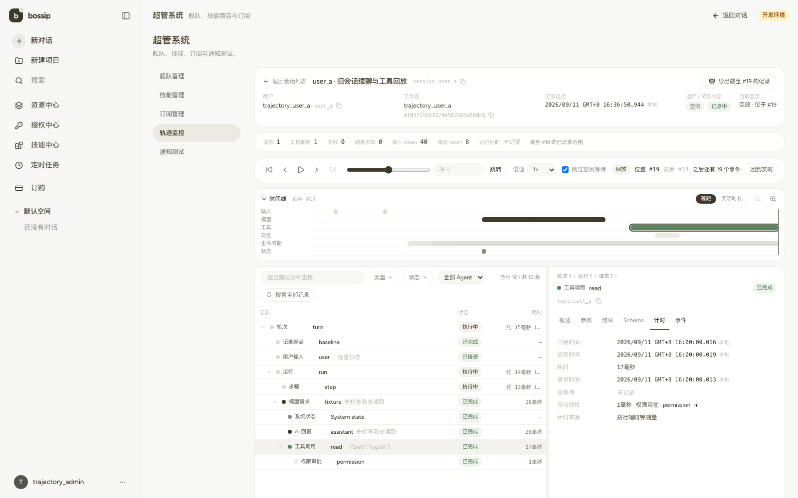
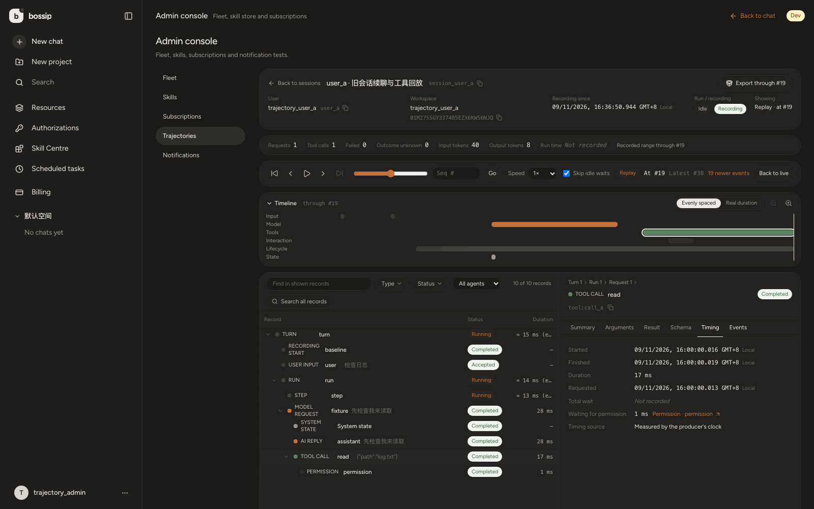

# 会话轨迹前端验证记录

日期：2026-09-11。工作树：`OpenBox-trajectory`，基线 `521338c`。与总实施状态配套，前端负责 `frontend-v2`；原项目的 3000/8080 进程未改动。

前端功能已落地并冻结，完整 check/build、原生浏览器验证和规模 fixture 测试已完成。原生 SPA 首摘要和 seek 达到本机初始目标；fixture 整页重载首行与水位更新有两项初始目标未达到，数值和未验证边界保留在下文。

## 实现与运行范围

- 页面：`/app/admin/trajectories`、`/app/admin/trajectories/sessions/:sessionId`，只向平台 `role=admin` 开放，跨目标用户和工作区查询。列表筛选、排序、游标和返回地址保留在 URL。
- 详情：上方时间线，下方虚拟记录树，右侧可调宽度的类型检查器；用户输入、Assistant、Request、Tool、System、问答、审批、恢复、重试、Agent、Artifact/文件 Diff 均有对应展示。
- REST 使用 `/api/admin/trajectories`，独立一次性 ticket 和 `/ws/admin/trajectories` 提示水位；1 秒补读。seq 全程十进制字符串。live head 与 playhead 独立，按指定 H 重建所有历史内容。
- 受控媒体在当前权限下读取；下载点击重新 GET，删除和撤权使历史位置上的旧内容失效；无普通 agent WS、余额结算初始化或执行操作。
- 预览：Vite `http://127.0.0.1:3101` → 原生验收后端 `http://127.0.0.1:8091`。后端采用真实 create_app、原生认证、SQLite 和独立合成记录；没有调用真实模型或沙箱。

## 实测结果及证据类别

**原生浏览器**：正常登录得到的刷新 Cookie 进入真实路由；从轨迹详情深链开始记录网络，避免把原聊天页已有连接算入监控生命周期。保存的 JSON 不包含密码、JWT 或 ticket 值。

- [22 组内容/只读验证](trajectory-verification/native-functional-readonly.json)：用户、AI、请求真实输入/选项/usage、工具结果/Schema/Timing、重试、子 Agent、问答、审批、恢复、文件版本；工具 H17 为 `one`、运行中，H19 为 `one two`、17ms；未记录会话读取前后 trajectory_id 都是 null。
- [降权](trajectory-verification/native-security-role.json)：真实 DB role 从 admin 改为 user 后，约 1242ms 显示拒绝，轨迹数据缓存 2→0、活动同步 1→0、目标清空；测试结束恢复 admin。
- [媒体删除与重新授权下载](trajectory-verification/native-security-media.json)：H35 不请求后来的媒体；H37 的真实 1×1 PNG 可显示/下载；删除后再次点击旧下载入口收到410，不再下载，图片和按钮消失，Blob缓存清空，创建/释放 object URL 为3/3。此例验证资源生命周期，不代表复杂视频/音频原生端到端验收。
- [会话删除](trajectory-verification/native-security-session-delete.json)：调用现有 delete_session 后，旧记录、数据缓存、同步和目标全部清除；故验收 user_b 会话现已删除。
- [删除终态复核](trajectory-verification/native-deleted-deeplink.json)：只读打开已删除B的旧深链，真实404稳定显示“会话不存在或已不可用。”，没有 loading、记录或订阅。之前的删除验证证明缓存清理，此次验证补齐终态展示；没有重复执行删除。
- [普通用户深链](trajectory-verification/native-ordinary-deeplink.json)：即使是目标会话所有者及工作区 owner，也重定向到普通 `/app`，轨迹 API 和入口均不可见；普通页随后产生的沙箱503与其自身连接不属于监控页面流量。
- [筛选和返回](trajectory-verification/native-list-filter-return.json)：跨用户 B 的列表→详情→返回保留 `?user=user_b`。这是删除B之前的有效证据。
- [历史暂停与丢通知补读](trajectory-verification/native-live-replay.json)：H17 的选择/输出/记录数不动，真实 head35→37；返回实时后独立写进程追加 seq38，约1290ms可见。这是跨进程未发送本地WS通知时的1秒轮询恢复，不是正常推送延迟或“采集额外开销≤100ms”的证明。
- [检查点历史加载](trajectory-verification/native-history-correctness.json)：head100009→H75200，暂缓真实 checkpoint 响应期间8次采样均无未来摘要、记录或工作区，释放后只有H75200的7529行；再跳H17，只有10行，单次44.14ms。回放只补到目标H，邻近前进可复用已读历史。

**组件/投影测试**：复用后端共享 golden 文件，在每个水位比对投影、统计与 Agent；覆盖大整数seq、未知事件、重复/乱序、历史结果、资源状态、跨目标/权限清理和下载迟到响应。它们不替代原生浏览器权限验证。

**浏览器 fixture**：`playwright.trajectories.config.ts` 只访问3101，在真实前端组件之外模拟REST/WS。与上面的原生认证/读取链分开报告；不运行默认 Playwright 的3000登录装配。15个功能场景均有通过证据：一次整组14通过、1个删除终态失败，修复后该项单独通过；未声称最终版本整组重跑15/15。[检查与运行记录](trajectory-verification/frontend-checks.json)

## UI01–UI16 对照

下表区分已实际跑过的路径和组合场景边界，不把一个简单样本扩称为所有场景实测。

| 编号 | 已实现/验证范围 | 尚未独立原生浏览器实测的边界 |
|---|---|---|
| UI01 | 原生用户/Assistant/Tool/Request各类型输入与页签；22组内容验证 | 无新增阻塞 |
| UI02 | 原生工具运行中/终态、Schema、精确Timing；组件原始/有效参数修订、固定页签 | 每一种审批修订路径的完整真实执行 |
| UI03 | 共享边缘golden含仅reasoning/工具参数；AI块和调用关联 | 单独发起真实provider仅工具响应 |
| UI04 | 原生失败请求、retry独立行；按请求保留输入/选项/usage | 真实provider切换执行 |
| UI05 | 原生子Agent树；交错子工具、父子关系、统计投影单测 | batch加多层子Agent的组合原生执行 |
| UI06 | 原生问题、回答、审批、resume关联；只读控件断言 | 无新增阻塞 |
| UI07 | 原生H17/H19结果和计时、H35/H37媒体；H75200延迟加载无未来摘要；10次跨检查点seek | 检查点基点计时边界见下文 |
| UI08 | 原生未记录/删除/拒绝；单测pending、空、not_recorded、unknown各状态 | 所有媒体格式的删除组合 |
| UI09 | 原生System工具快照；结构/完整JSON/差异组件已实现 | system变化和上下文压缩组合的原生展示 |
| UI10 | 旧会话baseline与记录起点、共享golden无补造；原生无记录读取不初始化 | 原生续聊执行另见后端验证报告 |
| UI11 | 最终zh浅色/en深色桌面与390px窄屏；无横向溢出；方向键切页签、详情宽度440→472；规模滚动最多53行 | 未做全站屏幕阅读器审计；多媒体原生边界见上文 |
| UI12 | 原生head前进不移动H/选择/记录数；丢通知轮询补读 | 正常WS推送的多样本延迟 |
| UI13 | 原生普通角色/会话owner/工作区owner拒绝；超管读取A/B | 单独仅workspace admin角色由后端权限测试覆盖 |
| UI14 | 原生B筛选往返；未记录会话不初始化；fixture筛选、排序、游标、详情往返均通过 | 大页游标为fixture验证 |
| UI15 | 原生降权与删除缓存/订阅清理，删除终态复核；迟到下载/导出和目标切换单测 | 已生成导出被撤权的原生浏览器下载；另见后端路由验证 |
| UI16 | 原生监控生命周期0 `/ws/agent`、0 `/api/billing/balance`，除刷新/ticket无写请求；问答/审批无提交控件 | 无新增阻塞 |

## 性能分层

环境为本机 Apple M5、10核、32GiB，Node24.18.0、Playwright1.62.1、Chromium151.0.7922.34；原生采样1600×1000。合成事件由原生 recorder 持久化：[100009事件/10009记录/20检查点](trajectory-verification/native-performance-dataset.json)。全部正式采样在产品写入、check/build结束后串行执行，没有并行浏览器测试。Vite开发环境和本机网络不代表生产部署。

| 层级 | 结果 | 解释 |
|---|---|---|
| Node纯投影 | 100000事件/10000记录，111.84ms，1次 | [原始数据](trajectory-verification/projector-performance.json)；不是浏览器性能 |
| 原生HTTP | 10次：摘要p95 12.73ms，头检查点p95 532.6ms（约12MB），H75200检查点p95 389.73ms，191尾事件p95 8.35ms | [原始数据](trajectory-verification/native-api-performance.json)；含body传输，不含渲染 |
| 原生浏览器首摘要 | 10次：median116.9ms、p95 175.6ms | [原始样本](trajectory-verification/native-browser-performance.json)；warm SPA/连接，清除轨迹查询缓存；真实点击到DOM出现后两帧 |
| 原生完整工作区 | 10次：median1249.1ms、p95 1352.7ms | 包含约12MB头检查点获取及投影；首摘要可提前显示 |
| 原生历史seek | 10次：median502.0ms、p95 642.5ms | 下降目标95200…50200，每次位于上次历史基点之前，重新读检查点和截至H尾页；DOM38行/10009记录 |
| fixture浏览器 | 整页reload20次首行p95 735.9ms，30次混合seek p95 215.1ms，30次滚动p95 33.9ms | [完整样本与环境](trajectory-verification/qa-scale-metrics.json)；100000事件/10004记录，模拟传输；最多53个DOM行 |
| 丢通知恢复 | 约1290ms，1次 | 轮询恢复；正常推送/采集额外延迟p95未测 |

原生10样本采用最近秩p95，因此本批p95等于最大值；不是充分的生产尾延迟估计。原生首摘要≤500ms、seek≤1000ms的本机初始目标达到。

fixture整页导航首行p95 735.9ms未达500ms，包含页面导航与开发模块加载；其摘要响应到首行p95为142.2ms。fixture的`liveOutputCommitToPaintMs`实际等待**live水位指示**更新后的绘制：20次p95 114.6ms，未达其100ms初始目标；它没有测量选中工具正文delta，也没有后端采集链，不能作为“采集额外延迟≤100ms”证据。fixture与原生SPA采用不同导航方式，不能直接互相替代。

播放器计时边界：跨到主检查点基点时可能没有该位置的原始事件时间戳，这一步按0等待推进；该H的内容仍从检查点正确重建。正常WS推送的正文可见延迟、生产网络性能、复杂音视频原生播放等未独立实测。

## 检查与来源

[完整检查摘要](trajectory-verification/frontend-checks.json)记录命令、退出码和原始日志SHA256：

- `npm run check`通过：105个测试文件、736项测试；i18n parity、TypeScript通过；ESLint 0错误、35警告。原基线32警告，增加2个懒加载路由和1个fixture的Fast Refresh提示，没有新增hooks/a11y错误。
- `npm run build`、全部185个改动路径的Prettier检查、`git diff --check`通过。
- 轨迹i18n专项：[679个语言键、654个基础引用键](trajectory-verification/qa-i18n-audit.json)，缺失、未使用、未分类与可疑内容均为空。
- 规模Playwright 1项通过，40.3秒，原始样本与未达初始目标均保留。此前两个QA脚本问题（遗漏baseline数量、重复汇总已汇总对象）均由CLI校正，没有修改产品代码。
- check/build之后681个产品`src`文件SHA256保持一致。最后只有两个e2e文件的数量、说明和报告构造校准，以及一份i18n QA脚本的纯格式化；对应格式与静态检查通过。

前端产品代码、组件测试和fixture e2e均由Claude CLI编写；监督方负责范围约束、diff检查、调用、原生验收脚本、截图、测量和本文档，没有直接代写前端产品实现。[CLI来源清单](trajectory-verification/frontend-cli-authorship.json)保留会话ID、操作计数、文件与日志SHA256；大体积原始日志留在忽略目录`frontend-v2/test-results/trajectory-claude`。CLI证书失败记录保留，未关闭TLS校验或修改全局配置。

## 最终视觉

[中文桌面及键盘验证](trajectory-verification/native-final-zh-timing.json)、[英文深色及键盘验证](trajectory-verification/native-final-en-dark.json)、[中文390px窄屏验证](trajectory-verification/native-final-zh-narrow.json)均通过。H19/head38准确显示19个后续事件，Tool Timing展示17ms执行耗时、请求/开始/结束时间、授权等待和计时来源。

[窄屏详情](trajectory-verification/native-final-zh-narrow.png)、[已删除会话终态](trajectory-verification/native-deleted-session-terminal.png)、[历史加载中不展示未来内容](trajectory-verification/native-historical-loading.png)、[大记录集回放](trajectory-verification/native-large-replay-final.png)。
