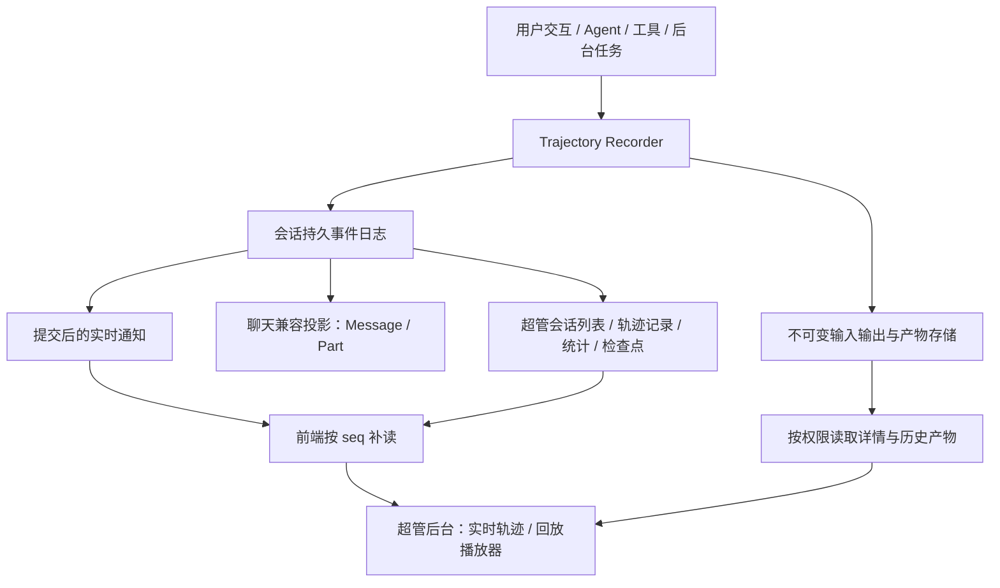

# 会话执行轨迹与回放：超管后台完整实施计划

> 状态：本地代码已实现，M0–M6 与 M7 的本地实现/专项验证已完成。本文件保留完整目标方案与退出条件；实际代码、测试、已知边界和部署操作见 [实现与本地验收记录](SESSION_TRAJECTORY_IMPLEMENTATION_STATUS.md)。尚未部署或全量启用，完整发布验收仍按 M7/M8 的未勾选项执行。
>
> 日期：2026-09-11。
>
> 范围：OpenBox 后端与 `frontend-v2` 超管后台。所有用户、所有客户端发起的 Agent 执行均由后端记录；监控、回放及其接口首版仅向平台超管开放。

配套文档：[前端展示与详情字段规格](./SESSION_TRAJECTORY_UI_SPEC.md)，包含 DeepSeek Harness 界面对照、各类记录的页签/参数和界面验收。

## 1. 已确认的产品要求

1. **以用户的会话为中心。** 每份轨迹归属于明确的 `user_id + session_id`；超管在后台跨用户查找会话，进入该会话的轨迹详情。
2. **覆盖全部 Agent 执行与交互。** 包括主 Agent、子 Agent、模型请求、流式返回、工具、权限、问答、重试、压缩、中断、继续和产物。
3. **支持监控和回放。** 运行时持续更新；运行结束、刷新页面、断线重连之后能够恢复；支持按记录顺序播放、暂停和跳转。
4. **旧执行过程不补录。** 不迁移历史事件，不根据最终消息猜测过去发生过的步骤。
5. **旧会话上线后继续聊天必须记录。** 接入条件是新活动发生在记录能力启用之后，与会话创建时间无关，无需新建会话。
6. **保留新请求实际使用的历史上下文。** 旧消息可以作为新请求的输入快照被保存，但不会被伪装成新发生的历史事件。
7. **回放恢复已记录的执行过程。** 回放操作没有模型调用、工具执行、权限批准、文件恢复或外部发布等副作用。
8. **仅平台超管可查看。** 后台提供“会话列表 → 轨迹监控/回放”，平台超管能查看所有用户、所有工作区的已记录会话。普通用户不显示入口，也不能调用轨迹列表、详情、事件、订阅、搜索、payload 或导出接口，即使会话属于本人。

记录范围与查看权限分开：所有用户的新活动都在记录范围内；读取方是平台超管。访问者的管理员身份不能覆盖事件中原始用户、会话或执行者的身份。

“全部”指 OpenBox 执行链可观察到的操作、输入、输出和交互。模型未返回的内部推理、未被工具或远程运行时提供的内部步骤不在可记录范围内。对第三方系统只收到最终结果的调用，回放展示请求、等待和最终结果，不生成不存在的中间帧。

完整性的承诺以已提交的事件为依据。进程可能在外部动作完成、结果尚未提交时退出；此类调用显示“结果未知”，不能推断成成功或自动重执行。

## 2. 当前代码事实与实施依据

| 已核实事实 | 代码入口 | 对方案的影响 |
|---|---|---|
| 消息和 Part 已持久化；Part 更新覆盖 JSON 当前值 | [消息模型](../backend/models/message.py)、[Part ORM](../backend/db/models/part.py)、[save_part](../backend/session/session.py) | 保留现有聊天接口，但需要追加式事件日志保存中间过程 |
| 文本和 reasoning 通过增量事件推送，并定期保存检查点 | [processor.py](../backend/agent/processor.py) | 最终 Part 无法还原每个增量；需要在增量产生时记录 |
| `process_step()` 包含模型流和之后的工具执行 | [processor.py](../backend/agent/processor.py) | Step 耗时与模型请求耗时必须分别记录 |
| 前端目前同时累计 Step 和工具 duration | [turn-view.ts](../frontend-v2/src/features/chat/lib/turn-view.ts) | 校正重复计时；不能据此生成真实时间线 |
| 重试会复用 Step 编号，但会创建新的 Assistant 消息 | [loop.py](../backend/agent/loop.py) | Step、请求尝试、消息需要独立身份 |
| 执行租约已有 `RunTicket.run_id` 和 generation | [question/runtime.py](../backend/question/runtime.py) | 复用运行身份和过期写入保护，补充持久关联 |
| 模型出口包含 LiteLLM、直接 Responses、原生工具搜索和辅助调用 | [llm.py](../backend/agent/llm.py)、[native_tool_search.py](../backend/agent/native_tool_search.py)、[video_analyze.py](../backend/tool/video_analyze.py) | 不能只在主循环外围记录一次请求 |
| 工具中间输出目前主要走 Bus，展示输出可能被截短 | [hooks.py](../backend/agent/hooks.py) | 在展示截短之前捕获可获得的完整输出；展示长度和存储长度分开 |
| `batch` 内部直接执行子工具 | [batch.py](../backend/tool/batch.py) | 子调用必须接入统一执行记录入口 |
| 子 Agent 使用独立子会话，父工具保存 `child_session_id` | [task.py](../backend/tool/task.py) | 明确轨迹归属会话与实际执行子会话的区别 |
| WebSocket 按用户分发，队列满时可能丢弃事件 | [ws.py](../backend/api/ws.py)、[bus.py](../backend/bus/bus.py) | 实时通知不能作为回放依据，必须支持按序补读数据库 |
| v2 重连后重新拉取消息，活动会话还会轮询快照 | [useChatEvents.ts](../frontend-v2/src/features/chat/hooks/useChatEvents.ts)、[messages.ts](../frontend-v2/src/features/chat/api/messages.ts) | 新轨迹使用带水位的快照和事件补读，不依赖文本长度判断新旧 |
| 普通消息读取允许工作区成员读取会话，修改操作另校验所有者 | [sessions.py](../backend/api/sessions.py) | 轨迹采用独立超管读取权限，普通消息权限不授予轨迹访问权 |
| 超管角色是平台级 `role=admin`，已有后端与前端守卫 | [middleware.py](../backend/auth/middleware.py)、[guards.tsx](../frontend-v2/src/app/router/guards.tsx) | 复用平台角色，不混同 `workspace_role=admin/owner`；读取时确认当前角色有效 |
| 后台已有导航、全平台用户查询与访问审计 | [AdminNav.tsx](../frontend-v2/src/features/admin/AdminNav.tsx)、[admin.py](../backend/api/admin.py) | 在后台增加轨迹栏目，沿用列表组件与审计能力 |
| 当前 Agent WebSocket 按登录用户恢复消息，还会确保其沙箱存在 | [ws.py](../backend/api/ws.py) | 超管监控使用独立只读订阅，不冒用目标用户连接、不因查看创建目标沙箱 |
| 文件记录可能被删除，远程 URL 可能过期 | [file_asset.py](../backend/db/models/file_asset.py)、[Blob 接口](../backend/blob/interfaces.py) | 回放需要不可变版本和独立保留引用 |
| 桌面单用户模式使用 SQLite，服务部署使用 PostgreSQL | [db/base.py](../backend/db/base.py) | 新增表和顺序分配需同时支持两种数据库 |

参考 DeepSeek Harness 的事件关联、独立视图投影和虚拟列表设计；OpenBox 使用现有 Python、SQLAlchemy、WebSocket、React 技术栈实施。

## 3. 总体架构与数据职责



### 3.1 事实来源

- 新接入活动的执行事实以追加式事件日志为准。
- Message、Part、请求摘要、工具摘要和回放检查点属于派生数据，能由事件及基线重建。
- 旧消息继续保留在现有表中，作为续聊输入的一部分。首次接入基线明确标识这些消息来自记录起点之前。
- 请求输入和历史产物引用不可变数据；当前文件、当前工具目录、当前模型配置不能替代历史版本。
- 前面讨论的“单独 RequestTrace 表”调整为事件日志之上的请求读模型，不建立另一套独立写入的请求事实来源。

### 3.2 与现有运行链的接入方式

新增 `backend/trajectory/` 作为记录、读取和投影模块，生产者显式调用 Recorder。`bus.publish()` 继续负责通知，不能作为自动收集全部事实的唯一入口。

本地业务变更能在同一数据库事务完成时，事件与变更一起提交。流式输出先进入持久日志，再通过兼容投影和实时通道交付。现有 `save_part()` 等函数需要事务内 helper，避免业务提交和事件提交分成两个独立事务。

现有 Chat API 和模型历史读取路径保持可用；对新记录范围内的数据，写入与修复均通过统一事件/投影入口。实施期间分阶段接入，所有生产路径完成验收后再在超管后台标记为完整记录。

## 4. 用户、会话与执行身份

### 4.1 身份定义

| 身份 | 含义与规则 |
|---|---|
| `user_id` | 会话所有者，从认证身份或已验证的后台执行上下文获得 |
| `viewer_id` | 查看轨迹的超管身份，仅用于读取鉴权、访问审计和缓存隔离；不是执行事件的所有者 |
| `session_id` | 轨迹归属会话，所有列表、订阅、导出和统计的主要范围 |
| `source_session_id` | 实际执行会话；主 Agent 等于 `session_id`，子 Agent 可不同 |
| `trajectory_id` | 一个用户会话的记录容器，惰性创建且保持稳定 |
| `turn_id` | 用户任务的持久身份；正常暂停/回答/继续可以沿用，新的独立用户输入开启新的 Turn |
| `run_id` | 一次执行租约，复用 `RunTicket.run_id`；暂停后续跑产生新的 Run |
| `step_id` | 一个逻辑 Step 的稳定 ID；该 Step 的请求重试沿用，其他 Step 不复用；展示编号不能代替 ID |
| `request_id` | 一次被 OpenBox 适配器实际发起的模型请求；重试和路由回退各用新 ID |
| `agent_id` | 本次 Agent 实例身份，`parent_agent_id` 表示委派关系 |
| `call_id` | OpenBox 生成的工具调用身份；provider 原始调用 ID 另存并限定在请求内 |
| `message_id` / `part_id` | 关联现有聊天对象；内容已删也不能级联删除执行日志 |
| `event_id` | 写入前生成的幂等身份，持久化重试复用同一个值 |
| `seq` | 归属会话内从 1 开始的连续提交顺序，数据库分配 |

普通单次回复可以用原始用户消息 ID 建立 `turn_id`。合成续跑消息、问答恢复和子 Agent 回传必须继承明确的 Turn 关联，不能用“最近一条用户消息”猜测。

### 4.2 子 Agent 与独立子会话

父会话委派的子 Agent，所有事件写入父会话的同一份轨迹，携带自己的 `source_session_id`、`agent_id` 和父调用关系。由此获得整次任务的统一 `seq`，无需根据不同进程的墙钟时间猜测顺序。

`TraceContext` 在创建子会话、写入子提示词之前就传递到子执行链；父子所有者必须一致。并发子 Agent 使用独立上下文，禁止修改共享 `ToolContext` 造成事件串到别的调用。

委派子会话在超管的父轨迹详情中通过 Agent 筛选和子树展开查看，不在全局列表重复算成另一份轨迹。若以后允许独立继续某个子会话，该独立 Run 以子会话自身作为新的轨迹归属，记录来源链接和输入基线；已发生的委派事件仍归属原父轨迹。

### 4.3 后台任务

- 会话发起的异步视频、发布、桌面和其他任务在入队时持久保存 TraceContext，完成回调继续写回原会话，即使原 Run 已结束。
- `cron` 已绑定目标会话时，触发、临时执行会话和回传都关联该目标会话；没有目标会话时，以新建的执行会话归属。
- 全局系统维护任务只有在确实属于某个会话时才加入该轨迹，不凭最近活动的会话进行归属。
- 父 Agent 结束、用户关闭页面、切换会话不会关闭轨迹；后续活动继续追加。

## 5. 事件协议与覆盖清单

### 5.1 事件信封

以下是目标协议示意，具体 Python/TypeScript 定义在 M0 固化：

```json
{
  "event_id": "evt_...",
  "trajectory_id": "trj_...",
  "user_id": "usr_...",
  "session_id": "ses_parent",
  "source_session_id": "ses_child",
  "seq": "42",
  "type": "request.delta",
  "version": 1,
  "occurred_at": "2026-09-11T08:00:00.123Z",
  "recorded_at": "2026-09-11T08:00:00.148Z",
  "turn_id": "turn_...",
  "run_id": "run_...",
  "step_id": "step_...",
  "agent_id": "agent_...",
  "request_id": "req_...",
  "caused_by_event_id": "evt_...",
  "data": {
    "block_id": "block_0",
    "block_type": "text",
    "chunk_index": 3,
    "delta": "正在分析"
  }
}
```

生产者必须提供类型所需的关联 ID；其余字段可省略。数据体采用按 `type + version` 区分的类型定义，进入数据库前验证可序列化性和关联归属。

模型和工具增量使用 `chunk_index` 或显式完整值 checkpoint 表明语义，不根据字符串长度推断更新类型。保留每个实际观测 chunk 的时间和内容，即使物理写入将多个 chunk 合成批次。

### 5.2 必须记录的事件族

| 类别 | 目标事件示例 | 必须保存的事实 |
|---|---|---|
| 记录接入 | `trajectory.started`、`baseline.captured` | 记录开始时间、旧会话标记、基线引用、版本 |
| 用户输入 | `input.accepted`、`input.injected` | 文本、附件版本、来源、用户消息 ID、接收和注入位置 |
| 会话操作 | `session.settings_changed`、`history.reverted`、`history.regenerated`、`history.forked` | 操作参数、变化前后有效配置/上下文引用、来源关系 |
| 生命周期 | `turn.started/finished`、`run.started/finished`、`step.started/finished` | 稳定身份、终态原因、暂停/恢复关系、计时 |
| 请求准备 | `request.prepared` | 实际采用的 system、messages、工具 schema、配置、provider、模型和 purpose |
| 模型调用 | `request.started`、`request.delta`、`request.usage`、`request.finished` | 输出块、返回的 reasoning、工具参数增量、usage、finish/error/cancel |
| 重试/回退 | `request.retry_scheduled`、`request.route_changed` | 原请求、新请求、attempt、原因、等待时间、目标路由 |
| 工具执行 | `tool.requested`、`tool.started`、`tool.output`、`tool.finished` | 调用输入、实际执行输入、输出、失败、父调用、开始/结束 |
| 权限 | `permission.requested/resolved/expired` | 工具与参数、策略结果或用户选择、修订后的参数、等待时间 |
| 问答 | `question.asked/draft_saved/resolved/cancelled` | 问题、选项、已提交的草稿、正式回答、拒绝/取消、恢复关联 |
| 子 Agent | `agent.spawned`、`agent.message`、`agent.finished` | 委派提示、父子身份、子会话、进度、返回结果 |
| 压缩 | `compaction.started/finished`、`context.replaced` | 输入范围、摘要、替换后的有效历史、相关模型请求 |
| 消息投影 | `message.committed`、`part.committed` | 最终或检查点内容、来源事件范围、当前模型历史的变化 |
| 业务状态 | `plan.changed`、`todo.changed`、`skill.loaded`、`tool_catalog.changed` | 当时的结构化状态、加载内容或版本、实际生效的工具目录 |
| 后台作业 | `job.submitted/progress/finished` | 作业身份、恢复信息、回调序号、结果、取消语义 |
| 产物 | `artifact.recorded/removed` | 内容版本、摘要、媒体类型、来源调用、可用性 |
| 用户接管 | `takeover.requested/started/finished` | 请求、确认、接管状态变化和恢复交接信息 |
| 中断/恢复 | `run.cancel_requested`、`run.interrupted`、`recording.gap`、`operation.late_result` | 取消原因、最后已知位置、未知结果、迟到结果来源 |

事件名称是本计划提出的目标协议，不代表仓库已经存在这些 Bus 事件。

### 5.3 捕获位置与语义

1. 请求快照在模型参数和工具 schema 最终组装之后捕获；每次实际派发都有独立 `request_id`。辅助模型调用使用 `purpose` 区分正文、压缩、标题、建议、工具内分析和定时任务摘要。
2. `capture_level` 明确记录 `adapter_input` 或 `provider_wire`。直接 HTTP 路径可以保存去除认证信息后的实际业务请求体；LiteLLM 路径至少保存最终适配器输入。没有观测到 SDK 内部重试或转换时，不声称记录了全部 HTTP 尝试；需要打开对应 provider hook 才能升级为 wire 级捕获。
3. `request.delta` 驱动请求输出记录，`message/part.committed` 记录落入聊天/模型历史的内容；两者通过来源关系相连，同一文本和 usage 不重复累计。
4. 工具记录必须覆盖参数拒绝、权限拒绝、超时、取消和嵌套调用。`tool.started` 表示即将进入真实执行器；权限等待单独计时。
5. 工具 `_on_output` 目前可能传入累积全文，Recorder 必须记录其 `mode=replace` 或转成验证过的 delta。不能把每次全文当增量重复拼接。
6. 对终端、浏览器、computer、远程桌面记录 Agent 发出的操作和运行时返回结果。`computer(action='batch')` 的原子操作列表必须保留；运行时提供子动作结果时逐项关联。连续桌面录像和用户全部键盘输入不由本功能自动生成。
7. 只有正式进入后端的用户输入/草稿属于轨迹。浏览器里尚未提交的打字过程不上传。

## 6. 持久化模型

### 6.1 目标表

| 表 | 主要字段/约束 | 职责 |
|---|---|---|
| `session_trajectories` | `id`、`user_id`、`session_id`、`started_at`、`next_seq`、`committed_seq`、`schema_version`；唯一 `(user_id, session_id)` | 接入与提交水位 |
| `trajectory_events` | 事件信封、inline data/大内容引用；唯一 `event_id` 和 `(trajectory_id, seq)` | 追加式事实日志 |
| `trajectory_payloads` | 所属轨迹、`payload_id`、内容 hash、存储 key、编码、大小、类型、可用性 | 请求输入、长输出、产物的不可变存储引用 |
| `trajectory_records` | `record_id`、kind、身份关联、起止 seq、状态、摘要、指标、`applied_seq`、投影版本 | 可重建的请求/工具/交互摘要，支持分页与统计 |
| `trajectory_session_summaries` | 唯一 `trajectory_id`、owner/session/workspace、最近活动、运行/记录状态、请求/工具/用量汇总、`applied_seq` | 可重建的超管会话列表投影，避免逐行扫描全部事件 |
| `trajectory_checkpoints` | 所属轨迹、`through_seq`、投影版本、完整状态引用、digest | 快速打开和随机位置回放 |

`request_traces` 不再作为额外事实表；请求摘要使用 `trajectory_records(kind=request)`。后台任务的 TraceContext 直接保存在各自任务的持久元数据中，不能只存在进程 `ContextVar`。

### 6.2 索引与约束

- 事件读取主索引：`(trajectory_id, seq)`。
- 定位索引：`(trajectory_id, request_id, seq)`、`(trajectory_id, call_id, seq)`、`(trajectory_id, agent_id, seq)`，按真实查询需求建立。
- 记录列表索引：`(trajectory_id, start_seq, record_id)`；筛选状态/种类时保留稳定游标。
- 超管会话列表索引：按最近活动与 session ID 排序，并为 owner、workspace、运行状态筛选建立组合索引；用户名称/邮箱与 Session 元数据使用关联查询。
- 所有 payload、checkpoint、record 引用必须属于同一轨迹或显式授权的来源关系。
- 不对 `message_id` / `part_id` 使用会导致事件被删除的级联。重新生成可能移除聊天对象，日志仍保存当时内容。
- PostgreSQL 使用 JSONB 与事务行锁；SQLite 使用现有写事务协调机制。`SELECT max(seq)+1`、进程内自增和 Redis 自增均不能成为持久顺序来源。
- 新建表通过 Alembic 部署到服务环境，同时纳入桌面模式的模型注册与建表路径；不依赖给所有旧 Session 回填列。

### 6.3 不可变大内容与产物

小型事件数据直接写数据库；较大的请求体、长输出和二进制产物写入现有部署可用的 Blob/OSS 存储适配器。不要把新增轨迹内容绑定到可变沙箱路径或临时签名 URL。

先将不可变对象写成功并验证摘要，再提交引用它的事件。提交失败留下的无引用对象交给清理任务；已有引用的对象不能按临时文件策略清理。去重限定在所属用户/轨迹的授权范围，不通过全局 hash 查询暴露其他用户的数据。

对已有 `FileAsset` 建立轨迹保留引用，或复制为轨迹拥有的不可变版本。显式删除附件时删除相应受控内容并保留可用性记录；回放显示“内容已删除”，不展示同名新文件。会话删除负责释放事件、检查点和产物引用，分支仍引用的内容不被提前删除。

## 7. 写入顺序、事务与可靠性

### 7.1 Recorder 的目标接口

```python
ensure_trajectory_in_tx(db, owner, origin) -> Trajectory
append_events_in_tx(db, context, events) -> PendingRange
record_stream(context, event) -> Awaitable[CommittedEvent]
flush(context) -> CommittedWatermark
```

`append_events_in_tx` 参与调用方事务，不私自提交；返回范围只有在外层事务成功后才成为已提交水位。所有者校验、既有业务写锁、轨迹顺序分配、事件写入和同步兼容投影遵循固定锁顺序。涉及多个业务会话时按稳定 ID 顺序获取会话锁，最后获取轨迹行锁；完整锁顺序在 M0 固化并通过并发测试验证。轨迹写入器不得反向获取会话锁。

一次提交分配连续 seq、插入事件、推进 `committed_seq`，全部成功才可见。事务回滚同时回滚序号分配。未知提交结果重试时按 `event_id` 查已提交记录；同 ID 不同 payload 必须拒绝。

### 7.2 先提交、后通知

1. 正式输入、权限回答等本地事实，与对应业务状态在同一事务保存。
2. 模型请求开始和工具即将执行的记录提交成功后，才进入外部调用。
3. 模型/工具返回的可见增量提交后，才能推给用户或用于触发下游操作。
4. 完成记录包含已经观察到的最后输出和 usage；正常结束、取消和异常路径都必须 flush。
5. 事务完成后发布 `trajectory.available` 水位通知；现有聊天事件也从已提交数据生成。

不要在调用外部服务期间持有数据库事务或锁。外部动作不具备与数据库一起原子提交的能力，开始记录只证明派发意图；结果缺失必须保留未知状态。

### 7.3 增量批量写入

同一轨迹可将多个增量合成数据库批次，保留每个成员的事件身份、内容和时间。前端只应用已提交成员。

批次按照时间、字节数或终态到来触发；开始/结束、交互回答和即将执行工具等结构事件强制冲刷相关前置增量。队列有界，超限时施加背压，不丢弃旧事件。大型单条内容通过 payload 引用保存。

流读取、批量提交和发布组成有界流水线：读取器排队，提交器返回持久化回执，发布器只消费已提交结果。不要让读取器每收到一个 chunk 都串行等待一次合批定时器；真实背压由待提交字节上限控制，结构事件通过 flush 屏障等待前置内容。

### 7.4 通知丢失与进程退出

事件表同时充当可补读的发送来源，不要求 Redis Pub/Sub 保存历史。收到通知后按 seq 读取；打开的实时视图定期检查服务端水位，修复“最后一个通知恰好丢失、后面没有新事件”的情况。

写入失败时，已启用记录的执行链不能悄悄退回无记录执行。当前操作安全结束或中断，停止发起后续模型/工具调用，反馈记录故障；用户取消信号仍应立即送达，不能因为日志数据库故障阻塞停止。

崩溃恢复依赖已有 Run 租约与 generation 校验。恢复任务记录最后已提交位置，关闭过期运行，已开始但没有结果的工具显示 `unknown`；晚到回调追加 `operation.late_result`，补充实际结果但不把已结束 Run 重新变成运行中。

## 8. 新旧会话统一接入

### 8.1 接入起点

启用记录后，在第一条被接受的新输入或续跑交互的事务中，惰性创建该会话轨迹并写入 `trajectory.started`。打开旧会话的只读 GET 不会创建日志。

首次 Agent 执行前保存基线，至少包含：生效的会话配置、当前历史版本、有效消息/附件引用、尚待处理的交互，以及记录起点。每次请求仍保存实际输入快照，不能假定首次基线永远等于后续模型上下文。

旧会话第一条新输入必须进入轨迹，不能等到模型开始返回时才初始化。已有待回答问题在上线后被回答时，先保存该问题的接入快照，再记录新回答和续跑。

### 8.2 超管后台可见行为

| 场景 | 行为 |
|---|---|
| 任意用户新建会话并开始聊天 | 从第一条被接受的输入开始记录，后台列表可发现 |
| 超管查看未续聊的旧会话 | 显示尚未开始记录，不扫描补造旧事件，不创建空轨迹 |
| 普通用户打开或继续会话 | 普通聊天界面不增加轨迹入口；续聊仍自动记录 |
| 旧会话上线后继续聊天 | 自动初始化，在超管详情标记“从此处开始记录”，本轮及后续活动可回放 |
| 新请求携带旧历史 | 旧历史只作为输入基线/请求快照出现，不计入新活动次数 |
| 超管刷新、重连、换设备 | 重新验证超管身份后，根据已提交事件和检查点恢复 |
| 关闭页面后继续后台任务 | 任务照常记录，重新打开可恢复 |
| 子 Agent 产生结果 | 按原父会话与父调用关系追加 |

统计必须标注 `coverage_start` 和 `through_seq`。轨迹统计仅覆盖已记录活动；现有会话生命周期累计账单/用量属于另一口径，不能标成这段轨迹的统计。

### 8.3 上线时正在运行的任务

正式启用前应停止向旧版本 worker 分配新 Run，并排空或交接在途任务，确认所有执行入口和回调消费者支持记录协议。旧 worker 继续无记录执行期间不能宣称功能已经全面启用。

外部作业无法排空时，交接其持久归属和当前状态，标记为接入前已开始；启用后的回调和新操作必须记录。无法获得的开始时间/旧输出保留未知，不能填造。灰度阶段记录中断范围以 `recording.gap` 明示。

## 9. 输入、输出与时间指标

### 9.1 请求输入

- 记录有效 system、消息顺序和内容、附件版本、工具目录、model/provider、采样和 reasoning 设置、tool_choice、上下文压缩后的实际输入。
- 每个请求有独立输入引用。共享 system/工具目录可按内容复用不可变块；不能只存配置版本而依赖以后仍存在的插件文件。
- provider 私有状态按当前内部数据权限保存受控引用，超管回放使用明确字段白名单；不能把 `PRIVATE_TOOL_PART_FIELDS` 整体展开到任何通用 API。
- 认证头、API key、cookie、签名令牌不进入回放 payload。请求快照用字段白名单构造，保留被移除字段的类别标记。
- 本计划保证捕获层级内的业务输入可检查，不承诺凭保存的凭据重新向 provider 执行。

### 9.2 输出与产物

模型每个可观察输出块保持原顺序、类型与增量。工具保存调用时输入、执行输出、交给模型的截断/摘要结果，以及两者的来源关系；只有运行时提供的数据才能被保存。

文件更改记录原版本/新版本或对应 diff 引用。图片、音频、视频保存受控的内容版本。一个工具只返回最终图片时，回放在结果事件出现时展示图片，不伪造生成过程。

### 9.3 指标口径

| 指标 | 定义 |
|---|---|
| 请求耗时 | 从实际派发边界到响应流结束/失败，排除后续工具执行 |
| 首输出等待（界面可标 TTFT） | 首个非空文本/reasoning/工具调用内容距请求开始的单调时钟差 |
| 首正文等待 | 第一段非空正文文本距请求开始的差，独立于 reasoning |
| 生成耗时 | 首输出到响应结束 |
| 输出速度 | provider 提供的 output tokens / 生成秒数；缺数据时显示未记录 |
| 工具耗时 | 实际执行器起止差；权限与用户等待单独展示 |
| Step/Run/Turn 耗时 | 各自生命周期区间；不得将并发子操作时长相加作为墙钟时间 |
| 用量 | 按 request_id 对最终 usage 去重统计；usage 增量必须声明 delta 或累计值 |
| 会话轨迹统计 | 在明确提交水位内覆盖全部已记录请求，不依赖前端已加载页面数量 |

时间线定位使用 UTC 时间戳，持续时间使用生产者单调时钟差。跨进程没有统一单调时钟，排序以 seq 和父子关系为准；时间偏移不改变因果关系。正在运行的预计时长仅是视图状态，不能写成已完成的耗时。

## 10. 查询、订阅与导出 API

列表入口为 `GET /api/admin/trajectories/sessions`；会话详情与回放入口统一在 `/api/admin/trajectories/sessions/{session_id}` 下。所有端点验证平台超管身份；不在普通 `/api/agent/session/...` 接口下新增轨迹读取入口。

读取身份分两步：先确认当前访问者有有效的平台超管权限，再从 Session/Trajectory 解析目标 owner、workspace 与 session。目标用户筛选参数只控制查询范围，不能替换认证身份；实际返回的事件、记录、payload 和导出必须属于已解析的目标轨迹。超管无需成为目标工作区成员，当前活动工作区和 `X-Workspace-Id` 不能隐式缩小跨用户查询范围。

### 10.1 超管会话列表

`GET /api/admin/trajectories/sessions` 支持用户 ID/用户名/邮箱、会话标题或 ID、工作区、运行状态、记录状态、最近活动时间范围及服务端分页。默认跨所有用户，按最近记录活动倒序，同时间使用 session ID 稳定排序。

每行对应一份归属会话，返回所有者与会话标识、工作区、最近模型、当前运行/记录状态、记录起点、最近活动、请求/工具/错误数量、已记录用量和详情入口。指标来自会话摘要投影，携带自己的 `applied_seq`；不在列表请求中加载原始 prompt 和完整事件。

默认列出已有记录的会话；可显式包含未记录会话，此时只关联现有 Session 元数据，不初始化轨迹。委派子会话在父详情内展开；确实拥有独立轨迹的子会话才拥有独立列表行。列表是查询时刻的监控视图，活动更新时提示刷新，浏览历史页不自动重排行；详情进入后使用该会话自己的固定事件水位。

### 10.2 会话详情与读取

| 方法与相对路径 | 用途 |
|---|---|
| `GET /` | 目标用户/工作区/会话信息、记录状态、起点、committed/projected 水位、全范围统计、可用 Agent 树 |
| `GET /records?before=...&limit=...&through_seq=...` | 按游标从尾部读取记录摘要 |
| `GET /records/{record_id}?through_seq=H` | 指定水位的请求/工具/交互详情与受控 payload 引用 |
| `GET /events?after_seq=N&until_seq=H&limit=...` | 无筛选、连续序列的原始事件页，用于恢复与回放 |
| `GET /checkpoint?at_seq=N` | 最近一个不晚于目标位置、版本可用的检查点 |
| `GET /search?q=...&through_seq=H&cursor=...` | 在已记录范围内搜索，返回稳定记录身份和对应 seq |
| `GET /payloads/{payload_id}` | 当前超管权限与目标归属校验后读取不可变大内容或产物 |
| `POST /export`、`GET /exports/{export_id}` | 固定水位生成回放包，读取导出状态与下载入口 |

API 返回的 `seq`、水位和游标使用十进制字符串/不透明字符串，服务端存 BIGINT；前端不能用超过 JavaScript 安全整数范围的 Number 比较。协议明确比较方式。

### 10.3 快照与事件衔接

打开流程：读取头部得到目标水位 H；获取 `through_seq <= H` 的检查点/摘要；补读到 H；然后追随 H 之后的新事件。投影落后时返回 `projected_through_seq`，客户端从该位置补齐，不能把旧投影标成最新。

`trajectory_records` 是最新状态缓存，不能仅过滤 `start_seq <= H` 就把当前行当成 H 时刻的状态。当缓存已应用 H 之后的事件时，固定水位的列表、详情、统计和 Agent 树必须从不晚于 H 的检查点加事件尾部重建，并可按 `(trajectory_id, H, projector_version)` 缓存结果。所有分页和详情响应声明实际水位；不保持跨 HTTP 请求的数据库长事务来冻结视图。

事件分页使用固定 `until_seq`，连续事件页必须携带 `from_seq`、`through_seq` 和 `has_more`。不将 Agent 筛选作用在恢复流上，否则筛选产生的 seq 间隔会被误判成丢失；筛选仅影响展示或记录查询。

### 10.4 超管只读实时订阅

新增独立只读 `/ws/admin/trajectories` 连接，沿用一次性 ticket 的认证方式并验证当前平台超管角色。连接按超管访问者及具体连接维护目标会话订阅，新增订阅/退订消息与 `trajectory.available` 水位通知，包含目标 owner、session、trajectory 和 committed seq。

通知只发到已授权且订阅了该会话的超管连接。不能把轨迹事件加入全员广播白名单，不能因为事件 owner 是普通用户就向其现有 WS 发送新的轨迹原始数据，也不能用超管 user ID 改写事件归属。跨进程可沿用内部消息分发设施，最终接收人由超管订阅表决定。

现有 `backend/api/ws.py` 的 `_on_bus_event()` 订阅了全部 Bus 事件，接入时必须显式排除内部轨迹事件，防止它们按原 owner 自动转发到普通聊天连接。现有 Message/Part 兼容通知继续走聊天通道。

该连接只允许订阅/退订和保活，不接入问答、审批、取消或创建沙箱等执行处理器。权限失效时清理订阅并停止发送；后台记录不依赖超管是否在线。

首版用通知触发超管 HTTP 事件补读并定期检查水位。后续即使增加 WS 事件批次，也沿用相同去重和缺口修复规则。会话列表只轮询摘要，不订阅所有会话的完整事件；丢失通知不能被视为已消费。

### 10.5 超管导出

导出固定水位 H，包含 manifest、版本、基线、事件 JSONL、必要 payload/产物和摘要校验。缺失或已删除内容列在 manifest 中，不生成声称完整的空占位文件。导出耗时任务复用现有可用的后台执行设施，分别保存发起超管、目标 owner/session、H 和状态。

导出状态、下载和 payload/媒体读取都经过超管鉴权及目标归属验证，不生成普通用户可直接使用的公开下载链接。超管被降权或停用后不能继续下载之前创建的导出；查看/导出记录进入现有审计日志，不能追加为目标用户的新执行事件。

回放包只承载数据；导入/打开不执行代码。首个版本实现导出与服务内回放，通用离线导入播放器另行立项。

## 11. 回放与前端实施

### 11.1 超管列表与详情入口

在 Web v2 现有“超管系统”增加“轨迹监控”栏目。列表路由为 `/app/admin/trajectories`，详情路由为 `/app/admin/trajectories/sessions/:sessionId`；均放在现有 `RequireAdmin` 路由守卫内。普通聊天页不增加轨迹 tab 或入口，普通用户直接输入后台 URL 也不能取到轨迹数据。

超管先在跨用户会话列表检索，再进入详情。详情采用类似 DeepSeek Harness 的“时间线 + 执行记录列表 + 右侧分类型详情”，支持实时监控、Agent 筛选、搜索与回放。顶部持续展示目标用户、工作区、会话及记录起点；返回列表恢复筛选、分页和滚动位置。文案走中英文 locale，颜色使用现有语义 token。

新增 `features/admin-trajectories`，通过公开入口供 `routes/admin` 装配，遵守 [v2 工程规范](../frontend-v2/docs/ENGINEERING_SPEC.md)。复用 shared 的表格、JSON、Markdown、媒体等通用组件；不横向导入 `features/chat` 的业务 store、执行处理器或其他 feature 的内部组件。现有 AdminRoute 最大宽度与滚动布局需要为轨迹详情提供宽屏容器，以容纳列表和检查器。

### 11.2 状态归属

- REST 元数据、详情与分页使用 TanStack Query，key 包含超管 viewer、目标 owner/session/trajectory、范围/版本；全局列表另包含筛选与分页参数。
- 有序事件和实时投影使用专用流式 store。检查点仅在初始化、seek 或明确 resync 时按水位安装；旧快照不能覆盖更新的事件前缀。
- 选择、折叠、回放速度、播放位置属于视图状态。组件读取投影，不直接拼原始消息或调用服务端记录接口。
- 超管退出登录、角色失效清理缓存与订阅；切换目标用户/会话时更新绑定 generation，迟到响应不能写入新目标。查看目标不改变应用的登录身份或活动工作区。
- 使用超管只读 WebSocket 连接，复用现有虚拟列表库，懒加载轨迹详情与 Markdown。

### 11.3 投影器

定义纯函数语义 `reduce(state, event) -> state`，状态中维护按身份索引的 Turn、Run、Step、Request、Tool、Interaction、Agent 和 Artifact。

结构变更更新记录顺序；文本增量只修改所属 block/record。视图按帧合并通知，不为每个 chunk 全量重建整个会话。完成事件沿用流式阶段同一个记录 ID，防止结束时重排或丢失选中状态。

Python 后端投影与 TypeScript 前端投影使用同一组协议 fixture 校验结果。原始事件可重放；快照/摘要携带 projector version。未知事件版本必须明确报不支持或标记该片段不可完整回放，不能静默跳过后仍宣称完整。

### 11.4 播放器

维护独立的 `live_head_seq` 与 `playhead_seq`。实时尾部始终接收新事件；超管回放历史时，后台更新只推进 live head，不移动播放位置。

支持播放/暂停、逐事件、前后 Step、跳到请求/工具、按 seq seek、倍速和可选压缩空闲等待。调度以 seq 为基础，播放间隔参考记录时间差；跨进程时钟导致负间隔时按 0 处理，原始时间保留在详情。

随机跳转使用不晚于目标位置的检查点，再应用其后的事件。跳到尚未加载的区域按需读取，不要求一次下载完整日志；播放过去的记录必须使用该位置的状态，不能显示从最新摘要取得的未来输出。

检查点保存重建所需的状态和不可变内容引用，复用已有内容块，避免每隔若干事件复制一次全部历史长文本。详情和产物也受 playhead 限制，只有对应事件已经发生才可在回放视图中出现。

### 11.5 虚拟化、搜索与统计

记录行使用稳定业务 ID 作为 React/virtualizer key。首次打开定位尾部；向上翻页保留锚点；浏览旧记录时新事件不抢滚动位置。

全文搜索由后端对已记录范围提供完整结果，客户端可即时筛选已加载内容但必须标识范围。总请求数和 usage 由后端固定水位统计。整个会话指标、父工具和子工具指标不能重复相加。

### 11.6 各类记录的展示与详情

页面区域、通用列表字段、类型对应的页签及全部详情字段按 [前端展示与详情字段规格](./SESSION_TRAJECTORY_UI_SPEC.md) 实施。覆盖用户输入、AI 回复、模型请求、工具/子工具、系统/上下文、子 Agent、审批/问答、中断/恢复/重试、压缩、后台任务、产物与记录边界。

用户提交内容、模型实际请求输入、工具原始参数与实际执行参数分别展示。模型请求和 AI 回复是关联的检查对象；工具使用“概述 / 参数 / 结果 / Schema / 计时”基础页签。前端详情所需但现有 Part 未保存的字段，必须在对应后端接入阶段补齐生产来源，不能由界面猜测。

## 12. 权限、数据保留与会话操作

### 12.1 平台超管读取权限

| 访问者 | 轨迹访问能力 |
|---|---|
| 当前有效的平台 `role=admin` | 查询所有用户、所有工作区的会话列表，读取选定会话的轨迹、payload、订阅、搜索和导出 |
| 普通用户，包括目标会话所有者 | 不开放轨迹界面与接口；已认证请求返回 403 |
| 仅有工作区 `owner/admin/member` 角色 | 不获得平台轨迹读取权限 |
| 未登录、令牌无效或已撤销 | 返回 401 或拒绝建立连接 |

沿用 `require_admin` 的平台角色定义；多用户模式下再读取当前 User 的 role、is_active、is_deleted，防止仅依赖尚未过期 JWT 的旧角色。可参考 [已有实时超管校验](../backend/notifications/testing.py) 的机制，将轨迹校验放在合适的鉴权模块，不把业务功能绑定到通知 feature。单用户模式沿用既有 default/admin 身份，只访问本实例数据。

新 HTTP 读取、订阅、发送通知及导出下载都校验有效权限，角色变更或账号停用后关闭订阅；保活检查负责回收没有后续消息的失效连接。前端守卫只负责导航，不能代替服务端鉴权。

订阅票据保存可验证的认证会话/撤销关联与有效期，不保存或冒用目标用户凭据。握手成功后仍要验证账号与认证会话状态，覆盖连接建立后的令牌撤销。

超管跨用户读取使用独立管理端查询，不要求成为目标工作区成员，也不通过普通消息读取接口扩大访问范围。记录所有者校验仍用于执行写入和目标对象归属验证；它与超管读取授权是不同检查。

### 12.2 查看范围、审计与执行隔离

所有详情对象与目标轨迹绑定；将用户 A 的 payload/record/export ID 填入用户 B 的详情路径必须拒绝。超管登录用户、目标会话所有者、后台实际执行者分别保留，不提供冒用目标用户 token 的实现路径。

沿用现有审计模块记录超管打开详情、开始订阅、读取原始内容/产物、发起及下载导出等访问，包含 viewer、目标 user/session、动作、时间和事件水位，避免记录完整 prompt。重复分页/轮询按一次查看活动合并审计，不能每个 chunk 生成一条访问审计。

轨迹后台只负责查看和回放，不提供替目标用户发送消息、同意审批、回答问题、取消执行、创建沙箱或恢复文件的按钮/接口。审计是管理访问记录，不进入目标用户的执行日志，也不改变其运行状态。

### 12.3 数据保留与会话操作

后台 Run 的 owner 来自已验证的任务记录；不能接受前端指定 `user_id`，也不能依赖可猜测的 payload ID 完成鉴权。子 Agent 与异步回调同时验证归属会话和真实来源关系。

会话“重新生成/回退”追加相应事件并更新当前模型历史投影，原有执行记录继续可检查。分支会话惰性创建自己的轨迹，保存来源位置及自有基线，后续活动只写分支；不复制旧执行过程冒充新事件。

会话删除按现有产品行为清理对应轨迹和引用，并阻止晚到回调重新创建已删除会话的轨迹。附件显式删除保持用户删除语义，回放标记内容不可用。运行中的后台任务处理遵循现有取消/保留规则，不能因为回放功能新增外部动作。

## 13. 实施改动地图

下表“新增”文件/目录是计划目标，当前尚不存在。

| 层 | 文件/目录 | 任务 |
|---|---|---|
| 协议与记录 | `backend/trajectory/`（新增） | types、context、recorder、repository、payload、projector、checkpoint、recovery、export、超管列表摘要 |
| 数据库 | `backend/db/models/trajectory.py`（新增）、现有 migrations、`db/models/__init__.py` | 表、索引、模型注册、SQLite 建表验证 |
| 包装与启动 | `backend/pyproject.toml`、后端启动/路由装配入口 | 注册新包、配置、恢复/投影任务及 API |
| 用户输入与投影 | `backend/session/session.py`、`backend/api/sessions.py` | 接入起点、基线、事务 helper、Message/Part 兼容投影 |
| 生命周期 | `backend/agent/loop.py`、`backend/question/runtime.py`、`backend/session/abort.py` | Turn/Run/Step、租约、重试、暂停、取消、崩溃恢复 |
| 模型出口 | `backend/agent/llm.py`、`native_tool_search.py`、`compaction.py`、`suggestions.py`、工具内直接模型调用 | 每次派发的输入、增量、usage、终态和 purpose |
| 工具 | `backend/agent/processor.py`、`hooks.py`、`backend/tool/tool.py`、`batch.py`、`task.py` | 调用身份、执行边界、完整输出、嵌套与子 Agent |
| 人机交互 | `backend/permission/permission.py`、`backend/question/question.py`、相关 API、plan/todo/接管工具 | 请求、选择、等待、结果和恢复位置 |
| 后台活动 | `backend/cron/executor.py`、`backend/video/`、发布/桌面/通知回传的生产者 | TraceContext 持久传播、幂等回调、异步终态 |
| 内容存储 | 现有 Blob/OSS 适配器、file asset 管理 | 不可变版本、保留引用、权限、删除与 GC |
| 服务端接口 | `backend/api/admin_trajectories.py`、`backend/api/admin_trajectory_ws.py`（新增）、现有 ticket/审计模块 | 超管列表、详情、只读订阅、水位补读、搜索、导出；在 main.py 注册 |
| 聊天通知隔离 | `backend/api/ws.py` | 全 Bus 监听排除内部轨迹事件，维持既有普通聊天通知 |
| 读取鉴权 | `backend/auth/middleware.py`、User 仓储或独立轨迹鉴权 helper | 平台角色与当前账号状态验证，分别处理 viewer 与目标 owner，权限失效停止读取 |
| 前端协议 | `frontend-v2/src/shared/types/`、`shared/ws/events.ts` | 类型、事件、订阅消息和版本 |
| 前端视图 | `frontend-v2/src/features/admin-trajectories/`（新增，含 api/hooks/stores/utils/components/index.ts） | 跨用户列表、筛选、获取、组装、回放、虚拟列表、时间线、分类型详情 |
| 后台装配 | `frontend-v2/src/routes/admin/`、AdminRoute、`features/admin/sections.ts`、`app/router/router.tsx`、`shared/router/paths.ts` | 轨迹栏目、列表/详情路由、RequireAdmin、宽屏布局、返回列表恢复 |
| 文案与指标 | v2 中英文 `admin.json`、新增 `admin-trajectories.json`、现有 `turn-view.ts` | 后台与回放文案、计时口径校正、记录起点说明 |

工具级原子执行入口收敛时保留现有权限与 execution frontier 行为。原来被 `batch` 拒绝的调用不能因为记录重构而获得执行资格。

## 14. 分阶段执行与退出条件

以下勾选表示独立 worktree 中的代码与对应本地验证已经完成，不表示已部署或已通过真实外部服务、移动设备及生产规模验收。逐入口测试、测试替身边界、性能口径和剩余发布步骤见 [实现与本地验收记录](SESSION_TRAJECTORY_IMPLEMENTATION_STATUS.md)。

### M0：协议、覆盖清单与实现骨架

- [x] 固化事件版本、身份、终态、时间单位、seq API 编码与锁顺序。
- [x] 按配套展示规格固化记录类型、页签、字段来源/可用性与历史位置语义。
- [x] 扫描模型派发、工具执行、人机交互和后台回调的实际入口，形成逐入口清单。
- [x] 确认每种 provider 的捕获层级，列出 SDK 内部行为是否可观察。
- [x] 建立跨语言 golden fixtures：普通回复、工具、重试、问答、子 Agent、旧会话续聊。
- [x] 固化平台超管专用读取、全用户记录范围、目标对象归属及实时权限失效策略。

退出条件：每个在用执行入口都有事件生产位置、归属来源、终态路径和对应测试；没有未解释的“稍后补日志”入口。

### M1：持久日志、内容存储与基础读取

- [x] 新增表、索引、配置和包注册；完成 PostgreSQL/SQLite 验证。
- [x] 实现惰性创建、事务内 append、幂等写入、连续水位和受控 payload。
- [x] 实现最小管理端事件读取与元数据 API，完成超管权限和目标归属校验；普通用户自己的会话也不能读。
- [x] 实现有界增量批量提交、提交后通知和写入故障处理。

退出条件：并发写入与故障注入下无重复/乱序/越权；未提交内容不出现在实时流中；从空投影能够重放 fixture。

### M2：接入、主循环与全部模型出口

- [x] 输入接收事务初始化新旧会话轨迹，首次执行捕获基线。
- [x] 绑定已有 run_id/generation，新增稳定 Turn/Step/Request 身份。
- [x] 接入正文、压缩、标题、建议、工具内模型调用、原生工具搜索与 fallback。
- [x] 保存最终业务输入、流式块、usage、重试和取消；拆分模型与 Step 计时。
- [x] 在兼容写入入口提交事件与 Message/Part 投影，核对覆盖清单中的提前退出路径。

退出条件：旧会话上线后第一条新输入完整记录；一次请求失败并重试能看到两次尝试；新数据只从日志即可恢复相同模型输出。

### M3：工具、子 Agent 与人机交互

- [x] 收敛顶层和 batch 子工具的记录入口，保留原授权规则。
- [x] 记录参数拒绝、权限决定、中间输出、完成、异常和未知结果。
- [x] 子 Agent 在子提示词提交前继承 TraceContext，保存父子树与实际子会话。
- [x] 接入问题、已保存草稿、正式回答、拒绝、已有超时/取消终态、暂停和恢复；不新增答题超时策略。
- [x] 接入计划、Todo、技能/工具目录变化、接管和会话操作。

退出条件：并发子调用归属正确，父会话可以展开完整子 Agent 过程；等待期间没有悬空运行状态；回放不会触发交互处理器。

### M4：后台作业、产物与恢复

- [x] 后台作业入队保存关联，进程重启/worker 切换不丢失会话身份。
- [x] 接入 cron、视频、发布和桌面作业的实际回调；重复回调按稳定来源 ID 去重。
- [x] 保存历史产物版本，验证临时 URL 过期后仍能访问已保留内容。
- [x] 实现租约过期结算、late result、记录缺口、删除后的回调拒绝。
- [x] 验证 regenerate、revert、fork 对轨迹与产物引用的影响。

退出条件：关闭页面或结束父 Run 后，异步结果仍归属原轨迹；进程强杀后可恢复已提交前缀并诚实显示未知结果。

### M5：服务端投影、检查点、搜索与同步

- [x] 实现超管跨用户会话列表及筛选/分页摘要投影、records/统计/Agent 树与 projector version。
- [x] 实现固定水位详情分页、检查点、seq 补读、超管只读 WS 和周期水位检查。
- [x] 实现完整范围搜索与固定水位导出。
- [x] 测试投影落后、检查点失效、未知事件版本和授权撤销。

退出条件：通知任意丢失或重复后都能收敛到相同结果；分页大小不改变结果；不同版本检查点不会被误用。

### M6：Web v2 超管列表与实时轨迹

- [x] 在超管系统增加轨迹栏目、跨用户会话列表、筛选分页和列表到详情导航；普通聊天页无轨迹入口。
- [x] 实现纯事件投影、表格、详情、Agent 树、状态和真实指标。
- [x] 按配套展示规格完成各类型详情、完整输入/参数/结果/Schema 检查及关联导航。
- [x] 实现稳定 key 虚拟化、前向补读、历史分页锚点和尾部跟随。
- [x] 接入完整范围搜索、统计范围、缺失产物和未知状态说明。
- [x] 完成目标用户/工作区显示、返回列表恢复、超管守卫、中英文、主题、键盘访问和窄屏检查。

退出条件：超管跨工作区查看各用户会话，实时内容与刷新后相同；切换目标没有缓存串线；普通用户无入口且直连接口被拒绝；普通 Chat 与后台轨迹引用相同新执行事实。

### M7：播放器与端到端验收

- [x] 实现独立 playhead、播放/暂停、逐事件、Step 跳转、倍速和 seek。
- [x] 回放状态按目标 seq 重建，阻止未来输出提前出现。
- [x] 回放期间保持 live tail 更新，提供回到实时位置入口。
- [ ] 完成导出包核对、无副作用回放测试与全部验收矩阵。
- [x] 按配套展示规格 UI01–UI16 完成本地核对，核对各类记录在运行中、终态和历史位置的内容，以及超管列表/导航/权限；独立原生场景边界见前端验证报告。
- [x] 压测大事件量、长输出、多子 Agent 与多个用户并发；数据规模、环境和样本口径见存储与前端验证报告。

本地导出包、无副作用回放和已列场景已验证。这里保留“全部验收矩阵”未勾选：独立移动设备、部分真实外部服务组合及记录增加的可见输出延迟 P95 对照测量尚未完成，不能由 fixture 或单独数据库延迟代替。浏览器摘要首屏与历史 seek 的本机目标已通过，实际生产灰度和全量验证属于 M8。

退出条件：完整重放、分批重放和 checkpoint+tail 重放结果一致；浏览器回放全过程没有模型/工具/交互写请求。

### M8：上线与旧会话续聊验证

- [ ] 先部署兼容 schema 与所有支持记录的执行节点，接入开关初始关闭。
- [ ] 灰度记录对象和超管查看者分别配置，验证完整执行入口及在途任务交接与回调能力。
- [ ] 开启所有用户的新活动记录和超管轨迹入口，分别验收新会话、旧会话续聊、旧问题回答和后台回调；普通用户保持无轨迹访问权。
- [ ] 检查延迟、写入失败、投影积压、序列缺口与存储增长。
- [ ] 补齐操作说明、故障恢复与回滚说明，再完成全量启用。

退出条件：全部验收场景通过，记录起点明确，全量启用后所有用户的后续新活动都通过 Recorder，只有平台超管可读取。M2/M3 完成不能被标记为整个功能完成。

## 15. 验收矩阵

| 编号 | 场景 | 必须满足的结果 |
|---|---|---|
| AC01 | 超管查看用户 A/B 各两个会话 | 均能访问；列表、详情、订阅、payload、搜索、导出与选定目标准确对应，不串线 |
| AC02 | 普通用户读取本人/他人轨迹，工作区管理员读取轨迹 | 列表、详情、事件、订阅、搜索、payload、导出全部拒绝；本人会话所有权不构成豁免 |
| AC03 | 新会话首次输入 | 输入、Run、Step、请求、输出与结束全部有记录 |
| AC04 | 旧会话上线后续聊 | 只记录新活动，基线包含实际使用的旧上下文，无旧事件回填 |
| AC05 | 只打开旧会话 | 不初始化空日志，不触发模型调用 |
| AC06 | 回答上线前已存在的问题 | 接入问题快照、新回答及后续 Run 有正确关联 |
| AC07 | 文本/reasoning/工具参数流 | chunk 顺序正确，完成值与逐增量重建一致 |
| AC08 | 请求重试与 provider fallback | 每次可观察派发有独立请求 ID，usage 不重计 |
| AC09 | 多个并行工具 | 正确输入输出对应，时间区间允许重叠，总耗时不重复相加 |
| AC10 | batch 子工具 | 每个已派发/被拒绝的子调用都有记录与父调用关系 |
| AC11 | 多层子 Agent | 所有者、父轨迹、实际子会话、父子树和回传正确 |
| AC12 | 权限批准/拒绝/修订/过期 | 原请求、决定、执行输入和等待时间可回放 |
| AC13 | 问答草稿/回答/拒绝/继续 | 仅已保存草稿入日志；回放不提交答案；恢复 Run 可追踪 |
| AC14 | 暂停、取消、新输入抢占 | 旧运行终态保留，新运行不覆盖旧记录 |
| AC15 | 工具执行后进程强杀 | 已提交前缀可读，缺结果显示 unknown，不自动重执行 |
| AC16 | 入队后重启，晚到/重复回调 | 原会话归属不丢，重复幂等，晚到结果不复活旧 Run |
| AC17 | WS 重复、乱序、断线、队列满 | seq 去重补缺，最终等价于数据库日志 |
| AC18 | 最后一条通知丢失 | 周期水位检查仍能补到终态 |
| AC19 | REST 快照与新事件竞态 | 旧快照不能覆盖新事件；固定 H 的分页和详情不混入 H 之后的状态 |
| AC20 | 分页加载、Agent 筛选和搜索 | 无重复/漏行，筛选不改变恢复流，统计范围清楚 |
| AC21 | Compaction 和工具输出裁剪 | 保留当时输入、替换关系和原始已捕获输出，历史轨迹不被裁掉 |
| AC22 | 回退、重新生成和分支 | 当前上下文改变但历史事实可查；新分支归属独立 |
| AC23 | 文件覆盖、临时 URL 过期 | 已保留历史产物仍指向原版本 |
| AC24 | 显式删除附件/会话 | 删除语义生效；晚到回调不重建；缺失内容被准确标记 |
| AC25 | 回放跳到生成中途 | 只显示该 seq 前已经发生的输出，不显示最终答案 |
| AC26 | 回放时实时运行继续 | playhead 稳定，live head 前进，回到实时后收敛 |
| AC27 | checkpoint+tail / 从头 / 不同批次回放 | 最终状态、关联、统计一致 |
| AC28 | 新增未知事件版本/损坏内容 | 明确报告不支持/损坏，不能静默丢弃 |
| AC29 | 日志写失败、未知提交结果、队列背压 | 幂等恢复，停止未记录的新副作用，无静默丢事件 |
| AC30 | PostgreSQL 与桌面 SQLite | 顺序分配、事务回滚、接入与查询语义一致 |
| AC31 | 超过 JS 安全整数的 seq | 比较、排序、游标和去重仍正确 |
| AC32 | 普通用户从 Web/移动端/API 发起同类动作 | 后端记录覆盖一致，超管后台可回放；普通用户仍不能访问轨迹 |
| AC33 | 全流程回放 | 不调用模型、工具执行、审批提交、问答提交或文件恢复接口 |
| AC34 | 并行请求与当前计费体系 | 请求 usage 统计可对账；回放不新增计费，金额仍以现有账本为准 |
| AC35 | 超管查看不同工作区，筛选用户并翻页后进入详情 | 不受当前工作区成员关系限制；用户/会话/统计归属正确，返回列表保留查询状态 |
| AC36 | 超管降权、停用或令牌撤销 | 新读取、订阅推送、payload 和既有导出下载停止；旧 JWT 角色不能继续授权 |
| AC37 | 超管仅打开、订阅、回放其他用户会话 | 无目标身份切换、沙箱创建、问答提交、取消或新 Run；只有独立的管理员访问审计 |

## 16. 测试、性能与证据

### 16.1 必要测试

- 后端单测：协议验证、幂等、身份传播、各生命周期和纯投影；使用同一批固定 fixture。
- 后端集成：真实事务、并发写入、执行归属校验、平台超管权限、普通用户拒绝、跨工作区查询、两种数据库、记录故障、租约恢复、读取/导出/删除。
- 前端单测：有序事件补读、快照水位、投影、seek、未来信息隔离、seq 字符串比较和稳定选择。
- 前端组件/E2E：超管列表筛选/分页/返回、目标用户与会话切换、实时流、回放、虚拟化、分页锚点、降权/授权失败、刷新恢复和受控产物读取。
- 全路径测试：真实应用装配，外部 provider/沙箱可以使用确定性替身；不能只证明单独 Recorder 工作。
- 回归检查：普通聊天、权限、问题恢复、工具暴露策略、子 Agent 中止、计费、fork/regenerate。

拟新增用例放在后端现有 `tests/unit`、`tests/integration` 和 v2 同目录测试/E2E 中。实施各阶段运行对应最小测试集，交付前执行 v2 `npm run check` 和相关 Playwright 场景；后端按 Makefile 现有 `uv run pytest` 路径执行。本文编写阶段不代表这些测试已执行。

### 16.2 初始参数与性能门槛

下列为待 M1/M7 压测校准的初始配置和验收目标，不是现有性能数据：

| 项目 | 初始建议 |
|---|---|
| 增量合批等待 | 最长 50 ms，结构/终态事件提前 flush |
| 单批数据触发量 | 64 KiB；单条大内容转 payload，保留原始事件语义 |
| 每会话待提交内存 | 4 MiB 起，另设实例总上限；触顶施加背压 |
| 实时水位兜底检查 | 打开的活动轨迹每 1 s；后台标签降频并在恢复可见时立即补读 |
| 初始记录页 | 100 条摘要；详情懒加载 |
| 超管会话列表 | 每页 50 条摘要起；可见首屏每 5 s 检查更新，历史页提示刷新，不加载全体会话事件 |
| 检查点 | 每完成若干请求或达到事件间隔生成；基准间隔 1,000 事件 |
| 压测规模 | 单会话 100,000 事件/10,000 记录、多并发子 Agent、多用户并发 |
| 性能目标 | 指定测试环境下记录增加的可见输出延迟 p95 <= 100 ms；摘要首屏 p95 <= 500 ms；普通 seek p95 <= 1 s |

压测报告必须记录硬件、数据库、内容大小、并发和网络条件。未达标优先调整合批、投影和检查点；不能通过丢弃 delta、缩短历史或静默裁剪内容达标。

### 16.3 交付证据

- 每个在用生产入口的捕获测试和 capture level 清单。
- 新会话与旧会话续聊的导出 fixture，包含清晰记录起点。
- 首次记录、重试、权限/问答、batch、子 Agent、后台回调的事件样本。
- 三种重放路径的状态/统计摘要一致性结果。
- 超管跨用户访问成功、普通用户全路径拒绝、权限失效、日志故障与崩溃恢复测试结果。
- 关键 Web 场景截图或录像，以及无副作用网络断言。
- 性能报告、数据增长估算、上线与回滚操作记录。

## 17. 发布、监控与回滚

配置至少区分被记录对象范围、超管查看开关、合批/队列限制、检查点策略和灰度范围。记录灰度按目标用户确定，查看灰度按平台超管身份确定，两者独立；全量后记录所有用户，普通用户不获得读取权。已开启记录对象的旧会话续聊自动接入，不能仅给新建 Session 打标。

监控事件提交延迟/失败、pending bytes、每会话提交水位、投影落后事件数、缺口补读、unknown 调用、payload 缺失和每用户/会话存储增长。日志与指标带身份关联但不打印完整请求内容或凭据。

回滚优先关闭超管查看入口与订阅，保持记录与既有聊天兼容。若记录链本身故障，暂停接收新的受监控 Run，排空/交接已开始活动后关闭记录；无法排空的范围记录缺口。超管后台的覆盖状态必须反映实际记录状态，不能静默退回无日志执行。

新增数据表和已记录内容保留，旧版本不得覆盖或猜测新的事件格式。重新启用时沿用该会话已有 seq，追加恢复/缺口标记，不能重置起点。

## 18. 最终完成标准

本计划以以下条件全部满足为完成：

1. 全量启用后，所有用户的每个会话都能自动记录启用后的全部可观察 Agent 活动，包括旧会话继续聊天。
2. 主 Agent、子 Agent、嵌套工具、人机交互、辅助模型和异步任务的在用路径均已接入并验收。
3. 已提交日志可以独立恢复记录范围内的过程，旧消息仅通过明确基线参与新请求。
4. 实时、刷新恢复、事件重放和检查点重放一致；断线与通知丢失能自动补齐。
5. 平台超管从跨用户列表进入会话详情，能够监控和回放所有工作区的目标会话；普通用户在所有读取入口均被拒绝，超管查看不触发执行副作用。
6. 未知结果、缺失内容和捕获层级明确展示，指标没有重复计时/计数。
7. 验收矩阵、必要回归、性能目标与上线验证完成，证据已归档。

后续独立能力包括普通用户自助轨迹、通用离线导入播放器、完整桌面录屏、分享轨迹、训练数据格式导出和基于旧轨迹重新执行。它们不影响本计划要求的超管后台会话监控与逐事件回放交付。
