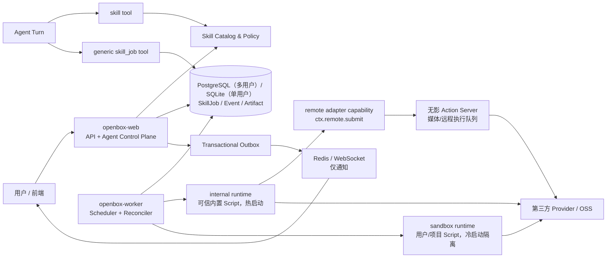
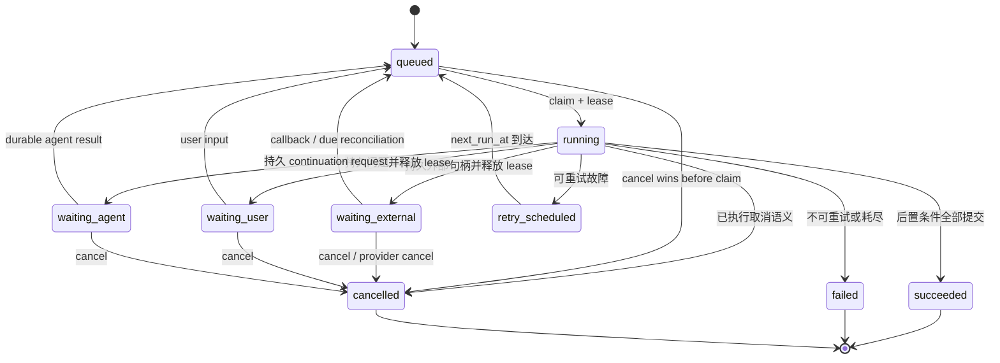

# OpenBox 通用 Skill Script 作业运行时整体改建规划

> 文档状态：Architecture / Execution Plan v2（已吸收 2026-08-28 对 OpenBox / codex / opencode / symphony 的逐条源码核对与评审意见）<br>
> 实施进度（2026-08-28）：PR#0–17 已落地——止血（`e0bc0b0`）、通用 Runtime 底座与
> Worker（PR#1–7）、Manifest/设置/API/工具/demo（PR#8–13）、web+mobile Job Card 与
> 聊天回执（PR#11/§8.3）、视频四操作迁移（PR#14–17，灰度闸 `SKILL_JOBS_VIDEO_WRITE`
> 默认关）。待办：PR#18 sandbox runtime（里程碑 C）、PR#19 旧工具删除（灰度完成且
> 旧 Job 清零后）、PR#20 生产加固；无影链路已对 dev 桌面实测线协议。<br>
> 2026-08-28 补充源码审计已收紧：operator-only hold、Turn 内 wait 预算、Session
> 删除副作用的租户归属、视频领域 helper 的属主检查、sandbox 资源名/PVC/Service
> 归属、备份前缀及 K8s adoption RBAC、Redis 订阅断线自恢复，以及 Session 删除后
> continuation 取消的持久重试入口；这些改动尚未替代 Phase 6/7 的验收与演练。<br>
> 编写日期：2026-08-28<br>
> 适用范围：OpenBox Agent、Skill、Script、异步作业、多用户运行与无影执行节点<br>
> 首个迁移样例：`video-production`，但视频不是平台核心抽象<br>
> OpenBox 审计基线：`619a34cb4f5ab8e0201d35f39521ec7927af63a6`

## 0. 结论先行

OpenBox 当前最根本的问题不是“视频状态写错了”，而是把三种本应独立的生命周期混在了一起：

1. **Agent Session / Turn**：模型当前这一轮是否仍在推理和调用工具。
2. **Skill Script Job**：一个脚本作业是否仍在排队、执行、等待外部服务、等待用户、重试或收尾。
3. **业务对象**：例如视频 Production / Segment，或者未来的数据导入、发布、爬取、编译等业务流程处于什么阶段。

模型返回 `stop` 只能证明本轮 Turn 结束，不能证明用户目标完成，更不能证明一个外部作业已经结束。反过来，一个视频已经由供应商生成，也不代表成片下载、OSS 入库、质检、渲染和附件交付已经完成。

本次改建的核心决策如下：

- 视频从平台核心工具注册表中移出，改为一个**可禁用的内置 Skill + 内部 Script 包**。
- 平台核心只提供通用的 `SkillJob` 能力，不理解视频、字幕、Seedance、STT 或渲染。
- Skill 仍负责给 Agent 注入说明、资源和可用操作；Script 负责确定性执行、持久状态、重试、取消和恢复。
- `SkillJob` 以 PostgreSQL 为唯一事实来源；Redis / WebSocket 只用于唤醒和加速展示。
- Runtime 只有两种：内置可信 Script 使用常驻、热启动的 `internal` worker；用户或项目 Skill Script 使用隔离、可冷启动的 `sandbox` runtime。无影等专用节点不是第三种 runtime，而是 internal handler 经 `remote` adapter capability 委托的执行资源。
- Web 与 Worker 使用**同一份代码和同一个镜像**，但生产环境以不同进程运行。开发环境可以嵌入 Worker，协议和数据库语义不能分叉。
- 多用户共享 Worker 池，但代码、作业、密钥、配额、日志、产物和事件全部按租户隔离。
- Agent 停止、Session 变为 `idle`、浏览器断线或 API 进程重启，都不应取消一个已被可靠接纳的 Skill Job。
- Todo / Plan 只用于展示和推理规划，永远不作为调度器或完成判据。
- 单用户模式（无 `JWT_SECRET`）现在也无条件初始化本地 SQLite 事实源；关闭 Skill Job 灰度开关不能顺带关闭 Session / Project 所依赖的 SQL 引擎。
- 新 Runtime 建成之前，先对现有视频 finalize 中断丢失做最小止血（Phase 0.5），线上问题不等整个改建完成。

不建议先造一个包揽所有概念的 `WorkItem`。本期先把 `Agent Turn`、`SkillJob` 和业务对象分开；未来确实需要“跨多个 Turn 持续推理”时，再独立增加 `AgentGoal`，由它观察一个或多个 Skill Job，而不是让 Skill Job 伪装成 Agent Goal。

### 0.1 范围与非目标

本规划负责建立通用 Skill Script 执行面，并以视频链路验证它。以下做法明确不在目标内：

- 不通过“Todo 未完成就强迫 Agent 继续”修复生命周期；
- 不把视频 Production、Segment 或供应商状态提升为平台通用实体；
- 不让不可信用户代码进入常驻 internal Worker；
- 不把 Redis、WebSocket、内存 Task 或无影节点 SQLite 当作平台 Job 总账；
- 不要求一个 Agent Turn 一直存活到外部任务终态；
- 不在迁移早期同时执行新旧两个付费提交路径；
- 不在本期强制重写现有 Cron 产品功能，首期只复用并抽取其可靠调度经验；
- 不引入 Temporal 等外部 workflow 引擎，理由见 3.5 节。

---

## 1. 背景与问题定义

### 1.1 直接暴露出来的现象

最近视频任务出现了以下组合现象：

- Agent 的计划尚未全部 `done`，但 Agent Loop 已经结束。
- 视频供应商侧已经返回了输出，界面或工具卡仍显示 `processing`。
- Agent 为了等待外部生成，多次调用状态工具或在单个 Tool Call 内长轮询。
- Session 已变为 `idle`，用户却无法判断后台作业究竟仍在运行、已经完成、正在收尾，还是已经失去执行者。
- 失败后既担心重复付费，又缺少一个不依赖 Agent 继续运行的恢复者。

这些现象不是“计划工具没管住模型”这么简单，而是完成语义和状态所有权没有被清楚建模。

### 1.2 当前代码中的根因

#### A. Agent Turn 被误当成完整任务

[`backend/agent/loop.py`](../backend/agent/loop.py) 在模型返回 `finish_reason == "stop"` 时结束循环，随后把 Session 设置为 `IDLE`。代码已经明确注明 Todo 是展示和规划数据，不是调度器；这条判断本身是正确的。

真正缺失的是 Turn 外层的、独立且持久的作业状态。现在只有两种错误选择：

- 让 Todo 强行续跑 Agent，容易制造假用户消息、死循环和额外 Token 消耗；
- 接受 Agent 正常结束，但没有另外的作业控制面接管外部任务。

#### B. Tool Call 同时承担“提交、轮询、恢复、收尾”

[`backend/tool/video_production.py`](../backend/tool/video_production.py) 同时包含供应商提交、状态查询、长轮询、取消、下载、OSS 入库和失败恢复。`wait` 路径会在 Tool Call 内睡眠并反复查询。

后果是：

- Agent Turn 的存活时间被外部服务延迟绑架；
- Tool Call 中断后，谁继续轮询没有稳定答案；
- 页面展示的是 Tool Part、业务对象还是外部任务状态，容易混淆；
- 重启、滚动发布、网络超时都可能把一个仍有效的外部任务变成“无人认领”。

#### C. API 进程承担了不应承担的后台所有权

[`backend/api/sessions.py`](../backend/api/sessions.py) 使用 `asyncio.create_task` 和进程内 `_background_tasks` 启动 Agent Loop。进程退出时这些任务不能恢复，也不能被其他副本可靠接管。实际情况比"不能恢复"更严重：[`backend/main.py`](../backend/main.py) 关停时会对活跃 Session 执行 `abort_all()`，并把仍为 `busy` 的 Session 直接改判为 `error`——每次滚动发布都在主动杀死正在 inline finalize 的视频任务，而不只是被动丢失。

现有 Cron 已经实现了条件更新 claim、并发限制和启动恢复的一部分思想，但 Cron Scheduler 仍随 API lifespan 启动，尚不是一个独立的、通用作业运行时。

#### D. 视频领域进入了平台核心注册表

[`backend/tool/registry.py`](../backend/tool/registry.py) 直接导入并注册 `video_identity`、`video_project`、`video_generate`、`video_transcribe` 和 `video_render`。即使工具 Schema 只在 Skill 加载后暴露，平台核心仍然在编译、启动和测试层面理解视频领域。

这会导致每新增一种复杂 Skill，都继续扩张核心工具、Agent Loop 分支和前端专用状态，最终变成无法演进的领域集合。

#### E. 现有 Skill 是“说明注入”，不是“可靠执行协议”

[`backend/skill/skill.py`](../backend/skill/skill.py) 和 [`backend/tool/skill_tool.py`](../backend/tool/skill_tool.py) 已能发现 Skill、注入内容、列出资源并按 Skill 激活工具，但没有统一描述：

- Script 在哪里运行；
- 是否可信；
- 是否允许共享热 Worker；
- 输入输出 Schema；
- 如何 checkpoint；
- 如何等待外部事件；
- 如何恢复、重试和取消；
- 如何绑定用户、密钥、配额和产物。

当前 `video-production/SKILL.md` 仍要求 Agent 自己驱动十阶段流程并等待任务，这正是 Agent 与执行脚本纠缠的地方。

#### F. “视频已出来但仍 processing”缺少精确状态

`video_jobs.status` 是无枚举约束的自由字符串（`String(24)`），实际取值包括 `submitting`、`finalizing`、`transcribing`、`dispatch_unknown`、`transfer_failed` 等，UI 把中间态统一概括为"处理中"。供应商完成、下载中、资产校验、OSS 上传、业务表更新、附件写入之间没有可区分的持久状态。如果某一步完成后进程退出，页面只看到一个旧状态，无法区分：

- 供应商仍在生成；
- 供应商已完成，平台正在接收结果；
- 结果已入库，业务对象未提交；
- 数据已提交，事件没有送到前端；
- Worker 已丢失，需要重新 claim。

目标架构必须用显式 `status + phase + checkpoint` 表达这些情况。

### 1.3 已经存在、应当复用的资产

OpenBox 并不是从零开始：

- [`backend/db/models/video_job.py`](../backend/db/models/video_job.py) 已具备用户范围的幂等键、`request_hash`、供应商任务 ID、沙箱任务 ID、状态、结果和输出资产，可直接支撑"相同键不同请求返回冲突"的语义。
- [`backend/db/models/video_production.py`](../backend/db/models/video_production.py) 已把 Production、Segment 和审批建成持久业务对象。
- [`container/media_jobs.py`](../container/media_jobs.py) 已有本地 SQLite 队列、owner、幂等、重启后重新入队、取消、子进程清理和并发边界。
- [`backend/cron/timer.py`](../backend/cron/timer.py) 已有条件 UPDATE claim（注释明确以单语句写入保证双副本安全）、过期运行标记回收、按用户并发限制和 watchdog 自愈；[`backend/cron/reaper.py`](../backend/cron/reaper.py) 与 [`backend/cron/warmup.py`](../backend/cron/warmup.py) 是现成的过期清理与保活模式。
- [`backend/cron/recovery.py`](../backend/cron/recovery.py) 已有启动恢复思路（清 stuck 标记、中断运行改判、漏跑重放）。
- [`backend/db/models/user_skill.py`](../backend/db/models/user_skill.py) 与 Skill Library 已有用户所有权、发布快照和安装来源。
- Redis Bus 与 WebSocket 已能做跨进程通知，但不能作为事实来源。
- 现有视频三条链路运行位置并不同构：generate 在后端进程内直连供应商（`sandbox_required=False`），transcribe 与 render 走沙箱/无影（`sandbox_required=True`）。迁移到统一 Job 协议时三者的路径和风险不同，不能按同一套改法套用。

改建应抽取这些机制，而不是继续为每个领域复制一套状态机。

---

## 2. 概念边界与完成语义

### 2.1 四层对象

| 层 | 对象 | 唯一含义 | 不能代表什么 |
|---|---|---|---|
| 对话层 | Session / Turn / Message / Tool Part | 模型这一轮是否在运行、输出了什么 | 外部 Script Job 是否完成 |
| 目标层（可选、后续） | AgentGoal | 需要跨多个 Turn 持续推理的用户目标 | 某个供应商任务的运行锁 |
| 执行层 | SkillJob / Attempt | Script 的可靠接纳、调度、等待、恢复、取消与结果 | 视频 Production 是否通过业务质检 |
| 领域层 | Production / Segment / Import / Deployment 等 | 业务特有的阶段和约束 | Agent 是否正在思考 |

### 2.2 必须成立的语义

- `Turn completed`：这一轮模型已结束。
- `Session idle`：当前没有 LLM Turn 占用该 Session。
- `SkillJob waiting_external`：没有 Worker 被长期占用；外部句柄和下次检查时间已持久化。
- `SkillJob succeeded`：该操作声明的所有后置条件已经原子提交或可由事务性事件重放。
- `业务对象 completed`：由该 Skill 自己定义，核心平台不解释。
- `Todo completed`：只表示 Agent 的计划展示，不触发任何资源释放、重试或状态结算。

因此，Session 可以是 `idle`，同时有三个仍在运行或等待的 Skill Job；这不是异常，前端必须并列展示。

### 2.3 完成判据必须由事实来源证明

每个 Operation Manifest 必须声明完成条件。例如视频段生成可定义为：

1. 供应商任务状态为成功；
2. 输出已经下载并校验；
3. OSS `FileAsset.status == ready`；
4. Segment 指向该资产；
5. Job 结果和 `job.succeeded` 事件在同一事务中落库。

仅看到供应商 URL、仅看到 MP4 文件、仅看到 Agent 的“已完成”文本，都不足以把 Job 标记为 `succeeded`。

---

## 3. 参考源码研究

本节区分“可采用的语义”与“不能直接照搬的实现”。本地参考仓库是阅读快照，不会成为 OpenBox 的运行时依赖。

### 3.1 OpenAI Codex

参考快照：`openai/codex` commit `7d6f808b97e424da80271be8cc539e8c5437a229`（2026-08-28）。

#### 值得采用

1. **Thread / Turn / Item 分层**

   [`codex-rs/app-server/README.md`](../../codex/codex-rs/app-server/README.md) 明确把 `turn/completed` 定义为 Turn 结束，而不是整个用户目标结束。OpenBox 应同样避免把 Session idle 解释成后台工作完成。

2. **持久 Goal 与 Turn 解耦**

   [`continuation.md`](../../codex/codex-rs/ext/goal/templates/goals/continuation.md) 把目标保留在多个 Turn 之间，要求按权威状态做 completion audit；[`runtime.rs`](../../codex/codex-rs/ext/goal/src/runtime.rs) 在 Thread idle 时读取持久 Goal 并尝试启动下一 Turn；[`0001_thread_goals.sql`](../../codex/codex-rs/state/goals_migrations/0001_thread_goals.sql) 将 Goal 状态单独持久化。

3. **防止陈旧执行者结算新状态**

   Codex Goal 更新使用 `expected_goal_id` 进行条件更新。OpenBox 的 Job Worker 应采用更强的 lease token / fencing version，所有进度和终态更新都必须携带本次 claim 的 token。

4. **持久 Follow-up Queue**

   [`ext/queue/src/service.rs`](../../codex/codex-rs/ext/queue/src/service.rs) 把后续输入持久化，并只在 Thread idle 时启动。OpenBox 可用同样思想实现幂等的 `session_inbox`，但只在 Job 明确返回 `needs_agent` 时唤醒 Agent。

5. **Skill 是说明和资源包**

   [`codex-rs/skills/src/invocation.rs`](../../codex/codex-rs/skills/src/invocation.rs) 能识别 Skill 下的脚本执行，但脚本仍通过执行环境运行。这个边界支持本规划：Skill 本身不是后台作业引擎。

6. **自主续跑必须带熔断**

   Codex Goal 为每个目标设 `token_budget`，达到阈值自动转 `budget_limited`；Turn 出错自动转 `Blocked`，代码注释明确写着这是为了防止 automatic continuation 循环烧 Token。未来 OpenBox 的 `AgentGoal`（8.4 节）必须照搬这两道熔断：预算上限 + 错误熔断，缺一不可。

#### 不能直接照搬

- Codex Goal 解决“Agent 跨 Turn 继续做事”，不能拿来替代供应商作业、下载、渲染或队列。
- App Server 的队列是 Thread 输入队列，不是多租户 Worker Queue。
- 部分 approval / user-input 等运行句柄仍可能是进程内状态；它不是现成的分布式工作流引擎。
- 让 Goal 一直自动启动模型去轮询视频，会浪费 Token，也无法解决幂等提交和 Worker 崩溃窗口。
- Codex 中 queue 优先于 goal 的 idle 竞争顺序来自扩展注册顺序这一隐式约定。OpenBox 的多种唤醒源（用户输入、job continuation、未来的 goal）之间的优先级必须是显式 policy，不能靠注册顺序。

官方语义参考：[Codex App Server](https://learn.chatgpt.com/docs/app-server)、[Long-running work](https://learn.chatgpt.com/docs/long-running-work)、[Codex as a platform](https://developers.openai.com/blog/codex-as-a-platform)。

### 3.2 OpenCode

参考快照：`anomalyco/opencode` commit `fc80874f45a595ff6874a4d36b1090f6a64424d2`（2026-08-20）。

#### 值得采用

1. **先持久接纳，再发 wake**

   [`packages/core/src/session.ts`](../../opencode/packages/core/src/session.ts) 的 V2 `prompt` 先调用 `SessionInput.admit`，再调用 `execution.wake`。即使 wake 丢失，输入仍在数据库。OpenBox 的 `SkillJob.start` 必须同样先提交 Job 和 Event，再尝试唤醒 Worker。

2. **幂等重试与冲突检测**

   [`packages/core/src/session/input.ts`](../../opencode/packages/core/src/session/input.ts) 用稳定 message ID 重放；相同 ID 但不同 payload 被判定为冲突。OpenBox 需要 `(user, skill, operation, idempotency_key)` 唯一约束，同时保存 `request_hash`。

3. **`steer` 与 `queue` 是显式语义**

   当前输入要影响正在运行的 Turn，还是排到下一 Turn，不靠时序猜测。OpenBox 对 Job 同样要区分 `signal`、`cancel`、`resume` 和新 Job，不能把用户新消息隐式解释成作业控制。

4. **同一 Session 串行、不同 Session 并行**

   [`packages/core/src/session/execution/local.ts`](../../opencode/packages/core/src/session/execution/local.ts) 和 run coordinator 对同一 Session 合并 wake。OpenBox 可把这个模式用于每个 Job 的单活执行，但所有权必须升级为数据库 lease。

5. **工具注册与权限过滤**

   [`packages/core/src/tool/registry.ts`](../../opencode/packages/core/src/tool/registry.ts) 先按 Location 聚合工具，再按权限 materialize。注意其 materialize 只剔除被整体 deny 的工具，细粒度授权发生在执行期 `permission.assert`。OpenBox 应让 Skill 加载后只暴露该 Skill 声明的通用 Operation，且服务端执行期授权是必须项，不是补充项。

6. **先记录 Tool Call，再执行副作用**

   [`packages/core/src/session/runner/llm.ts`](../../opencode/packages/core/src/session/runner/llm.ts) 明确在副作用前记录调用并持久结算结果。OpenBox 的 Skill Job 必须先有 durable intent，才能调用外部供应商。

7. **明确承认 BackgroundJob 的局限**

   [`packages/core/src/background-job.ts`](../../opencode/packages/core/src/background-job.ts) 明确声明当前注册表是 process-local、非持久，重启会丢状态；远程观察和恢复需要另一套持久所有权设计。这正是 OpenBox 不能继续依赖 `asyncio.create_task` 的证据。

#### 不能直接照搬

- OpenCode V2 源码仍把 durable multi-node ownership、持久 busy/retry/terminal 状态和 continuation recovery 列为未完成项。
- BackgroundJob 适合本地体验，不适合 OpenBox 的多用户生产作业。
- V1 [`session/status.ts`](../../opencode/packages/opencode/src/session/status.ts) 和 [`run-state.ts`](../../opencode/packages/opencode/src/session/run-state.ts) 仍用进程内 Map 管理 runner/status。
- Todo 表持久化不等于调度语义；[`session/todo.ts`](../../opencode/packages/opencode/src/session/todo.ts) 只是计划数据。

### 3.3 OpenAI Symphony

参考快照：`openai/symphony` commit `8001b52e3062495a16e520e4ceaf8f9de868c4d0`（2026-08-12）。

#### 值得采用

1. **Worker 正常退出不代表工作项完成**

   [`SPEC.md`](../../symphony/SPEC.md) 明确区分 Unclaimed、Claimed、Running、RetryQueued 和 Released，并规定正常 Agent Turn 完成后重新查询 Tracker；Tracker 仍 active 就在同一 Thread 继续。

2. **外部事实源 + reconciliation**

   [`agent_runner.ex`](../../symphony/elixir/lib/symphony_elixir/agent_runner.ex) 每次 Turn 后重新读取 Issue 状态；Orchestrator 定期做 active refresh、stall detection 和 retry。这一原则应映射为：OpenBox 的 Job DB 和外部 provider handle 是事实源，不能相信内存中的 coroutine。

3. **正常续作与异常重试分开**

   正常结束用短延迟重新检查，失败用指数退避。OpenBox 也应区分 `waiting_external` 的计划性检查与 `retry_scheduled` 的故障重试。

4. **"需要人工输入"不是故障**

   Symphony 把等待操作员输入的任务单独分类为 blocked，而不是进入 retry / restart。映射到本方案：Reconciler 永远不能把 `waiting_user` 当作故障重试，等待用户只受 TTL 约束（见 7.3 节）。

#### 不能直接照搬

- Symphony 当前 Orchestrator 状态主要在单个 GenServer 内存中，规范也明确说明 retry timer 和运行会话不会在重启后恢复。
- 它可以依赖 Issue Tracker 重新发现工作；OpenBox 的内部 Script Job 没有这样的外部总账，必须由 PostgreSQL 自己持久化调度状态。
- 它面向代码 Agent 工作项，不直接解决多租户密钥、产物、付费供应商幂等和用户级配额。

### 3.4 参考结论矩阵

| 机制 | Codex | OpenCode | Symphony | OpenBox 决策 |
|---|---|---|---|---|
| Turn 与目标分离 | Goal | Session V2 尚未完整覆盖 Goal | Tracker Issue | 采用；AgentGoal 与 SkillJob 继续分离 |
| 先持久再唤醒 | Queue / Goal state | Prompt admission → wake | Claim 后启动 worker | 采用事务 Job + Outbox |
| 同一对象单活 | Thread idle gate | Local coordinator | Claimed set | 升级为 DB lease + fencing |
| 后台执行恢复 | 不是 Skill Script Job | 明确未实现 durable BackgroundJob | 重新轮询 Tracker | PostgreSQL Job 为事实源，独立 Worker 恢复 |
| Skill 定位 | 说明/资源/脚本 | 说明/资源、Location scoped | Workflow prompt | Skill Manifest + Script Runtime |
| Todo 语义 | 计划展示 | 计划展示 | 无关 | 绝不作为调度器 |

### 3.5 为什么自研而不是引入现成作业引擎

本方案实质上是在自建一个 durable job runtime，必须正面回答"为什么不用现成的"：

- **Temporal**：语义最完整，但自托管运维负担重；多租户公平调度、按用户配额、capability 模型都要在其之上重做；sandbox / 无影执行面仍需自研 adapter。引入它省下的是本方案里最小的部分（claim/retry/timer），换来的是最大的一个运维依赖。
- **Hatchet / procrastinate / pgqueuer**（PostgreSQL 系任务队列）：有队列与重试，但没有本方案需要的 checkpoint + `WaitExternal` / `WaitUser` 等待语义、Manifest 能力上限和沙箱隔离；且多数不支持 SQLite，单用户形态直接不可用。
- **DBOS**：durable workflow 在进程内执行，与"不可信用户代码必须隔离在 sandbox"直接冲突。
- **Celery / arq**：只有 at-least-once 任务投递，无持久状态机与恢复语义，等于还要再造一层。

真正的难点——多租户能力模型、Skill Manifest、沙箱与远程执行、与 Session/Tool 体系的集成——在任何现成引擎上都要重写；而调度内核（claim、lease、retry、outbox）是小而清晰的部分，且仓库里已有 cron 验证过的条件 UPDATE 抢占模式可以直接抽取。因此结论是自研薄内核、复用已验证模式。

附带一个简化机会：单副本 / 自托管形态的 Worker 唤醒可以用 PostgreSQL 自带的 LISTEN/NOTIFY，把 Redis 的必要性压缩到多副本 WebSocket 扇出；周期 due scan 仍是正确性兜底。

---

## 4. 目标架构

### 4.1 总体结构



### 4.2 控制面与数据面

**控制面（openbox-web）**：

- 鉴权、租户解析；
- Skill 发现、启停和 Manifest 校验；
- 创建、查询、取消、恢复 Skill Job；
- Agent Session / Turn；
- Job 卡片和事件订阅；
- 不持有长时间外部轮询 coroutine。

**数据面（openbox-worker）**：

- claim 可运行 Job；
- 加载受信内置 handler 或调用 sandbox runtime；internal handler 可经 remote adapter 委托专用节点；
- 心跳、checkpoint、退避、取消和恢复；
- 写入结果、产物引用和事务事件；
- 定期 reconciliation。

### 4.3 同一镜像、不同进程

内置 Script “和运行代码一起编译启动”应解释为：

- 代码随 OpenBox backend 镜像构建；
- Manifest 与 handler 映射在构建时校验；
- Worker 启动时一次性 import 内置 handler，保持依赖和连接池热状态；
- API 进程只读取 Manifest，不直接执行 handler；
- 线上用同一 image digest 启动至少两个 role：

```text
openbox-web     -> python -m main
openbox-worker  -> python -m skill_runtime.worker_main --queues default,media-control
```

`--queues` 列的是调度资源池（`queue_name`），不是 runtime 名：queue 决定"哪个 Worker、多大并发额度来跑"，`runtime_kind` 决定"以什么方式执行"，二者正交，不能混用同一套命名。

本地单用户开发设置 `SKILL_WORKER_MODE=embedded`，在 Web lifespan 中启动一个 Worker，
并复用完全相同的 Repository、claim、lease 和 handler 协议。单用户 SQLite 是 Web
进程工作目录中的本地文件，独立 `worker_main` 会拒绝这种拓扑，避免两个容器各建一份
互不可见的总账。生产环境使用 PostgreSQL + standalone Worker，禁止 embedded，避免
滚动发布杀死全部作业执行者。

**单用户模式必须有同语义事实源**：原实现无 `JWT_SECRET` 时 [`backend/main.py`](../backend/main.py) 完全不初始化 SQL 引擎。当前实现由 API 启动路径无条件初始化本地 SQLite（不受 Skill Job 功能开关影响）；需要执行作业时再启用 embedded worker，并继续复用同一套条件 UPDATE claim、lease 和 Repository 语义。

### 4.4 两类 Runtime 与 remote adapter

| Runtime | 代码来源 | 启动方式 | 信任级别 | 主要场景 |
|---|---|---|---|---|
| `internal` | OpenBox 构建镜像中的签名 allowlist | 常驻 Worker 内热调用 | 高，但仍受 JobContext 限权 | 内置视频、资源处理、平台自带集成 |
| `sandbox` | 用户安装 / 项目 Skill 包 | 用户沙箱内按需冷启动 | 不可信 | 用户脚本、项目自动化、社区 Skill |

**Runtime 只有这两种。** 无影媒体节点、GPU 等专用执行机不是第三种 runtime，而是 internal handler 经 `remote` adapter capability（`ctx.remote.submit`，见 9.2 节）委托的执行资源：Worker 发起短请求、把远程句柄写入 checkpoint、返回 `WaitExternal`；节点并发用 queue 额度约束。这样"handler 代码在哪执行"（runtime）与"handler 委托了谁"（capability）不再是两个互相重叠的概念。

禁止用户上传的 Manifest 选择 `internal`，也禁止数据库中任意字符串作为 Python import path。`internal` entrypoint 只能来自构建产物中的静态 Registry；`remote` adapter 同为构建产物中的静态 allowlist。

### 4.5 与现有 Cron 的关系

Cron 触发的是 Agent Turn，SkillJob 执行的是 Script，两者不合并。但 claim、看门狗、启动恢复、过期清理这些原语应当抽成共享调度内核（落位见 13 节），`cron/` 与 `skill_runtime/` 共用，而不是各自维护一套渐行渐远的实现。首期允许 Cron 保持现状、只提取公共原语；Cron 是否最终改用同一内核，另行评审。

---

## 5. Skill 包与 Script 执行协议

### 5.1 Skill 包的两份契约

每个可执行 Skill 包含：

1. `SKILL.md`：给模型看的触发条件、工作流、何时调用哪个 operation、如何向用户解释结果。
2. `skill.yaml`：给平台看的机器契约，不进入普通模型上下文。

示例：

```yaml
apiVersion: openbox.ai/v1
kind: Skill
metadata:
  name: video-production
  version: 2.0.0
  displayName: 视频制作
spec:
  distribution: builtin
  defaultEnabled: true
  runtime:
    kind: internal
    handler: builtin.video_production
    handlerVersion: 2
  operations:
    generate_segments:
      inputSchema: references/generate-input.schema.json
      outputSchema: references/generate-output.schema.json
      queue: media-control
      invocationTimeoutSeconds: 120     # 单次 invocation 上限
      maxExternalWaitSeconds: 86400     # waiting_external 累计上限
      maxTotalSeconds: 172800           # Job 总期限，超过由 Reconciler 按 policy 终态
      userInputTimeoutSeconds: 259200   # waiting_user TTL
      maxAttempts: 8
    render:
      inputSchema: references/render-input.schema.json
      outputSchema: references/render-output.schema.json
      queue: media-control
      invocationTimeoutSeconds: 300
      maxExternalWaitSeconds: 86400
      maxTotalSeconds: 172800
      maxAttempts: 8
  phases:
    provider_generate: skill.video.phase.provider_generate
    asset_download: skill.video.phase.asset_download
    asset_publish: skill.video.phase.asset_publish
    domain_commit: skill.video.phase.domain_commit
    delivery: skill.video.phase.delivery
  capabilities:
    secrets: [seedance, stt]
    objectStorage: [read-user-assets, write-user-artifacts]
    remoteExecutors: [wuying-media]
    network: [seedance-provider, stt-provider]
  policy:
    billableOperations: [generate_segments]
    cancelOnSkillDisable: false
```

Manifest 安装时必须完成：Schema 校验、版本固定、入口 allowlist、权限上限合并、包 hash 记录和不兼容字段拒绝。

当前 internal rollout 只接收内联 `inputSchema` / `outputSchema`，并在 admission 时
固定输出契约；上例的包内相对引用由 Phase 6 package resolver 解析。在 resolver
落地前，字符串 `$ref` 必须 fail closed，不能把“尚未解析”误当成“无需校验”。Job
入参、后续 input、progress、checkpoint、result 和内联 Schema 都有独立 JSON 大小
上限，非法 JSON / NaN 不得进入总账。

超时是三层而不是一层：invocation 超时约束单次执行，`maxExternalWaitSeconds` 约束外部等待累计时长，`maxTotalSeconds` 是 Job 总期限（`waiting_user` 另有独立 TTL）。三者都由 Reconciler 强制执行，到期动作（failed / cancelled / operator review）由 policy 声明，不能只出现在告警清单里而 Schema 中没有对应字段。

`phases` 必须在 Manifest 中枚举并给出 i18n 标签键：web（frontend-v2）和 Flutter 移动端都要渲染 phase，且移动端 locale 与 web 逐字节同步，自由字符串无法本地化；前端遇到未知 phase 统一走 fallback 展示。

### 5.2 Handler 协议

内部和沙箱 Script 都实现相同的逻辑协议：每次 invocation 必须是**有界、可恢复的一步**，而不是在内存里等几个小时。

```python
async def run(ctx: JobContext, operation: str, payload: dict, checkpoint: dict) -> Outcome:
    ...
```

允许的 Outcome：

```python
Succeeded(result, artifacts=[])
WaitExternal(checkpoint, wake_at, external_handle=None, progress=None)
WaitUser(checkpoint, prompt, input_schema, expires_at=None)
NeedsAgent(checkpoint, reason, payload)
Retry(checkpoint, error_code, retry_at)
Failed(error_code, message, retryable=False)
Cancelled(result=None)
```

关键约束：

- sandbox handler 不接触任何平台数据库、用户 ID 参数或全局密钥；internal handler 允许经包内 repository 访问自己的领域表（如视频表），但连接/会话由不可伪造的 `JobContext` 提供，且禁止直接读写平台 Job 表——Job 状态只能通过返回 Outcome 改变。这与 11.1 节"只有内置包可以访问视频表"配套，二者不矛盾。
- `ctx.user_id`、`ctx.job_id`、权限和密钥范围来自服务端记录，忽略模型或 payload 中同名字段。
- Handler 在返回 `WaitExternal`、`WaitUser` 或 `NeedsAgent` 前必须给出足以恢复的 checkpoint。
- checkpoint 不允许包含明文 Secret、长期签名 URL 或大文件；只保存稳定 ID、阶段、hash 和 provider handle。
- 外部等待必须释放 Worker lease。到达 `wake_at`、收到 callback 或用户 signal 后重新入队。
- 状态读取、清理和既有任务 finalize 前使用 `ctx.assert_lease()`；创建新的 billable、远端或不可逆外部状态前必须使用 `ctx.may_start_external()`。后者在同一个 Job 行锁内同时校验 lease 与 `desired_state`，建立“取消已提交”与“允许启动副作用”的确定顺序；它仍须配合稳定 provider 幂等键处理门禁之后发生的晚到取消（见 7.4、10.2）。
- 大文件下载/上传必须切成多个 checkpoint 步骤，单次 invocation 不得依赖超过 `invocationTimeoutSeconds` 的连续传输。
- 简单短脚本可以一次返回 `Succeeded`；长任务必须使用 SDK Outcome 协议。

### 5.3 用户 / 项目 Skill 的冷启动

`sandbox` runtime 的标准路径：

1. Worker claim Job；
2. 确保该用户的沙箱可用；
3. 根据 Job 固定的 package hash / version 挂载或恢复 Skill 包；
4. 调用沙箱 Action Server 的通用 `/skill-jobs/invoke`，传入短期 capability token；
5. 沙箱内由 `openbox-skill-runner` 启动声明的相对 entrypoint；
6. 只接受符合 Outcome Schema 的返回；
7. Worker 把 Outcome 和 checkpoint 提交到平台 DB；
8. 进程退出，沙箱可按现有策略保温或回收。

沙箱不获得平台 DB、Redis、阿里云主账号或供应商 Secret。确实需要外部能力时，通过 capability-scoped broker / proxy 调用，或使用只对单个 OSS 对象有效的短期签名 URL。

对尚未迁移到 SDK 的传统脚本，可提供 `runtime: sandbox-ephemeral` 兼容模式，但必须明确标记：硬超时、进程重启不可恢复、不能用于付费或关键副作用。它不能被 UI 宣称为 durable Job。

### 5.4 内置 Script 的热启动

`internal` Worker 启动时：

- 从静态 `BuiltinHandlerRegistry` 加载 handler；
- 验证 Manifest handler version 与代码实现一致；
- 初始化可共享但无用户状态的 HTTP client、provider adapter 和连接池；
- 每次 invocation 创建独立 `JobContext` 和临时目录；
- invocation 结束后清理用户级内存引用；
- 不允许模块级变量缓存用户 token、输入或产物。

这既避免每个内置 Skill 都冷启动完整运行环境，也不会把长任务绑在 Web 请求或 Agent Turn 上。

---

## 6. 通用 SkillJob 数据模型

### 6.1 `skill_jobs`

建议字段：

| 字段 | 说明 |
|---|---|
| `id` | 稳定 Job ID，建议 UUIDv7 / ascending ID |
| `user_id` | 必填租户所有者 |
| `session_id` | 可空；用于来源与通知，不决定 Job 生死 |
| `project_id` | 可空；项目范围 |
| `skill_key` | 如 `builtin:video-production` 或安装快照 ID |
| `skill_version` / `package_sha256` | 固定执行代码版本 |
| `operation` | Manifest 中声明的操作 |
| `runtime_kind` / `queue_name` | internal / sandbox；queue 是资源池名，与 runtime 正交 |
| `status` | 通用状态机状态 |
| `phase` | Skill 定义的当前阶段，如 `provider_generate`、`asset_finalize` |
| `input_data` / `output_schema` | 已验证、去除 Secret 的输入；接纳时固定的成功输出契约 |
| `checkpoint_data` | 可恢复状态 |
| `progress_data` | 面向 UI 的结构化进度快照 |
| `result_data` | 终态结果 |
| `error_code` / `error_message` | 机器码与脱敏信息 |
| `idempotency_key` / `request_hash` | 幂等接纳与冲突判断；默认由服务端从 tool_call 派生（见 8.1），不信任模型自造 |
| `desired_state` | `run` 或 `cancel`，避免取消竞态 |
| `attempt_count` / `retry_count` / `max_attempts` | invocation 审计次数；消耗故障预算的失败次数；故障预算上限。正常外部轮询只增加 attempt，不消耗 retry |
| `next_run_at` / `deadline_at` | 下次可被 claim 的时间；Job 总期限（由 Manifest `maxTotalSeconds` 推导，Reconciler 强制执行） |
| `lease_owner` / `lease_token` / `lease_expires_at` | 分布式所有权与 fencing |
| `handler_version` / `image_digest` | 恢复和部署兼容证据 |
| 时间字段 | created / started / updated / completed |

必须有唯一约束：

```text
UNIQUE(user_id, skill_key, operation, idempotency_key)
```

再次提交相同键和相同 `request_hash` 返回原 Job；相同键但不同请求返回 `409 IdempotencyConflict`。

生产索引至少包括：

```text
(status, next_run_at, queue_name)
(user_id, created_at DESC)
(session_id, created_at DESC)
(lease_expires_at) WHERE status = 'running'
```

### 6.2 `skill_job_attempts`

每次 claim 新增一行，记录：

- job / user / attempt number；
- worker ID、queue、runtime、lease token；
- started / heartbeat / ended；
- outcome、错误码、执行时长、资源用量；
- provider request correlation ID；
- handler version / image digest。

Attempt 是审计和排错记录，Job 是用户看到的当前状态。

### 6.3 `skill_job_events` 与 Outbox

事件表按 Job 维护单调 `seq`：

- `job.created`
- `job.claimed`
- `job.progressed`
- `job.waiting_external`
- `job.waiting_user`
- `job.needs_agent`
- `job.retry_scheduled`
- `job.cancel_requested`
- `job.succeeded`
- `job.failed`
- `job.cancelled`

状态更新和事件插入必须在同一数据库事务。事件行同时带 `published_at`；Outbox Publisher 成功发 Redis / WS 后更新它。这样”DB 已完成但前端仍 processing”会通过重放自动修复。

Publisher 的归属和竞争要写死：Publisher 随 Worker 角色运行（embedded 模式随嵌入 Worker），API 进程只写事件不发布；多个 Publisher 扫描未发布事件必须用行级互斥（PostgreSQL 用 `SKIP LOCKED` 或 advisory lock）防止重复发布，并按 `(job_id, seq)` 保序。单副本形态可用 PostgreSQL LISTEN/NOTIFY 代替 Redis 做唤醒通道（3.5 节）。

高频进度不进事件表：轮询型 progress 只更新 `skill_jobs.progress_data`，事件只在 `status` 或 `phase` 变化时插入，防止轮询把事件表灌爆。终态 Job 的事件与 Attempt 设保留期（建议 90 天）后归档清理，migration 附带对应索引。

前端重连后先 GET 当前 Job snapshot，再以 `(job_id, seq)` 订阅增量。WebSocket 丢包只影响延迟，不影响正确性。
Redis Pub/Sub listener 必须在启动时 Redis 暂不可用、或运行中连接中断后自行重订阅；
不能让一次瞬时故障永久终止 API 副本的增量转发。Outbox 的 Redis 发布仍失败关闭并
保留未发布事件，snapshot 始终是恢复后的权威状态。

### 6.4 `skill_job_inputs`

用于用户回答、外部 callback、人工恢复和 Agent signal：

- `id`、`job_id`、`user_id`；
- `kind`：`user_answer` / `provider_callback` / `agent_result` / `operator_resume`；
- `source_event_id` / `idempotency_key`；
- `payload`、`created_at`、`consumed_at`。

唯一约束防止 callback 或双击重复消费。Input 只负责唤醒或向下一 invocation 提供数据，不直接绕过状态机修改 Job。

### 6.5 `skill_job_artifacts`

只保存 Job 与现有 `file_assets` 的关系：role、ordinal、metadata、created_at。`Succeeded` 结算必须在同一事务中确认每个声明的 FileAsset 都属于当前用户、未删除且已 `ready`；任一项不满足就以 handler 契约错误失败，不能丢弃坏引用后仍标成功。关系按 handler 声明顺序写入。对象存储 key 使用不可猜测的用户/Job 前缀，下载继续走短期签名 URL。

### 6.6 `user_skill_settings`

建议新增：

```text
PRIMARY KEY(user_id, skill_key)
enabled
settings_data
created_at / updated_at
```

- 没有记录时使用 Manifest `defaultEnabled`；
- 禁用后从 Agent 的可用 Skill 列表隐藏，并拒绝新 Job；
- 历史 Job 和 Artifact 仍可查看；
- 默认不取消已经接纳的 Job，用户可单独取消；
- 用户 Skill 卸载时，运行 Job 继续引用不可变 package snapshot，不能指向已经被替换的目录。

现有 `user_skills` / `skill_installs` 继续负责包所有权、发布快照和安装来源，不要再造一套重复的 Skill Library。

### 6.7 `session_inbox`

8.3 节的 `NeedsAgent` 续作依赖这张表，必须与其他表同期建模，不能只在文字里出现：

```text
id / session_id / user_id
kind                          # 首期只有 job_needs_agent
source_job_id / source_event_seq
payload                       # handler 给 Agent 的结构化上下文
status                        # pending / processing / consumed / expired
claim_token                   # dispatcher lease fencing；恢复后的旧进程不能结算新 claim
created_at / consumed_at
UNIQUE(source_job_id, source_event_seq)
```

- Session idle 时消费 pending 项启动下一 Turn；Session busy 时排队。
- Session 被删除或归档时，先撤销 processing claim；pending 行保留为取消重试标记，
  对应 Job 的取消意图提交成功或确认 Job 不存在后才标记 `expired`，不能永远悬空。
- 消费必须幂等：同一 `(source_job_id, source_event_seq)` 只触发一次 Turn。
- 每次 synthetic Turn 使用数据库唯一 marker；只接受该 marker 之后、下一条真实用户消息之前的 terminal assistant 文本。若用户中途打断，dispatcher 生成下一代 marker 重新排队，绝不能把用户后续会话的回答误写成 `agent_result`。自动 compaction 消息属于同一 Turn，但 summary 文本不算 continuation 结果。

---

## 7. Job 与 Attempt 状态机

### 7.1 Job 状态



禁止使用一个含义不清的长期 `processing` 状态。UI 展示可以用“处理中”，但底层必须能同时展示：

```text
status=waiting_external
phase=provider_generate
provider_state=running
next_check_at=...
```

或者：

```text
status=retry_scheduled
phase=asset_finalize
provider_state=succeeded
last_error=oss_timeout
```

### 7.2 Lease 与 fencing

claim 的 v1 实现建议直接采用 cron 已在双副本下验证过的**条件 UPDATE 抢占**（单语句 UPDATE 带 `rowcount == 1` 判定，见 [`backend/cron/timer.py`](../backend/cron/timer.py)），PostgreSQL 与 SQLite 通吃；`FOR UPDATE SKIP LOCKED` 批量 claim 作为 PostgreSQL 高吞吐优化在竞争变大后引入——当前全仓尚无 SKIP LOCKED 先例，不要把它当成第一步的前提。无论哪种实现，claim 都在同一事务内：

1. 选择 `status in (queued, retry_scheduled)` 且 `next_run_at <= now()` 的 Job；
2. 增加 `lease_token` / fencing version；
3. 设置 `lease_owner`、`lease_expires_at`、`status=running`；
4. 插入 Attempt 和 `job.claimed` 事件；
5. 提交后执行 handler。

所有 checkpoint、progress 和 terminal UPDATE 都附带：

```sql
WHERE id = :job_id
  AND status = 'running'
  AND lease_token = :claim_token
```

过期 Worker 即使恢复网络，也不能覆盖新 Worker 的结果。注意 fencing 只保护数据库写入：lease 时长必须远大于单个 invocation 步骤的最坏耗时；创建新外部状态前还必须调用 `ctx.may_start_external()`（5.2 节），原子检查 lease 和取消意图，否则僵尸 Worker 仍可能产生外部副作用。

单用户 / 开发 SQLite 跑单 Worker + 同一条件 UPDATE 路径；生产多副本只保证 PostgreSQL 路径。

### 7.3 心跳与恢复

- 只有正在执行一个有界 invocation 时才持有 lease 并心跳。
- `waiting_external`、`waiting_user`、`waiting_agent` 不持有 Worker。
- Reconciler 扫描过期 `running`：Attempt 标记 `lost`，Job 根据 policy 进入 `retry_scheduled` 或 `failed`。
- 对声明 `cancelRequiresHandler=true` 的 operation，重试预算耗尽、lease 丢失或总期限到达都不能直接伪造终态：Job 保留外部句柄，设置 `desired_state=cancel`，进入带 `x-operator-only` 的 reconciliation hold。只有管理员通过受限入口提交 `retry_reconciliation=true` 才再进行一次有界核对；普通用户输入不能解除该 hold。
- `waiting_user` 永远不被当作故障重试（参考 Symphony 的 blocked 分类，3.3 节）；它只受 Manifest `userInputTimeoutSeconds` 约束，到期按 policy 进入终态或 operator review。
- `waiting_external` 到期只重新排队做一次状态推进，不启动 Agent。
- provider callback 先幂等写 `skill_job_inputs`，再把 Job 唤醒为 `queued`。
- Worker wake 丢失不影响正确性；周期扫描必须最终发现 due Job。

### 7.4 取消语义

取消使用 `desired_state=cancel`，而不是只取消某个 asyncio task：

- 未 claim：事务内直接 `cancelled`；
- 正在 internal invocation：JobContext cancellation token + lease 检查；
- waiting external：handler 尝试 provider cancel，再按 provider 事实结算；
- remote：转发 cancel，仍由平台 Job 跟踪最终结果；
- 供应商已经不可逆成功时，保留 Artifact，并以明确 policy 决定 `succeeded` 或 `cancelled_with_output`。首期建议成功事实优先，同时记录 cancel race 事件。

取消与新外部调用的排序以 `ctx.may_start_external()` 为边界：若取消事务先提交，门禁返回 false，handler 不得启动新任务；若门禁先完成而取消随后到达，则属于晚到取消，handler 必须凭已持久化的 intent、稳定幂等键和 provider/remote 事实继续收敛，不能把它伪装成“从未提交”。

停止 Agent 不自动取消 Job。前端必须提供“停止回答”和“取消作业”两个不同动作。

---

## 8. 通用 Agent 接口

### 8.1 只新增一个通用工具

核心注册表只新增 `skill_job`，动作建议为：

```text
start   创建或幂等返回一个 Job
get     获取权威 snapshot
wait    最多等待 10-15 秒的事件；超时返回当前 snapshot
cancel  请求取消
resume  提交已验证的 user/operator input
result  获取终态结果和 Artifact
```

工具参数示意：

```json
{
  "action": "start",
  "skill": "video-production",
  "operation": "generate_segments",
  "input": {"production_id": "..."}
}
```

幂等键不信任模型：默认由服务端从 `(session_id, tool_call_id)` 派生——同一次工具调用被重放（结果丢失、流中断重试）不会产生第二个 Job；模型可另传显式领域键用于"再次运行"这类语义（12.3 节），但服务端派生键始终存在。Turn 级重试产生新 tool_call_id 属于新意图，由第二层领域幂等（10.1 节）兜底。

`start` 时服务端必须验证：

- Skill 对当前用户启用；
- 当前 Agent Turn 已加载该 Skill；
- operation 存在且允许；
- input 通过 Manifest Schema；
- runtime 由已安装快照决定，不能由模型覆盖；
- user/session/project 来自 `ToolContext`；
- billable operation 已有 Skill 私有审批证据。

`get` / `wait` / `cancel` / `result` / `resume` 只校验属主与可见性，**不要求该 Skill 在当前 Turn 已激活**——否则用户隔天回来问"我的视频怎么样了"，Agent 连查询都做不了。

`wait` 必须有服务端预算：每个 Turn 最多 2 次，超限直接返回终止性提示（"作业已后台化，请结束本轮回答"），而不是指望提示词约束模型不循环。当前 Agent Loop 在一轮开始时生成 `ToolContext.run_id`，同一轮跨多个 assistant step / compaction 复用它作为预算键，避免每个模型 step 都重新获得两次等待额度；该 run id 仍是进程内 Turn 身份，不等同于 8.3 节尚待 Phase 7 补齐的持久 Agent run token。

### 8.2 Tool Call 不再等完整作业

`start` 的成功条件是“Job 已可靠接纳”，不是“外部工作已经结束”。返回示例：

```text
job_id=job_...
status=waiting_external
phase=provider_generate
progress=3/5 segments submitted
background=true
```

Agent 可以立即结束 Turn。前端继续通过 Job Card 展示进度。只有用户明确要求同步等待，Agent 才能做一次有界 `wait`；不得循环 sleep/poll。

### 8.3 Job 终态与 Agent 的关系

普通完成不重新启动 Agent Turn，但**聊天时间线不能没有回执**：终态事件（succeeded / failed / cancelled）默认由平台向来源 Session 插入一条结构化系统消息（Job 卡片引用 + 结果摘要，不经过 LLM、零 Token 成本），加上通知和 Artifact 卡片。否则用户让 Agent 做视频，对话里永远等不到一句"做完了"，会话导出和回顾也缺失结果记录。是否额外让 Agent 生成一段自然语言总结，是可选产品开关，默认关闭。

只有 handler 返回 `NeedsAgent` 时，平台才：

1. 写入 `job.needs_agent`；
2. 幂等创建 `session_inbox` continuation（表定义见 6.7 节），键为 `(job_id, event_seq)`；
3. Session idle 时启动下一 Turn；Session busy 时排队；
4. Agent 处理后以结构化结果写 `skill_job_inputs`；
5. Job 重新入队。

`processing` claim 必须有心跳和 fencing token；恢复扫描只把超时 token 置换为新
claim，旧 dispatcher 即使稍后恢复也不能 heartbeat、消费 inbox 或覆盖新结果。
synthetic marker 同时承担 Turn 边界：已完整结束的旧 Turn 可复用，未完成且被真人
新消息打断的 Turn 必须换新 marker，结果提取不能跨越真人消息。
恢复 abandoned claim 时，只有原 reservation 时间戳仍有效，或 durable synthetic
marker 仍是最新用户消息边界，才允许把 Session 从 `busy/error` 释放为 `idle`；优雅
停机则主动归还 claim，避免每次发布留下一个完整的 stale timeout 窗口。
如果 Session 被删除或归属失配，`processing` claim 要先撤销 fencing token 并回到
不可路由的 `pending`；这个 pending 行在 `request_cancel` 成功前充当持久重试标记，
成功或确认 Job 不存在后才置为 `expired`。这样瞬时数据库故障不会留下永久卡在
`waiting_agent`、却再也没有 Session 可以接续的 Job。

这套 fencing 目前只覆盖 `NeedsAgent` dispatcher。普通用户触发的 Agent Turn 仍沿用
Session status + 进程内 abort，尚无持久 `run_token`；多 API 副本下的“最新 Turn
获胜”必须在 Phase 7 另行补齐，不能把 inbox 的 claim token 泛化成整个 Agent Loop
已经具备跨副本互斥。

`WaitUser` 的回答通道也要定一条正道：结构化输入默认走 Job Card 直写 `skill_job_inputs`（不经过 LLM）；用户在聊天里回答、由 Agent 调 `resume` 的路径只用于需要上下文理解的场景。两条路都以 `source_event_id` 去重，先到者生效。`operator_resume` 不属于用户回答：它只能经管理员鉴权的独立入口写入；共享 provider 账号下的远端任务 ID 是平台 capability，普通作业所有者不得注入或接管。

`x-operator-only` 还是持久状态机门禁，而不只是 API/UI 提示：普通 `wake_job`、lost-wake repair 和 provider callback 可以保存审计输入，但都不能把该 hold 自动改回 `queued`；只有验证通过的 `operator_resume` 能解除。否则一个晚到 callback 就可能绕过人工确认，重新进入具有外部副作用的 handler。

这借鉴 Codex Queue 和 OpenCode durable admission，但它只是连接两套状态机，不能把 Job 状态直接设成 Session 状态。

### 8.4 可选 AgentGoal

后续若用户明确要求“持续运行直到整体目标完成”，可增加独立 `AgentGoal`：

- 保存 objective、status、completion criteria；
- 在 Turn idle 时决定是否继续推理；
- 可以观察多个 Skill Job；
- completion 必须做事实审计；
- 必须自带熔断：每 Goal 的 Token / 时间预算 + Turn 出错自动 Blocked（照搬 Codex，见 3.1 节）；
- Goal 的停止、暂停或完成不直接伪造 Job 终态。

该能力参考 Codex Goal，但不应成为本次 Skill Runtime 上线的前置条件。

---

## 9. 多用户、安全与资源治理

### 9.1 租户隔离不变量

每个入口都必须满足：

- Job、Attempt、Event、Input、Artifact 都带 `user_id`；
- Repository 查询始终用 `(id, user_id)`，不能先按 ID 取再在 Python 判断；
- 可选启用 PostgreSQL RLS 作为第二道防线；
- WebSocket 事件按 user channel 发送，payload 不包含其他租户标识；
- 日志包含 hash / correlation ID，不记录 Prompt 中的敏感字段和 Secret；
- 临时目录使用 `/tmp/openbox-jobs/<user-hash>/<job-id>/<attempt>`，终态清理；
- OSS key 使用用户和 Job 范围，返回短期签名 URL；
- 缓存键必须包含 user、skill、version、operation。
- 删除、归档等入口必须先确认对象属主，再执行 Cron 解绑、sandbox release、通知等
  旁路副作用；旁路函数本身也要再次校验 user，不能依赖调用者“应该已经查过”。
- 内置领域 helper 同样必须接收并校验来自 `JobContext` 的 user：视频的 segment、
  transcript、render 和输出 FileAsset 更新不能只凭 checkpoint 中的业务 ID。

执行环境的资源名本身也不能被当成租户身份：Docker 名称使用“可读前缀 + 原始
`user_id` 哈希”；Kubernetes 为兼容平台既有的规范 ULID PVC 保留旧名称，其他身份
使用带哈希的有界名称。Pod、PVC、Service 每次复用都核验原始 owner/selector，旧
PVC 只有在现存 Pod 或规范 ULID 能证明归属时才补写 owner，名称碰撞一律 fail closed。
Pod/PVC legacy adoption 需要部署 Role 对 `pods` 与 `persistentvolumeclaims` 的 `patch`
权限；Service 的 409 复用必须验证 selector，不能把同名 Service 视作成功。

sandbox 的全局寿命不能由某个 API/Worker 进程内的 `session_ids` 引用计数决定：会话
释放只清本地绑定，不删除执行环境。WebSocket 空闲回收至少要从数据库确认该用户既无
活跃 Agent Session、也无非终态 SkillJob，并在每次破坏性操作前复核；生产 Phase 7
还应把“检查—删除”升级成跨副本的用户级资源 lease，彻底关闭新 Job admission 的
竞态窗口。Docker 与 K8s 一样在 API/Worker 启动时只做 reconcile；容器用原始 owner
标签和持久 `SESSION_API_KEY` 恢复路由，同名创建竞态复用胜者，禁止把另一个进程的
容器当作 orphan 强删。Web 进程滚动退出也不得调用 provider 全量 cleanup。

无影 `WuyingProvider` 当前把所有用户映射到同一台物理桌面。工作目录、队列
`owner`、请求头和 user hash 都只能防止误路由，无法阻止能执行任意代码的租户读取
同机其他目录或进程。因此该模式只允许用于单用户开发或互相信任的内部执行；生产
多用户必须为每个租户提供独立容器/虚拟机（或等价的强隔离执行环境），再由 remote
adapter 路由。平台 Job 的数据库租户过滤不能替代执行面的 OS 隔离。

### 9.2 JobContext 能力模型

JobContext 只暴露 Manifest 批准的能力：

- `secrets.get(alias)`：返回本次调用可用的短期凭据或代理；
- `assets.open(asset_id)`：强制校验用户所有权；
- `artifacts.create(...)`：只能写该用户的 Job 前缀；
- `providers.call(alias, ...)`：经过 timeout、审计和配额；
- `remote.submit(alias, ...)`：只允许 Manifest 指定 executor；
- `progress(...)`、`checkpoint(...)`、`is_cancel_requested()`。

Handler 不允许读取 Web 进程全局用户状态，也不允许自己从 payload 选择别人的用户或资产。

### 9.3 公平调度与配额

共享 Worker 池至少实施：

- 全局 queue 并发；
- 每用户并发；
- 每 Skill / Operation 并发；
- provider 级 QPS / 并发；
- remote host 并发；
- 付费额度预留与结算；
- 最大排队数、最大输入和最大 Artifact 大小。

claim 不能简单按全局 created_at 永远取最早任务，否则大用户可饿死其他用户。首期（Phase 2）只做两层硬上限：全局 queue 并发 + 每用户并发（cron 已有同款实现，直接复用模式）；用户分片公平轮转或 `tenant_virtual_finish` 加权调度是后续项，等真实负载出现倾斜再上。优先级只能由服务器 policy 决定，不能信任用户 payload。

当前 PostgreSQL claim 对每个 queue 使用事务级 advisory lock，把 `running` 计数与
条件 claim 串行化；因此 `SKILL_WORKER_CONCURRENCY` 是同 queue 多副本共享的上限，
不是“每个 Pod 各自这么多”。所有消费同一 queue 的 Worker 必须部署相同上限；SQLite
仍只支持单 Worker。每用户上限在同一事务中使用用户级 lock，且 lock 顺序固定为
queue 后 user，避免副本间死锁。

### 9.4 Skill 禁用、卸载和版本升级

- 禁用：阻止新 Job、从可用列表隐藏；默认让已接纳 Job继续，用户可取消。
- 卸载用户 Skill：若有非终态 Job，保留不可变执行快照；不得删除其唯一代码副本。
- 升级：新 Job 使用新版本；旧 Job 固定原 `package_sha256` 和 handler version。
- 内置部署：Worker 至少兼容 N 和 N-1 checkpoint；不能在仍有旧 Job 时直接删除旧 handler。
- Manifest 权限升级：必须显式重新授权，不能静默继承。

---

## 10. 外部副作用与故障窗口

### 10.1 付费或不可逆提交

每个付费提交采用两层幂等：

1. 平台 Job 幂等：防止重复创建同一操作；
2. Skill 领域幂等：例如 `production_id + segment_revision + operation`，防止重复收费。

标准流程：

1. 事务内保存 `phase=submit_intent`、请求 hash 和 provider idempotency key；
2. 提交事务；
3. 立即调用 `ctx.may_start_external()`，在 Job 行锁内确认当前 lease 有效且取消尚未提交；
4. 调用 provider；
5. 持久化 provider task ID；
6. 返回 `WaitExternal`。

如果第 3 步超时且不知道 provider 是否接收：

- 进入 `phase=submit_unknown`；
- 优先按 provider idempotency key 查询；
- provider 不支持查询时进入 `waiting_user` / operator review；
- 禁止盲目再次提交。

### 10.2 故障矩阵

| 崩溃点 | 恢复方式 | 禁止行为 |
|---|---|---|
| Job 事务提交后、wake 前 | 周期扫描发现 queued Job | 再创建一个 Job |
| claim 后、handler 前 | lease 过期，Attempt lost，重新 claim | 旧 Worker 结算新 lease |
| submit intent 后、provider 调用前 | 幂等重试同一个提交键 | 生成新付费键 |
| provider 接收后、task ID 落库前 | `submit_unknown` + provider lookup / 人工审计 | 盲目重提 |
| provider 成功后、下载前 | checkpoint task ID，重新进入 finalize | 重新生成内容 |
| OSS 上传后、业务表更新前 | 按 object key / checksum 幂等 finalize | 创建重复 Artifact |
| lease 过期但旧 Worker 仍存活并继续执行 | 创建新外部状态前 `ctx.may_start_external()`；新旧 Worker 复用同一 provider 幂等键；provider 无幂等能力则该 operation 禁自动重试、只走 `submit_unknown` | 用新键重复提交外部任务 |
| 外部任务仍可能存在但本地重试预算耗尽 | `cancelRequiresHandler` operation 进入 operator-only reconciliation hold，保留 handle 与 cancel intent；管理员核实后显式再推进 | 仅因本地预算耗尽就标记 failed/cancelled |
| Job 终态提交后、WS 发布前 | Outbox 重放 | 依靠前端旧状态回写 DB |
| cancel 与 provider success 竞态 | 以 provider 事实 + policy 原子结算并记录 race | 静默丢弃已付费结果 |

---

## 11. 视频 Skill 的迁移设计

视频只是第一个验证通用架构的内置 Skill，不在核心代码中出现任何视频分支。

### 11.1 目标包结构

```text
backend/builtin_skills/video_production/
  SKILL.md
  skill.yaml
  handlers.py
  repository.py
  provider.py
  workflow.py
  schemas/
  references/
```

首期可以继续使用现有 `video_productions`、`video_segments`、`video_approvals` 和 `video_jobs` 表，避免一次迁移所有领域数据；但只有该内置包可以访问它们。平台 Registry、Agent Loop、通用 API 和 Worker 不得 import 视频模块。

### 11.2 Operation 划分

建议至少提供：

- `production.create_or_update`
- `production.submit_approval`
- `segments.generate`
- `segments.transcribe`
- `production.render`
- `production.status`

核心只看到 operation 字符串和 Schema。是否收费、需要何种审批、如何计算 hash、Segment 如何修订，全部留在视频包内。

### 11.3 Job 推进示例

`segments.generate`：

1. 校验 Production / Segment / 审批与用户所有权；
2. 为每个 revision 固定领域幂等键；
3. 提交尚未提交的 Segment；
4. checkpoint provider task IDs；
5. 返回 `WaitExternal`；
6. 下一 invocation 查询所有 task；
7. 对已完成输出做幂等 OSS finalize；
8. 未完成则带退避再次 `WaitExternal`；
9. 全部后置条件完成后 `Succeeded`。

`segments.transcribe` 和 `production.render` 由 internal handler 经 `ctx.remote.submit` 委托无影 Action Server（4.4 节：remote 是 capability，不是第三种 runtime）。平台 SkillJob 是总账；[`container/media_jobs.py`](../container/media_jobs.py) 的 SQLite Job 是执行节点局部队列，remote job ID 只作为 checkpoint。无影节点重启后重新排队，平台 Reconciler 持续查询并最终收敛。注意 media_jobs 的 `owner` 语义是"桌面内队列所有者"，共享桌面阶段必须显式映射平台 `user_id`，但这仍然只是路由和账务归属，不是安全隔离；生产多用户执行必须遵守 9.1 节的每租户强隔离约束。

若转写 adapter 在“已发起请求但尚未持久化 provider handle”的窗口崩溃，平台不能根据时间阈值把 `transcribing` 重置并重新提交。该状态必须进入 operator review，由运维先核实远端确实没有任务，再用受限的 `operator_resume` 输入恢复；普通用户回答不能解除这类不确定性。

同步 STT 返回后必须先把 transcript 以 `transcript_ready` checkpoint 持久化，再做
相似度计算和业务表提交。后半段失败返回 `Retry`，只消耗本地故障预算并重试幂等
domain commit，不再计入 `waiting_external`，也绝不再次调用 STT；而 provider
超时且没有 handle 时继续保留 `transcribing` 并进入上述 operator review，不能把一次
不明确的收费调用降级成普通 `failed` 后允许盲目重提。

三条链路现状并不同构（1.3 节）：generate 目前在后端进程直连供应商，对应"internal handler 直连 provider"；transcribe / render 已走沙箱/无影，对应"internal handler + remote adapter"。迁移时不要假设三者可以套同一份实现，风险评估和灰度也应分开。

### 11.4 修复“视频已出来仍 processing”

迁移后状态会明确分为：

```text
provider_generate -> provider succeeded
asset_download     -> 下载/校验
asset_publish      -> OSS 与 FileAsset ready
domain_commit      -> Segment / Production 更新
delivery           -> Artifact / 附件事件
succeeded          -> Job 终态
```

供应商已出视频但 OSS 暂时失败时显示：

```text
status=retry_scheduled
phase=asset_publish
provider_state=succeeded
```

这既不会误报“仍在生成”，也不会在结果尚未交付时误报“全部完成”。恢复完全由 Worker 完成，不需要再次唤醒 Agent。

### 11.5 旧接口退出顺序

1. 先用新 Job Runtime 包装只读 status / reconciliation；
2. 新提交走 `skill_job`，旧 Tool 只读；
3. 对现存非终态 `video_jobs` 创建兼容 SkillJob 或由 compatibility reconciler 接管，保留原 provider / sandbox job ID；
4. 确认所有活跃旧 Job 收敛后，移除 Skill 指令中的 `wait` / 轮询步骤；
5. 从 [`backend/tool/registry.py`](../backend/tool/registry.py) 移除五个视频工具，只保留 `skill` 和通用 `skill_job`；
6. 最后删除旧提交入口和兼容 adapter。

切换期间允许双写状态，不允许“双执行提交”。Shadow 模式只能比较查询结果，不能同时调用两个 provider submit 路径。

---

## 12. API、事件与前端改造

### 12.1 API

建议端点：

```text
POST   /api/skill-jobs
GET    /api/skill-jobs?session_id=&status=&cursor=
GET    /api/skill-jobs/{id}
GET    /api/skill-jobs/{id}/events?after_seq=
POST   /api/skill-jobs/{id}/cancel
POST   /api/skill-jobs/{id}/inputs
GET    /api/skill-jobs/{id}/artifacts
PUT    /api/skills/{skill_key}/settings
POST   /api/skill-jobs/callbacks/{provider}   # 供应商 webhook：签名校验，无用户鉴权
```

每个 endpoint 从 auth context 获得用户，Repository 查询必须带 user 条件。callback 路由不走用户鉴权，靠 per-provider 签名（HMAC / token）校验后幂等写入 `skill_job_inputs(kind=provider_callback)` 并唤醒 Job。Worker 直连数据库，不经过用户 API；"内部 API"仅指沙箱 / 无影节点的回调与运维端点，与用户 API 分开，不共用可伪造的 owner 参数。

### 12.2 前端状态

前端需要从“一个 Session spinner”改为并列状态：

- Agent：`thinking / waiting_input / idle / error`；
- Jobs：每个 Job 独立卡片和阶段；
- Business object：Skill 自己的展示卡片；
- Notifications：后台完成、需要用户、失败、已取消。

Job Card 至少展示：Skill、operation、status、phase、进度、最后更新时间、是否可取消、Artifact 和错误恢复提示。phase 的展示文案来自 Manifest 声明的 i18n 标签键（5.1 节），未知 phase 走 fallback。

**落位目标是 `frontend-v2`**（feature-based，参照现有 `src/features/cron/` 的卡片模式），旧 `frontend/` 只保证不因新 API 报错；Flutter 移动端（`mobile/`）与 web 逐特性对照同步，Job Card / Job 列表 / 输入卡片必须有移动端对照实现，工期单独计入（14.1 节）。

页面刷新或 WebSocket 重连后，以 GET snapshot 为准；客户端不得因为没收到 terminal event 就永久保留 `processing`。

### 12.3 用户交互

- “停止回答”：只 interrupt 当前 Agent Turn。
- “取消作业”：设置 Job desired state。
- “禁用 Skill”：阻止新作业；提示是否取消当前作业。
- “再次运行”：创建新的显式 idempotency key；不能偷偷复用失败的付费操作。
- “继续/回答”：写 `skill_job_inputs`，由状态机消费。

---

## 13. 代码落位建议

```text
backend/skill_runtime/
  types.py               # Status、Outcome、JobContext 接口
  manifest.py            # skill.yaml Schema、校验、版本
  registry.py            # Builtin allowlist 与安装快照解析
  repository.py          # 所有带租户和 lease 条件的 DB 操作
  scheduler.py            # claim、公平调度、due scan
  reconciler.py           # lease 回收、waiting external、outbox 补偿
  worker.py               # invocation 生命周期
  worker_main.py          # 独立进程入口
  outbox.py               # Redis / WS 发布
  runtimes/
    internal.py
    sandbox.py
  adapters/
    remote.py              # 无影等远程执行节点 adapter（internal handler 经 ctx.remote 使用）

backend/db/models/
  skill_job.py
  skill_job_attempt.py
  skill_job_event.py
  skill_job_input.py
  skill_job_artifact.py
  user_skill_setting.py

backend/api/
  skill_jobs.py
  skill_settings.py

backend/tool/
  skill_job.py            # 唯一通用 Agent Job 工具

backend/builtin_skills/
  video_production/

frontend-v2/src/features/jobs/
  SkillJobCard.tsx
  SkillJobList.tsx
  SkillJobInputCard.tsx

mobile/lib/features/jobs/    # Flutter 对照实现，与 web 逐特性同步
```

实际 PR 可以调整文件名，但模块所有权不能退回到 `agent/loop.py` 或核心 `tool/registry.py` 中增加领域分支。claim / watchdog / 启动恢复等原语应抽成可被 `cron/` 复用的共享内核（4.5 节），不要在 `skill_runtime/` 里再抄一份。

---

## 14. 分阶段执行规划

### Phase 0：冻结语义与建立保护网

**目标**：先固定边界，避免迁移期间继续增加领域耦合。

工作：

- 评审并确认本文四层对象和状态语义；
- 冻结向核心 Registry 新增领域工具；
- 为现有视频链路增加 correlation ID 和状态时间线日志；
- 记录基线指标：Agent Turn 时长、视频状态年龄、重复 status 次数、失败收敛时间；
- 为现有 `video_jobs` 增加状态一致性检查脚本，只读运行；
- 定义 feature flags 与回滚责任人。

验收：

- 团队可以对任一状态回答”谁拥有、事实源在哪、什么事件使其改变”；
- 当前生产链路没有行为变化；
- 现有问题可用 job / session / provider correlation ID 串起来。

### Phase 0.5：现有视频 finalize 止血（不等新 Runtime）

**目标**：引发本文的线上问题不能等一两个月后的 Phase 4–5 才修，先用最小改动堵住。

工作：

- 启动时扫描非终态 `video_jobs`（`finalizing` / `submitting` 超龄），复用现有幂等 finalize 逻辑重驱收尾（[`backend/tool/video_production.py`](../backend/tool/video_production.py) 已有 300 秒超时判定与 OSS head 幂等检查的雏形，只是目前仅在 Agent 再次调用工具时才触发）；
- 借用 cron timer 现成的 piggyback 维护位做周期补扫，不新建调度器；
- 只动恢复路径，不动提交路径，不新建表。

验收：

- Web 重启 / 滚动发布后，卡在 `finalizing` 的任务在一个补扫周期内收敛；
- 不产生任何新的 provider 提交；
- 该改动独立可回滚，与后续所有 Phase 无依赖。

### Phase 1：通用数据模型、Repository 与状态机

**目标**：建立不执行副作用的 durable Job control plane。

工作：

- 增加七张通用表（含 `session_inbox`）和 Alembic migration；
- 单用户模式初始化本地 SQLite 引擎，保证同一 Repository 路径可用；
- 实现状态转换白名单；
- 实现 user-scoped CRUD、幂等接纳、request hash 冲突；
- 实现事件序列和 transactional outbox；
- 实现 lease token / fencing 的 Repository API；
- 增加 property / concurrency tests。

验收：

- 相同请求并发 100 次只产生一个 Job；
- 相同幂等键不同 payload 稳定返回冲突；
- 旧 lease 无法更新新 claim；
- DB 提交后即使不发 Redis，snapshot 和未发布 Event 仍完整。

回滚：只新增表和未使用代码，可关闭 `SKILL_JOBS_ENABLED`。

### Phase 2：独立 Worker、Scheduler 与 Internal Runtime

**目标**：让一个测试内置 Skill 可以脱离 Web / Agent 可靠执行。

工作：

- 实现 Worker 入口、条件 UPDATE claim（cron 同款）+ fencing token、heartbeat、due scan；
- 实现 `internal` registry 和 handler contract；
- 实现 `Succeeded / WaitExternal / Retry / Failed / Cancelled`；
- 并发控制首期只做全局 queue 与每用户上限（9.3 节），加权公平轮转后置；
- Docker / Compose / 部署清单增加同镜像 Worker service；
- 开发模式支持 embedded worker；
- 加入 crash injection tests。

验收：

- Web 重启不影响 Job；
- Worker 在每个故障注入点崩溃后，Job 最终由另一个 Worker 收敛；
- waiting_external 不长期占用 Worker；
- stale Worker 不能重复结算。

回滚：停止 Worker、关闭接纳 flag；已创建但未执行的测试 Job 可安全取消。

### Phase 3：Manifest、用户启停与通用 `skill_job` 工具

**目标**：Agent 只通过通用协议启动 Job。

工作：

- 引入 `skill.yaml` Schema；
- Skill loader 合并 Manifest 与用户 settings；
- 内置 handler build-time allowlist；
- 增加 `user_skill_settings` API / UI；
- 新增通用 `skill_job` tool，并只在 Skill 激活后 materialize；
- 增加 Job API、Job Card（frontend-v2 + Flutter 移动端对照）、WS snapshot reconciliation；
- 先接入一个无副作用 demo Skill 做 E2E。

验收：

- 禁用 Skill 后 Agent 看不到它，也不能创建新 Job；
- 直接伪造 internal handler / user_id / runtime 被拒绝；
- Agent Turn 结束后 Job Card 继续更新；
- 浏览器刷新不会让 terminal Job 重新显示 processing。

### Phase 4：视频只读接管与 Shadow Reconciliation

**目标**：先证明新 Runtime 能正确观察和收敛现有视频 Job，不碰付费提交。

工作：

- 创建 `builtin_skills/video_production` 包和 Manifest；
- 将 status derivation / finalization 提取为 handler；
- 为旧 `video_jobs` 建 compatibility mapping；
- 新 Reconciler shadow 查询 provider / 无影状态，与旧工具输出对比；
- 对状态差异告警，不自动提交新外部任务；
- 实现 Artifact / domain commit 的幂等检查。

验收：

- 新旧 status 在定义映射后达到约定一致率；
- 能识别“provider succeeded、asset finalize 未完成”；
- 能在不运行 Agent 的情况下完成一次遗留 Job 的收尾；
- Shadow 路径不会产生任何 provider submit。

### Phase 5：视频写路径迁移

**目标**：新视频作业由通用 SkillJob 执行，Agent 不再轮询。

工作：

- 按 operation 迁移 generate、transcribe、render；
- 保留视频审批、hash、revision 和付费幂等逻辑在 Skill 私有代码；
- remote adapter 对接无影 media queue；
- 实现 submit_unknown、provider lookup 和人工审计路径；
- Skill 指令改为启动 Job 并结束 Turn，不要求循环 wait；
- 新提交逐用户 / 百分比灰度；
- 旧 Tool 变为只读兼容入口。

验收：

- Agent / Web / Worker 任一进程重启都不造成重复付费；
- 视频供应商完成后，即使 Agent 早已 idle，Job 仍可完成 OSS、业务表和附件交付；
- 用户取消、禁用 Skill 和 Session 关闭的语义符合本文；
- 所有活跃旧 Job 有明确 owner 和迁移状态。

回滚：按用户关闭 V2 新提交，旧只读路径继续观察；已经由 V2 提交的外部任务继续由 V2 Reconciler 接管，绝不能切回旧路径重新提交。

### Phase 6：Sandbox Runtime 与社区 Skill Script

**目标**：让通用用户 Skill 也能使用相同 Job 协议，但保持不可信隔离。

工作：

- Action Server 增加通用 invoke / cancel / status；
- 提供 Skill Runner SDK 和 JSON Outcome 协议；
- package snapshot / hash pinning；
- capability token、Secret broker、Artifact API；
- 冷启动 timeout、资源限制、输出上限；
- 为 legacy ephemeral script 明确降级标志；
- 编写示例 Skill 和开发者文档。

验收：

- 用户 A 的脚本无法读用户 B 的 Job、Secret、资产或事件；
- 沙箱重启后 durable handler 可从 checkpoint 继续；
- 卸载 / 升级 Skill 不改变已接纳 Job 的代码版本；
- 任意 stdout、超大输出或非法 Outcome 不会污染核心状态。

### Phase 7：生产加固与旧视频工具删除

**目标**：完成架构切换和运维闭环。

工作：

- 移除核心视频工具注册和旧提交路径；
- Worker autoscaling、queue health、dead-letter / operator tools；
- N/N-1 handler compatibility 和 drain deploy；
- 多租户负载、故障、灾备演练；
- SLO dashboard 与告警；
- 评估是否需要独立 AgentGoal / session_inbox 自动续作。

验收：

- 核心 Agent 和 Tool Registry 不 import 视频模块；
- 生产不存在 process-local Job 所有权；
- 运行手册、回滚手册和迁移脚本通过演练；
- 旧非终态视频 Job 为零，兼容代码可删除。

### 14.1 建议 PR 切分

建议每个 PR 保持可回滚，顺序如下（第 0 项独立于其余所有 PR，可立即合并）：

0. 现有视频 finalize 止血（Phase 0.5）；
1. 状态类型与 transition tests；
2. DB migration + models；
3. Repository + idempotency；
4. Event / Outbox；
5. claim / lease / fencing；
6. Internal handler contract；
7. Worker entrypoint + deployment role；
8. Manifest parser + builtin registry；
9. User settings；
10. Job REST / WS；
11. Job Card；
12. Generic `skill_job` tool；
13. Demo Skill E2E；
14. Video read adapter / shadow；
15. Video generate；
16. Video transcribe / Wuying remote；
17. Video render / Artifact delivery；
18. Sandbox runtime；
19. Remove legacy video tools；
20. Production hardening。

工程量按里程碑重估，每个里程碑独立可停、可交付：

- **里程碑 A（Phase 0–3 + demo Skill）**：通用底座可用，单人约 4–6 周；
- **里程碑 B（Phase 4–5 视频迁移）**：单人约 3–4 周，其中 Flutter 移动端 Job Card 对照另计约 1 周；
- **里程碑 C（Phase 6–7 sandbox 与生产加固）**：体量接近里程碑 A，单列一个周期，不与 A/B 承诺在同一时间窗。

原"单人 6–9 周完成全部 Phase"的口径不成立：capability token / Secret broker / 公平调度 / autoscaling / crash-injection 测试套件，加上 web 与移动端两端 UI，仅 Phase 0–5 就值 6–9 周。两名熟悉现有代码的工程师并行可按上述里程碑各压缩约三分之一。每个阶段仍以验收门槛而不是日期作为切换条件。

---

## 15. 数据迁移与零停机发布

### 15.1 Additive First

1. 只新增通用表、索引和可空映射字段；
2. 部署仍走旧链路的代码；
3. 启动 shadow read / reconciliation；
4. 回填现有非终态 `video_jobs` 的 generic mapping；
5. 校验数量、provider handle、状态和用户所有权；
6. 再打开少量 V2 新提交。

### 15.2 活跃视频 Job 回填

回填规则：

- 保留原 `video_job.id`、user、session、production、segment、idempotency key；
- provider / sandbox job ID 写入 generic checkpoint；
- 已有输出资产的 Job 先做后置条件审计；
- 无 provider handle 且状态为 submitting 的 Job 标记 `submit_unknown`，不自动重提；
- 只在事务内建立一对一 mapping；
- 回填脚本可重复运行，输出审计报告。

### 15.3 灰度 Feature Flags

建议：

```text
SKILL_JOBS_ENABLED
SKILL_JOBS_WORKER_ENABLED
SKILL_JOBS_VIDEO_SHADOW
SKILL_JOBS_VIDEO_WRITE_PERCENT
SKILL_SANDBOX_RUNTIME_ENABLED
SKILL_WORKER_MODE=standalone|embedded|off
```

灰度键应按稳定 user hash，不按随机请求，避免同一用户在两个写路径之间漂移。

### 15.4 回滚原则

- 关闭“新 Job 接纳”不等于停止 Reconciler；已提交外部任务必须继续收敛。
- 不能通过回滚代码重新提交同一付费工作。
- Worker 发布先启动新版本，再 drain 旧版本；过期 lease 由新版本接管。
- 旧 handler 只有在对应非终态 Job 为零后才能从镜像删除。
- Schema 回滚不删除 Job / Event 数据；破坏性 migration 另行安排维护窗口。

---

## 16. 测试计划

### 16.1 单元与属性测试

- 所有合法 / 非法状态转换；
- 幂等键和 request hash；
- lease token / fencing；
- retry backoff 和 max attempts；
- cancel race；
- Manifest 权限上限和 internal allowlist；
- checkpoint / Outcome Schema；
- Skill 禁用和版本 pinning；
- `wait` 每 Turn 预算、`get` / `result` 免激活的授权边界；
- 三层超时（invocation / 外部等待 / 总期限）与 `waiting_user` TTL 到期动作。

### 16.2 数据库并发测试

- 100 个并发 start 只创建一个 Job；
- 多 Worker `SKIP LOCKED` 不重复 claim；
- 旧 lease 结算被拒绝；
- callback 重放只消费一次；
- Outbox 重放不产生重复用户事件；
- 多用户公平性和每用户并发上限。

### 16.3 Crash Injection

在第 10.2 节每个故障点强制退出进程，验证：

- Job 不丢；
- 外部付费提交不重复；
- Artifact 不重复；
- 最终状态收敛；
- 页面刷新后与 DB 一致；
- 旧 Worker 不能覆盖新结果。

### 16.4 多租户安全测试

- IDOR：用户 A 请求用户 B 的 Job / Event / Artifact / input；
- 伪造 `user_id`、runtime、handler、asset_id；
- WebSocket 频道串租户；
- 日志与错误泄露 Secret；
- 用户脚本访问 backend filesystem / DB / Redis；
- 配额和公平队列绕过；
- 禁用 / 卸载时的运行 Job。

### 16.5 E2E

- Demo internal Skill：WaitExternal → callback → success；
- Demo sandbox Skill：冷启动 → checkpoint → 重启 → success；
- 视频段生成：provider slow、callback 丢失、查询恢复；
- 无影转写 / 渲染：节点重启、本地 SQLite recovery、平台最终收敛；
- OSS 临时失败后仅重试 finalize；
- submit timeout / unknown 不重复付费；
- Agent 在 Job 开始后立即 stop，最终仍交付；
- 浏览器关闭、Web 重启、Worker 滚动发布后的前端状态。

---

## 17. 可观测性与运行目标

### 17.1 必备指标

- `skill_job_created_total{skill,operation,runtime}`
- `skill_job_terminal_total{status,error_code}`
- `skill_job_queue_lag_seconds`
- `skill_job_status_age_seconds{status,phase}`
- `skill_job_attempt_total{outcome}`
- `skill_job_lease_expired_total`
- `skill_job_reconcile_latency_seconds`
- `skill_job_duplicate_admission_total`
- `skill_job_idempotency_conflict_total`
- `skill_job_outbox_lag_seconds`
- `skill_job_user_concurrency`
- `skill_job_provider_submit_unknown_total`
- `skill_job_cancel_latency_seconds`

### 17.2 首期 SLO 建议

- 已提交 Job 不丢失：100%；
- 平台导致的重复付费提交：0；
- terminal DB 事件到前端可见 P95 < 2 秒；
- 丢失 WS 后刷新恢复正确状态：100%；
- 过期 running Job 在两个 lease 周期内被处理；
- callback 可用时 terminal convergence P95 < 10 秒；纯轮询按 provider policy，P95 < 一个 poll interval；
- 跨租户数据泄露：0。

### 17.3 告警

- `running` 超过 lease；
- `waiting_external` 超过 Skill 最大等待期；
- `submit_unknown` 非零；
- Outbox backlog 持续增长；
- queue lag 超阈值；
- provider / remote executor 错误率突增；
- 同一用户或 Skill 长期占满队列；
- Artifact 已 ready 但 Job 长期非终态；
- Job succeeded 但业务对象仍非预期状态。

---

## 18. 主要风险与决策点

### 已决策

- 视频不是核心功能；是内置 Skill。
- 内置 Script 与 backend 同镜像发布，独立 Worker 热执行。
- 用户 Script 不进入 internal Worker。
- PostgreSQL 是 Job 事实源，Redis / WS 不是。
- Agent stop 不等于 Job cancel。
- Todo 不驱动调度。
- 无影媒体队列是 remote executor 的局部状态，不是平台总账。
- Runtime 只有 internal / sandbox 两种；remote 是 internal handler 的 adapter capability，不是第三种 runtime。
- 幂等键默认由服务端从 tool_call 派生，模型只能补充显式领域键。
- claim v1 采用 cron 验证过的条件 UPDATE + fencing token；SKIP LOCKED 是后续 PostgreSQL 优化。
- 单用户模式初始化本地 SQLite 引擎承载 Job 事实源，不被排除在该能力之外。
- 不引入外部 workflow 引擎（3.5 节）。

### 实施前仍需确认

1. **禁用 Skill 时活跃 Job 默认行为**

   本文建议“继续已接纳 Job，阻止新 Job”，UI 提供批量取消。

2. **cancel 与已成功付费结果竞态**

   本文建议保存结果并记录 cancel race，不销毁已付费 Artifact。

3. **Agent 自动续作默认值**

   本文建议只有 `NeedsAgent` 自动写 session inbox；普通完成只通知。

4. **生产数据库支持范围**

   多 Worker 强保证以 PostgreSQL 为准；SQLite 只支持本地单 Worker。

5. **内置 handler N-1 保留周期**

   需要结合最长 Job 生命周期和部署频率设定，建议至少覆盖最长外部等待期。

6. **终态聊天回执形式**

   本文建议默认插入结构化系统消息（不经过 LLM，见 8.3 节），Agent 自然语言总结作为可选开关；需要产品确认。

7. **双前端过渡期的兼容范围**

   Job Card 落在 frontend-v2；旧 `frontend/` 是只保证"不报错"，还是补最小只读展示，需按当前实际部署构成确认。

### 主要风险

- 迁移时同时存在旧视频表和新 Job 状态，可能产生映射漂移；用 shadow audit 和单写路径控制。
- provider 不支持真正幂等或按键查询；必须保留 `submit_unknown` 人工审计，不可用自动重提掩盖。
- 用户脚本能力过大；Sandbox Runtime 不能复用 internal import 机制。
- Web 与 Worker 版本不同步；Manifest / handler version 和 drain deploy 是硬门槛。
- 一个大 Skill 把所有阶段塞进单次 invocation；通过 timeout、Outcome 协议和 code review 强制切步。
- 自动唤醒 Agent 过多导致 Token 消耗和循环；`NeedsAgent` 必须是显式、去重、可限流事件。
- web 双前端 + Flutter 移动端三端对照会拉长 UI 工期；phase i18n 标签和 Job Card 组件要一次设计、三端复用。

---

## 19. Definition of Done

整体改建只有同时满足以下条件才算完成：

- [ ] 核心 Agent Loop 不根据 Todo、视频状态或外部 Job 状态强行续跑。
- [ ] Session idle 与 Job 状态在 API 和 UI 中完全分离。
- [ ] 核心 Tool Registry 不再 import 视频领域代码。
- [ ] 视频通过内置 Skill Manifest 和通用 `skill_job` 执行。
- [ ] 内置 Script 在独立热 Worker 中运行，Web 重启不丢 Job。
- [ ] 用户 Skill Script 通过 sandbox runner 和 capability token 执行。
- [ ] 所有 Job 状态、checkpoint、attempt 和 event 持久化。
- [ ] 多 Worker 使用 lease + fencing，旧 Worker 无法陈旧写入。
- [ ] 多用户的 Job、Secret、Artifact、事件、配额和日志完成隔离测试。
- [ ] 付费提交具备平台幂等 + 领域幂等，unknown outcome 不盲目重试。
- [ ] provider 完成后的下载、OSS、业务提交和附件交付可独立恢复。
- [ ] WebSocket 丢失或页面刷新后从 DB snapshot 恢复正确状态。
- [ ] Skill 可按用户禁用，禁用不破坏历史和已接纳 Job。
- [ ] 无影 remote executor 重启后平台 Job 最终收敛。
- [ ] Crash Matrix、并发、租户隔离和生产 E2E 全部通过。
- [ ] 灰度、回滚、Worker drain、旧 handler 保留和运维手册完成演练。
- [ ] 单用户模式（本地 SQLite）与多用户模式的 Job 语义一致并有测试覆盖。
- [ ] 终态 Job 在来源 Session 时间线有持久回执，移动端与 web 的 Job 展示对照完成。
- [ ] 旧视频提交工具和兼容代码在活跃旧 Job 清零后删除。

---

## 20. 最终建议

实施顺序不要从“把视频工具搬个目录”开始。正确顺序是先建成通用、持久、可恢复的 SkillJob Runtime，再让视频成为第一个迁移消费者。否则只是把领域耦合从 `tool/` 移到 `skill/`，生命周期问题仍然存在。

最重要的三个落地点是：

1. **数据库先于 wake**：Job 先可靠接纳，Worker 唤醒可以丢。
2. **一步一 checkpoint**：等待外部服务时释放 Worker，恢复者不依赖 Agent。
3. **状态各归其位**：Turn、Job、业务对象和前端投影分别建模，通过事件关联，不相互冒充。

按本文 Phase 0–5 完成后，当前视频问题会被系统性解决；完成 Phase 6–7 后，同一架构可以承载任意内置或用户 Skill Script，而无需继续把领域逻辑塞进 Agent Loop。
