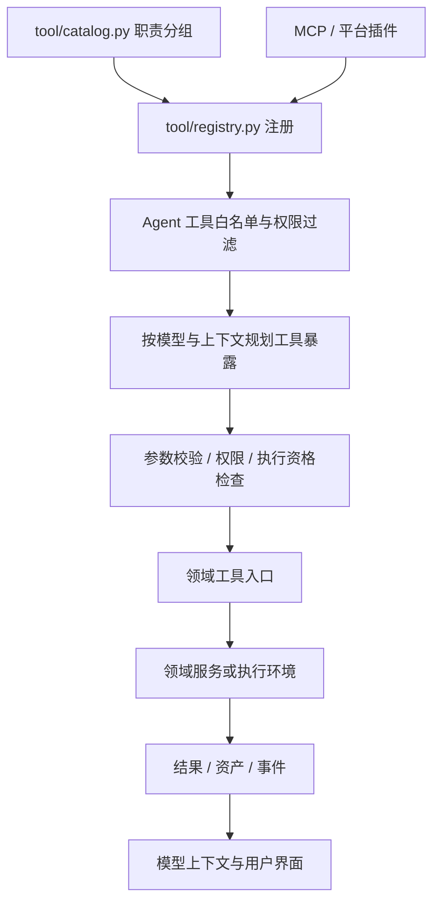

# Agent 能力与代码职责

本文描述当前代码结构。工具清单见 [工具目录](../reference/TOOLS.md)，技能来源和包结构见
[技能目录](../reference/SKILLS.md)，扩展步骤见 [开发指南](../contributing/ADDING_CAPABILITIES.md)。

## 一、先区分对象，再按功能分类

工具、技能、指令、资源和 Agent 配置具有不同生命周期。它们可以共同属于“视频制作”或
“资料研究”领域，但不应该因为都能帮助 Agent 完成任务就放进一个工具模块。

| 职责 | 当前代码 | 内容 |
|---|---|---|
| 运行内核 | `backend/agent/`、`backend/session/` | Driver 所有权、模型调用、消息与上下文、压缩、调度、中断、恢复 |
| 工具系统 | `backend/tool/` | 通用调用协议、按职责注册的工具入口、动态外部工具适配 |
| 技能系统 | `backend/skill/`、`backend/skill/builtins/` | Provider、目录、版本快照、个人技能库、安装包和随代码交付的技能 |
| 指令与命令 | `backend/agent/prompts/`、`backend/session/instruction.py`、`backend/command/` | 系统提示词、项目规则、角色指令、快捷命令模板 |
| 记忆与资源 | `backend/memory/`、`backend/skill/snapshot_resource.py`、`backend/team/mcp.py` | 用户记忆、技能附属资源和受范围约束的 MCP 资源 |
| Agent 定义 | `backend/agent_catalog/` | 模型、指令、工具白名单、技能引用、输入输出约定、版本和编译 |
| 协作编排 | `backend/agent/subagent_*`、`backend/team/` | 子任务、团队模板、成员、任务依赖、通信、恢复、验收和完成 |
| 自动化与交互 | `backend/cron/`、`backend/question/`、`backend/notifications/` | 定时触发、等待回答、继续运行和结果通知 |
| 连接与环境 | `backend/sandbox/`、`backend/mcp/`、`backend/core/oss.py` | 执行环境、桌面/浏览器连接、OAuth、对象存储 |
| 业务服务 | `backend/video/`、`backend/publish/`、`backend/trends/`、`backend/autopilot/`、`backend/platforms/` | 视频任务、发布、热点、营销和平台账号业务 |
| 成果与交付 | `backend/sandbox/assets.py`、`backend/team/artifacts.py`、`backend/snapshot/` | 文件资产、交付物校验、快照、变更与回滚 |
| 权限与运行保障 | `backend/permission/`、`backend/auth/`、`backend/billing/`、`backend/trajectory/` | 操作权限、租户边界、账号积分、运行采集与分析 |

模型路由、协议适配和重试属于运行内核，主要入口是 `agent/model_resolve.py`、`agent/llm.py`
和 `agent/retry.py`。文件诊断、执行钩子和恢复服务属于内部机制；无需为了列出“能力”而把
它们都包装成模型工具。已有领域服务保留原有职责；本次目录整理没有创建新的通用工作流引擎。

## 二、工具调用链

分组只决定实现归属。`agent/tool_resolution.py`、`agent/tool_exposure.py` 和 `team/policy.py`
继续决定实际可用集合、模型可见集合与团队授权。`catalog.describe_builtin_groups()` 是开发者
库存，不是某位用户的权限查询接口。不能把它的全部结果直接作为 Agent 的授权工具列表。

可复用 Agent 的 10 个固定核心工具由 `tool/workspace/CORE_TOOL_IDS` 声明。
`agent_catalog/requirements.py` 在显式绑定技能时合并依赖，随后进入编译器的部署、类别、
团队范围和付费权限检查；读取技能正文不会修改已冻结的运行授权。

工具入口可以依赖领域服务；把文件移动到一个类别不会自动把历史业务逻辑全部抽离。
新代码优先让工具负责输入、调用与输出，让服务负责业务状态和规则。当前媒体工具仍包含
较多供应商编排逻辑，逐项修改时再按此边界提取，避免在目录迁移中同时改动执行语义。

## 三、分类维度不能互相代替

| 维度 | 例子 | 负责什么 |
|---|---|---|
| 对象类型 | 工具、技能、指令、资源、Agent、团队模板 | 生命周期和使用方式 |
| 功能领域 | 文件执行、桌面、知识、协作、媒体、营销 | 代码归属和展示分组 |
| 来源 / 执行面 | builtin、custom、mcp、synthetic；platform、sandbox | 接入来源和执行边界 |
| 作用范围 | 用户、工作空间、项目、会话、团队运行 | 数据可见性和身份约束 |
| 依赖 | 无影、OSS、联网服务、浏览器连接、模型供应商 | 哪些条件会影响当前操作 |
| 权限 | 工具白名单、操作范围、团队委派、付费工具授权 | 是否允许执行 |
| 当前状态 | 未安装、未启用、缺配置、未授权、暂时不可用 | 为什么当前不能使用 |

这些信息目前分布在工具定义、Skill Provider、Agent 编译器、连接服务和运行上下文中。
当前提供工具职责目录与只读库存、内置技能分类清单，并未增加一个覆盖所有对象的状态 API。功能目录也不
替代 T0/T1/T2 委派规则、模型侧 pack、权限名称或账号积分账本。

## 四、依赖与异常的现有边界

- 无影按部署配置提供共享开发桌面或按用户分配的桌面。会话工作目录不是独立安全容器，
  也不能把所有部署都描述成“每个会话独占一台桌面”。用户身份与租户隔离由服务端约束。
- 已知沙箱不可用时，运行内核把状态传入工具上下文；需要沙箱的工具会提前返回错误。
  普通聊天可以继续。基础执行工具不等于 Agent 聊天必须在线的基础设施。
- 依赖必须细分到操作：`browser_mode` 读写偏好不要求浏览器在线；网站登录状态查询和
  打开远程登录页面具有不同依赖；视频提交、查询和素材落地也不能一概而论。
- 同参数重复调用、模型重试、外部操作结果未知分别由不同机制处理。当前没有覆盖所有工具
  和服务的统一依赖熔断器；目录整理没有改变重试或付费策略。
- 无影连接失败、模型 429、OSS 未配置、网站登录过期应保留各自错误原因。操作结果未知时
  先核对已有结果，不能仅凭超时就认定没有执行并重复发布或付费。
- 团队花费进入用户账号积分账本；团队运行限制与操作授权继续独立存在，不增加团队钱包。

恢复和副作用边界详见 [运行内核](AGENT_KERNEL_ARCHITECTURE.md)、
[团队运维](../operations/AGENT_TEAM_OPERATIONS.md)与[媒体外部操作](MEDIA_EFFECT_SAFETY.md)。

## 五、代码与文档入口

- 工具实现与分类：`backend/tool/<domain>/`、`backend/tool/catalog.py`。
- 通用插件定义接口：`tool.tool`；注册接口：`tool.registry`，路径保持稳定。
- 内置技能说明与资源：`backend/skill/builtins/<group>/<name>/`；唯一登记清单：`catalog.json`；
  运行服务：`backend/skill/`。项目自定义技能仍使用 `.openbox/skills/`。
- 测试：`backend/tests/unit/`，包含目录完整性、插件生命周期、技能范围、团队与恢复回归。
- 当前参考放入 `docs/architecture/`、`docs/reference/`、`docs/contributing/`；已有专题文档
  从 [文档索引](../README.md)进入。历史方案保留其上下文，不作为当前目录结构的唯一依据。
