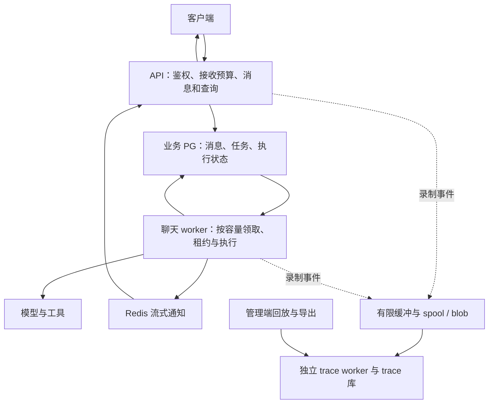

# 聊天容量与 Trace 资源隔离实施计划

> 日期：2026-09-16。状态：待实现、待复测。
> 本文记录百万事件混合压测之后的新增工作、公开方案调研和性能估算，不代表这些优化已经上线。
> 依据：[2026-09-15 混合压测报告](LOADTEST-2026-09-15-MIXED.md)。录制、数据归属与 fail-open 规则继续遵循 [SPEC.md](SPEC.md)。

## 1. 目标与当前结论

优先让聊天在压力下可靠接收、排队、完成或明确失败，并保护历史查询和流式连接；随后提高实际执行吞吐。

- 已完成：trace 批量更新、投影跳过忙行、通知按用户锁隔离，以及百万事件回读校验。
- 尚未完成：聊天执行的整体并发预算、持久待执行任务、独立聊天 worker，以及开始执行前失败的完整客户端反馈。
- 业务库、trace 库和 trace worker 已经分开。后续重点是聊天执行与 API 的进程隔离，以及仍在业务进程内的事件生产成本。
- 千人混合负载下已确认业务连接池超时；连接持有时间、事务等待、CPU 调度各占多少尚未分解，不能直接判定为 PostgreSQL 执行 SQL 太慢。
- “1,000 人同时提交并允许排队”与“1,000 个 agent 同时执行且低延迟”是两个容量目标，必须分别验收。

### 1.1 已测基线

以下使用通知锁修复后的同一版本。业务 API 为单个 Uvicorn 进程、2 CPU / 1.5 GiB；业务 PG 为 2 CPU / 1.5 GiB；连接池最多 30 个连接。模型替身用约 200 ms 输出三个文本块，未包含真实模型、工具和 OSS 网络波动。

| 指标 | 50 路空载 | 50 路混合 | 1,000 路空载 | 1,000 路混合 |
|---|---:|---:|---:|---:|
| 完整成功会话 / 1,000 | 1,000 | 1,000 | 971 | 953 |
| 消息接收 P95 | 0.528 s | 0.606 s | 15.726 s | 19.572 s |
| 首字 P95 | 2.154 s | 2.856 s | 54.207 s | 62.896 s |
| 完整回复 P95 | 2.665 s | 3.545 s | 55.760 s | 65.102 s |
| 历史查询 P95 | 0.580 s | 0.765 s | 11.464 s | 14.670 s |
| 会话列表 P95 | 0.457 s | 0.572 s | 10.229 s | 11.111 s |
| HTTP 500（所有被测接口合计） | 0 | 0 | 6 | 19 |

混合负载叠加约 5,000 trace 事件/秒、累计 100 万事件，以及持续管理端回放。完整成功以数据库消息内容、归属和最终 idle 状态审计为准，不能用收到 WebSocket 完成事件的样本数替代。历史、列表使用完成后查询口径；原测试后台查询受到等待尾段影响，不混入本表。

## 2. 公开产品方案与选型依据

以下资料于 2026-09-16 核对，描述公开实现或官方建议，不是这些产品在 OpenBox 环境下的容量实测。

| 参考方案 | 可核实做法 | 本计划采用的原则 |
|---|---|---|
| [LangChain Agent Server](https://docs.langchain.com/langsmith/agent-server) | 持久任务、租约、同一会话最多一个 run；支持 API 与 queue worker 分开部署；Redis 传递取消及流式事件，运行数据保存到 PG | 消息接收、任务执行、流式通知分开；沿用现有运行身份与过期写入保护 |
| [LangChain 扩容指南](https://docs.langchain.com/langsmith/agent-server-scale) | 区分请求并发与运行并发；按 worker 数、执行槽位和平均执行时间规划吞吐 | 执行并发不能由 HTTP 连接数决定，配置需要随资源和任务时长实测 |
| [Dify 1.13.0 发布说明](https://github.com/langgenius/dify/releases/tag/1.13.0) | 该版本将流式工作流与 Advanced Chat 执行迁入 Celery worker，并通过 Redis Pub/Sub 回传事件；非流式 WORKFLOW 在该说明中仍由 API 执行 | 独立执行进程可以保留流式体验，不把该版本的变更泛化为所有 Dify 执行路径 |
| [Langfuse 架构](https://langfuse.com/handbook/product-engineering/architecture) | 原始事件写对象存储，Redis 只传引用，worker 异步处理；业务数据与 trace 分别进入 PG 和 ClickHouse | 复用现有 spool/blob 引用与批处理，按测量决定是否需要进一步拆分或更换存储 |
| [Celery 优化指南](https://docs.celeryq.dev/en/stable/userguide/optimizing.html) | 限制预取，长任务和短任务可交给不同 worker；延迟确认后的重投递要求任务支持幂等 | 避免任务被忙 worker 大量预取，聊天、导出和维护分别设置预算 |
| [Temporal 任务队列](https://docs.temporal.io/task-queue)、[Activity 幂等](https://docs.temporal.io/activity-definition) | worker 有空位才领取；任务可持久等待；操作可能重试，需处理重复副作用 | 重启恢复、超时和工具副作用必须一起设计，不能自动重跑整个 agent |
| [OpenTelemetry 可靠性](https://opentelemetry.io/docs/collector/resiliency/) | 有限队列、退避重试、可选磁盘 WAL；溢出、磁盘故障和超出重试期限仍可能丢失 | 持续监测缓冲容量、积压年龄和缺失记录，不承诺无限缓冲 |
| [PgBouncer 功能说明](https://www.pgbouncer.org/features.html)、[Redis Pub/Sub](https://redis.io/docs/latest/develop/pubsub/) | 事务池复用连接，但不兼容会话级 advisory lock、LISTEN 等特性；Pub/Sub 是最多一次投递 | 连接代理须先查兼容性；实时通知不能承担唯一的任务或回复存储 |

**当前选型：**保留 Python agent、业务 PostgreSQL、Redis 和既有 trace 链路，增加持久聊天任务与独立异步聊天 worker。先补齐运行语义及指标，再决定是否采用专门任务框架、PgBouncer 或分析型数据库。此选择是结合现有代码作出的工程判断，并非上述产品对 OpenBox 的推荐。

## 3. 目标架构

- 聊天任务是业务执行状态，保存在业务库；trace 事件继续使用独立库，不恢复业务事务内写 trace 的旧设计。
- 接收消息和创建待执行任务必须在同一事务中完成，避免消息已保存但任务未投递的空档。
- worker 只在有执行容量时领取任务，领取后提交事务、释放连接，再调用模型或工具。
- 所有实例共享执行上限及按用户/工作区的公平规则；单进程信号量只能作本地保护，不能代替整体容量控制。
- trace 保持 fail-open：故障不能让聊天失败。容量耗尽时按既有缺失协议显式记录 gap，不能悄悄把应录事件采样掉后宣称完整性通过。

## 4. 实施阶段与退出条件

### P0：先定位资源等待，建立可比较基线

- [ ] 测量业务连接池等待、连接持有时长、事务/SQL/锁等待、事件循环延迟和 CPU 限流。
- [ ] 为每次聊天记录接收提交、任务领取、模型请求、上游首字、客户端首字和持久终态时间。
- [ ] 分别记录接收中请求、等待任务、执行任务、最老任务年龄、拒绝、取消、超时和恢复次数。
- [ ] 将用户总等待拆为接收、排队、执行准备、上游等待和推送阶段；HTTP 确认延迟单列，避免相互重叠阶段重复相加。各阶段分位数不能直接相加成总 P95。
- [ ] 使用不同负载发生进程驱动聊天、查询和回放，监控压测端 CPU、事件循环和发送速率；每组至少重复三次。

退出条件：能够解释连接池超时前资源在等待什么；重跑基线时保留相同资源、数据规模、事件速率和统计口径。

### P1：持久任务、并发限制与客户端状态

- [ ] 在昂贵业务 SQL 前设置有界的接收预算，保持完整鉴权。队列达到容量或等待期限时，以明确繁忙响应和重试提示拒绝新任务。
- [ ] 新增持久聊天任务及必要索引，消息与任务原子提交；用用户、会话、客户端消息 ID 等稳定身份防止重复提交创建重复执行。
- [ ] 区分排队、执行、等待用户输入、完成、失败、取消和被新轮次替代。前端显示排队及失败原因，重连后能查询真实状态。
- [ ] 执行限制主要作用于根聊天任务。子 agent 采用独立预算或可释放槽位的调度方式，避免父任务占满全部槽位后等待子任务造成死锁。
- [ ] 对接现有 `RunTicket`、generation 和租约；状态更新、终态事件及取消都校验当前任务身份，旧执行不能覆盖新轮次。
- [ ] 排队期间停止、连续发送新消息、模型选择、附件投递和 prompt history 保持现有语义；盘点 Web、移动端、同步/异步入口和后台触发的根执行路径。
- [ ] 补齐开始执行前异常的持久失败状态和通知。短暂存储故障后的状态收敛交给恢复流程，不靠一次可能失败的错误回调。
- [ ] 只安全恢复尚未开始的任务。已开始的模型/工具操作按检查点和副作用记录处理；无法判断结果的操作标为结果未知，不自动从头重跑。
- [ ] 不把现有问答恢复专用的 `resume_pending` 直接当通用聊天队列；等待问答不应持续占用模型执行槽位。

退出条件：已接收任务不会在重启后消失、不会静默挂起；重复提交、抢占、租约过期和取消均不会产生重复执行或跨轮次写入。

### P2：独立聊天 worker 与数据库资源保护

- [ ] 增加独立异步聊天 worker 运行模式。API 承担鉴权、消息接收、查询和流式转发；聊天执行可单独扩容。
- [ ] 接通既有 Redis 跨进程通知和取消；最终消息、状态与恢复进度仍从业务存储读取，断线补齐不能依赖 Pub/Sub 保留历史。
- [ ] 根据 P0 证据缩短持有连接的区间，修复跨外部 I/O 的长事务；保留已完成的通知按用户锁隔离。
- [ ] 为 API 查询、消息接收和 worker 设置有界访问预算，给历史和列表预留容量。若拆连接池，计算所有进程的连接数总和，不能每个进程都复制原来的 30 个连接额度。
- [ ] 执行并发先扫描 10、20、50 等档位，再依据内存、模型时长和 PG 等待选择；这些是实验参数，不是生产容量承诺。
- [ ] 如连接数量仍是瓶颈，再评估 PgBouncer。现有 trace writer 使用会话级 advisory lock 的专用连接，不能直接改走事务池。

退出条件：聊天执行压力不会耗尽 API 的全部访问容量；多进程下消息归属、实时通知、取消和任务唯一领取通过验收。

### P3：继续降低 trace 竞争并扩大吞吐

- [ ] 分别测量 emitter 序列化、入队、spool 写入、blob 外置、入库、投影和回放成本，按实际热点优化批量与调度。
- [ ] 为管理端回放、导出、归档和 GC 设置并发与处理预算，持续检查入库、投影最老积压时间。
- [ ] 校验新增聊天进程后的 spool 路径、生产者身份与消费拓扑。同机共享卷方案不能直接假设在多主机上仍可用。
- [ ] 极端瞬时突发单独测试，观察 64 MiB 队列溢出及 gap 覆盖。持续 5,000 事件/秒通过不代表约 82,000 事件/秒突发已解决。
- [ ] trace 当前仍是单写入者；增加相同 worker 不会自动增加写入吞吐。只有证明单写入者已是主要瓶颈后，再设计分片和跨分片完整性。

退出条件：同等 trace 压力下聊天与查询退化减少，百万事件逐条核对通过；同时报告积压与追平时间，不能以延后处理掩盖持续吞吐不足。

## 5. 性能能预估提升多少

### 5.1 50 路混合负载：可量化的条件估算

从原始校正结果取值：首字 P95 为 2.153778 s（空载）和 2.855635 s（混合），差 0.701857 s；完整回复为 2.664505 s 和 3.544597 s，差 0.880092 s。

设 `f` 为通过隔离与优化消除这部分观测差值的比例，估算公式为：

`目标延迟 = 当前混合延迟 − f × (当前混合延迟 − 当前空载延迟)`

| 假设消除比例 f | 首字 P95 估算 | 相对当前混合延迟降低 | 完整回复 P95 估算 | 相对当前混合延迟降低 |
|---|---:|---:|---:|---:|
| 50% | 2.505 s | 12.3% | 3.105 s | 12.4% |
| 80% | 2.294 s | 19.7% | 2.841 s | 19.9% |
| 100%，回到原空载值 | 2.154 s | 24.6% | 2.665 s | 24.8% |

**第一阶段以首字约 2.29～2.50 s、完整回复约 2.84～3.10 s，即延迟降低约 12%～20%，作为条件目标。** 消除 50%～80% 是用于规划的假设，尚无实现后数据证明，不是置信区间。独立进程、任务提交和通知也有开销，同等资源下可能达不到该区间。

两组 P95 的差值不是对每个请求进行的因果分解，原测试也只有单轮结果并存在压测端共享进程的局限。回到空载约等于减少 25% 是参照点，不是整体优化的理论上限，更不能推断“每个请求都能减少 0.7 秒”。

### 5.2 千人突发：先估可靠性，不承诺提速倍数

- 当前千人混合完整成功率为 95.3%。目标是在指定队列容量和等待期限内，1,000 次合法测试提交全部接收且全部正确完成；这是验收目标，不是已证明的生产成功率。
- 超过声明容量的另一组测试允许明确拒绝，但拒绝、排队超时、执行失败都必须单列，不计入成功。不能通过大量返回繁忙把接口“错误率”降下来后宣称千人测试通过。
- 当前首字 P95 62.896 s 包含过载等待，只有收到首字的样本进入分位数；不能据此承诺排队后变成 2 秒、提速十倍或更高。
- 确定总执行槽位、真实平均任务时长、接收吞吐和上游模型额度之后，才可估计千人首字及完成时间。排队必须计入用户端总等待。

简化容量模型：`稳定吞吐 ≈ 总执行槽位 C / 平均执行时长 S`。需要留出余量，并以 CPU、数据库、模型限额中的实际瓶颈修正；`S` 是平均执行时长，不能用 P95 或模型单次网络耗时代替。[参考 LangChain 容量规划](https://docs.langchain.com/langsmith/agent-server-scale)

例如仅作算术说明：若每轮执行时长都为 20 s、100 个空闲槽位同时开始处理 1,000 个已入队任务，则分为 10 批，约 200 s 完成；第 950 个任务约在 180 s 时才开始。增加队列能避免失控，不能使这些任务都立即出现首字。实际任务时长不均、外部限额及资源竞争会改变结果。

### 5.3 真实模型与 trace 的估算边界

- 低并发且上游模型占主要等待时，此方案对模型生成速度本身没有直接提升。需要分别观察服务端排队和上游首字，不把固定替身的百分比套到 Qwen 或其他真实模型上。
- 本轮百万 trace 事件已完整落库，但混合场景入库完成 277.60 s、投影完成 507.83 s；进一步改善尚无实测倍数，先要求同等压力下不回退，再用 P3 测量设定数值目标。
- 增加实例的收益不能假设线性增长。先找出受限资源，再分别报告同等总资源下的改造收益和新增资源后的扩容收益。

## 6. 压测与验收

### 6.1 对照矩阵

- [ ] 50、100、250、500、1,000 路聊天，各做无额外 trace 压力和混合压力两组；基线仍保留正常聊天录制。
- [ ] 固定替身复用原来的约 200 ms / 三块输出；另测 10、30、120 s 流式时长、较大上下文、附件与可控工具替身。真实模型小流量结果单列。
- [ ] 混合压力维持 1,000 用户 × 1,000 trace 事件、约 5,000 事件/秒，并保持历史、列表和管理端回放负载一致。生产事件放在实际发出事件的进程中，不通过移走生产成本改变测试题目。
- [ ] 对比两种资源口径：API 与聊天 worker 合计保持原 2 CPU / 1.5 GiB、总业务连接预算不增加；以及单独标明 CPU、内存、连接预算增加量的扩容组。trace 与 PG 规格分别记录。
- [ ] 在 P0 基线后、看到候选实现结果前，固定各组队列容量、端到端截止时间、重试策略和查询负载。超时样本必须算失败，不延长等待或自动重试掩盖失败。
- [ ] 测试多实例、worker 重启、Redis 暂时不可用、取消、新消息抢占、重复提交、慢模型、工具结果未知和子 agent 槽位耗尽。

### 6.2 通过条件

- 声明容量内：每次接收成功的合法请求有正确持久终态，固定替身千人测试要求 1,000 / 1,000 正确完成；无连接池超时、意外 HTTP 500、OOM、串号和重复工具副作用。
- 超载组：有明确繁忙/超时/取消状态，拒绝比例、接收比例、完整成功比例及最长等待全部报告，无静默挂起。
- 性能：按 §5 的条件目标检查 50 路混合负载；历史和列表先以 P95 ≤ 1 s 作为待验证的产品目标，千人首字目标依据测得的执行容量设定。
- 完整性：百万 trace 事件逐条核对 ID、内容、用户归属、顺序和去重；对超出录制容量的独立突发组核对 gap，不能把 gap 组算作零丢失。
- 指标：同时报告接收、排队、首字、完成的 P50/P95/P99，成功/失败/拒绝分母，实际事件发送速率、处理速率和追平时间。对比查询的实际吞吐，防止通过降速换取好看的延迟。
- 队列：持续负载下等待长度和最老任务年龄可稳定；突发停止后能清空。所有超时用户都进入总体结果，不能只统计最快返回的用户。

## 7. 迁移、发布与回退

- 新增持久任务及索引需要业务库迁移，采用兼容旧读写的增量方式；保持桌面 SQLite 的单 worker 模式。此前完成的 trace 批量与通知锁修复不需要因此重做迁移。
- 先部署支持新任务协议的 worker 并验证就绪，再逐步切换接收入口；迁移期间避免新旧执行入口同时领取同一任务。
- 回退前停止新协议接收、排空或明确转移待执行任务，并等待现有租约收敛；保留已提交消息与任务，不能删队列表后启动旧代码。
- 首次实施按 P0 → P1 → P2 → P3 推进，各阶段提交代码及对应证据。单独增加 worker 数量必须重新核算数据库与模型的总预算。
- 本文只是计划变更；尚未新增业务迁移、启用聊天 worker 或执行新一轮压测。后续每个阶段填写实现提交、环境、测试结果和遗留问题。

## 8. 实施记录

| 阶段 | 状态 | 实现提交 / 证据 |
|---|---|---|
| 既有 trace 与通知锁修复 | 已完成本地验证 | `a604c45d`、`4d3e1cb3`；[混合压测报告](LOADTEST-2026-09-15-MIXED.md) |
| P0 指标与基线 | 待实现 | — |
| P1 持久任务与执行语义 | 待实现 | — |
| P2 独立聊天 worker 与连接预算 | 待实现 | — |
| P3 trace 竞争与吞吐 | 待实现 | — |

本计划的混合压测与恢复验收属于用户在首次百万事件测试后追加的范围；旧 WAVE3 文档中的阶段性测试范围不替代本计划的退出条件。
